# VISUALISATION OTHER ISSUES


##  Formy elementow na wykresach


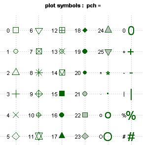
<br>
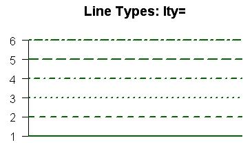


##  Kolory

 

###  sposoby kodowania kolorow dostepne w R


**rgb**-3 liczby dla trzech postawowywch kolorow (czerwony [R-red], zielony [G-green], niebieski [B-blue]). Because each of the three colors can have values from 0 to 255 (256 possible values), there are: 256 × 256 × 256 = 256^3 = 16.777.216 possible color combinations  
<br>
**rgba**-rgb z dodatkowym czwartym parametrm (alpha), odpowiedzialnym za szarosc.  
<br>

**hex**-ze znakiem hasha. Używaj systemu liczbowego heksagonalnego (16 znaków). 
A computer screen displays a color by combining red light, green light and blue light. 100% red, 100% green and 100% blue produces white. Zero red, zero green and zero blue produces black. In fact, equal levels of red, green and blue, whatever that level may be, will always produce a shade of gray.
The six digits of a hex code are in fact three two-digit numbers, each representing the level of red, green and blue. So #000100 is zero red, the darkest possible shade of green without being totally black, and zero blue. #010101, because the three values are all equal, is the darkest possible shade of grey, and #020202 is the second darkest. And of course #000000 is black. But what about #FFFFFF for white – what do the letters mean?
Hex Codes Use The Hexadecimal System to Minimize Length.
There are 256 possible shades each of red, green and blue (0 through 255). If we wanted to produce white (the brightest levels of all three colors combined), we’d need to write #255255255. That’s nine digits long.
Hex codes use the hexadecimal number system to make it possible for 256 numbers to be represented with only two digits. Instead of counting 0 through 10 like our regular decimal number system, it counts 0, 1, 2, 3, 4, 5, 6, 7, 8, 9, A, B, C, D, E, F and then 10, followed by 11, 12, 13, 14, 15, 16, 17, 18, 19, 1A, 1B, 1C, 1D, 1E, 1F and then 20. Make sense?
This means that 256 numbers can be represented using only two digits, instead of the 100 that are possible with our decimal number system (0 through 99). So the highest possible two digit number is not 99 but FF (equal to 255). This is why white is #FFFFFF, pure red is #FF0000, pure green #00FF00 and pure blue #0000FF.  
<br>

**HSLi HSV**-HSL and HSV are the two most common cylindrical-coordinate representations of points in an RGB color model.  
<br>

**LUV**-kolejny rodzaj kodowania kolorow. Mozna go skojarzyc z paleta przedstawiona na przechylownym zaokraglonym trojkocie.  
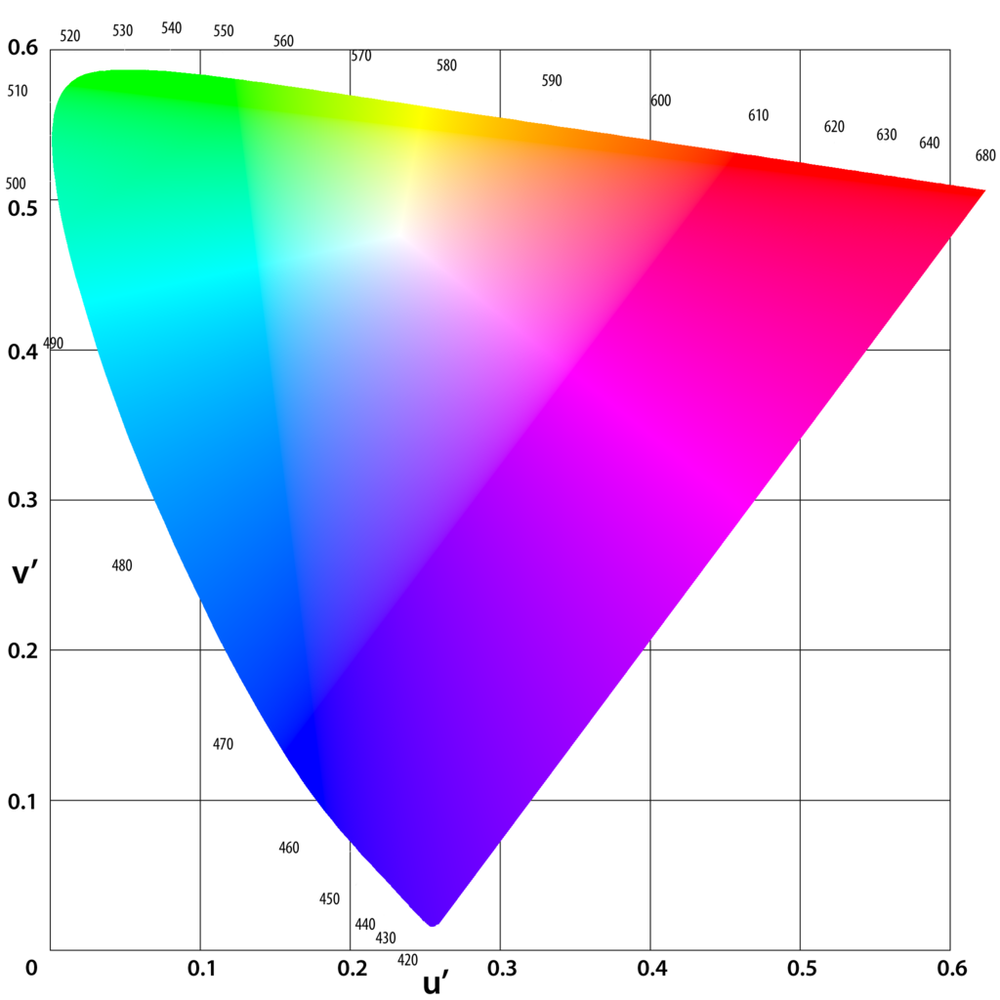
<br>

**LAB**
<br>

**XYZ**


###  `r CHAP(2,'przekodowywanie kolorow')
Podstawowym typem jakim sie operuje w R jest hex.

```{r}

#z rgb do hex
rgb(.04,.56,.65) #znormalizowany do 1
rgb(.04,.56,.65, maxColorValue = 255) #reczna normalizacja


# z hex do rgb - sposob 1 
require(colorspace)
hex2RGB(c("#FF1223"))
hex2RGB(c("#FF0000","#00FF00", "#0000FF"))

# z hex do rgb - sposob 2 
col2rgb(c("#4682B433"))


#z palet R do rgb
col2rgb("peachpuff")

col2rgb(c(g66 = "gray66", darkg =  "dark gray", g67 = "gray67",
          g74 = "gray74", gray  =       "gray", g75 = "gray75",
          g82 = "gray82", light = "light gray", g83 = "gray83"))

col2rgb(palette())


# z kolorow R na hsv
require(colortools)
col2HSV

```


###  palety kolorow


#### sztywne
 

```{r}
#dostepne w pakiecie grDevices

colors()
colors()[2]

palette()
palette()[3]

require(RColorBrewer)
#podglad palet
display.brewer.all(type="qual") 
brewer.pal(7,"Greens")

```


### palety elastyczne

```{r}

#rzeczy dostepne w grDevices

rainbow(5) # 5 kolorow
n<-10
rainbow(n, s=1, v=1, start=0, end=max(1,n-1)/n , alpha=1)

heat.colors(5)
heat.colors(5, alpha=.5)

gray.colors(5)
gray.colors(5, start=1, end=0)

cm.colors(5)

terrain.colors(5) 
terrain.colors(5, alpha=.5) 

topo.colors(5)
topo.colors(5, alpha=.5)


#hsv
hsv(.5,.5,.5)


#hcl
hcl(h = c(0, 120, 210, 300))

hcl(h = 0, c = 35, l = 85, 
  alpha, #zarkes [0,1]-przezroczystosc
  fixup = TRUE) 


#paleta kolorowa gdzie dostajemy hex
require(Kmisc)
x<-c(runif(20))
gradient(x, m = 10,cols = c("darkorange", "grey60", "darkblue"))


#paleta z ustalonym sztywnym zakresem-dostajemy hex
require(plotrix)
x<-c(runif(20))
color.scale(x, #zbior (wektor.macierz/ramka danych)
  c(0,1), #dla rgb pierwsza liczba dla pierwszego i drugiego koloru
  c(1,1), #dla rgb druga liczba dla pierwszego i drugiego koloru
  c(1,0), #dla rgb trzecia liczba dla pierwszego i drugiego koloru
  alpha=.9, #przezroczystosc koloru
  na.color=c(0,0,.5), #kolor dla brakow danych
  xrange = c(-3,3),  #ustawiony na sztywno zakres kolorystyczny palety
  color.spec='rgb'  # w jaki sposob podawane sa kolory
)


```


###  Przyklady sposobu kodowanie kolorow na przykladzie wykresow wykonanych w f:ggplot2:

```{r}
z<-data.frame(x=1:10, y=c(1,3,5,6,4,5,3,4,2,1))

#RGB
ggplot() + geom_line(data=z, aes(x=x, y=y), colour=rgb(0.2, 0.4, 0.7))

#Nazwa koloru
ggplot() + geom_line(data=z, aes(x=x, y=y), colour='orange')  #lista kolorow w pliku 'kolory_R-a'

#Kodowanie literowe
ggplot() + geom_line(data=z, aes(x=x, y=y), colour='#FFFFFF')  #lista kolorow w pozrodziale 'kolory R-a'

#Paleta
ggplot() + geom_line(data=z, aes(x=x, y=y), colour=rainbow(10))

#Paleta
ggplot() + geom_line(data=z, aes(x=x, y=y), colour=heat.colors(10))

#inne skale to terrain.colors, cm.colors, topo.colors
#skale dodatkowe sa w pakietach EColorBrewer i colorRamps

#Jaki uklad liczb w sytemie PGB ma dany kolor RGB?
col2rgb('orange')
```

### Palety kolorow w R przeglad
W przypadku kolorow gdzie odowlujemy sie po ich nazwach (np. orange) lista kolorow jest w pliku w pliku 
<a href="figures/koloryR.pdf">koloryR</a>

Kolory formatu #FFFFFFF znajduja sie ponizej:
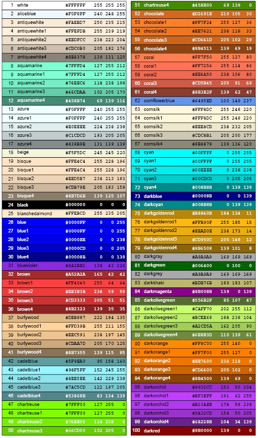

Skale kolorow w pakiecie RcolorBrewer
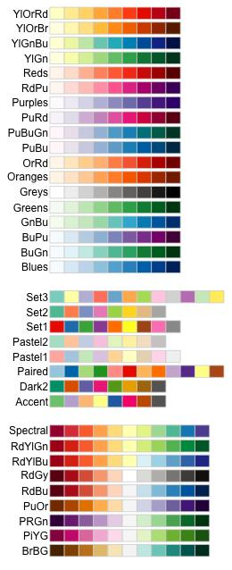


### Gotowe palety kolorow RGB


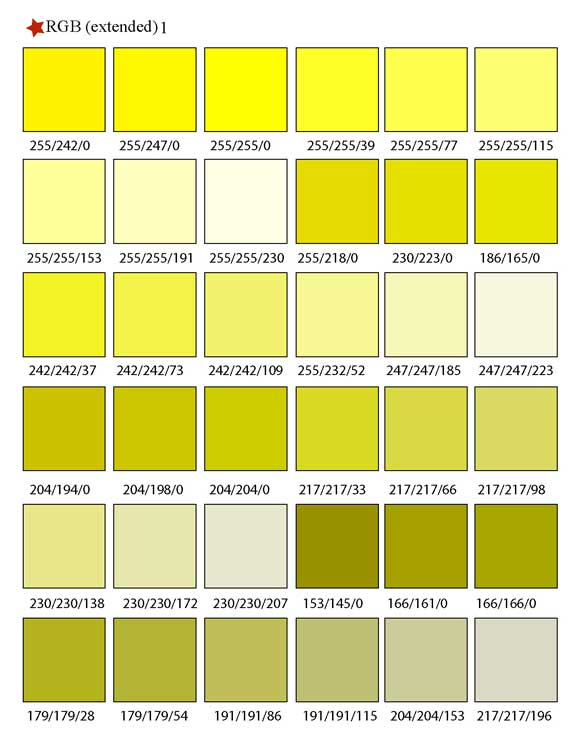
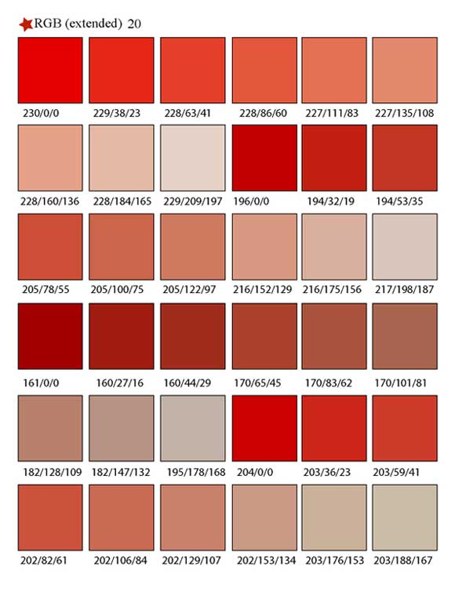
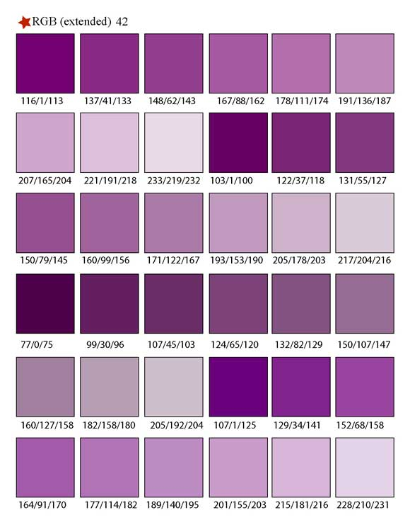
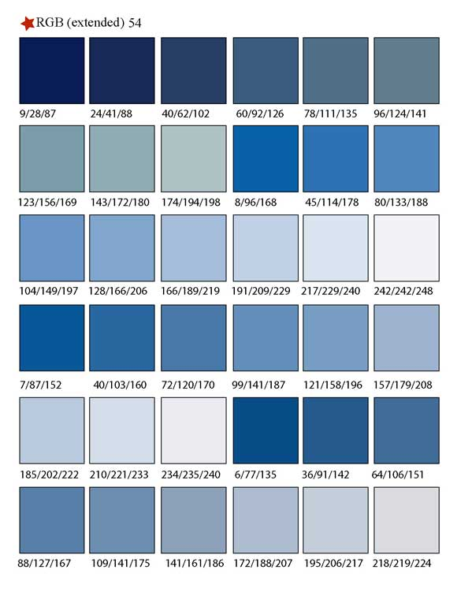
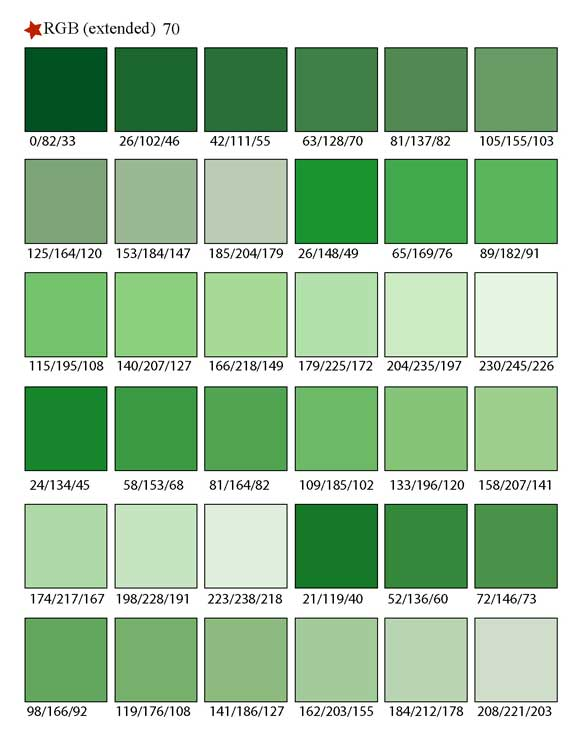
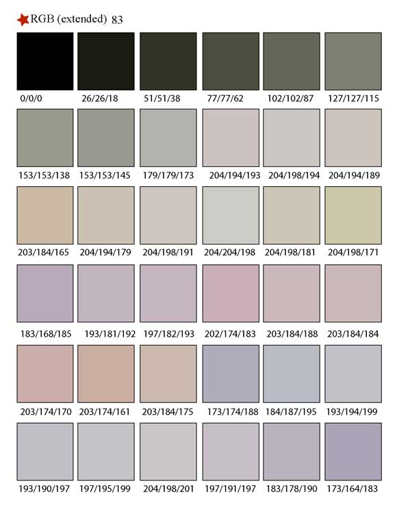
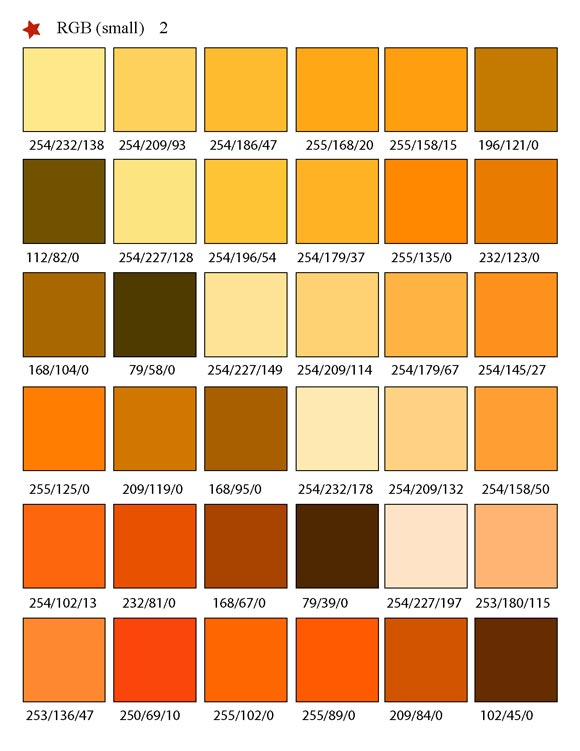
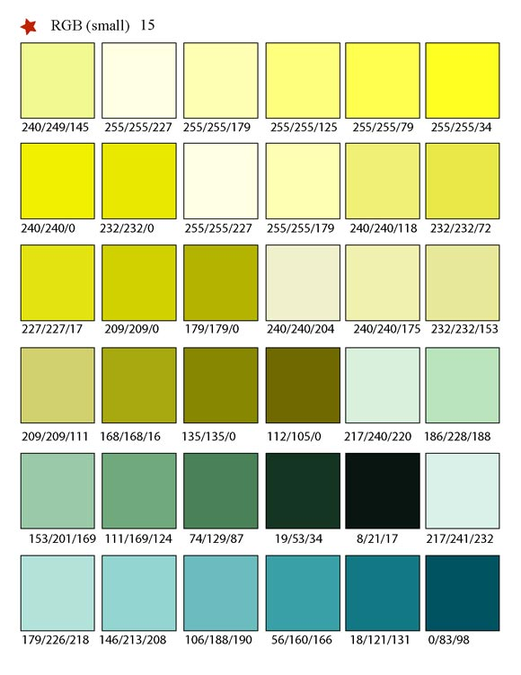
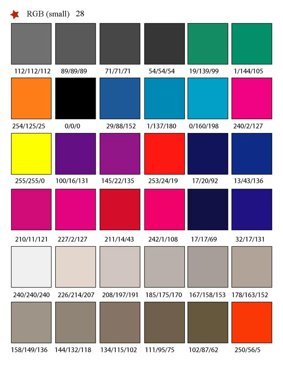
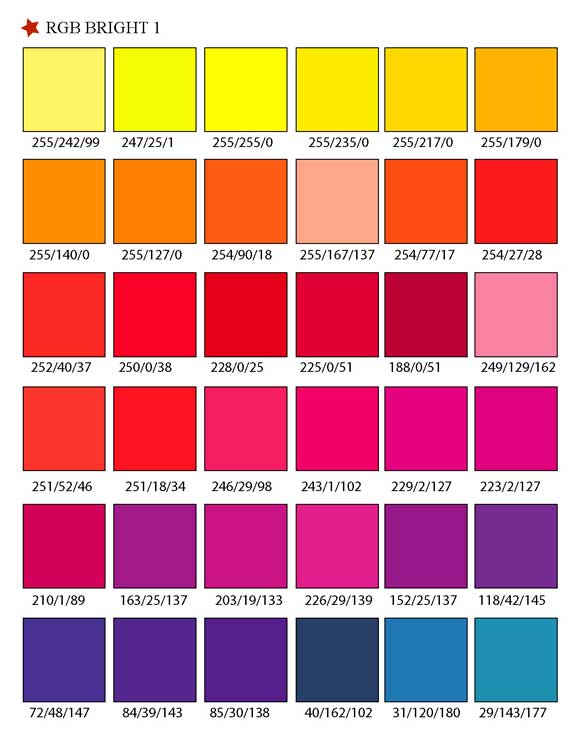
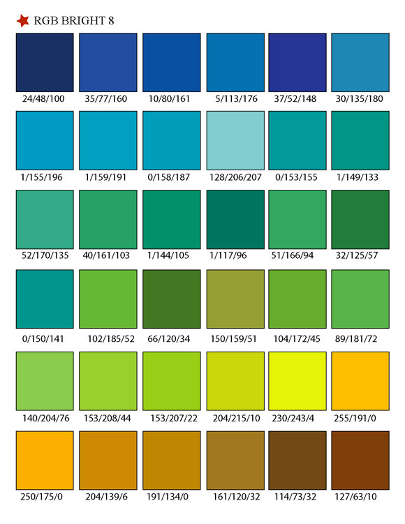
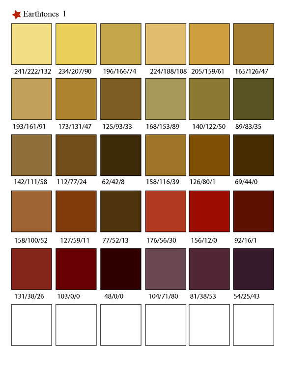
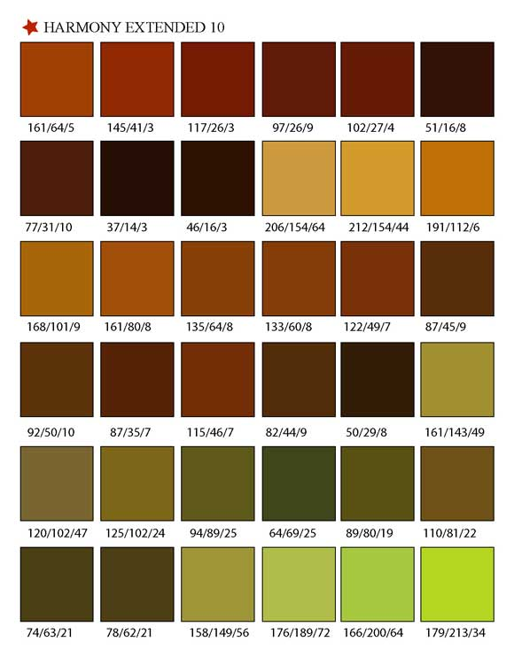
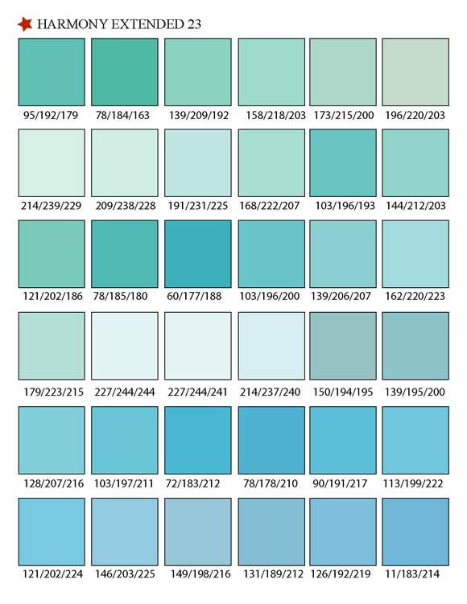
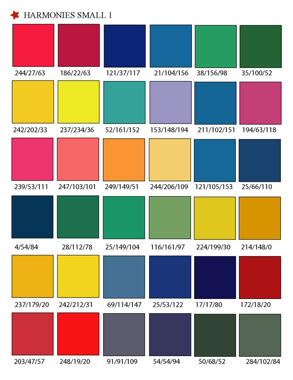
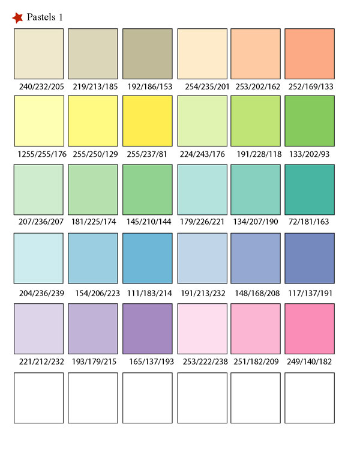


### Inne przyklady ladnych palet kolorow


Przyklad 1
```{r}
#ladne kolorki
library(gcookbook) # For the data set

# Base plot
p <- ggplot(uspopage, aes(x=Year, y=Thousands, fill=AgeGroup)) + geom_area()

# The palette with grey:
cb_palette <- c("#999999", "#E69F00", "#56B4E9", "#009E73", "#F0E442", 
                "#0072B2", "#D55E00", "#CC79A7")

# Add it to the plot
p + scale_fill_manual(values=cb_palette)
```


## Wspolrzedne

### Odczytywanie wspolrzednych z wykresow

```{r}
require(graphics)
locator(n=5) #uruchamiam funkcje, nastepnie klikam  puntu (w tym wypadku 5). Funkcja konczy dzialanie po kliknieciu n punktow lub po uzyciu przycisku esc.
```


##  Jednostki wspolrzednych na wykresie

###  jednostki dlugosci 'units'


```{r}

require(grid)

"npc"
Normalised Parent Coordinates (the default). The origin of the viewport is (0, 0) and the viewport has a width and height of 1 unit. For example, (0.5, 0.5) is the centre of the viewport.

"cm"
Centimetres.

"inches"
Inches. 1 in = 2.54 cm.

"mm"
Millimetres. 10 mm = 1 cm.

"points"
Points. 72.27 pt = 1 in.

"picas"
Picas. 1 pc = 12 pt.

"bigpts"
Big Points. 72 bp = 1 in.

"dida"
Dida. 1157 dd = 1238 pt.

"cicero"
Cicero. 1 cc = 12 dd.

"scaledpts"
Scaled Points. 65536 sp = 1 pt.

"lines"
Lines of text. Locations and dimensions are in terms of multiples of the default text size of the viewport (as specified by the viewport s fontsize and lineheight).

"char"
Multiples of nominal font height of the viewport (as specified by the viewport s fontsize).

"native"
Locations and dimensions are relative to the viewport s xscale and yscale.

"snpc"
Square Normalised Parent Coordinates. Same as Normalised Parent Coordinates, except gives the same answer for horizontal and vertical locations/dimensions. It uses the lesser of npc-width and npc-height. This is useful for making things which are a proportion of the viewport, but have to be square (or have a fixed aspect ratio).

"strwidth"
Multiples of the width of the string specified in the data argument. The font size is determined by the pointsize of the viewport.

"strheight"
Multiples of the height of the string specified in the data argument. The font size is determined by the pointsize of the viewport.

"grobwidth"
Multiples of the width of the grob specified in the data argument.

"grobheight"
Multiples of the height of the grob specified in the data argument.

```


## Wykresy dynamiczne

```{r}

require(animation)

#ustawienie interwalow czasowych
oopt = ani.options(interval = 2, #wielkosc przerwy dla koljnych klatek-wywolujemy potem funkcja 'ani.pause' 
                   nmax = 10)

# tworzenie petli
for (i in 1:ani.options("nmax")) {
  plot(rnorm(30))
  ani.pause() ## pause zdefiniowana wczesniej w 'ani.options'
}

## restore the options
ani.options(oopt)

```

## Rozne elementy graficzne

###  Tabelki

####  Hmisc

```{r}
#estetyczne wyswietlanie macierzy
require(Hmisc)

#pierwszy przyklad
data(HairEyeColor)
print.char.matrix(HairEyeColor[ , , "Male"], col.names = TRUE)

#drugi przyklad
require(ggplot2)
data(diamonds)
print.char.matrix(diamonds[1:5,])
```

### Drzewa


#### pakiet ade4-recznie rysowane drzewa niebinarne


```{r}
#Reczne rysowanie bardziej wypasionych drzew  (PAKIET ade4)----
require(ade4)
provi.tre <- "(  ((a,b,c,d,e)A,(f,g,h)B) C, ((i\njkj,j)k,l) G )D;" #uwaga. nie wolno powtarzac nazw liter bo sie pomiesza!!!
provi.phy <- newick2phylog(provi.tre)
plot.phylog(provi.phy, 
            clabel.l = 1.2, #wielkosc znakow w lisciach 
            clabel.n = .9, #wielkosc znakow na wezlach
            f = .6, ) #dlugosc galezi drzewa
```


