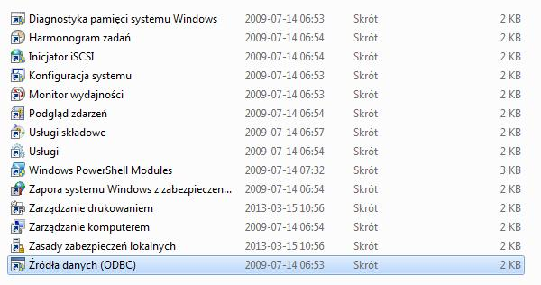
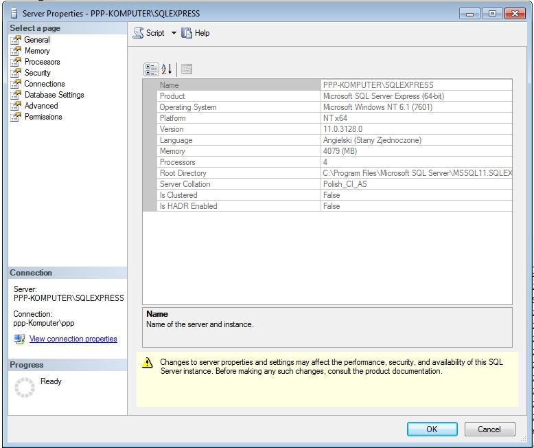

# (PART) <lfg>ADDS-ON</lfg> {-} 

# FORKING


## SQL Databases


https://db.rstudio.com/databases/microsoft-sql-server/

### Load file with sql code


```{r}

require(RODBC)
con <- odbcConnect('sql')
sql <- paste(readLines(con = "C:/Users/lukasz.muszynski/Desktop/temp_files/sql_source/sql_source.sql"), collapse = "\n")
wynik <- sqlQuery(con, sql)

```


### Configuration of connection between R and database with sql server as an example (for ODBC drivers

Go to  **control panel**, and next go to configuration of OCBD conneciton (see figure RODBC_1 i RODBC_2)
<br><br>

```{r, eval=TRUE, echo=FALSE, fig.cap='', out.width='500px'}
knitr::include_graphics('figures/RODBC_1.jpg')
```

```{r, eval=TRUE, echo=FALSE, fig.cap='', out.width='500px'}

```

```{r, eval=TRUE, echo=FALSE, fig.cap='', out.width='500px'}
knitr::include_graphics('figures/RODBC_3.jpg')
```

In the administrator window (see next figure) in fiel 'Name' and 'Description' type in any name you want to use in R-cran.
In filed 'Server' type in server name from sql server properties (see second figure from here ).

```{r, eval=TRUE, echo=FALSE, fig.cap='', out.width='500px'}
knitr::include_graphics('figures/RODBC_4.jpg')
```

```{r, eval=TRUE, echo=FALSE, fig.cap='', out.width='500px'}

```


In the end we have to connect with database in R usin p:RODBC:
```{r}
require(RODBC)
odbcConnect('sql')
channel <- odbcConnect('sql')
z<-sqlQuery(channel, 'select top 100 * from [dbo].[Sheet1$]')
```


### ORACLE

Connecting with RODBC
```{r}
# first you have to define odbc in Windows (like when you use other databases)

require(RODBC)

connection <- odbcConnect('oracle', 'system', 'oracle') #'oracle' is a database name,  'system' is username, 'oracle' is a password

result <- sqlQuery(connection, 'select * from   TABLE1')

sqlTables(connection, schema='system')

```


### SQL Server

#### Connection using p:DBI

```{r}

# SQL Server autentification
con <- DBI::dbConnect(odbc::odbc(),
                      driver = "SQL Server Native Client 11.0",
                      server = 'DESKTOP-BGFASK3\\SQLEXPRES',
                      database = 'master',
                      Trusted_Connection = 'yes',
                      Port = 1433)

# Windows autentification
con <- DBI::dbConnect(odbc::odbc(),
                      Driver = "SQL Server",
                      Server = "DESKTOP-BGFASK3\\SQLEXPRESS",
                      Database = "master",
                      Trusted_Connection = "True")

```


#### Connection beteen R and SQL server and available operations (except SELECT)


Using full string to provide connection parameters:
```{r}
# connection with  Windows Authentification
dbhandle <- odbcDriverConnect('driver={SQL Server};server=PPP-KOMPUTER\\SQLEXPRESS;database=Nauka;trusted_connection=true')

```

Most of syntax below can be applied to other databases.
```{r}
require(RODBC)
require(ggplot2) #for diamonds dataset
z <- diamonds

#connection configuration with full string (in sql server useful to specify trusted connection)
channel <- odbcDriverConnect(
	connection='
			Driver={SQL Server}; 
			Server=PPP-KOMPUTER\\SQLEXPRESS;
			Database=master;
			Trusted_Connection=yes;') # here we use trusted connection

#saving table in sql server
sqlSave(channel, # connection
				z,  #variable with table do save
				colnames=T,   #if columns names should be included
				nastring=NULL,   #how to define missing values
				rownames=F,   #if rows names should be included
				tablename='lukasz'  )  #table name

#updating data in table - we will replace old table the new one.
sqlUpdate(
			channel, 
			z, 
			tablename='lukasz', 
			nastring=NULL) #we will get error. Function needs kolumn with index (argumrnt 'index' of the function is a string with name of column), to overwrite table. If we dont't have indexit is easier to remove table and save new.


#list of available tables in server
sqlTables(channel, tableType='TABLE')  # available values for argument 'tableType' are: TABLE, VIEW, SYSTEM TABLE, ALIAS, SYNONYM. By default all types of tables are printed


#columns structure in table
sqlColumns(  channel
					 , sqtable='lukasz') # table name must be provided


#removing table
sqlDrop(channel, sqtable='lukasz', errors=T) # In the case of error we will get value -1.


#information about connection
odbcGetInfo(channel)


#info about mapping types between R and SQL when SAVING data in SQL 
getSqlTypeInfo(driver = "Microsoft SQL Server")


# info about data types in database
sqlTypeInfo(channel = channel)


```


#### set nocount on


The RODBC driver seems to think that when SQL Server returns any count of rows that the entire statement is complete. So you need to set nocount on at the beginning of your statement or stored procedure that is called. *set nocount on*: This allowed me to use a stored procedure that was using temporary table in R.
      
      
```{r}

require(RODBC)

# connection with database
z<-odbcConnect('sql')
#odbcClose(z)

#query
dane<-sqlQuery(z, '
               set nocount on
               SELECT rok,miesiac,model_sc model, sum(kwota) kwota,count(*) ilosc into #temp from 
               (select distinct
               year(data_wpisu) rok
               ,month(data_wpisu) miesiac
               ,day(data_wpisu) dzien
               ,datepart(hh,data_wpisu) godzina
               ,datepart(mm,data_wpisu) minuta
               ,p_l_nr_czlonka id_klienta
               ,p_s_nr_konta id_konta
               ,p_l_id_wniosek id_wniosek
               ,model_sc
               ,p_l_kwota kwota
               ,pd 
               ,pd*p_l_kwota/100 EL
               from sc.scoring ) as dane
               
               group by rok,miesiac,model_sc
               
               
               select * from
               ( select distinct rok,miesiac,model,kwota from #temp) as pv
               PIVOT
               (sum(kwota) FOR model in ([dk1],[s2],[dk3],[s4],[s5])) as tab
               order by rok,miesiac')
#end of query

odbcClose(z)


```


### Postgres


#### p:RPostreSQL


```{r}

#___RPostgreSQL
require(RPostgreSQL)
m <- dbDriver("PostgreSQL")
con_1 <- dbConnect(drv = m, dbname = 'lukasz', user = 'postgres', password = 'ppp', port=5432, host = 'localhost')
rs = dbSendQuery(con_1, "drop table diamonds")  # uwaga: jezeli chcemy wykorzystac lacze z src_postres to robimy dbSendQuery(my_db$con,q)
dbGetInfo(con_1) # podstawowe informacja po polaczeniu
dbListTables(conn = con_1) # lista tabel
dbRemoveTable(con_1, name = 'diamonds') #usuniecie tabeli
dbDisconnect(con_1) # rozlaczenie sie z baza


```


#### Working with dlyr


**Laczenie z baza i przesylanie tabel**


```{r}

# polaczenie z baza danych
my_db <- src_postgres(  dbname = 'lukasz'
											, user = 'postgres'
											, password = 'ppp'
											, port=5432
											, host = 'localhost')

# skopiowanie z R-a do postgresa
copy_to(  dest = my_db
				, mtcars
				, temporary = FALSE) 

# stworzenie zmiennej podlaczonej do tabeli w postgresie na ktore bedziemy mogli pracowa z R
tabela <- tbl(  my_db
							, 'mtcars') # praca na tabeli 'diamonds' ktora jest w bazie postres


# usuniecie tabeli w postgresie
dbRemoveTable(my_db, name = 'mtcars') #usuniecie tabeli


# zamkniecie polaczenia z baza
rm(my_db)

```


**zapytanie dplyr/sql**


```{r}

my_db <- src_postgres(  dbname = 'lukasz'
											, user = 'postgres'
											, password = 'ppp'
											, port=5432
											, host = 'localhost')
copy_to(my_db, df = mtcars, name = 'mtcars', temporary = TRUE)
tabela <- tbl(   my_db
							, 'mtcars')


# zapytanie przypisuje sie do zmiennych. Jest tu zasada leniwej ewaluacji wiec na razie nie nie jest wykonywane. Zapytanie moga stanowic ciag gdzie jedno moze sie odwolywac do wczesniejszych jak ponizej
z1 <- tabela %>% mutate(nowa_zmienna=cyl*10)
z2 <- z1 %>% mutate(mowa_zmienna_2=cyl*100)

# wykonanie zapytanie i zwrocenie wynikow do R-a
collect(z2)


# UWAGA: na razie przy takim ciagu zaleznosci nie mozna sie chyba odwolywac do kolumn wczesniej zdefuniowanych:
z1 <- tabela %>% mutate(nowa_zmienna=cyl*10)
z2 <- z1 %>% mutate(mowa_zmienna_2=nowa_zmienna*100)
collect(z2) #zwroci blad ( wynika moze to z tego ze w normlany SQL nie jest dopuszczalne takie odwolywanie sie do kolumny wczesniej utworzonej)


# wykonanie zapytania i zapisanie wynikow w tabeli w bazie
compute(z2, temporary=FALSE)

# podglad kodu SQL
show_query(z2)


```

### Other things

```{r}

#tlumeczenie wyrazenia na sql
translate_sql(first %is% NULL)

```


