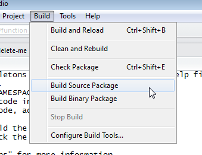
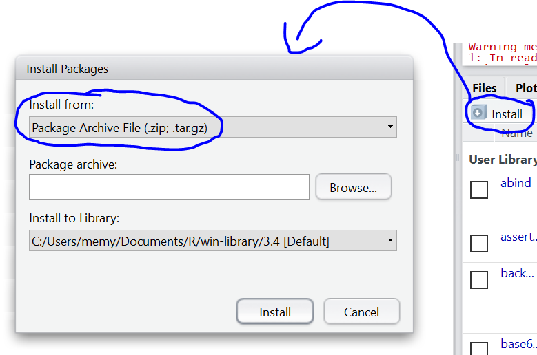

# WORK ORGANISATION


## Projects


## Packrat

https://rstudio.github.io/packrat/walkthrough.html


### Creating packrat project

**Step 1** 
Creating New Project and checking if p:packrat is installed


**Step 2**
Changing project into packrat mode.

```{r, eval=TRUE, echo=FALSE, fig.cap='opis z numeracja', out.width='500px'}
knitr::include_graphics('figures/packrat_mode_settings.png')
```


When we accept 'packrat' mode then new directory named 'packrat' will be created
On the console you will see that:
```{r, eval=TRUE, echo=FALSE, fig.cap="Creation of 'packrat' files and directory", out.width='500px'}
knitr::include_graphics('figures/packrat_f_init.png')
```
We can create that manually too with f:init.

'packrat' directory contains:

1. packrat/packrat.lock: Lists the precise package versions that were used to satisfy dependencies, including dependencies of dependencies. (This file should never be edited by hand!)
2. packrat/packrat.opts: Project-specific packrat options. These can be queried and set with get_opts and set_opts; see ?"packrat-options" for more information.
3. packrat/lib/: Private package library for this project.
4. packrat/src/: Source packages of all the dependencies that packrat has been made aware of.
5. .Rprofile: Directs R to use the private package library (when it is started from the project directory).


### Managing packages in packrat


** Installing packages**

You can install packages from CRAN or github in regular way. All packages will be downloaded to 'packrat' directory in your project. If your project needs to install packages from local directories firt you have to create extra directory (most recommended is to create it in project directory) and the set path to it wih f:set_opts(packrat):

```{r}
packrat::set_opts(local.repos = "<path_to_repo>")
```


**shapshot**

Packrat should automatically **create *snapshot*  ** of packages. We can do it manually too:

```{r}
packrat::snapshot()
```


```{r, eval=TRUE, echo=FALSE, fig.cap='opis z numeracja', out.width='500px'}
knitr::include_graphics('figures/packrat_making_shapshots.png')
```


To restore *snapshot* 

Once your project has a snapshot, you can easily install the packages from that snapshot into your private library at any time.

You’ll need to do this, for example, when copying the project to a new computer, especially to one with a different operating system. Let’s simulate this by exiting R and then deleting the library subdirectory in your project. Then launch R from your project directory again.

Packrat automates the whole process for you – upon restarting R in this directory, you should see the following output:


## Creating own packages

### With RStudio
Do tworzenia pakietu wykorzystany narzedzia zaimplementowane w RStudio.

Writing an R package from scratch:
https://hilaryparker.com/2014/04/29/writing-an-r-package-from-scratch/


**Step 1**: <lfr>Warning</lfr> Istalujemy program (nie jest to pakiet!!!) 'Rtools' jezeli nie jest zainstalowany. Jest do pobrania na stronie CRAN-R. Dodatkowo sprawdzamy czy mamy zainstalowany  pakiet roxygen2.

```{r, eval=TRUE, echo=FALSE, fig.cap='Rtools on CRAN website', out.width='500px'}
knitr::include_graphics('figures/own_package_installing_Rtools.png')
```


**Step 2**: Tworzymy plik z wlasnymi funkcjami (wszystkie w jednym pliku). Plik zapisujemy jako zwykly plik skryptu R-a. Mozna tez dodawac definicje obiektow (np. R6) i ich instancje.
Jezeli chcemy aby do naszych funkcji byl dostepny 'help' oraz zrobila sie dokumentacja, w naszym pliku dodajemy opis dla kazdej funkcji uzywajac tzw. skladni Roxygen. (wczesniej musimy pamietac o tym czy mamy zainstalowany pakiet roxygen2 !!!)
Kazda linika opisu Roxygen zaczyna sie od `#' `
Znakiem `@` rozpoczynam kolejne tagi (hasla) naszego 'help-a' Wyjatkiem jest piewsza linijka z opisem pod ktora zostawiam jedna linijke wolna. Ponizej przyklad:


```{r}
#' Moja super funkcja do sumowania elementow
#'
#' @usage function(x1, x2=2)
#' @param x1 - pierwszy parametr typu numeric
#' @param x2 - drugi parametr typu numeric. Domyslanie ma wartosc 2.
#' @return - funkcja zwraca wartosc liczbowa
#' @note - moja notatka
#' @examples
#' # tutaj podaje jakis uzyteczny przyklad (jak widac moze zawierac kilka linije kodu)
#' x1 <- 100
#' moja_funkcja(x1)
#' @export

# definicja mojej funkcji:
moja_funkcja <- function(x1, x2 = 2){
  x1 + x2 # funkcja sumuje dwa elementy
}
```
Nie wszystkie tagi sa obowiazkowe. Ja zawsze daje `@usage` (zeby wiedziec na szybko jakie sa parametry i jakie maja wartosci domyslne), `@examples` (zazwyczaj z dzialajacym przykladem) i chyba zawsze daje sie `@export`. Obowiazkowy tez jest tytul (bez niego nie bedzie sie dalo zbudowac pakietu). Wazne jest zeby zrobic to starannie, bo przy skomplikowanych funkcjach dobry help jest bezcenny. Poza tym nie mozna robic pomylek w samej skladni Roxygen (nie zapominamy o spacji przed `@` itp.), bo potem bedziemy sie meczyc z bladami przy budowie. 

<br><lfg>Useful</lfg>
<div class="btn-success"> Szkielet takiego komentarza Roxygen mozna wprowadzic automatycznie. Kursor umieszczamy wewnatrz funkcji i nastepnie rozwijamy przycisk 'różdżki' i wybieramy 'Insert Roxygen Skeleton' </div><br>

```{r, eval=TRUE, echo=FALSE, fig.cap='Inserting skeletons', out.width='500px'}

```


**Step 3**: Tworzymy nowy *Project*. W koncowym oknie podajemy sciezke dostepu do pliku gdzie jest nasz kod oraz nazwe i miejsce gdzie powstanie nowy katalog (patrz na ponizsze zrzuty). W utorzonym katalogu beda nowe pliki utworzone po nacisnieciu przysicku 'Create Project' niezbedne do dalszej pracy zwiazanej z tworzeniem pakietu.


```{r, eval=TRUE, echo=FALSE, fig.cap='Starting of creation Project', out.width='500px'}
knitr::include_graphics('figures/own_package_uruchomienie_narzedzia.png')
```
<br>
```{r, eval=TRUE, echo=FALSE, fig.cap='Selecting new project', out.width='500px'}
knitr::include_graphics('figures/own_package_wybor_rodzaju_projektu_1.png')
```
<br>
```{r, eval=TRUE, echo=FALSE, fig.cap='Selecting type of new project', out.width='500px'}
knitr::include_graphics('figures/own_package_wybor_rodzaju_projektu_2.png')
```
<br>
```{r, eval=TRUE, echo=FALSE, fig.cap='Paths ans names in Project. In (1) we have to provide path for pur file with functions. In (2) we provide path where new project directory will be created', out.width='500px'}
knitr::include_graphics('figures/own_package_nazwa_i_sciezki.png')
```
<br>

**Step 4**
Zeby dalo sie tworzyc dokumentacje sprawdzamy w ustawieniach czy jest taka mozliwosc (patrz ponizszy zrzut):
```{r, eval=TRUE, echo=FALSE, fig.cap='Ad step 4: Settings for Roxygen documentation', out.width='500px'}

```


**Step 5**: Jezeli wprowadzilismy jakies modyfikacje do naszego pliku z funkcjami (np. dodalismy nowa funkcje, usunelismy, albo zmodyfikowalismy stara) i chcemy odswiezyc projekt klikamy 'clean and rebuild'. 

**Step 6**: Jezeli chcemy dodatkowo zbudowac/odswiezyc nasza dokumentacje Roxygen to klikamy 'Document'

```{r, eval=TRUE, echo=FALSE, fig.cap='Ad step 5 and 6: Rebuilding package and updating documentation', out.width='500px'}
knitr::include_graphics('figures/own_package_clean_and_rebuild.png')
```


**Step 7**: Uruchamiamy budowanie ostatecznego katalogu pakietu ktory bedziemy instalowali w R  (rysunek 'build'). Mozna wybrac 'Build Source Package' jak i 'Build Binary Package' (patrz zrzut).
Ja zazwyczj wybieram wersje 'Binary'. Binary releases contain computer readable version of the application, meaning it is compiled. Source releases contain human readable version of the application, meaning it has to be compiled before it can be used. The source release is the raw, uncompiled code. 

```{r, eval=TRUE, echo=FALSE, fig.cap='Build new package', out.width='500px'}

```
W wyniku powstanie nowy plik ktory mozna zainstalowac w programie R jak kazdy inny pakiet, ale instalacje robimy nie z repozytorium CRAN ale z lokalnego zrodla. 

```{r, eval=TRUE, echo=FALSE, fig.cap='Instalation of package from local files', out.width='500px'}

```


**Uwagi**:

1. Jezeli chcemy dodac **wlasne zbiory danych** tworzymy katalog 'data' w naszym katalogu z projektem. Wklejami tam pliki z danymi najlepiej w formacie txt. Bedzie je mozna po zaladowaniu pakietu wywolac funkcja `data()`.
2.  Jezeli chcemy aby podczas ladowania pakietu ladowaly sie inne pakiety musimy (jeszcze przed utworzeniem pliku zrodlowego ktory bedzie bezposrednio instalowany) w pliku DESCRIPTION (najlepiej otworzyc go notatnikiem)  dodac linijke kodu za 'Maintaner' wyszczegolniajaca pakiety:<br>
  Maintainer: Who to complain to <yourfault@somewhere.net>
  Depends: shiny, ggplot2

### Without RStudio

It is possible to create own package without RStudio, but difficult and time-consuming. RStudio tool for doing this i preferable and much better solution. 


## Github

Swnietny podrecznik o wspolpracy Githuba i Windows pt "Happy Git and GitHub for the useR" (autor Jenny Bryan), jest na stronie http://happygitwithr.com/install-git.html#install-git


### Installation and configuration with RStudio

<br><lfr>Warning!</lfr>
<div class="btn-danger"> Before installation you must have your own account on Gibtub webpage. </div><br>

**Step 1:**

Install *Git for Windows* from https://gitforwindows.org/ on your computer.


**Step 2:**

Instroduce yourself to Git by writting in shell this code:

```{r}
git config --global user.name 'lucas9999'
git config --global user.email 'memy@wp.pl'
git config --global --list

```

**Step 3 (optional):**

Installing Git Client. This is optional but highly recommended. This give us ability to use Version Control. Best choise is Sourcetree from https://www.sourcetreeapp.com/ . 

**Step 4:**

Make repo in GitHub :

1. Go to https://github.com and make sure you are logged in.
2. Click green “New repository” button. Or, if you are on your own profile page, click on “Repositories”, then click the green “New” button.
3. Repository name: myrepo (or whatever you wish, we will delete this) Public YES Initialize this repository with a README
4. Click big green button “Create repository.”
5. Copy the HTTPS clone URL to your clipboard via the green “Clone or Download” button.


**Step 5:**

Detect Git with RStudio.


Firs let’s check **if RStudio can find** the Git executable.

1. File > New Project… Do you see an option to create from Version Control? If yes, good.
3. Select New Directory > Empty Project. Do you see a checkbox “Create a git repository”? If yes, good, CHECK IT.
3. Give this disposable test project a name and click Create Project. Do you see a “Git” tab in the upper right pane, the same one that has “Environment” and “History”? If yes, good.

If all looks good it means than RStudio and Git are talking to each other.

Keep reading if things don’t go so well or you want to know more.

**If RStudio did't detect Git automatically**:

In shell you command to detect Git location:
```{r}
where git
```
Last time I got path: C:/Program Files/Git/cmd/git.exe. 
Then tell RStudio where to find it. From RStudio, go to Tools > Global Options > Git/SVN and make sure that the box Git executable points to … the Git executable.
**Restart RStudio** if you make any changes.


### Cloning repo from Git account

Clone the new GitHub repository to your computer via RStudio

In RStudio, start a new Project:

1. File > New Project > Version Control > Git. In the “repository URL” paste the URL of your new GitHub repository. It will be something like this https://github.com/jennybc/myrepo.git.
  - Do you NOT see an option to get the Project from Version Control? Go to chapter 14 for tips on how to help RStudio find Git.
2. Take charge of – or at least notice! – the local directory for the Project. A common rookie mistake is to have no idea where you are saving files or what your working directory is. Pay attention. Be intentional. Personally, I would do this in ~/tmp.
3. I suggest you check “Open in new session”, as that’s what you’ll usually do in real life.
4. Click “Create Project”.

This should download the README.md file that we created on GitHub in the previous step. Look in RStudio’s file browser pane for the README.md file.


```{r, eval=TRUE, echo=FALSE, fig.cap='Instalation of package from local files', out.width='500px'}
knitr::include_graphics('figures/git_repo_Cloning.png')
```

### Updates

**Updating repo after changes in local files**

To update repo after local changes:
1. Check 'stages'. If there are some then commit them. 
2. Use "push" button to load changes files to your repo. While pushing you will have to log in your git account.

```{r, eval=TRUE, echo=FALSE, fig.cap='Git stages to commit', out.width='500px'}
knitr::include_graphics('figures/git_stages.png')
```

```{r, eval=TRUE, echo=FALSE, fig.cap='Committing changes: (1) select changes to commit, (2) add comment for each change, (3) commitm changes', out.width='500px'}
knitr::include_graphics('figures/git_commiting_changes.png')
```

**Updating local files after changes in repo**

Just press pull button. 


### Package to repo

If we have existing project how to connect it with our Git account?


```{r, eval=TRUE, echo=FALSE, fig.cap='', out.width='500px'}
knitr::include_graphics('figures/git_export_project_to_repo.png')
```

After that you will have to restart RStudio. 


Then create new repo on your account but withour README. 

```{r, eval=TRUE, echo=FALSE, fig.cap='', out.width='500px'}
knitr::include_graphics('figures/git_create_repository_without_README.png')
```

Then create new branch in RStudio.
```{r, eval=TRUE, echo=FALSE, fig.cap='New git branch in RStudio', out.width='500px'}
knitr::include_graphics('figures/git_new_branch.png')
```

### Deleting repo on Git

1. On GitHub, navigate to the main page of the repository.
2. Repository settings buttonUnder your repository name, click  Settings.
3. Repository deletion buttonUnder Danger Zone, click Delete this repository.
4. Read the warnings.
5. Deletion labelingTo verify that you're deleting the correct repository, type the name of the repository you want to delete.
6. Click I understand the consequences, delete this repository.

```{r, eval=TRUE, echo=FALSE, fig.cap='Removing repo from account', out.width='500px'}
knitr::include_graphics('figures/git_delete_repo.png')
```
Next remove your local repo if you want. 


## SVN

