--- 
title: "Introduction to R"
author: "Łukasz Muszyński"
date: "`r Sys.Date()`"
output: bookdown::gitbook
documentclass: book
bibliography: [book.bib, packages.bib]
biblio-style: apalike
link-citations: yes
description: ""
---

# INTRO

Placeholder


<!--chapter:end:index.Rmd-->

# (PART) <lfg>PROGRAMMING</lfg> {-} 

# SYNTAX


## Variables names

1. Nie dopuszcza sie rozpoczynania nazw zmiennych od cyfr. Ponadto niedopuszczalne sa znaki takie jak:  / * + - & ^ [ ( { ? : ;
2. Dopuszczalne jest stosowanie podkreslnikow oraz kropek, rowniez na poczatku. Zmienna z kropka na poczatku maja pewna wlanosc opisana w ksiazce Gagolewskiego. Zmienna taka bedzie tzw zmienna ukryta i nie bedzie np. widziana domyslnie przez f:ls ktora wyswietla liste zmiennych.
3. W przypadku tworzenia nazw zmiennych warto odwolac sie do regul podanych przez Wickhama w tzw. 'Style Guide' w jego podreczniku do zaawansowanego programowania w R ( http://adv-r.had.co.nz/Style.html ). 


## <- vs =

To make things easier for new users familiar with languages like C, R added the capability in 2001 to also allow = be used as an assignment operator, on the basis that the intent (assignment or association) is usually clear by context.  So,
x = 3

clearly means "assign 3 to x", whereas

f(x = 3)

clearly means "call function f, setting the argument x to 3".

There is one case where ambiguity might occur: if you wanted to assign a variable during a function call. The only way to do this in modern versions of R is:
f(x <- 3)

which means "assign 3 to x, and call f with the first argument set to the value 3".  This is a contrived example though, and never really occurs in real-world programming.  [UPDATE: In fact, constructs like this are best avoided for reasons given in the comments below.]


## Using quotation marks [cudzysłów]

Mozna uzywac pojedynczego ` ' ` i podwojnego ` " `
Wazne jest pamietanie o tym jak stosuje sie cudzyslow w podawaniu argumentow funkcji. Tutaj moga wystapic rozne sytuacja. W wiekszosci funkcji podawanie nazwy argumentu bez cudzyslowia oznacza albo 

1. odwolanie sie do zdefiniowanej wczesniej zmiennej albo 
2. uzywamy go gdzie podajac argument definiujemy obiekt

```{r}
wektor <- c(1,2,3,4) # definiuje zmienna

# ad 1 : tutaj wektor to odwolanie do zmienne ktora zostala wczeniej zdefiniowana
sum(wektor) 

# ad 2:tworze obiekt w trakcie podawania argumentu 
sum(c(1,2,3,4))


# nastepny przyklad dla f:char
ciag_tekstowy <- 'ala ma kota'

char(ciag_tekstowy) #zwraca dlugosc tekstu

char('ala ma kota') #dlugosc tekstu stworzonego w trakcie podawania argumentu


```

Ale przeanalizujemy teraz ponizszy przypadek:
```{r}
#tworze tabela z dwoma kolumnami
tabela<- data.frame(  kolumna_A = 1:10
				          	, kolumna_B = 11:20)


# celowo jest tak na odwrot ponizej z nazwami
kolumna_B <- 'kolumna_A'

# ta funkcja wykona nam operacja dodania nowej kolumny o nazwie "suma" to naszej tabeli
dplyr::mutate( tabela # tutaj podaje nazwe moje tabeli i dziala to jak poprzednio
							,suma = kolumna_B * 10 ) # chce stworzyc nowa kolumne poprzez pomnozenie wartosci innej kolumny przez 10 i tutaj niestety  zasada dzilania jest juz inna

```
Powyzej problem polega na tym, ze bedziemy miec zrobiony iloczynu po kolumnie_B a nie kolumnie_A. f:summarise nie traktuje nazwy "kolumna_B" jako odwolania do zdefiniowanej wczesniej zmiennej o nazwie komlumna_B do ktorej przypisalismy nazwe "kolumna_A" !!!.

Takie rozwiazanie jest wprowadzone dla wygody zeby nie meczyc sie z cudzyslowiem. Ale pytanie co zrobic jezli jednak bedziemy chcieli zdefiniowac kolumne potrzebna do iloczyny poprzed odwolanie sie do zdefiniowanej wczesniej zmiennej. To bedzie nam potrzebne np. wtedy kiedy w kodzie nie bedziemy z gory wiedziec jaka kolumne bedziemy chcieli zastosowac i zostanie to okreslone w innym miejsu programu, gdzie wybor przypiszemy wlasnie do zmiennej do ktorej bedzie sie trzeba odwolac.
Niestety rozwiazania tego problemu jest dosyc skomplikowany zagadnieniem zwiaznanym z manipulowaniem elementami samej skladni jezyka. p:dplyr ma swoj wlasny system rozwiazania tego problemu ktory pokaze wlasnie przy omawianiu tego pakietu. Ponizej natomiast przedstawie jedno z mozliwych uniwersalnych rozwiazan:

```{r}

# jeszcze raz to co w poprzednim chunku ale odwolamy sie do kolumny poprzez zmienna

#tworze tabela z dwoma kolumnami
tabela<- data.frame(  kolumna_A = 1:10
				          	, kolumna_B = 11:20)


# celowo jest tak na odwrot ponizej z nazwami
kolumna_B <- 'kolumna_A'

lazyeval::lazy_eval(lazyeval::interp(~dplyr::mutate(tabela, sum = kolumna * 10), kolumna = as.name(kolumna_B)))
```
Jak widac powyzej mamy juz zastosowano kolumne_A do wyliczen ale skladnie jest dosyc skomplikowana. Na szczecie wiekszosc funkcji dla ktorych argumenty definiuje sie w taki sposob nalezy do p:dlyr a tam jest inne duzo wygodniejsze rozwiazanie, ktore pokaze pozniej. 


**Podawanie argumentow funkcji**
```{r}
# podajac argujenty mozna podawac ich nazwy
mean(  x = 1:10
		 , trim = 0
		 , na.rm = FALSE)

# ale jezeli zachowujemy kolejnosc jak jest to domyslnie w funkcji mozemy nazwy pominac. 
mean(  1:10
		 , 0
		 , FALSE)

# mozemy podac argumenty w innej kolejnosci ale wtedy musimy uzywac nazw
mean(  trim = 0
		 , na.rm = FALSE
		 , x = 1:10)


```


## Sterowanie przeplywam [control flow]


### petla for

**skladnia**

Licznik petli for moze byc po dowolnym wyrazeniu wektorowym (np. macierz liczb-licznik przebiega wtedy po kolejnych kolumnach) typu liczbowgo (zatem moga to byc rowniez ulamki). Petla moze tez isc po innych typach obiektow niz wektory/macierze liczbowe ale nie jest to rozwiazania zalezane ze wzgledu na slaba wydajnosc

```{r}

#wersja 1 skladni
np.
for(i in 1:10){
	print(i) #wyswietl i w konsoli
}

#wersja 2 skladni bez nawiasow wasatych
for(i in 1:10) print(i)


# petla po obiekie nieliczbowym (po liscie tesktow)
for(i in list('ala', 'kot') ) print(i)


```


**break i next w petli for**

W petlach mozna wykorzystywac operacje *break* (przerwij petle) i *next* (przejdź do nastepnej iteracji):
```{r}

#break
n<-100
for(i in 1:n){
  wyrazenia
  if(n > 10) break   # przewywam petle przy spelnieniu warunku
}

#next
n <-100
m <- 20
for(i in 1:n){
  wyrazenia
  if(n == m) next # przechodze do nastepnej interacji przy spelnieniu warunku ze n = m.
}
```


**Reczne sterowanie licznikiem** petli niemozliwe o czym swiadczy ponizszy przyklad
```{r}
s <- 0

for(i in 1:10){
  
  s <- s+i
  if(i==2) i <-9 # tutaj chce zeby i zwiekszylo sie przy drugiej iteracji do 9 czyli zeby przeskoczyl do dziewiatej interacji petli
}
s # wartosc sumy pokazuje ze nie nastapilo przeskoczenie
# zmienna s ma ta sama wartosc co suma skumulowana suma liczb od 1 do 9 
cumsum(1:9)
```


### if


Skladnia wersja 1
```{r}

if(3 < 10) print('ok')
```


Skladnia wersja 2
```{r}


if(3 > 10)
{
  print('ok')
}
```

Skladnia wersja 3
```{r}

if(3 > 10)
{
  print('ok')
}else{  #nawias wasaty powinien byc za 'else' a nie pod nim !!!
  print('no ok')
}
```


Skladnia wersja 4
```{r}
z <-10
if(z > 10){
  print('ok')
}else if(z < 5){
  print('ok')
}else{
  print('I do not know')
}
```


### ifelse (czyli wektorowa wersja if)

f:ifelse moze dzialal na calym wektorze wartosci logicznych w przeciwieństwie do zwyklego if. f:ifelse mozna zagniezdzac. Niestety czesto wystepuja z nim problemy (np. w pakiecie dplyr).

```{r}
ifelse(c(1,2,3,4,5) > 3 # tutaj dostaniemy caly wektor wartosci logicznych
			 , 'ok' # zwraca jezeli TRUE
			 , 'zle') # zwraca jezeli FALSE
# wynikiem bedzie wektor wartosci 'ok' i 'zle'

```
Funkcja `ifelse` ma swoj dobry subsytut o prawie identycznej nazwie: `dplyr::if_else`. Ale tu jest jeden fajny bajer bo funkcja automatycznie obsluguje rowniez sytuacje gdy sa braki danych `NA`
```{r}
dplyr::if_else(c(1,2,3,NA,5) > 3 # dla czwartego elementu jest brak danych NA i porownanie z wartoscia 3 nie nastapi i zwroci nam znowu wartosc NA
							 , 'ok' # zwraca jezeli TRUE
							 , 'zle' # zwraca jezeli FALSE
							 , 'wystapil brak danych' ) #zwraca jezeli NA (brak danych)

```


### while

```{r}

x <- 1
while(x < 10){
  x <- x + 1
}
x
```


### repeat
W f:repeat nie podaje sie ilosci wykonan operacji, ale zagniezdza warunek stopu (przez wyrazenie 'break'), dlatego trzeba na te strukture uwazac. 

```{r}
sum <- 1

repeat
{
  sum <- sum + 2;
  print(sum);
  if (sum > 11)
  break;
}

```


### switch
Switch to taka kompaktowa wersja 'if'


<br><lfr>Warning!</lfr>
 
<div class="btn-danger">W przypadku f:switch zmienna ktora dostarczamy musi byc typu *character* czyli tekstem. Cos takiego jak ponizej wywali blad </div>:
```{r}
# ponizej chce zeby f:switch wyswietlila w konsoli odpowiedni napis w zaleznosci od wartosci zmiennej w. Poniewaz w ma wartosc 3 chcialbym zeby bylo wyswietlone 'ok'
w <- 3
switch(w, # w jest liczba a nie tekstem i dostaniemy blad !!!!
  1 = print('malo'), 
  2 = print('malo'),
  3 = print('ok'),
  4 = print('duzo'),
  print('lipa')) # 'lipa' ma sie wyswietlac jezeli wartosc zmiennej 'w' jest inna niz 1 ,2, 3, lub  4.
```

Musimy zrobic niestety tak zeby to dzialo:

```{r}

w <- 3
switch(as.character(w) # konwertuje liczbe 3 na tekst
			 , '1'=print('malo')
			 , '2'=print('malo')
			 , '3'=print('ok')
			 , '4'=print('duzo')
			 , print('lipa'))

```


Switch a wykonywanie WIELU operacji jeseli spelniona jest okreslona wartosc
```{r}
a <- 70

# jezeli chce aby przy danym warunku bylo wykonanych kilka operacji uzwywam nawiasow wasatych i srenikow
switch( as.character(a)
       ,'1'=print('zle')
       ,'10'=z <- 4444
				# chce ponizej wykonac az 3 dzialania jezeli zmienna 'a' nie ma wartosci 1 ani 10. 
       , { w <- 100;     #operacja 1 
           print('zle'); #operacja 2
           z <- 10000}   #operacja 3
       )
w # sprawdzam czy do w przypisalo sie 100
z # sprawdzam czy do z przypisalo sie 10000
```


## formulas

### Informacje wstepne

Formuly to klasa obiektow ktore mozna uzyc np. jako argument w funkcjach wymagajacych rownania (np. f:lm do obliczania regresji )

```{r}
# stworzenie formuly i przypisanie do zmiennej
a <- formula('y ~ x | z')
class(a)

# uzycie formuly w funkcji do liczenia regresji
lm( formula = price ~ table + cut # w modelu regresji price to zmienna objasniana a table  i cut objasnaijace
   , data = diamonds)


```

### Przyklady stosowania formul

```{r}

y ~ a  #zaleznosc y od a

y ~ a + b    #zaleznosc y od a i b gdzie a i b sa addytywne

y ~ a + b + a:b  #zaleznosc y od a i b gdzie a i b sa addytywne, oraz zaleznosc od interakcji a i b

y ~ .  #zaleznosc y od wszystkich pozostalych zmiennych (zmienne sa addytywne i nie uwzgledniamy interakcji)


#zaleznosc od wszystkich zmiennych ale NIE uwzgledniamy WYRAZU WOLNEGO
y ~ . - 1  
#lub   
y ~ . + 0    


y~.-a  #zaleznosc od wszystkich zmiennych z wyjatkiem zmiennej a


#Operator I() umozliwia zastosowanie dzialan w ich arytmetycznym sensie:
y ~ I(a + b * 2)  #zaleznosc od SUMY zmiennych a i b*2 (to nie to samo co y~a+b*2!!!)

y ~ lag(x, 2) #y zalezny od opoznionej zmiennej x o 2 okresy


#offest-zeby dodac zmienna dla ktorej wspolczynnik nie jest estymowany (jest na sztywko rowny 1). Przyklad dla f:glm liczacej np. regresje logistyczna
glm(  Y ~ offset(log(N)) + (x1 + x2)
    , family=poisson)


# wprowadzenie warunkowosci - ale interpretacja tutaj zalezy od tego w jakiej metodzie statystycznej to zastosujemy
response ~ predictor | condition


#Zastosowania znaku mnozenia
#Znak mnozenia * zastepuje nam addytywnosc i interakcje w analizie ANOVA. Nie ma to zastosowania przy regresji. (Biecek str 166)
y ~ a * b #to to samo co:
y ~ a + b + a : b


```

### Formula a tekst

```{r}
# srpbujemy formule przesztalcic na text funkcja do konwertowania obiektow na tekst
a1 <- as.character(formula('y ~ x | z'))
a1 # okazuje sie ze dostlismy 4 elementy tekstowe

# jezeli chcemy formule przeksztalcic w jeden ciag tekstowy ktory wyglada tak jak orryginalna formula stosujemy:
a2 <- deparse(formula('y ~ x | z')) 
a2 # teraz mamy jeden ciag tekstowy

```

### Wyciaganie elementow formuly

```{r}
z <- formula('y ~ x | z')
#wyciagniecie wszystkich elementow formuly
terms.formula(z) 

#wyciagam tylko zmienne
all.vars(z) 
```


### Modyfikacja formul


```{r}

z <- formula(y ~ 1 + x + w^2 + u + i + u:i)

# do formuly z daodaje zmienna 'ze', usuwam zmienna 'x' i usuwam interacje 'u:i'
update(z,  ~ . + ze - x - u:i) # w formule nie moze byc cyfr mnozacych cale addytywne wyrazenia poza jedynka oznaczajaca wyraz wolny (przyklad bledu: y ~ 1+2*x)

#you can also modify left side of formula
update(z, log(.) ~ . ) #logarytmuje cala lewa strone formuly (kropka zastepue nam)

# jeszcze raz usuwam zmienna (tym razem 'y')
update(z, ~ . -y)

#usuwam zmienna 'y' i na jej miejsce dodane 'log(y)'
update(z, ~ . -y +log(y))

```

### Dynamiczne tworzenie formuly LINIOWEJ z zadanych elementow
Ponizsz funkcja umozliwia tworzenie z zadanych elementow prostych liniowych formul.
```{r}
z <- c('a','b','c') #zmienne objasniajace
d <- 'y' # zmienna objasniana

reformulate(  termlabels = z #zmienne objasniajace
            , response   = d #zmienna objasniana
            , intercept  = TRUE) # czy formula ma miec wyraz wolny
```


## LANGUAGE BRICKS (Expression and call)


Basic terms

* *constant*-e.g. 1, 'a', TRUE, FALSE
* *name* (called also *symbols*)- names of functions, variables and the like
* *call* - expression which can executed by R. call is recursive, so call can include another call.
* *expression* - group of calls.


### evaluating call and expressions


```{r}
eval()
```


### names


```{r}
#to get name:
quote(z)
as.name('z')
as.symbol('z')

#to check if name
z <- as.name(z)
z # we will get name, not string 'z' are any other value
is.name(z)
is.symbol(z)
```


### converting call and expression


```{r}
#expression (not call!!!) from string
parse(text='z<-100') #text is not a first parametr so you have to specify it manually.

#call to string
deparse(quote(z <- 100))
```


### creating call


```{r}
#1.
quote(z <- 100)

#2.
w <- 100
bquote(z = b + .(w)) #dynamic substitution with .()
#warning: problem with '='
z<-'ble'
bquote({.(as.name(z)) = w})[[2]] #use paranthesis to solve problem

#3.
substitute(z <- 100)

#4.
w<-'price'
substitute(target <- 100, list(target=as.name(w)))
#warning: problem with '=' . I have no ide what to do with that.


#5.
substitute(z <- w, list(w=100))
```


### get elements of expression


```{r}
p <-parse(text='z<-100')
p[[1]]
```

### get elements of call


```{r}
z <- quote(z + w + 200 + 500)
all.vars(z) #names of variables
all.names(z) #all names
z[[1]] #first element
```


### change functions parameters in call expressions


```{r}
z <- quote(mean(x=c(1,2,3,4), trim=.3))
z$trim <- .6
z
```


### call vs expression

You should use expression when you want its capacity to hold more than one expression or call. It really returns an "expression list". The usual situation for the casual user of R is in forming arguments to ploting functions where the task is forming symbolic expressions for labels. R expression-lists are lists with potentially many items, while calls never are such. It's interesting that @hadley's Advanced R Programming suggests "you'll never need to use [the expression function]": http://adv-r.had.co.nz/Expressions.html. Parenthetically, the bquote function is highly useful, but has the limitation that it does not act on more than one expression at a time. I recently hacked a response to such a problem about parsing expressions and got the check, but I thought @mnel's answer was better: R selectively style plot axis labels

The strategy of passing an expression to the evaluator with eval( expr, envir= < a named environment or list>) is essentially another route to what function is doing. A big difference between expression and call (the functions) is that the latter expects a character object and will evaluate it by looking for a named function in the symbol table.

When you say that processing both with the eval "works", you are not saying it produces the same results, right? The D function (call) has additional arguments that get substituted and restrict and modify the result. On the other hand evaluation of the expression-object substitutes the values into the symbols.

There seem to be "levels of evaluation":

```{r}
expression(mean(1:10))
# expression(mean(1:10))
 call("mean" , (1:10))
# mean(1:10)
 eval(expression(mean(1:10)))
# [1] 5.5
 eval(call("mean" , (1:10)))
# [1] 5.5
```


### quote vs expression

* **expression** returns its arguments as a vector of unevaluated expressions.
* **quote** returns its argument as an unevaluated expression.


### dynamic formulas


```{r}
y <- 'price'
as.formula(paste('x~',y,sep=''))

y <- 'price'
as.formula(bquote(x~.(as.name(y))))

y <- 'price'
as.formula(substitute(x~target, list(target=as.name(y))))
```


### Functions

#### call, do.call, match.call


1. W f:call podajemy elementy ktore nie a przekazywane w postaci listy (w przeciwienstwie do f:do.call). 
Jezeli nie podajemy nazw parametrow musimy zachowac dobra kolejnosc. Otrzymujemy w wyniku niewyliczone wyrazenie typu call. Kolejnosc argumentow bedzie taka jak podalismy w f:call wiec nie musi sie zgadzac z kolejnoscia argumentow jaka jest domyslnie w funkcjach. Uwaga f:match.call mozna tez uzywac wewnatrz funkcji zeby pobrac wartosc wprowadzonych w funkcji argumentow (wiecej infro patrz w rozdziale o funkcjach).
2. W f:match.call podajemy parametry i nazwe funkcji call wraz z ich PELNYMI nazwami parametrow. otrzymane wyrazenie bedzie mialo argumenty zgodne z porzadkiem argumentow w funkcji. Otrzymujemy niewyliczone wyrazenie typu call. Kolejnosc argumentow bedzie sie zgadzac z kolejnoscia argumentow jaka jest domyslnie w funkcjach (to podstawowa roznica w stosunku do f:call i f:sys.call).
3. W f:do.call parametry podajemy w liscie bez koniecznosci podawania nazw parametow-nalezy zachowac wtedy kolejnosc. Dostajemy wynik OBLICZONEGO wyrazenia. 


```{r}
#call a match.call

call('rnorm',  sd=10, n=20) # otrzymamy wyrazenie w ktorym kolejnosc jest taka jak podana w funkcji call
match.call(rnorm, call('rnorm',  sd=10, n=20)) # otrzymane wyrazenie bedzie mialo argumenty zgodne z porzadkiem argumentow w funkcji. 


#call i quote
call('round', quote(2+6.8))

# wersja gdzie pierwszy argument jest jako character
match.call(eval(as.name('rnorm')), call('rnorm', sd=10, n=20))


```


#### f:substitute


```{r}
z <- substitute(a + b, list(a=1, b=2) )  #zwroci nam call a nie expression!!!
class(z)
eval(z)


#takie cos nie ma sensu:
z <- substitute(expression(a + b), list(a=1, b=2) )
class(z)
eval(z)  #dostaniemy wyrazenie typu call ktore nie bedzie zinterpretowane tak aby je wyliczyc!!!


#uwaga. Cos takiego jest niedozwolone. 1 jest podstawione automatycznie po obu stronach rownania co prowadzi do sprzecznosci!!!
z <- substitute(x <- x + 1, list(x = 1))
eval(z)


#nieprawidlowe uzycie substitute
z <- expression(a+b)
a = 3
b = 4
eval(z) #do tego momentu ok
y <- substitute(z, list(a=1, b=2) ) #nie zadziala prawidlowo. 'z' nie jest widziane jako zmienna
eval(y)
```


<!--chapter:end:01-SYNTAX.Rmd-->

# FUNCTIONS AND ENVIRONEMNTS


## Functions 

### Types of functions

Types of functions we can meet (this division is not exclusive)

1. **Primitive** vs **closure**: Primitive functions are only found in the base package, and since they operate at a low level, they can be more efficient (primitive replacement functions don’t have to make copies), and can have different rules for argument matching (e.g. switch and call). This, however, comes at a cost of behaving differently from all other functions in R. Hence R core generally avoids creating them unless there is no other option. Jest jeszcze kategoria 'internal' podobna do 'primitive'. Duzo o 'internal' i 'primitive' jest w artukule Wickhama *R’s C interface* ([link](http://adv-r.had.co.nz/C-interface.html)), oraz na stronie ([link](http://www.biosino.org/R/R-doc/R-ints/_002eInternal-vs-_002ePrimitive.html))
2. **Generic functions** - Generic functions (objects from or extending class genericFunction) are EXTENDET function objects, containing information used in creating and dispatching methods for this function. They also identify the package associated with the function and its methods. Generalnie sa to funkcje kore mozna przeciazac (staja sie tak jakby metodami dla klas obiektow).
3. **Replacement functions** [funkcje podstawieniowe]. Funkcje uzywajace operatora przypisania `<-` slozace do wygodnego modyfikowania wlasciwosci obiektu. 

Warto tez poczytac o **infix operator**: https://www.datamentor.io/r-programming/infix-operator


```{r}
#czy funkcja jest 'primitive':
is.primitive('mean')

# Czy funkcja jest 'generic':
require(methods)
isGeneric('mean')


#to jest chyba lista primitive functions
nms <- names(methods:::.BasicFunsList)   

```


### Extracting function code


Extracting methods depends on type of function

1. Just press F2-not always give you detailed code

2. If it is primitive or internal function use f:show_c_course(pryr).<br>
`pryr::show_c_source(.Internal(mean(x)))`  <br>
`pryr::show_c_source(.Primitive(sum(x)))`

3. If it is S3 method use f:getS3method(utils)-see example below: 

```{r}
# Extractig code from s3 method

#step 1-check if it is s3 object
require(pryr)
pryr::ftype(weighted.mean)

# step 2-see all classes
methods(weighted.mean)

# step 3-find class you are interested in. Usually 'default' has more intresting code. 
require(utils)
getS3method(f = 'weighted.mean', class = 'default')

```

4. If it is S4 method use f:getMethod('methods')
```{r}
require(Matrix) # pakiet z funkcja ktora ma metode S4

# sprawdzam czy niteresujaca funkcja jest typu S4
pryr::ftype(chol2inv)

# wyswietlam jakie sa dostepne metody dla tej funkcji
showMethods(chol2inv) # funkcja chol2inv 

# wyswietl kod dla metody chol2inv
getMethod('chol2inv', 'C')

findMethod('chol2inv', 'diagonalMatrix')

```


### Functions defining


```{r}
z <- function(x, y, z=10)  #z is default value. Names 'x', 'y' i 'z' refers only to variables INSIDE function.
{
 
  a <- 10 #przypisanie lokalne
  b <<- 100 #przypisanie globalne
  
  return() #to co ma byc zwrocone. Moze to byc dowolny typ danych (macierz, lista, wektor itp)
}
```


### Unspecified formal arguments [argumenty nadmiarowe]


```{r}
z <- function(x,...) #argumenty nadmiarowe beda przekazane do funkcji zagniezdzonej
{
  g(y, w, ...)
}
```
Przyklad:

```{r}
www <- function(x,...)
{
  z <- list(...)
  return(x + z[[2]])
}
www(x=2, y=100, u=300)
```


How to check if we passed any argument?

```{r}
fff <- function(...){
	if(length(list(...))==0){
		print('there is nothing')
	}else{
		print('there is something')
	}
}
```


### functions arguments without quotation marks


#### Dla okreslonej ilosci argumentow


```{r}

z <- function(x){
  z <- deparse(substitute(x))
  return(z)
}
z(tr)


 # exapmple 1
l.fff <- function(a) {
  z <- deparse(substitute(a))
  diamonds[1:10, z]
}

l.fff(cut)


# example 2
l.fff1 <- function(a) {
  abc <- deparse(substitute(a))
  dplyr::select(.data = diamonds[1:10,], eval(parse(text=abc )) )
}

l.fff1(cut)

#warning - proble with Handley's functions
l.fff1 <- function(a) {
  z <- deparse(substitute(a))
  dplyr::select(.data = diamonds[1:10,], eval(parse(text=z )) ) # it will return always "z" variable
}

l.fff1(cut)


```

<br>
This solution works for both arguments with quotations marks and without it.
```{r}


# example 3
get_column <- function(zmienna){
  if('character' %in% class(substitute(zmienna))){
    zmienna_ost <- zmienna
  }else{
    zmienna_ost <- deparse(substitute(zmienna))
  }
  diamonds[1:10, zmienna_ost]
}

get_column(cut)
get_column("cut")


```


#### Dla nieokreslonej ilosci argumentow

```{r}

foo <- function(a, ...) {
    arg <- deparse(substitute(a))
    dots <- substitute(list(...))[-1]
    c(arg, sapply(dots, deparse))
}

x <- 1
y <- 2
z <- 3

foo(x,y,z)
```


### recursive function


#### f:Recall
f:Recall is useful when you will need to rename function
```{r}
fib <- function(n)
  if(n<=2) { if(n>=0) 1 else 0 } else Recall(n-1) + Recall(n-2)
fibonacci <- fib; rm(fib)
## renaming wouldn't work without Recall
fibonacci(10) # 55

```
<br>
If not you can use name of function for recursion:
```{r}

fib <- function(n)
  if(n<=2) { if(n>=0) 1 else 0 } else fib(n-1) + fib(n-2)
fib(10)

```


<br>
Ciag fibbociego w dwoch wersjach
```{r}


fib_1 <- function(n){
  
  if(n<=2){ 
    if(n>=0) 1 else 0 
  }
  else{
    fib_1(n-1) + fib_1(n-2)
  }
}
fib_1(5)


fib_2 <- function(n){
  
  if(n<=2){ 
    if(n>=0) return(1) else return(0)
  }
  else{
    a <- fib_2(n-1)
    b <- fib_2(n-2)
    return(list(fib_2(n-1)[[1]] + fib_2(n-2)[[1]], a, b ))
  }
}

fib_2(6)
fib_2(6) %>% listviewer::jsonedit()


```


<br>
Pouczajacy przykad funkcji rekurencyjnej do liczenia sumy skumulowej w roznych wariantach.

```{r}

# suma rekurencyjna - ciagniecie w dol

f1 <- function(s=0,x){
  if(x<1){
    return(s)
  }else{
    s<-s+x
    f1(s=s,x=x-1)
  }
}


f1(0,10)


# suma rekurencyjna - normalna rekurencja

f2 <- function(x){
  if(x<1){
   return(0) 
  }else{
    x+f2(x-1)
  }
}

f2(10)


# suma rekurencyjna - zwykla rekurencja plus zapis sanych o poszczegolnych sumach i poszczegolnych dodawanych wartosiach

f3 <- function(x){
  
  if(x < 1){
    return(list(0,0))
  }else{
    list(x+f3(x-1)[[1]], x, f3(x-1))
  }
  
}

f3(10)


# przypadek w ktorym dostaniemy ostateczna sume i element dodany poprzedni element. Dlaczego dostaniemy tylk tylt???

f4 <- function(x){
  
  if(x < 1){
    return(list(0,0))
  }else{
    list(x+f4(x-1)[[1]], x-1)
  }
  
}
 
f4(10)


```

<br>
Ciagniecie informacji w gore dla listy
```{r}

lista <- list(a=5, b=list(c=20, d=list(e=50, f=100)))

f5 <- function(x){
  
  if(is.numeric(x)){
    x
  }else{
    list(sum( unlist(x) ), lapply(x, f5) )  
  }
}

f5(lista)

```


### create infix function


```{r}

'%moje_dzialanie%' <- function(x,y)   #in real syntax use tits instead of  single quote
{
z <- x^2+y^3
return(z)
}
x = 10
y = 20
x%moje_dzialanie%y
```
<br>

### replacement functions [funkcje podstawieniowe]
Przy definiowaniu funkcji w nazwie  musi byc symbol *<-*. Na końcu musi byc podany argument *value*.

```{r}

#example 1: ponizsza funkcja konwertuje wartosci powyzej 50 na inf.

'cutoff<-' <- function(x, value){ #in real syntax use tits instead of  single quote
x[x > value] <- Inf
x
}

x <- 1:100
cutoff(x) <- 50
x


#example 2: the following function allows you to modify the second element of a vector:


'second<-' <- function(x, value) { #in real syntax use tits instead of  single quote
  x[2] <- value
  x
}
x <- 1:10
second(x) <- 5L
x


```
<br>


### missing


```{r}
myplot <- function(x, y) {
                if(missing(y)) {
                        y <- x
                        x <- 1:length(y)
                }
                plot(x, y)
        }
```


### pmatch


```{r}
pmatch("m",   c("mean", "median", "mode")) # returns NA
pmatch("med", c("mean", "median", "mode")) # returns 2
```


### Overloading functions [przeciazanie funkcji]-(concern generic functions)

For more information see: objective orientated programing.

```{r}

plot.logical=function(obiekt) #overloading f:plot for 'logical' data type.
{
    
}

```


### Arguments values from give vector


```{r}
center <- function(x, type = c('mean', 'median', 'trimmed')) {
  type <- match.arg(type)
  switch(type,
         mean = mean(x),
         median = median(x),
         trimmed = mean(x, trim = .1))
}
x <- c(runif(100))
center(x, 'mean')
center(x, 'median')
center(x,'ble') #wywali blad bo nie ma tego na liscie
```


```{r}
require(tables)
tabular( (Species + 1) ~ (n=1) + Format(digits=2)*(Sepal.Length + Sepal.Width)*(mean + sd), data=iris )

```


```{r}
require(tables)
require(xtable)
z1 <- tabular( (Species + 1) ~ (n=1) + Format(digits=2)*(Sepal.Length + Sepal.Width)*(mean + sd), data=iris , html=F)

html(tabular( (Species + 1) ~ (n=1) + Format(digits=2)*(Sepal.Length + Sepal.Width)*(mean + sd), data=iris ))


require(tables)
mydf <- data.frame(rowFactor1 = sample(letters[1:2], 100, replace = TRUE), 
                colFactor1 = sample(LETTERS[1:2], 100, replace = TRUE), 
                x = rnorm(100), 
                rowFactor2 = sample(1:2, 100, replace = TRUE), 
                colFactor2 = sample(1:2, 100, replace = TRUE))

tab1 <- tabular(Heading()*RowFactor(rowFactor2, spacing = 1, 
                        levelnames = c("rowLabel1", "rowLabel2"))*
                Heading()*RowFactor(rowFactor1, 
                        levelnames = c("b1", "b2")) ~ 
                Heading()*Factor(colFactor2, 
                        levelnames = c("colLabel1", "colLabel2") )*
                Heading()*Factor(colFactor1, 
                        levelnames = c("a1", "a2"))*
                Heading()*(x)*Heading()*(mean), 
        data = mydf)
  
  
html(tab1)


```


```{r, o.l='h'}

require(xtable)
require(ggplot2)

print(xtable(head(diamonds)), type='html', html.table.attributes='class="sortable"')

```
<div id="content">
  <ul id="tabs" class="nav nav-tabs" data-tabs="tabs">
  <li class="active"><a href="#red" data-toggle="tab">Red</a></li>
    <li><a href="#orange" data-toggle="tab">Orange</a></li>
    <li><a href="#yellow" data-toggle="tab">Yellow</a></li>
    <li><a href="#green" data-toggle="tab">Green</a></li>
    <li><a href="#blue" data-toggle="tab">Blue</a></li>
  </ul>
  <div id="my-tab-content" class="tab-content">
  <div class="tab-pane active" id="red">
  asdfdsafdsaf
  <p>red red red red red red</p>
  </div>
  <div class="tab-pane" id="orange">
  


  <p>orange orange orange orange orange</p>
  </div>
  <div class="tab-pane" id="yellow">
  sadfsdaf
  <p>yellow yellow yellow yellow yellow</p>
  </div>
  <div class="tab-pane" id="green">
  sadfvdasf
  <p>green green green green green</p>
  </div>
  <div class="tab-pane" id="blue">
  weefsdaf 
  <p>blue blue blue blue blue</p>
  </div>
  </div>
</div>


### conditionals values of arguments

```{r}

f <- function(x, y=ifelse(x<10,0,10)){
  print(y)
}

f(5)

f(20)

```


### f:formals


```{r}

#lista argumentow funkcji
formals(lm)

#> przypisanie wartosci zmiennych 

#przyklad_1
f <- function(x) a+b
formals(f) <- alist(a = , b = 3) # function(a, b = 3) a+b
f(2) # result = 5

#przyklad 2
b <- 40
f <- function(x) 100 * x + b
formals(f) <- alist(x=10, b=30)
f()
f()
#<


```


<br>
Wyciagane argumentow funkcje w jej srodku

```{r}

function_1 <- function(a, b, c){
  
  formals(sys.function())
  
}

function_1()

```


### functions factory


```{r}
#creating function witch output is albo a function 
poisson_nll <- function(x) {
  n <- length(x)
  sum_x <- sum(x)
  function(lambda) { #returned function
    n * lambda - sum_x * log(lambda) # + terms not involving lambda
  }
}


x1 <- c(41, 30, 31, 38, 29, 24, 30, 29, 31, 38)
x2 <- c(6, 4, 7, 3, 3, 7, 5, 2, 2, 7, 5, 4, 12, 6, 9)

#create new functions
nll1 <- poisson_nll(x1)  
nll2 <- poisson_nll(x2)

#using new functions
nll1(c(1,20))
nll2(c(1,20))
```

<br> How to check body of new function
```{r}
#raw body
nll1

#substituted value of x (when we produce new function they differ in x)
as.list(environment(nll1))
```


### function operator


```{r, o.l='ko'}

chatty <- function(f) {
  function(x, ...) {
    res <- f(x, ...)
    cat("Processing ", x, "\n", sep = "")
    res
  }
}
f <- function(x) x ^ 2
s <- c(3, 2, 1)
chatty(f)(1)

```


## Environments


## Environment and variables scope
### Types of environment in R


1. srodowisko gdzie obiekt jest przechowywany [chyba binding environment] (wyszukujemy f:ls)
2. srodowisko gdzie obiekt zostal utworzony [enclosing environment] (dla obietow ktore sa funkcjami  uzywamy f:environment(obiekt). W przypadku np. danych to pojęcie chyba nie ma zastosowania. Do czego miałaby się przydać informacja o miejscu utworzeniu zmiennej? Wystarczy jej lokalizacja).
3. srodowisko ktore wywolalo obiekt [calling environments] (f:parent.frame) 
4. srodowisko parent [parent einvironment]( dotyczy srodowisk. f:parent.env )
5. srodowisko wykonywania operacji [execution environment] (f:environment() )

Uwga ad. punkt 2. f:environment ktora jako argument ma podana funkcje zwraca ta kutra jest aktualnie dostepna w przestrzeni. Jezeli chcemy odwolac sie do konkretnej przestrzeni stosujemy np: `environment(plyr::summarise)`

"The enclosing environment determines how the function finds values; the binding environments determine how we find the function"


#### srodowisko gdzie obiekt jest przechowywany


<div> <div>

```{r}
#kom do identyfikacji obiektu uzywamy funkcji

#lista zmiennych w srodowisku globalnym
ls(envir = .GlobalEnv)  <small class='Sblack'>Uwaga!: odwolanie do srodowiska globalnego przez `.GlobalEnv`</small>

#> odwolanie do zmiennych w innym srodowisku
new_env <- new.env(parent = .GlobalEnv) #tworze srodowisko
assign(x = 'x', value = 1:10, envir = new_env) # w srodowisku tworze wektor 'x' o wartosciach 1:10
ls(envir=new_env) #lista zmiennych w nowym srodowisku o nazwie 'new_env'
#<
```


#### srodowisko gdzie obiekt zostal utworzony


```{r}

funkcja_bylejaka <- function(){
  print(100)
}
environment(funkcja_bylejaka)

```


#### srodowisko ktore wywolalo obiekt


```{r}

funkcja_1 <- function(){
  funkcja_2()
  environment() # wyciagam nazwe sorowiska f:funkcja_1
}


funkcja_2 <- function(){
  print(100)
  print(parent.frame()) # wyciagam nazwe srodowiska funkcji ktore wywolala f:funkcja_2. Jest to f:funkcja_1
}

funkcja_1()


```

<br>
Srodowisko ktore wywolalo funkcje-informacje wyciagana we wnetrzu funkcji.
```{r}

get_encoling_enviroment <- function(){
  
  ft <- function(){
    env_parent <- parent.frame()
    call_ <- sys.call()
    call_
    list(eval(substitute(environment(x), list(x=as.name(call_[[1]])))), env_parent, environment(mean))
  }
  ft()
}

get_encoling_enviroment()


```


#### srodowisko paren


```{r}

env_1 <- new.env()
env_2 <- new.env(parent = env_1)
parent.env(env_1)
parent.env(env_2)

#zmiana srodowiska parent
parent.env(env_2) <- .GlobalEnv
parent.env(env_2)
```


#### srodowisko pracy


```{r}

#bierzace srodowisko pracy
environment()

```


#### lexical scoping rules

Jezeli kod wewnatrz funkcji nie znajdzie zmiennej w jej wnetrzu to szuka w srodowisku otaczjacym. Środowisko otaczajace definiuje sie wzgledem miejsca gdzie FUNKCJA ZOSTALA STWORZONA, a nie gdzie znajduje sie aktualnie (tzw. laxical scoping).

Example of how does scoping rule works:

```{r, o.l='c'}

x<-100


f1 <- function(){
	x<-200
	return(f2())
}


f2 <- function(){
	return(10+x)
}


f1() # we will get 110 !!! (not 210)


```


#### Odwolanie przez referencje - sposob najprostszy


Mozna tez zastosowac p:R.oo

```{r}

set <- function(x, value){
   eval.parent(substitute(x <- value))
}
valX <- 51
set(valX ,10)
valX #uzyskamy wartosc 10 a nie 51 !!!


addOne_1 <- function(x,value){
   eval.parent(substitute(x <- x + 1))
}
valX <- 51
addOne_1(valX)
valX

```
<br>Note that you could not change the value of x inside the function. If you change the value of x, a new object will be created. The substitute function will replace x with the new value and hence this method wont work. For example:
```{r}
addOne_2 <- function(x,value){
   x <- x + 1
   eval.parent(substitute(x <- x))
}
valX <- 51
addOne_2(valX)
#Otrzymamy blad: Error in 52 <- 52 : invalid (do_set) left-hand side to assignment
```
If you want to change the value of x inside the function, you have to copy x to a new object and use new object as x.  At the end of the function, you can replace the value of x with the new object at the parent environment.

```{r}
addOne_3 <- function(x, value){
   xx <- x
   xx <- xx + 1
   eval.parent(substitute(x <- xx))
}
valX <- 51
addOne_3(valX)
valX
```


```{r}
#p

substitute
quote
eval
parse
deparse
call

all.names(q)
#k

z <- unlist(quote({z <- 100; w <- 200}))


z_p <- parse(text='z<-100')
mode(z_p)
mode(z_p[[1]])

q <- quote(z <- 100 + 200)
unlist(q)
mode(q[[3]])
mode(q[[3]][[1]])
mode(quote({z <- 100; w <- 200}))


mode(substitute(z <- 100))
mode(substitute({z <- 100; w <- 200}))


unlist(call('z<-100'))


```


#### environments - basic operations


Informacje (dosc zaskakujace) o strukturze srodowisk w programie R sa w ksiazcek Gagolewskiego. Warto tez zajec do artykulu Wickhama pt. *Environments* ([link](http://adv-r.had.co.nz/Environments.html))
```{r}
#new environment
zz <- new.env() 

#ASSIGNING variable to environment
assign('a', 100, envir=zz) 
assign('b', 200, envir=zz)
assign('c', 300, envir=zz)
zz$d <- 400
zz$e <- 500

#zrzucenie do listy elementow ze srodowiska
w <- as.list(zz)

#REMOVING zmiennej 'a' ze srodowiska 'zz'
rm('a', envir=zz) 

#USUNICIE WSZYSTKICH elementow z danego srodowiska
rm(list=ls(srod1, all.names=TRUE), envir=srod1) #not run

#WYSWIETLENIE zmiennej 'b' ze srodowiska 'zz'
get('b', envir=zz ) 

#w jakim otoczniu (w jakim innym srodowisku) jest SRODOWISKO 'zz'
parent.env(zz) 

#LISTA zmiennych w danym srodowisku
ls(envir=zz) 

#czy zmienna 'b' ISTNIEJE w srodowisku 'zz'
exists('b', envir=zz, inherits=T) 

#funkcja wywolujaca globalenvironment (jest to funkcja , dlatego sa nawiasy okragle)
globalenv() 

#nazwa srodiwska globalnego (you gives it as a parameter in some functions)
.GlobalEnv

```
<br>


#### Nesting environments


```{r}

#tworzenie srodowiska w srodowisku
g1 <- new.env()
g2 <- new.env(parent = g1)
g3 <- new.env(parent = g2)

assign('a', 100, envir=g1) #przypisanie zmiennej do srodowiska g1

#pobieram ze srodowiska g2. Nie ma jej tam, ale jest w srodowisku otaczajacym g1. Jesli nie bylo by w g1 poszukiwania byly by kontynuowane w kolejnym nadrzednym srodowisku poniewaz parametr inherits jesst ustawiony domylsnie na TRUE. .
get('a', envir = g2)

ls(patter='^g') #funkcja zwroci srodowiska zagniezdzone w innych, zatem dostaniem g1 i zagniezdzone w niej g2 zagniedzone w g2 srodowisko g3.

#zwraca rodzica srodowiska g3 niestety nie jest to jego nazwa
parent.env(g2)

#usuniecie srodowiska nie powoduje usuniecia srodowisk w nim zagniezdzonych
rm(g1)
ls(patter='^g')

#co wiecej jako rodzic dalej pokazywane jest srodowisko usuniete.
parent.env(g2)

#ustawienie otoczenia
parent.env(g3) <- g2

```
<br>
<small class='Sblack'>Uwaga</small>
Srodowisko moze byc argumentem funkcji. W takiej sytuacji operacje wykonywane na srodowisku zostawiaja w nim zmiany po skonczeniu dzialania funkcji. 


### Different functions to work with environments

#### operator przypisania


<small class='Sblack'>Uwaga</small>
Operator `<<-` przypisuje do srodowiska otaczajacego a niekoniecznie do globalenvironment.

It helps to think of <<- as equivalent to assign (if you set the inherits parameter in that function to TRUE). The benefit of assign is that it allows you to specify more parameters (e.g. the environment), so I prefer to use assign over <<- in most cases.

Using <<- and assign(x, value, inherits=TRUE) means that "enclosing environments of the supplied environment are searched until the variable 'x' is encountered." In other words, it will keep going through the environments in order until it finds a variable with that name, and it will assign it to that. This can be within the scope of a function, or in the global environment.

In order to understand what these functions do, you need to also understand R environments (e.g. using search).

I regularly use these functions when I'm running a large simulation and I want to save intermediate results. This allows you to create the object outside the scope of the given function or apply loop. That's very helpful, especially if you have any concern about a large loop ending unexpectedly (e.g. a database disconnection), in which case you could lose everything in the process. This would be equivalent to writing your results out to a database or file during a long running process, except that it's storing the results within the R environment instead.

My primary warning with this: be careful because you're now working with global variables, especially when using <<-. That means that you can end up with situations where a function is using an object value from the environment, when you expected it to be using one that was supplied as a parameter. This is one of the main things that functional programming tries to avoid (see side effects). I avoid this problem by assigning my values to a unique variable names (using paste with a set or unique parameters) that are never used within the function, but just used for caching and in case I need to recover later on (or do some meta-analysis on the intermediate results).


#### detach attach


Attach umozliwia dostep do ramki/listy bezposrednio. Detach uniemozliwia taka operacje. Trzeba sie odwolywac posrednio.

```{r}

a <- 100

d <- data.frame(a=1, b=2)

attach(d)

a  #bedziemy mieli informacje o zakryciu zmienne z ramki. Zatem 'a' bedzie oznaczalo tutaj dostep do zmiennej o wartosci 100.


```


#### with, within


Roznica miedzy f:with i f:within:  
f:within is similar, except that it examines the environment after the evaluation of expr and makes the corresponding modifications to data (this may fail in the data frame case if objects are created which cannot be stored in a data frame), and returns it. within can be used as an alternative to transform.


```{r}
require(MASS) #do danych 'anorexia'
anorexia$wtDiff <- with(anorexia, Postwt - Prewt)
anorexia <- within(anorexia, wtDiff2 <- Postwt - Prewt)
anorexia <- transform(anorexia, wtDiff3 = Postwt - Prewt)
```


#### local


Umozliwia m.in robienie obliczeń 'na boku'. Wynik local przypisujemy do zmiennej. Zostanie przypisany ostatni element w klamrach (zgodnie z regula dzialania klamr).

```{r}
z <- local({
  w <- 100
  u <- 200
})
z #zwroci 200

```


### wyszukiwanie i usuwanie zmiennych


Sluza do tego przede wszystkim takie funkcje jak `rm`, `ls`, `ls.str`, `lsf.str`,`exists`, `get`.


#### ls


Podstaje lista zmiennych w danym srodowisku. Zwraca poza zmiennymi funkcje i srodowiska. F:ls dziala rowniez dla data.frame i list. Funkcja domyslnie pomija zmienne zaczynajace sie od znaku kropki `.`
```{r}
#Dosylnie zwracane sa elementy z srodowiska globalnego
ls()


#lista elementow w danym srodowisku (nazwy podajemy bez cudzyslowia)
ls(envir = zz)


#lista elementow w data.frame i liscie
m <- data.frame(a=c(1:10), b=letters[1:10])
ls(m)  

l <- list(a=1, b=2)
ls(m)


#wyszukiwanie elementow zgodnie ze wzorcem regular expression
ls(pattern='z') #dostaniemy elementy zawierajace z nazwie litere z


#uwzglednianie zmiennych ukrytych
ls(all.names=TRUE)


#niestety nie ma parametru 'mode' do ograniczenia zakresu typow szukanych obiektow.
ls(mode='list') #BLAD: Error in ls(mode = "list") : unused argument (mode = "list")


#funkcje-elementy w srodku
#ls() nie dziala niestety dla funkcji
f <- function()
{
  x <- 100
  y <- 200
  return(x + y)
}
ls(f) #wywali blad
get('x', f)#wywali blad
#Wniosek jest taki ze te funkcje nie dzialaja dla funkcji
```


#### lsf.str


Lista funkcji w danym srodowisku.

```{r}
#lista funkcji w oparciu o pattern
lsf.str(pattern='^l\\.m')


#lista funkcji w oparciu o pattern
lsf.str(envir=my.env)
```


#### ls.str


Zwraca liste obiektow wraz z ich struktura, a konkretnie stosuje f:str na kazdym obiekcie ktory zwraca. 

```{r}
ls.str(mode = "list")
```
 

#### rm


f:rm usuwa zmienne, funkcje, srodowiska. 
```{r}

#usuniecie elementu
rm(z)

#usuniecie kilku elementow
rm(a,b)


#usuniecie gdzie nazwy elementow podaje jako stringi
rm(list=c('a','b','c'))


#usuniecie wszystkich elementow w danym srodowisku (domyslnie w globalnym)
rm(list=ls())
rm(list=ls(envir = 'my.env'))


#usuniecie wszystkich zmiennych z pominienciem funkcji
rm(list = setdiff(ls(), lsf.str()))

#usuniecie elementow wg. 'pattern'
rm(list=ls(pattern='zzz'))


#inherits
rm(a, envir='my.env', inherits = FALSE) # czy usuwac zmienne ze srodowiska nadrzednego
```

### exists, existsFunction i get

```{r}
#czy istnieje dany obiekt (funkcja, zmienna, srodowisko)
exists(x = 'z',   #nazwe zmiennej podajemy jako strin <small class='s1'>UWaga</small>
  envir = 'my.env' , 
  mode = 'any', 
  inherits =    ) #czy szukac w srodowisku otaczjacym

exists('apply')
exists('foreach') #false jezeli pakiet 'zawierajacy funkcje nie jest zaladowany

#czy istnieje funkcja 'mean
existsFunction(f = 'mean')


#pobieranie obiektow ze srodowisk
get(x='z', 
  envir='my.env',
  mode='list'
  inherits=TRUE)


```


## Macros


Wszystko co dzieje sie w makrze jest widoczne poza nim. Makra tak jak funkcje moja argumenty

```{r}

require(gtools)

#makro musi miec jakis argument. Jesli chcemy sie nim nieprzejmowac stosujemy ponizsza konstrukcje
z <- defmacro(x, expr={
  u <- 100
})
z(0) #uwaga: zero nie bedzie przypisane globalnie do x (nazwa argumentu makra!!!)


# w makrach mozna tworzyc nowe funkcje
plot.sf <- defmacro(type='b', col='black',
                    title=deparse(substitute(x)), DOTS, expr=
  function(x, y) plot( x,y, type=type, col=col, main=title, ...)
)

```


<!--chapter:end:02-FUNCTIONS_AND_ENVIRONMENTS.Rmd-->

# DATA STRUCTURES


## Objects attributes

1. Atrybuty sa przechowywane w postaci *pairlist*
2. Liste atrybutow obiekty pobieramy przez f:attributes
3. Konkretny atrybut pobieramy f:attr (np. `attr(x, 'names')`)
4. Nowe atrybuty przypisujemy przez f:attr (np. `attr(x, 'atrybut') <- wartosc`).
5. W przypadku niektorych atrubutow (class, names,...) mozna odwolywac sie przez funkcje podstawieniowe.
6. dim, length, ncol, nrow  are not an attributes. They are function of type *primitive*


## Podzial struktur

Na razie pominiemy tzw. typy danych tzn. daty, liczny, ciagi tekstowe, bo to rozbudowane tematy i zajmiemy się tym w jakie struktury mozna takie typu zebrac. 

Dane w jezyku R sa przechodywane w listach ktore dzieli sie na 2 podstawowe typy

1. **atomowe** - kazdy element listy jest tego samego typu (czyli wszystko jest np. liczba) i elementow nie mozna w sobie zagniezdzac (przykladem jest np. vektor, matrix, array). Lista atomowa nie moze przechowywac obiektu NULL.
2. **generyczne** - kazdy element moze byc innego typu i elementy mozna zagniezdzac (przykladem sa listy, data.frames [ramki danych]). Lista generyczna moze przechowywac obiekt `NULL`.

```{r}
nasz_wektor <- c(1,2,3)

is.atomic(nasz_wektor)   # czy obiekt jest atmowy
isGeneric('nasz_wektor') # czy obiekt jest generyczny

```


## Atomic lists [Listy atomowe]

W przypadku list atomowych beda nas interesowaly:

1. **vector** - wektor
2. **matrix** - macierz dwuwymiarowa
3. **array**  - macierz o dowolnej liczbie wymiarow

**Uwaga**: W R nie ma czegos takiego jak **skalar**, czyli obiektu zawierajacego na sztywno tylko jeden element !!!. Mozna sobie co najwyzej zrobic wektor z jednym elementem albo macierz o wymiarze 1x1.


### wektory

Dla wektorow w wiekszosci sytuacji chyba nie ma sensu wyrozniac czy jest wierszowy czy kolumnowy. Po uzyciu na nim funkcji transponujacej dostaniemy matrix z jednym wierszem:
```{r}
wektor <- c(1,2,3)

transponowany_wektor <- t(wektor)
class(transponowany_wektor) # sprawdzam klase obiektu i dostaje "matrix"

```
Taka transpozycja moze kilka razy mi sie kiedys przydala. 


**Tworzenie wektora**
```{r}

#obie ponizsze linijki kodu sa rownowazne
wektor <- c(1,2,3,4,5,6,7,8,9)
wektor <- 1:9

#mozna tez to mieszac te konstrukcje
wektor1 <- c(1:3, 10:20, 5, 12, 100:200)

# sklejanie wektorow
wektor_1 <- 1:3
wektor_2 <- 4:6

# skleilem ponizej 4 wektory 
wektor_razem <- c(  wektor_1
						  		, wektor_2
							  	, 1:30
								  , c(1,2,3)) 


wektor_pusty_liczbowy <- numeric(0) # ten wektor ma zero elementow ale wiemy ze jest typu liczbowego (typy wektorow bede w jednej z kolejnych czesci)


```

**Wybieranie podzbioru elementow wektora po indeksach**
```{r}

# wybieranie po indeksach (pozycjach) elementow

wektor[1]        #wyciagnij pierwszy element
wektor[c(2,3)]   #wyciagnij drugi i trzeci element
wektor[2:3]      #wyciagnij drugi i trzeci element
wektor[-1]       # wszyskie elementy z wyjatkiem pierwszego
wektor[c(-1,-3)] # wszyskie elementy z wyjatkiem pierwszego i trzeciego
wektor[-1:-3]    # wszyskie elementy z wyjatkiem pierwszego drugiego i trzeciego

# mozeby tez wyciagajac elementy zmieniac sobie kolejnosc
wektor[c(3,2,1)]
order(wektor) # to naz zwroci ktory pod wzgledem wartosci jest dany element
wektor[order(wektor)] # dzieki takiemu podstawieniu dostaniemy posortowany wektor. Ale do srotowania generalnie lepsza jest f:sort ktora bedzie potem pokazana.


```

**Wybieranie podzbioru elementow wektora po warunkach logicznych**
```{r}

wektor[c(TRUE, TRUE, FALSE, FALSE, FALSE, FALSE, FALSE, FALSE, FALSE)] # wycianij pierwszy i drugi element - zwrocmy uwage ze ilosc wartosci logicznych jest rowna ilosci elementow wektora, czyli warunek definiujemy oddzielnie dla kazdego elementu

#ponizsze dzialanie zwraca nam wektor wartosci logicznych o dlugosci naszego wektora pokazujace ktore elementy sa wieksze niz 3
wektor > 3
#nic nie stoi na przeszkodzie zeby powyzsze dzialanie podstawic w nawiasach kwadratowych naszego wektora:
wektor[wektor > 3] # wyciagnij elementy wieksze niz 3

# bardziej skpmplikowany warunek
wektor[wektor > 3 & wektor < 8]

```


**Wybieranie podzbioru elementow wektora po nazwach.**
```{r}

wektor <- c(a=10, b=20, c=30) # kazdy element naszego wektora bedzie teraz mial nazwy literowe

names(wektor) # zwroci wektor z nazwami elementow wystapujacymi w naszym wektorze

wektor['a'] # element o nazwie 'a'
wektor[c('a','b')] # elementy o nazwach 'a' i 'b'

# niestety nie dziala tutaj trik ze znakiem minus jak przy odwolywaniu sie przez indeksy
wektor[-'a'] # dostaniemy blad

#zeby rozwiazac powyzszy problem z brakie mozliwosci uzycia minusa zastosujemy:
indeksy_do_usuniecia <- which(names(wektor) %in% c('a', 'b')) # f:which zwroci nam numery nazw ktore zawieraja sie w zbiore dwuelementowym 'a' i 'b'.
wektor[-indeksy_do_usuniecia] # dostaniemy tylko element 'c'


# wektor bez komplenu nazw dla elementow:
wektor_bez_kompletu_nazw <- c(a=10, b=20, 30) # trzeci element nie nazwany
names(wektor_bez_kompletu_nazw)   # na trzeciej pozycji mamy po prostu znak pusty ""

wektor_bez_kompletu_nazw[""] # to nie zadziala. Do elementow nie nazwanych nie odwolamy sie po nazwie !!!


```


**Atrybuty wektora**
```{r}

wektor <- c(a=10, b=20, c=30)

#wczesniej wspomniane nazwy elementow
names(wektor)

#dlugosc wektora
length(wektor)

# podstawowy typ wektora (w rozdziale o typach danych wyjasnie co to jest)
mode(wektor)

# tzw. klasa wektora (to nie to samo co podstawowy typ, chociaz tutaj mamy akurat prosty wektor numeryczny i f:mode oraz f:class zwraca nam 'numeric' ). O tym czym jest klasa tez bedzie pozniej
class(wektor)

```


**Modyfikacja wektora**
```{r}

wektor <- c(a=10, b=20, c=30, d=40)

wektor[2] <- 200 # drugi element zastap wartosciowa 200
wektor
wektor['c'] <- 300
wektor
wektor[1:3] <- c(1,2,3)
wektor
wektor[1:3] <- c(1000, 2000) # trzy elementy zastepujemy dwoma, ale nie jest do dobra praktyka. 
wektor
wektor[1:3] <- 100  # to zadziala  i jest czesto stosowane bo kilka elementow zastepujemy JEDNYM I TYM SAMYM elementem
wektor

# mimo ze wektor ma tylko 4 elementy mozemy sie odwolac w indeksie do liczby 5 i tym samym dokleic kolejny element
wektor[5] <- 10000
wektor

# to co jest nizej tez zadziala. Wektor ma juz 5 elementow a teraz bedzie mial 10. Dziury od elementu 6 do 9 zostana wypelnione brakami danych czyli wartoscia NA
wektor[10] <- 10000
wektor

wektor <- wektor[1:3] # skrocenie wektora do pierwszych 3 elementow


# ponizsze 2 linijki sa roznowazne
wektor <- replace(wektor, list = c(1,2), values = c(10,20))
wektor[c(1,2)] <- c(10,20)


```


**Rozne przydatne funkcje do pracy z wektorami**
```{r}

wektor <- 1:10

# odwrocenie kolejnosci elementow
rev(wektor) 

# sortowanie rosnaco
sort(wektor)

# sortowanie malejaco
sort(wektor, decreasing = TRUE)

# sortowanie malejaco tak zeby braki danych NA byly po sortowaniu na koncu wektora 
sort(wektor, decreasing = TRUE, na.last = TRUE)

which(wektor == 2) # pozycja elementow rownych 2
which(wektor > 2 & wektor < 7)

which.max(wektor) # pozycja najwiekszego elementu
which.min(wektor) # pozycja najmniejszego elementu
is.na(wektor) # czy elementy sa brakami danych typu NA
is.nan(wektor) # czy elementy sa brakami danych typu NaN

wektor %in% c(1,10) # czy kazdy z kolejnych elementow zawiera sie w zbiorze liczb 1 i 2
! wektor %in% c(1,10) # zaprzeczenie tego co jest wyzej


wektor_1 <- 1:10
wektor_2 <- 1:10
wektor_1 == wektor_2 # czy kazdy element z osobna jest taki sam 
wektor_1 != wektor_2 # czy kazdy element z osobna jest taki rozny
wektor_1 > wektor_2 # czy kazdy element z osobna jest wiekszy w wektorze_1 w stosunku do wektora_2
all.equal(wektor_1, wektor_2) # czy wszyskie elementy sa takie same (dostaniemy jedna wartosc logiczna)

unique(wektor) # usuniecie duplikatow

duplicated(wektor) # czy poszczegolne wartosci sa duplikatami

order(wektor) # ktory z kolei pod wzgledem wartosci jest dany element

```


## matrix


**Tworzenie macierzy**
```{r}

macierz <- matrix(  data  = 1:4 #beda 4 elementy 
									, nrow  = 2 # beda w wiersz
									, byrow = TRUE) # elementy beda wprowadzone w kolejnosci po wierszach


macierz

# tak jak przy wektorach mozna wprowadzic nazwy elementow
# (1) mozna nazwac oddzielnie kazda komorke macierz co chyba nigdy nie jest praktykowane i nie bedziemy sie tym zajmowac
# (2) mozna nazwac kolumny i wiersze - to sie najbardziej przydaje
# (3) mozna nazwa wymiary

macierz_z_nazwami <- matrix(  data = 1:4
														, nrow = 2
														, dimnames = list(  a=c('A','B') #wymiar wierszy o nazwie 'a' bedzie zawieral wiesze 'A' i 'B'
																							, b=c('D','E'))) #wymiar kolumn o nazwie 'b' bedzie zawieral kolumny 'D' i 'E'

#
macierz_z_nazwami

```

**Atrybuty macierzy*

```{r}

names(macierz_z_nazwami) # dostaniemy NULL bo nie nazwalismy osobno kazdej komorki (Przy okazji zauwaz ze to pierwszy raz kiedy dostalismy obiekt NULL - wlasnie czesto jezli jakas funkcja nie ma czego zwrocic bo to nie isnieje, to zwraca NULL ktorego nie nalezy mylic z NULL-em w SQL-u)
colnames(macierz_z_nazwami) # nazwy kolumn 
rownames(macierz_z_nazwami) # nazwy wierszy
dimnames(macierz_z_nazwami) # nazwy wymiarow

length(macierz) # ilosc komorek macierzy
dim(macierz) # wymiary - dostaniemy dwu elementowy wektor z iloscia i kolumn i wierszy
ncol(macierz) # ilosc kolumn
nrow(macierz) # ilosc wierszy


```
**Odwolywanie sie do elemenow**
Tutaj wszystko dziala analogicznie do wektorow wiec nie ma sie nad czym rozwodzic. Komplikacja jest to ze mamy 2 wymiary. Podam kilka prosty przykladow juz bez rozwleklego komentowania

```{r}

macierz1 <- matrix( data  = 1:9
									, nrow  = 3)

#nazwy kolumn i wierszy mozna tez przypisac tak
colnames(macierz1) <- c('A','B','C') 
rownames(macierz1) <- c('D','E','F') 

macierz1[ ,2] # druga kolumna
macierz1[2, ] # druga wiersz
macierz1[1,2] # element z pierwszego wiesza i drugiej kolumny
macierz1[1, 1:2]
macierz1[1:2, 1:2]
macierz1[-1,]
macierz1[-1:-2,]
macierz1[,'A']
macierz1[,c('A','B')]

# Wazna uwaga do powyzszego jest to ze jezeli zwracany obiekt jest jednowymiarowy dostajemy wektor a nie jednowymiarowa macierz
is.matrix(macierz1[ ,2]) # zwroci FALSE


```

**Funckje do pracy z macierzami**

Generalnie wiekszosc funkcji do pracy z wektorami moze tez pobrac macierze:
```{r}
macierz <- matrix(1:4, 2)
sum(macierz) #suma wszysktich elementow
max(1:4) # maksimum z wszystkich elemenotow

```
W powyzszych sytuacjach macierz jest potraktowana po prostu jak wektor i funkcja nie widzi wymiarowosci macierzy.


Problem jest jezeli nie chcemy traktowac macierzy jak wektora ale zrobic obliczenia wzgledem kolumn albo wierszy (czyli pracowac na jej wymiarach)


Zalozmy ze chcemy zrobic wartosc maksymalna z kazdej kolumny. Mozna to zrobic petla for:
```{r}
macierz <- matrix(1:4, 2)

wynik <- numeric(0) #definiuje pusty wektor liczbowy gdzie bededokladal wyniki moich obliczen
for(i in 1:ncol(macierz)){ # wartosc licznika 'i' bedzie od 1 do ncol(macierz) czyli ilosci kolumn macierzy
	max_i_tej_kolumny <- max(macierz[,i])  #max z i-tej kolumny
	wynik <- c(wynik, max_i_tej_kolumny) # do mojej zmiennej doklejam sobie wartosc max z kolejnej kolumny
}
wynik
```

Jest to jednak malo wygodne i w praktyce jesli chcemy ta sama operacje wykonac na wielu roznych elementach (czyli np. na kolejnych kolumnach marcierzy) to stosujemy funkcje mapujace. Funkcje te niesamowite zastosowania w pracy ze zlowonymi strukturami danych. Przy macierzach nie bedzie dzialo sie nic spektakulanego. Dla macierzy istnieje taka dedykowana mapujaca funkcja i nazywa sie apply:

```{r}
# wartosc maksymalna z kolumn (dostaniemy dokladnie to samo co wczesniej z petli for)
apply(macierz
			, MARGIN = 1
			, FUN = max) 

# wartosc maksymalna z wierszy
apply(  macierz
			, MARGIN = 2
			, FUN = max) 
```


**Skejanie (bindowanie [binding])**

Bindowanie po wierszach [rows]
```{r}

#czy mozna bindowac macierz ktore maja inne nazwy kolumn?
z1 <- matrix(c(1:4),c(2:2))
colnames(z1) <- c('a','b')
z2 <- matrix(c(5:8),c(2:2))
colnames(z2) <- c('c','d')

z <- rbind(z1,z2)
#wniosek jest taki ze mozna. Nazwy sa przejmowane od pierwszej macierzy


#tworzenie macierzy przez bindowanie kiedy macierz startowa jest pusta i nieokreslona (bidnowanie od zera)
m1 <- numeric()
m1 <- rbind(m1, matrix(c(1:10), 2) )
m1 <- rbind(m1, matrix(c(10:1), 2) )
m1 #dostaniemy macierz o wymiarach 2X10


# bindowanie po kolumnach
cbind(m1, m1)


```


**Inne operacje macierzowe**
```{r}
#posortowanie po pierwszej kolumnie
macierz[order(macierz[, 1]), ]  #przypomnij sobie co robi f:order i wyjasnij jak tutaj dziala


# transponowanie
t(macierz)

```


### Array (macierz wielowymiarowa)
Ja tego typu struktury danych bardzo rzadko uzywam w praktyce, wiec potraktuj to jako ciekawostke ktorej nie bede szczegolowo opisywal. W podstawowych kwestiach tutaj nie ma sie nad czym rozwodzic bo wszystko jest tak jak w matrix tylko mamy wiecej wymiarow. W przypadku takich obiektow bardziej skomplikowane jest np. sklejanie (bindowanie) takich kilku wielowymiarowych kostek w jedna. Gdyby Cie to interesowalo to jest p:abind ktory sluzy do pracy z macierzmi wialowymiarowymi, ktory tutaj bedzi uzyty wlasnie do bindowania. 

```{r}
# tworze macierz twojwymiarowa
macierz_w <- array(  data = 1:27
									 , dim = c(3, 3, 3) # zrobimy 3 wymiarowa kostke z 3 wierszami w kazdym wymiarze
									 , dimnames = NULL) # nazwy sobie podarujemy


dim(macierz_w) #wymiary macierzy

# uwaga: do wielowymiarowej transpozycji sluzy f:aperm a NIE f:t jak przy macierzach dwuwymiarowych
aperm(macierz_w, perm = c(2,1,3)) # tutaj zrobilismy transpozycje wymiaru drugiego z pierwszym

```


**Sklejanie (bindowanie) macierzy wielowymiarowych**
```{r}

require(abind)
w1 <- array(NA, c(5,2))   #macierz dwuwymiarowa o wymiarach 5x2

m1 <- matrix(1:10, c(5,2)) # nastepna macierz dwuwymiarowa 5x2

w2 <- abind::abind(  w1
						       , m1
						       , along = 3) #bindujemy po trzecim wymiarze - wiec dostane trojwymiarowa kostke sklejona z dwoch dwuwymiarowych macierzy
dim(w2) # moj nowy obiekt ma wymiar 5x2x2

```


## Generic list [Listy generyczne]


Tutaj zajmiemy się dwoma najbardziej podstawowymi:

1. list [lista] - najbardizej ogolny typ listy. Wszyskie inne sa jej szczegolnymi przypadkami i modyfikacjami
2. data.frame [ramka danych] - cos co jest mniej wiecej odpowiednikiem tabeli w SQL, czyli prostokatna tabela z danymi gdzie kazda ma tyle samo elementow ale moze byc innego typu


### List


Przedstawiamy najpowszechniej spotykana i najbardziej ogolna postac listy generic, czyli  *list*.  

Uwagi ogolne

1. Lista jest typu *recursive* (mozna ja zagniezdzac). W R mozna ustawić limit rekursji przez f:options (options(expressions=10000)). Dosylnie mozna dokonac rekursji 5000 razy.
2. Elementami listy moga byc funkcje i srodowiska. `w <- list(z=mean); w$z(1:50, na.rm=TRUE)`
3. Nazwy elementow listy NIE musza byc unikatowe.
4. Atrybut *names* moze byc NULL-em.
5. Jest to najbardziej ogolny typ list wiec wiekszosc atrybutów i cech powinna sie odnosci tez do innych list (np. data.frame)
6. Elementem listy moze byc obiekt NULL (w przeciwienstwie do listy atomowej)
7. Pusta lista (list()), nie jest obiektem typy NULL. Ma dlugosc rowna 0
8. Do list mozna dodawac elementy o indeksie przekraczajacym aktualny rozmiar listy. Przerwy sa wypalniane przez NULL (lista ma dlugosc 6 a my przypisujemy elemento do 8 to w 7 bedzie automatycznie przypisany NULL) 
8. Do listy mozna dodawac elementy o nazwie ktorej nie ma w liscie
9. `is.vector(list(1,2,3))` - zroci TRUE. Nalezy pamietac ze kazdy typ danych to w ogolnosci lista. 


Glowne atrybuty:

1. length-ilosc elementow
2. names - nazwy elementow

```{r}
# utworzenie listy

moja_lista <- list( a = 1:10 # wektor liczbowy
									 ,b = 'ala' # wektor teksotwy
									 ,c = list(a=10, z=200) # w liscie moge zagniezdzic nastepna liste bo to typ generyczny
									 ,d = NULL # w liscie moge umiescic NULL bo to typ generyczny
)


# 5 sposobow wyciagniecia pierwszego elementu listy

moja_lista[1] # wyciagam pierwsza element listy
class(moja_lista[1]) # ale jest to dalej lista tylko ze jedno elementowa - nie dobralem sie bezposrednio do wektora liczbowego !!!

# teraz dobiore sie do pierwszego elementu bezposrednio
moja_lista[[1]]
class(moja_lista[[1]]) # mam wektor liczbowy - dobralem sie bezposrednio do niego!!!

# analogicznie dziala to dla pobieraniu elementow po nazwach
moja_lista['a']
moja_lista[['a']]

moja_lista$a  # tu znowu dobieram sie bezposrednio po nazwie !!!
class(moja_lista$a)

```

Teraz wazne pytanie: skoro elementy w liscie mozna zagniezdzac to czy jak odwolac sie do zagniezdzonych elementow. Nie stanowi to problemu bo odwolania mozna ukladac z lancuchy:
```{r}
# drugi element w wektorze liczbowym
moja_lista[['a']][2] 
#lub
moja_lista[[1]][2] 
#lub
moja_lista$a[1]


# drugi element w zagniezdzonej liscie
moja_lista[['c']][['z']]
#lub
moja_lista[[1]][['z']]
#lub
moja_lista$c$z

```
Jezeli w wystapiloby wielokrotne zagniezdzenie to teki lancuszek mozna dalej ciagnac.


** f:list a f:as.list**
```{r}

require(ggplot2)
d <- head(diamonds)

list(d) # jednolementontowa lista

as.list(d) # lista wektorow
```

**Modyfikacja listy**
```{r}

moja_lista <- list( a = 1:10 # wektor liczbowy
									 ,b = 'ala' # wektor teksotwy
									 ,c = list(a=10, z=200) # w liscie moge zagniezdzic nastepna liste bo to typ generyczny
									 ,d = NULL # w liscie moge umiescic NULL bo to typ generyczny
)

# podmieniam pierwsze 2 elementy listy nowymi wartosciami. Warto zwrocic uwage na to ze nazwy pierwszych dwoch elementow sie nie zmiania mimo ze lista nowych elementow ma inne nazwy ('ab' i 'wz')
moja_lista[1:2] <- list(ab = 1000, wz = 200)
moja_lista


# dodaj nowa zagniezdzona liste na koncu naszej listy
moja_lista <- append(  moja_lista
			 							 , values = list(nowa_lista = list(a=200)))

# dodaj wektor liczbowy po 3 elemencie listy
moja_lista <- append(  moja_lista
			 							 , values = list(nowy_wektor=1:5)
			 							 , after =  3)

#usuniecie drugiego elementu z listy
moja_lista[2] <- NULL


# usun NULL-e z listy
moja_lista <- purrr::compact(moja_lista)


# ZOSTAW w liscie tylko te elementy ktore spelniaja okresony warunek
purrr::keep(   moja_lista
						, .p = function(x) length(x) > 1 ) # element listy musi miec dlugosc co najmniej 2. 'x' symbolizuje tu element listy


#teraz odwrotnie: USUN w listy tylko te elementy ktore spelniaja okresony warunek
purrr::discard(   moja_lista
						   , .p = function(x) length(x) > 1 ) # usuwam elementy ktore maja dlugosc co najmniej 2


```


**Atrybuty listy**
```{r}
# ilosc elementow glownych (nie zlicza zagniezdzonych itp)
length(moja_lista)

# nazwy elementow glownych
names(moje_lista)

# glebokosc listy (jak glebokie jest zagniezdzenie)
purrr::vec_depth(moja_lista)

```


**Laczenie list (merge)**
```{r}

lista_1 <- list(a=10 , b=20 ,  c=30             )
lista_2 <- list(       b=200,       d=300       )
lista_3 <- list(       b=2000,            w=3000)

rlist::list.merge(  lista_1
									, lista_2 # tu nadpiszemy 'b' i dodamy 'd'
									, lista_3) # tutaj znowu nadpiszemy 'b' i dodamy 'w'


```

**funkcje mapujaca dla list**

lapply
```{r}

lista <- list(a=2, b=4)

lapply(lista, function(x) x^2) # podnies do kwadratu kazdy element listy

# to samo
purrr::map(lista, .f = function(x) x^2)


# podnies do kwadratu tylko wybrane elementy
lista2 <- list(a=2, b=3, c=4)
purrr::map_at(  .x = lista2
							, .at = c('a', 'b') # podnosze elementy o nazwach 'a' i 'b'
							, .f = function(x) x^2 )

# podnies do kwadratu tylko wybrane elementy
purrr::map_at(  .x = lista2
							, .at = c(1, 3) # podnosze element pierszy i trzeci
							, .f = function(x) x^2 )


# podnies do kwadratu tylko wybrane elementy
purrr::map_if(  .x = lista2
							, .p = function(x) x >2 # podnosze elementy wieksze niz 2
							, .f = function(x) x^2 )


```


#### List recursion


```{r}


################ list  - podstawowe konstrukcje

# PROSTE DRZEWO - latwo stworzyc ulepszona wersje rapply

lista <- list(a=list(b=20, c=list(d=100, e=200)), b=list(i=40, w=90), p=100)
lista
f <- function(l){
  if(is.numeric(l)){
    l^2
  }else{
    lapply(l, f)
  }
}
wynik_1 <- f(lista) #  w wyniku dostajemy liste ale liczby sa tylko na lisciach
print(wynik_1)
listviewer::jsonedit(wynik_1)
unlist(wynik_1) # dodajemy liscie przeksztalcone w wektor


# AGREGOWANIE WSPINAJACE - z uzyciem p:data.tree

lista <- list('a'=list('z'=9), 
              'b'=list('c'=list('z'=20), 
                       'd'=list('z'=30, 
                                'w'=40)))
# uwaga na taki zestaw danych:
# lista <- list('z'=9, 'b'=list('c'=list('z'=20), 'd'=list('z'=30, 'w'=40)))  - pierwszy element nie jest lista

require(data.tree)
nod <- FromListSimple(lista, nodeName = 'lista')

print(nod, 'z','w')

# uwaga moze byc problem z kolejnoscia zaladowania pakietow
Aggregate(node = nod, attribute = 'z', aggFun =  sum) # sumujemy tylko po 'z' a nie po 'w' !!!
nod$Get(Aggregate, "z", sum) # sumujemy w sposob wsponajacy po zmiennaj 'z'


# CIAGNIECIE DANYCH W DOL 

f_mean <- function(l, n=''){
  
  nazwy <- names(l)
  n_nazwy <- paste(n, nazwy, sep='_') # zestaw nazw - tyle elementow ile elemetow listy (nie ma w paste parametru collapse wiec nie dostajemy jednego elementu)
  
  
  
  mapply(function(x,y){ # poczatek mapply
    if(is.list(l)){
      f_mean(x,y)
    }else{
      y
    }
  }, 
  l, 
  n_nazwy) # nazwy ktore przekazuje w dol - inna dla kazdego elementu listy
  # koniec mapply
}
wynik_3 <- f_mean(lista, '') # dostajemy liste ktora ma wartosci tylko na lisciach
listviewer::jsonedit(wynik_3) 
unlist(wynik_3)


# AGREGACJA SEGMENTAMI - bez stosowania p:data.tree

f_mean_c <- function(l,n=NULL){
  
  srednia <- mean(unlist(l)) # licze srednia z wszystkich lisci poprzed przeksztalcenie w wezle wszystkiego na wektor
  
  n_srednia <- c(n, srednia)
  
  lapply(l,
         function(x,y){
           if(is.list(x)){
             f_mean_c(x,y)
           }else{
             y
           }
         }
         ,n_srednia
  )
}

f_mean_c(lista, NULL)


### AGREGACJA SEGMENTAMI - ulepszona wersja z bardziej czytelnymi wynikami bez storowania p:data.tree

lista <- list('a'=list('z'=9), 'b'=list('c'=list('z'=20), 'd'=list('z'=30, 'w'=40)))


f_mean_c1 <- function(l,n=NULL){
  
  lapply(l,
         function(x,y){
           if(is.list(x)){
             srednia <- mean(unlist(x)) # bedziemy liczyc srednia
             return(list(srednia,f_mean_c1(x,y))) 
           }else{
             '' # z liscmi na samym dole nic nie robimy
           }
         }
         ,n
  )
}

wyn_1 <- f_mean_c1(lista) 
wyn_2 <- unlist(wyn_1)
wyn_3 <- wyn_2[wyn_2!='']

require(data.tree)

nod_1 <- FromListSimple(wyn_1, nameName = 'lista')


```


#### Other issues

```{r}

# listy mozna powielac funkcja 'rep'

lista <- list(a=1, b=2)
rep(lista, 3)

```


### pairlist

Section 2.1.11 from R documentation states this:  
Pairlists are handled in the R language in exactly the same way as generic vectors (“lists”). In particular, elements are accessed using the same [[]] syntax. The use of pairlists is deprecated since generic vectors are usually more efficient to use. When an internal pairlist is accessed from R it is generally (including when subsetted) converted to a generic vector.


### data.frames

Jest to typ z ktorego korzysta sie najczesciej

**Tworzenie**
```{r}

```

#### Atrybuty i odwolywanie sie do elementow


Odwolywanie do pustej tabeli - powoduje blad

```{r}
f <- data.frame()
j <- 1
maks <- max(f[,j], na.rm=T) # zakladamy ze 'f' jest pusta
```


Jaki ma numer kolumna o okreslonej nazwie?
```{r}
which(names(dane_sql)=='kwota')
```


#### Columns removing


```{r}

require(ggplot2)
d <- data(diamonds) 
d <- diamonds

#usuwanie kolumn#

d <- diamonds
d <- d[1:20 , -c('cut', 'clarity', 'price', 'carat') ]  #nie dziala!!!

d <- diamonds
d <- d[1:20 , c(-1,-2,-3) ] #dziala

d <- diamonds
d <- d[1:20 , -c(1,2,3) ] #dziala
```


#### Columns adding


```{r}
#zakladaem ze nie ma kolumny o nazwie 'z'
ramka$z <- wektor
ramka[,'z'] <- wektor


#dodanie kolumny po okreslonej kolumnie
append(x = ramka, values = wektor , after = numer_kolumny_po_ktorej_dokladamy )

```


#### Rows adding

use functions from p:dplyr

#### Sorting

```{r}

require(ggplot2)
z<-diamonds
names(z)
dim(z)
#pierwszy sposob
z1<-z[ with(z, order(depth, -price))   ,] #uprzadkowanie po zmiennej 'depth' rosnaca, a nastepnie malejaco po 'price'
#drugi sposob
library(taRifx)
sort(z, f= ~ depth + -price)
#trzeci sposob
library(plyr)
arrange(z, depth, desc(price))
```
		
#### Duplicates

```{r}		

#MACIERZ i RAMKI DANYCH
require(ggplot2)
z<-diamonds
#zwroci wiersze ktore sie zduplikowaly ze wzgledu na zmienne depth i price
z2<-z[duplicated(z[,c('depth', 'price')]),]  
#usuniecie duplikatow ze wzgledu na zmienne depth i price
z2<-z[!duplicated(paste(z['depth'], z['price'])),]  

#Usuwanie calych zduplikowanych wierszy
z[  !duplicated(z)   ,   ]
#lub
unique(z)

#Zliczanie zduplikowanych wierszy
sum(duplicated(z) )
```
		

#### Missing data


```{r}

#DANE:
m <- data.frame(  a = c(1,4,3,1,2,7)
                , b = c(NA,4,NA,1,4,6)
                , c = c(NA,1,4,NA,NA,6)
                , d = c(NA,2,4,5,6,NA))

#usuwanie wierszy ze wzgledu na braki danych w ktorychkolwiek kolumnach (sprawdzic czy jest dobrze)
m1 <- m[ ifelse(apply( !is.na(m), 1, FUN=prod ), TRUE, FALSE)  , ]
  
#usuniecie wierszy po ze wzgledu na braki danych w kolumnach 2 i 3
m1 <- m[!is.na(m[,2]) & !is.na(m[,3]),]

#zliczenie wszystkich komorek z brakami danych w ramce danych
sum(is.na(m))

#zliczenie brakow danych po zmiennych
apply(is.na(m),2, FUN=sum) #stosujemy apply poniewaz funkcja is.na zwroci nam tu typ matrix!!!

#zliczanie brakow danych po wierszach
apply(is.na(m),1, FUN=sum)

#INNE PROBLEMY
z <- data.frame(a=c(1,2,2,3, NA, NA, 5   ))
z1 <- z[ z[,1]==2   ,]
z1 #dostaniemy elementy rowne 2 ale rowniez braki danych NA!!!
#Trzeba zastosowac
z1 <- z[   !is.na(z[,1]==2  ) &  (z[,1]==2 )==TRUE    ,      ]
```


	
#### Binding *data.frames* by rows
	
		
f:rbind

```{r}

r1 <- data.frame() #pusta ramka danych.
r1 <- rbind(r1, c(1:10))
r1 <- rbind(r1, c(10:1))
r1 <- rbind(r1, list(c(1,5), letters[6:10])) #wywali blad
```
<br>		
f:rbind.fill(plyr)
```{r}

#Zastosowanie funkcji rbind.fill (pakiet plyr)
#Funkcja binduje po wierszach ramki danych, dopasowujac dane z kolumn o odpowiadajacych sobie nazwach. Jezeli nazwy nie pasuja to powstaje kolumna z brakami danych. ez problemowo dziala laczenie kolumn typu factor. Jesli zakresy leveli sie nie zgzdzaja w nowej polaczonej ramce beda poszerzone. 
require(plyr)
a1<-data.frame(a=1:5, b=5:1)
a2<-data.frame(b=letters[1:5], c=1:5)
a1
a2
rbind.fill(a1,a2)
```


<br>


f:rbind_all(dplyr) and f:rbind_list(dplyr). It works like f:rbind.all(plyr), but are much faster. (<small class='SwhiteR'>Warning</small> Warning: when you are joinning *factor* columns bevaviour is slightly differen. Namely, if levels of factor don't fit new column will be conwerted to factor)


    
Bindowanie ramek o innej strukturze po kolumnach - musza do siebie pasowac nazwy w pierwszej kolumnie
```{r}

#Bindowanie ramek po kolumnach-jedna kolumna.
z1 <- data.frame(a=c(1,2,3,4,5), b=letters[1:5])
z2 <- data.frame(a=c(2,3,4,5,6), b=letters[6:10])

m1 <- match(z2[,1],z1[,1])
d1 <- m1[is.na(m1)==F]
d2 <- z2[is.na(m1)==F,2:ncol(z2)]
z1[d1,3] <- d2  #tutaj mamy z1[,3]. W petli numeracje zaczynamy od ncol(z1)+1


#Uogolnienie na wiele kolumn
#Bindowanie ramek po kolumnach-jedna kolumna. Zrobic cos co jest odpowiednikiem dla find.matches dla wierszy.
z1 <- data.frame(a=c(1,2,3,4,5), b=letters[1:5])
z2 <- data.frame(a=c(2,3,4,5,6), b=letters[6:10], c=c(10,11,12,13,14))

m1 <- match(z2[,1],z1[,1])
d1 <- m1[is.na(m1) == FALSE]
d2 <- z2[is.na(m1) == FALSE,2:ncol(z2)]

f <- ncol(z1)
for(i in 1:ncol(d2))
{
  #i=2
  z1[d1,c(f+i)] <- as.vector(d2[,i])
}

#Uwaga. Cos takiego nie zadziala:
# f1<-ncol(z1)
# f2<-ncol(d2)
# z1[d1,c(f1+1:f1+f2)]<-d2
```

<br>
See also f:rlist.bind(rlist).  
		
#### Binding *data.frames* by columns
		

Generally it is good to use functions like f:join or f:merge to add column if no all names fits.

```{r}

r2 <- data.frame() #empty data.frame.
r2 <- cbind(r2, c(1:10)) #we will get error
r2 <- cbind(r2, c(10:1)) #we will get error
r2 <- cbind(r2, letters[10:1]) #we will get error

```

    
		
#### Subsets
		

```{r}

require(ggplot2)
data(diamonds)

#pierwszy sposob:
p1 <- d[  d[,'clarity']=='SI2' & d[,'z']>2.8  ,c(-3,-7)]

#drugi sposob:
subset(diamonds, price>2000 & x>6 , select=cut:x ) #select wybiera zmienne (tutaj od cut do x)
subset(diamonds, select=c(cut,x) ) #select wybiera zmienne (tutaj od cut do x)
subset(diamonds, price>1500 & color=='E' ) 
subset(diamonds, price>1500 | color=='E' ) 
```
				
			
			
		
#### Other issues
		
Funkcja do konwertowania typu kolumn

```{r}

convert.magic <- function(obj,types){
  for (i in 1:length(obj)){
    FUN <- switch(types[i],character = as.character, 
                  numeric = as.numeric, 
                  factor = as.factor)
    obj[,i] <- FUN(obj[,i])
  }
  obj
}

foo<-data.frame(a=1:5, b=6:10,c=as.character(c('1','2','3','4','9')))
sapply(foo,class)

out <- convert.magic(foo,c('character','character','numeric'))

sapply(out, class)
```

		
Utworzenie nowej `pustej` tabeli z odziedziczonj struktury po innej tabeli (te same nazwy kolumn i typy danych)
```{r}

a<-data.frame(a=1:10, b=11:20, c=letters[1:10])
a
sapply(a,class)

b<-a[0,]
b
sapply(b,class)
```

			
			

## Different data structures convetring and merging


### Converting from *matrix* to *data.frame*

Nazwy przy konwertowaniu z *data.frame* na *matrix* i odwrotnie
		
```{r, o.l='ko'}

		#utrata nazw przy konwertowaniu data.frame na matrix
		z<-data.frame(a=c(1,2), b=c(1,2))
		z1<-as.matrix(z)
		names(z1)  #utrata nazw
		
		
		#utrata nazw przy konwertowaniu matrix na data.frame
		m<-matrix(c(1,2,3,4), c(2,2), dimnames=list(c('a','b'),c('c','d')))
		m1<-as.data.frame(m)
		names(m1)  #nie ma utraty!!!
```

### Merging data.frames and matrices
		
```{r}

#merge
merge(df1,df2, all=T)  #df1 i df2, to nazwy table. Zlaczenie nastepuje domyslnie po kolumnach o tych samych nazwach
#all=T full outer
#all.x=T left outer
#all.y=T right outer

#sqldf
require(sqldf)
sqldf("select df1.id, df2.cov as covariate from df1 join df2 on df1.id=df2.id where class='case' and cov>3 order by cov")
```


### Converting to list

```{r}

#WEKTOR
as.list(c(a=1,b=2,3)) #zachowuje nazwy elementow tam gdzie sa podane

      
#MACIERZ
m<-matrix(1:4, 2, dimnames=list(aa=c('a','b'),bb=c('w','z') ))
names(m)<-letters[6:9]
#po elementach
as.list(m) #zachowa nazwy elementow

#po wierszach
require(plyr)
alply(m,1) #zachowa nazwy kolumn

#po kolumnach
alply(m,2) #zachowa nazwy wierszy

      
      
      
#ARRAY
a<-array(1:27, c(3,3,3))

#po elementach
as.list(a)

#po wymiarach
require(plyr)
alply(a,1)
alply(a,2)
alply(a,c(1,2))
alply(a,c(1,2,3))


      
      
#DATA.FRAME
require(ggplot2)

#po kolumnach
as.list(head(diamonds)) #zachowuje nazwy kolumn


      
      
#DATA.TABLE
require(data.table)
d<-as.data.table(head(diamonds))

#po kolumnach
as.list(d) #zachowa nazwy kolumn

```


### Converting from list

Skomplikowane zagadnienie bo lista moga miec zlozona strukture.

```{r}

#TUTAJ DOSTANIEMY WEKTORY-dziale koercja

l <- list(a=1, b=c(10,20), c='dcdsc',d=T )
unlist(l) #dziala mechanizm koercji      

l <- list(m=matrix(1:4,2), c=c('1',2))
unlist(l)

d <- data.frame(a=c(1,2), z=c(2,4))
unlist(d)

l <- list(z=data.frame(a=c(1,2), z=c(2,4)), w=c(1,2,3))
unlist(l)

l <- list(list(a=1,b=2), c=c(1,'2',3))    
unlist(l)

l <- list(c(1,2,3))
unlist(l, recursive=FALSE)
     
l <- list(c(1,2,3), c(3,4))
unlist(l, recursive=FALSE)      
     
      
      
      
#TU NIE DOSTANIEMY WEKTORA ALE LISTE-recursive=FALSE
        
#jest jakas lista
l <- list(c(1,2,3), list(1,2,3))
unlist(l, recursive=FALSE)

#jest jakas ramka
l <- list(data.frame(a=c(1,2),b=c(2,3)), c=c(1,2,3))
unlist(l, recursive=FALSE)


    
      
```


<!--chapter:end:03-DATA_STRUCTURES.Rmd-->

# DATA TYPES


## Missing values [Braki danych]


### about missing values


W jezyku R odpowiednikiem NULL-a SQL-owego, czyli braku danych jest `NA` i `NaN`. `NaN` od `NA` rozni sie tym, ze stosuje sie go do oznaczenia sytuacji kiedy nie mamy danych bo dzialanie bylo niewykonalne np. dzielenie zera przez zero (0/0).
W R istnieje też słowo `NULL`, ale nie jest to brak danych ale nazwa obiekt w strukturze jezyka R ktory spelnia rozne funkcje (patrz nastepny podrozdzial o nullach [link](#null)). 
```{r}
wektor <- c(1, 2, NA, NA, 3) # wektor z dwoma brakami danych

# ponizej dostaniemy NaN
0/0 

```


```{r, results='asis', eval=TRUE, echo=FALSE}
l.html::l.html.panel.intro('',
'1.  `NA` - (not available) zapisane w cudzyslowie jest **stringiem** a nie typem NA!!!!. F:is.na sprawdza czy element jest typu *NA* lub *NaN*.
2. NA wystepuje w roznych odmianach w zaleznosci od typu danych e.g. NA_integer_.
3.  `NaN` (not a number). Mozna otrzymac np. w wyniku nie wykonalnej operacji arytmetycznej (np. 0/0). f:is.nan sprawdza czy element jest typu NaN ale nie NA
4.  `na.omit()` pomija brak. W data.frame usuwa wszystkie wiersze w których występuje chociaż jeden brak danych (nie dotyczy NaN).
5.  `na.fail()`  zwraca obiekt tylko jezli jest w nim komplet danych (nie ma NA).
6.  `na.pass()`  nie robi nic, zwraca pełny obiekt z brakami danych.
7.  `na.exlude()`  to samo co f:omit, **ale** drobna różnica przy stosowaniu funkcji w modelach ekonometrycznych `exclude` przy robieniu prognoz robi puste miejsca nie skracając długości prognozowanego szeregu w przeciwieństwie do f:omit.')
```


### Some functions for missing values 

`NA` vs `NaN`
```{r}
d <- c(NA,NaN)
is.na(d)
is.nan(d)
is.na(d) & !is.nan(d)
```


f:na.omit
```{r}
d <- data.frame(a=1:4, b=c('a','b',NA,NaN))
d
na.omit(d)

```


f:complete.cases:
Use to return only complete rows (without missing values).
<small class='SwhiteB'></small> This function don't  concern *NaN*! (see results of example below).

```{r}
d <- data.frame(a=1:4, b=c('a','b',NA,NaN))
d[complete.cases(d),]
```


##  NULL {#null}

```{r, results='asis', eval=TRUE, echo=FALSE}

l.html::l.html.panel.intro('','
1. Jest to oddzielny obiekt i stanowi oddzielna klase
2. There is only one NULL object
3. NULL length is 0
3. There are objects with length 0 whitch are not nulls (e.g. list())
4. NULL can not be included in atomic vector. Podstawiony do zwyklego wektora powoduje jego skrocenie, tzn pomijane sa indeksy w ktorych jest NULL. W przypadku macierzy sa trudne do przewidzenia zachowania (jesli po obcienciu nie pasuja wymiary macierzy)
')

```


Co to jest typ NULL?
```{r}

z <- NULL
class(z)  #to oddzielna klasa i oddzielny obiekt


#this gives NULL:
z <- {}
z


# functions dont't return NULL even if they doesn't include 'return' <small class=''>Watch out</small>
w <- function(){
  10
}
w

```


## O typach danych

W R sa nastepujace PODSTAWOWE typy danych:

1. logical [logiczny] 
2. numeric [liczby calkowite i niecalkowite]
3. complex [liczby zespolone]
4. character [tekst]

Typ *numeric* dodatkowo dzieli sie na 2 podtypy: *integer* (calkowitoliczbowy) i *double* (ulamkowy). Jest tez cos takiego jak typ *Raw*, ale nigdy nie widzialem zastosowania i rzadko sie o nim wspomina. 

Kolejnosc wymienionych typow nie jest przypadkowo - sa to typy od najmniej do najbardziej ogolnego. Ta kolejnosc definiuje tzw. **reguly koersji [coersion rules]**, ktore okreslaja jak rozwiazac sytuacje konfliktowe miedzy typami danych. Jest to konieczne, aby zachować informacje w danych:
```{r}
# Ponizej jest konflikt bo do dwoch liczb dodalismy tekst. Pytanie: czy wektor wynikowy bedzie typu liczbowego czy tekstowego?
wektor <- c(1,2,'3') 

# otoz zgodnie z hierarchia przchodzimy do typu bardziej ogolnego czyli dostaniemy tekst
class(wektor)


wektor <- c(1,TRUE,FALSE) # konflikt liczby z typem logicznym
class(wektor) # dostaniemy typ liczbowy a wartosc TRUE bedzie przekonwertowana na 1, a FALSE na 0.


```
Warto sobie przypomniec ze MS SQL chcialby na sile nasza tekstowa liczbe 3 skonwertowac na liczbe i tam dostlibysmy typ liczbowy.

**UWAGA**
Przechodząc dalej zapewne zastanawiasz sie dlaczego na liscie typow nie bylo np. typu danych do przechowywania dat. W R jest kilka typow sluzacych do przechowywania dat a najbardziej popularny nazywa sie *Date*. **Ale *Date* nie jest typem PODSTAWOWYM !!!**. *Date* bazuje na typie numerycznym. Tutaj wyjdzie wspomniana przy wektorach roznice miedzy klasami i typami podstawowymi:
```{r}

moja_data <- as.Date('2017-01-01')

# klasa wektora to rzeczywiscie 'Date'
class(moja_data)

# ale typ podstawowy to 'numeric' !!!
mode(moja_data)

# oprocz f:mode jest jeszcze f:typeof. Od mode rozni sie tym ze w typie 'numeric' robi jeszcze rozroznienie czy jest to 'integer' czy 'double'
typeof(moja_data)

```

Na bazie typow podstawowych jest powstalo oczywiscie wiecej typow pochodnych. Wiekszosc na bazie typu *numeric* i *character*.

Teraz przejdziemy do szczegolowego przeanalizowania poszczegolnych typow danych.


## *logical*

### General notes

1. W przypadku typu *numeric* jezeli przekonwertujemy na typ *logical* to 0 jest traktowane jako FALSE a liczby **rozne** od 0 jako TRUE. Jest to np. ważne przy f:if, ktora akceptuje liczby jako wartosci logiczne zgodnie ze wspomniana logika
2. Jest cos takiego jak nieokreslona wartosc logiczna `logical(0)`. Mozemy ja zidentyfikowac przez f:length (rowne 0), i f:is.logical (TRUE)


```{r}
# konwersja na typ logiczny
as.logical(c(  0
             , 1
             , 2
             , 300
             , 10.86 # ulamek
             , -50   # liczba ujemna
             , 0.1   # ulamek bliski 0
             , complex(1, 0, 0) # liczba zespolona z dwoma zerowymi argumentami 
             , complex(1, 2, 4) # liczba zespolona
             ))


```


###  Logical operators


```{r}

l1 <- c(T,T,T,T)
l2 <- c(F,F,T,T)


#wersja wektorowa
l1 & l2
l1 | l2


#wersja niewektorowa-pod uwage sa brane tylko pierwsze elementy wyrazen skladowych
l1 && l2
l1 || l2


#Watch out:
prod(c(T,F,T)) #cos takiego zwraca liczbe a nie wartosc logiczna


any(c(TRUE, FALSE, TRUE))


all(c(TRUE, FALSE, TRUE))


```

<br>
lazy vs eager evaluation [ewaluacja leniwa vs gorliwa]

```{r}

# eager
y <- 5
x <- 5
(x == 6) & (y == (y <- y + 10))
y


# lazy
y <- 5
x <- 5
(x == 6) && (y == (y <- y + 10))
y

```


## *numeric* i *complex*


### Types of variables


Sa dwa glowne typy liczb
1. `numeric` ktory sie dzieli na *integer* , *double*
2. `complex` - jest to typ podstawowy (f:mode i f:typeod zwroca *complex*)

Ustalanie typu liczby
1. `class`-zwroci *numeric* jestli obiekt nie jest jakos rozbudowany w ramach programowania obiektowego
2. `mode`-zwroci *numeric* lub *complex*
3. *typeof*-bardziej jest szczegolowy od mode, tzn. w przypadku liczb niezespolonych *typeof* poda czy to jest *integer* czy *double*.


Funkcje do konwertowania typow liczbowych:

1.  as.double
3.  as.integer
4.  as.numeric (tutaj sa wszystki typy liczbowe wymienione wyzej-bez complex)
5.  as.complex
6.  10L-liczba 10 typu integer. **Domyslnie liczby sa typu *double* **.

Watch out: w starszych wersjach R-a było cos takiego jak as.real, czy as.float.


pmax(wektor1, wektor2) # porownuje dla dwoch wektorow kady element z kazdym i z takich par wymieram element wiekszy
pmin(wektor1, wektor2) #


### Infitinive values [wartosci nieskonczone]

Wartosc *Inf* wystepuje rowniez z minusem<br>

```{r}
c(1, Inf, -Inf)
```


### Imposible operations [dzialania niewykonalne]

```{r}

#Działania wykonalne
Inf/1
1/Inf
Inf+Inf


#Działania niewykonalne
Inf-Inf
0/0
Inf/Inf

```

###  Replacing *Inf* in data.frame

This function (unlike f:is.na) doesn't work with data.frames.

```{r}

z <- data.frame(a=c(1:3,Inf,5), b=c(4,Inf,6:8))
do.call('data.frame', lapply(z,function(x) replace(x,is.infinite(x),NaN)))
```


### *complex* [zespolone]

```{r}

#defining complex number
z <- complex(real = 1, imaginary = 2)
#or
z <- 1 + 2i

Re(z)  #real part
Im(z)   #imaginary part
Mod(z)  #modul
Arg(z)  #wartosc argumentu z postaci trygonometrycznej
Conj(z) #sprzezenie [conjugate]
```


## *character*


###  Extracting

#### By index

```{r}
require(stringr)

#atomowo
string <- 'ala ma kota'
str_sub(string, 1, 6)

#atomowo od konca
string <- 'ala ma kota'
str_sub(string, -4, -1)


#atomowo zlozony
string <- 'ala ma kota'
str_sub(string, start = c(1,5), end = c(2,6) )


#wektorowo
string_2 <- c('ala ma kota', 'jest piekny poranek')
str_sub(string_2, 2, 4) #tak samo dla wszystkich elementow
str_sub(string_2, start = c(2,3), end = c(4,5)) #roznie dla poszczegolnych elementow


```


#### By pattern

```{r}

str_extract_all('12a45', '\\d') #wyciagniecie cyfr oddzielnie

str_extract_all('12a45', '\\d+') #wyciagniecie calych ciagow cyfr

stri_extract_last_regex('12a45', '\\d+')

```


#### By words

```{r }

sentences <- c('Jane saw a cat', 'Jane sat down')

stringr::word(sentences, 1) #pierwszy wyraz
stringr::word(sentences, 2)
stringr::word(sentences, -1) #pierwszy wyraz od konca
stringr::word(sentences, 2, -1)

stringr::str_extract_all('aa bb cc', stringr::boundary(type = 'word') )
stringr::str_extract_all('Aa bb cc. Dd ee ff.', stringr::boundary(type = 'sentence') )


stringi::stri_extract_all_words('dsca sdc sadc sadc')


```


### Replacing

#### By index

Jest problem z podstawieniami zlozlonymi
```{r}

#atomowo
string <- 'ala ma kota'
str_sub(string, 1, 6) <- 'PpP'
string

#atomowo od konca
string <- 'ala ma kota'
str_sub(string, -1,-4) <- 'PpP'


#atomowo zlozony-nie zadowala mnie to rozwiazanie
string <- 'ala ma kota'
str_sub(string, c(1,5), c(2,6) ) <- 'PpP'
string # otrzymamy dwa oddzielne wektory


#wektorowo
string_2 <- c('ala ma kota','jest piekny poranek')
str_sub(string_2, 2, 4) <- 'PpP' # tak samo dla wszystkich elementow
string_2

string_2 <- c('ala ma kota','jest piekny poranek')
str_sub(string_2, start = c(2,3), end = c(4,5)) <- 'PpP' # roznie dla poszczegolnych elementow
string_2

```


#### By pattern

```{r}

string <- c('ala ma kota ala')
str_replace(string, 'ala', 'krysia') # pierwsze napotkane
str_replace_all(string, 'ala','krysia') # wszystkie
stri_replace_last_fixed(string, 'ala', 'PpP') # ostatni

# n-ty
string <- c('ala ma kota ala ala')
p <- str_locate_all(string, 'ala')
str_sub(string, p[[1]][2,1], p[[1]][2,2] ) <- 'PpP' # drugi
string

string <- c('ala ma kota ala ala')
p <- str_locate_all(string, 'ala')
str_sub(string, p[[1]][c(2,3), 1], p[[1]][c(2,3), 2] ) <- 'PpP' # drugi i trzeci
string  # niestety dostaniemy dwa oddzielne wektory
```


### Detecting

```{r}
#funkcja str_detect nie ma odmiany 'all', gdyz w jej wypadku nie ma ona sensu.

z <- c('alala cmcmc ', 'cmcmcmc', 'alalala')
str_detect(z, 'al')


```


### Find position

```{r}

#lokalizacja pierwszego napotkanego wzorca

z <- c('ala ma kota ', 'jest piekny poranek')
str_locate(z, 'kot') #zostanie zwrocona macierz z pozycjami. W przypadku stringow gdzie nie wykryto wzorca jest im poswiecony wiesz wypelniony wartosciami 'NA'


#lokalizacja wszystkich wzorcow

z <- c('al bl al ', 'al al cl cl al', 'cl cl cl')
str_locate_all(z, 'al') #otrzmuje liste gdzie kazdemu stringowi jest przypisana oddzielne macierz. Tutaj w przypadku braku wykrycia elementow macierz jest pusta (nie ma jak przy wykrywaniu pierwszego napotkanego wzroca wartosci 'NA')

```


### Counting

```{r}

z <- 'clcl cl cl'

str_count(z, 'cl')

```


### Joining

#### f:str_c

```{r}

str_c(letters[-26], sep=" comes before ", letters[-1])

```


#### f:paste

```{r}
#sklej 3 stringi polaczone w jeden. Separatorem jest spacja
paste('ala', 'ma', 'kota', sep=' ')


a1 <- c('a')
a2 <- c('b')
a3 <- c('c')

paste(a1, a2, a3)
paste(a1, a2, a3, sep=',')


a1 <- c('a','b')
a2 <- c('c')
paste(a1, a2)
paste(a1, a2, sep=',')
paste(a1, a2, collapse=':')
paste(a1, a2, collapse=':', sep=',')


a1 <- c('a','b')
a2 <- c('c','d')
paste(a1, a2)
paste(a1, a2, sep=',')
paste(a1, a2, collapse=':')
paste(a1, a2, collapse=':', sep=',')


a1 <- c('a','b','e')
a2 <- c('c','d')
paste(a1, a2)
paste(a1, a2, sep=',')
paste(a1, a2, collapse=':')
paste(a1, a2, collapse=':', sep=',')


a1 <- c('a','b')
a2 <- c('c','d','e')
paste(a1, a2)
paste(a1, a2, sep=',')
paste(a1, a2, collapse=':')
paste(a1, a2, collapse=':', sep=',')


a1 <- c('a','b')
a2 <- c('c','d','e','f')
paste(a1, a2)
paste(a1, a2, sep=',')
paste(a1, a2, collapse=':')
paste(a1, a2, collapse=':', sep=',')


a1 <- c('a','b')
a2 <- c('c','d','e','f','g','h','i','j')
paste(a1, a2)
paste(a1, a2, sep=',')
paste(a1, a2, collapse=':')
paste(a1, a2, collapse=':', sep=',')


#macierze
a1 <- matrix(c('c','d','e','f'), c(2,2))
a2 <- matrix(c('g','h','i','j'), c(2,2))
paste(a1,a2)
paste(a1, a2, sep=',')
paste(a1, a2, collapse=':')
paste(a1, a2, collapse=':', sep=',')
```


#### Duplicated

```{r}

fruit <- c("apple", "pear", "banana")
str_dup(fruit, 2)

```


###  Upper Lower Case


#### Ignoring case

```{r}

stringr::str_detect('AB', fixed('a', ignore_case = TRUE  ))
stringr::str_detect('AB', regex('a', ignore_case = TRUE  ))


```


#### Conversion

```{r}

tolower('SDAC') #na male
toupper('asdcas') #na duze

require(Hmisc)
capitalize('dsac sadc') #zamiana pierwszej litery na wielka

```


### Length

<lfr> Warning </lfr>

```{r}

#zliczenie dlugosci bez uwzglednienia wartosci NA, oraz z uwzglednieniem spacji.

str_length( c('a a a',NA) )


#zliczenie dlugosci z uwzglednieniem wartosci NA (zwracana dlugosc dla NA to 2), oraz z wuzglednieniem spacji.

nchar( c('a a a',NA) )

```


### Splitting

```{r}

str_split('lala', 'l')

#rozdzielenie stringu-kazdy element osobno
z <- 'alala ala lal'
str_split(z, '', nchar(z)+1)

```


#### Splitting into columns

```{r}
#funkcja colpslit
require(reshape)
x <- c("a_1", "a_2", "b_2", "c_3")
vars <- colsplit(x, "_", c("trt", "time"))
vars
str(vars)

df <- data.frame(a=c('a_b', 'c_d', 'e_r'), stringsAsFactors = FALSE)
tidyr::separate(df, col = a, into = c('A', 'B'), sep = '_')

```


### Trimming padding

```{r}
#usuwa spacje z krancow ciagu (both, lefh, right)
str_trim('   cdd ', side='both')

 #doda 30 spacji z lewej strony
str_pad('hadley', 30, 'left')
```


### Other

#### 'f:gsubfn

```{r}

require(gsubfn)


# PRACA Z LISTA - przyklad usuwania polskich znakow
# uwaga ponizsza operacje mozna wykonac przy pomocy funkcji chartr(base)

z1 <- c('ą','ć','ę','ł','ń','ó','ż','ź')
z2 <- list('a','c','e','l','n','o','z','z')

names(z2) <- z1

s <- '[ąćęłńóżź]'

gsubfn(s, z2 , 'sdę ć csd ódsc')


# PRACA Z FUNKCJAMI

gsubfn("[[:digit:]]+", function(x) as.numeric(x)+1, "(10 20)(100 30)")


# PRACA Z FORMULAMI-dziala troche jak uproszczenie skladni dla funkcji

gsubfn("[[:digit:]]+", ~ as.numeric(x)+1, "(10 20)(100 30)")

gsubfn("[[:digit:]]+", ~ paste(rep("X", n), collapse = "-"), "5.2") #n - jest pobierane z elementow zdefiniowanych w pierwszy argumencie 'gsubfn'

```


#### f:strapply(gsubfn)

Use to operate on atoms of string. Atom in a single sign/element or elements in round braces.
```{r}

require(gsubfn)
strapply(X = 'asdcsac', pattern = '[[:alpha:]]')
strapply(X = 'asdcsac', pattern = '([[:alpha:]]+)')
strapply(X = '45365asdcsac', pattern = '[[:digit:]]+|[[:alpha:]]+')

```


####  f:charmatch(base)

```{r, o.l='c'}
charmatch("med", c("mean", "median", "mode"))

```


####  sklejanie ramek danych i dodatkowe argumenty do f:do.call

```{r}
sklejone_dane <- do.call(paste, c(OD_zm_robocza_1[,which(names(OD_zm_robocza_1)%in%names(kod_tab_1[,-ncol(kod_tab_1)]))], sep='') )
```


#### f:match

```{r}

#zwraca pierwszy napotkany podciag znakow zgodny z wzorem
str_match('kotalalalala', 'al')

```


### Inne

```{r}

#ODWOCENIE KOLEJNOSCI ELEMENTOW STRINGU

require(Kmisc)
str_rev('abc')


#PRZYCINANIE STRINGU
require(BBmisc)
clipString(c('sdcasc sadcsadc', 'sdc asdc'), len=10, tail='...')

```


###  p:stringr - dzialanie wetorowe

```{r}

require(stringr)

#wektorowe dzialanie na funkcji str_sub

m.s <- matrix(c(c(1,3,5,7,9),  c(1,4,7,10,NA)), byrow=TRUE, nrow=2)
m.e <- matrix(c(c(2,4,6,8,10), c(3,6,9,12,NA)), byrow=TRUE, nrow=2)

matrix(str_sub(c('alalalalalala','klsklsklsklsklskls'), m.s, m.e), byrow=TRUE, ncol=2 )
matrix(str_sub(c('alalalalalala','klsklsklsklsklskls'), m.s, m.e), byrow=FALSE, nrow=2 )


# wektorowe dzialanie na funkcji str_detect

str_detect(c('lupa','kot'), c('lu','ko'))

```


### regular expressions [wyrazenia regularne]


#### Zamiana stringu na regular expression

```{r}

require(utils)
glob2rx("abc.*")

```


#### Rodzaje regular expressions

W r są dwa rodzaje regular expression:

1. extended regular expression
2. perl

Perl jest tak naprawdę rozszerzeniem extended. W helpie do hasła 'regex' jest jeden wyjątek opisujący sprzeczność miedzy tymi dwoma systemami.


Turning off regular regular expression in p:stringr 
```{r}
string <- c('a.a', 'b.b')

stringr::str_detect(string, pattern = '...')                 # turned ON
stringr::str_detect(string, pattern = stringr::fixed('...')) # turned OFF

```


#### Rodzaje uzywanych  symboli

Tzn. matcharacters:
\$ * + . ? [ ] \^ { } | ( ) \ \\

Definicje\textit{ matcharacters}:

1.  "." matches everything except for the empty sting "".
2.   "+" the preceding item will be matched one or more times.
3.  "*" the preceding item will be matched zero or more times.
4.  "\^" matches the empty string at the at the beginning of a line. UWaga w 'character class' ma to inne znaczenie
 When used in a character class (see explanation about character classes
                                 in the following section) means to match any character but the following ones.
5.  "\$" matches empty string at the end of a line.
6.  "|" infix operator: OR
7.  "(", ")" brackets for grouping.
8.  "[", "]" character class brackets (see next section).


Rozszerzenie o Perl:

9. (?=...)   - PRZED wyrazeniem na byc wyrazenie okreslone przez trzykropek
10. (?!...)
11. (?<=...) - PO wyrazeniem na byc wyrazenie okreslone przez trzykropek
12. (?<!...)


Dodatkowe symbole pomocznice

1. [:alnum:] - litery i cyfry
2. [:alpha:] - male i duze litery
3. [:lower:] - male litery
4. [:upper:] - duze litery
5. [:digit:] - cyfry
6. [:punct:] - znaki takie jak: ! " # $ % & ' ( ) * + , - . / : ; < = > ? @ [ \ ] ^ _ ` { | } ~


#### Hierarchia operatorow


1. ()
2. {},? 
3. ^
4. |

Kolejnosc operatorow wzieta ze strony. Moim zdaniem jedynka z dwójką powinny być odwrocony.

Next remarks obout operators

* ^ -  
* $ - 
* | - do rozdzielenia nawiasow okraglych oraz calych wyrazen
* () - dobrze organizuje kod
* [] - 
* {} - dotyczy jednego symbolu poprzedzajcego lub wyrazenia w nawiasie okraglym
* \\ - dotyczy pojedynczych symboli


#### Przyklady uzycia symboli


```{r}

str_extract_all('abc', pattern = 'a.') # 'a' and any symbol that is next to

str_detect(c('abc', 'bac'), pattern = '^a') # if string starts with 'a'

str_detect(c('abc', 'acb'), pattern = 'c$') # if string ends with 'c'

str_detect(c('aa','bb'), 'a|b') # if string contains 'a' or 'b'

# see the differnce!!!
str_replace('abcd',     pattern = 'ab|cd',     replacement = 'c') # only 'ab' was replaced with 'c'
str_replace('abcd',     pattern = '(ab)|(cd)', replacement = 'c') # only 'ab' was replaced with 'c'
str_replace_all('abcd', pattern = 'ab|cd',     replacement = 'c') # 'ab' and 'cd' was replaced with 'c'

str_replace_all( 'aabcdef', '(^a)|b' , 'c' ) # replace 'a' if it is firt sign or 'b' 

str_replace_all( 'aabcdef', '[abf]' , 'C' ) # replace 'a' or 'b' or 'f'
str_replace_all( 'aabcdef', '[^abf]' , 'C' ) # replace NOT 'a', 'b' or 'f'

string <- c('ala','aa','allllla')
str_extract(string, 'a?')
str_extract(string, 'a+')
str_extract(string, 'a*')
str_extract(string, 'a{2}')
str_extract(string, 'a{1,2}')


str_extract('abc.efg.hij', '([^\\.]{1,})$')
           
str_extract('abcZabc', '.{0,}(?=Z)')


str_extract('abc.efg.hij',     '(?<=\\.)[^\\.]{0,}$')   # elementy ktore sa po ostatniej kropce
str_extract('abc.efg.hij',            '([^\\.]{1,})$')  # elementy ktore sa po ostatniej kropce (second way)
str_extract('abc.efg.hij', '.{0,}(?=(\\.[^\\.]{1,})$)') # elementy ktore sa przed ostatnia kropka

str_extract(c('zabc', 'wabc'), '(z)(?=abc)')  # 'abc' poprzedzone przez 'z'
str_extract(c('zwgr', 'zabc'), '(z)(?!abc)')  # cos innego niz 'abc' poprzedzone przez 'z'
str_extract(c('alac', 'alaw'), '(?<=ala)(w)') # 'abc' za ktorym jest 'w'
str_extract(c('rtgw', 'alaw'), '(?<!ala)(w)') # cos innego niz 'abc' za ktorym jest 'w'


# znaki specjalne - kropka
str_locate('a.a', '.')
str_locate('a.a', '\\.')

str_locate_all('a(a)b', '(|)')
str_locate_all('a(a)b', '\\(|\\)')

str_locate('a|a', '|')
str_locate('a|a', '\\|')


```


## *date* and *POSIX*


Patrz artykuly/Dates_and_Times_Made_Easy_with_lubridate.pdf}{artykul} na temat pakietu lubridate.

Zrodla:<br>
Artykul: 'Dates and Times in R ze strony Berkley'

### Data types


W R-cran sa 4 podstawowe sposoby przechowywania informacji o datach i czasie

1.  **Date**-przechowuje date z dokladnoscia do dni. Date jest typem numeric. Przy konwertowaniu liczby na date trzeba podac parametr *origin*.
2.  **chron** (wymaga pakietu chron)-przechowuje date i godzine jako oddziele elementy listy (`thetimes = chron(dates=?2002-06-09?,times=12:45:40,format=c('y-m-d','h:m:s'))`)
3.  **POSIXlt**-przechowuje date i godzine jako liste oddzielnych elementow. Jako ze jest to lista elementy mozna wyciagac elementy przy uzyciu dolara. Poprzez funkcje 'structure' mozna latwo zobaczyc wszystkie elementy skladajace sie na obiekt.
4.  **POSIXct**-tak jak typ Date przechowuje data w postaci liczby. Ale tutaj liczba oznacza ilosc sekund wiec mamy do czynienia z wieksza precyzja.


Istnieje zmienna *origin* w p:lubridate przechowujaca domyslnie date '1970-01-01'.


### Zapisywanie dat i konwertowanie na daty

####  Typ Date

Funkcje z p:lubridate
```{r}
ymd("1970-10-15")
mdy("10/15/1970")
dmy(15101970)

```


f:as.Date
```{r}
as.Date('1915-6-16')
as.Date('1990/02/17')
as.Date('1/15/2001',format='%m/%d/%Y')
as.Date('April 26, 2001',format='%B %d, %Y')

#if converting from number origin is necessery. (For convenience use variable 'origin' from p:lubridate)
as.Date(2345, origin='1970-01-01')
```


Kod dla typu 'Data' | Wartosc
--------------------|--------
%d | dzien miesiaca
--------------------|--------
%m | miesisc-liczba
--------------------|--------
%b | miesisc-skrot
--------------------|--------
%B | miesisc-pelna nazwa
--------------------|--------
%y | rok-2 cyfry
--------------------|--------
%Y | rok-4 cyfry


#### Typ chron


```{r}
require(chron)

d <- dates('11/14/92') #kolejnosc-miesiac/dzien/rok (po amerykansku)
t <- times <- '23:45:32'
z <- chron(d,t)

dates <- dates(c("02/27/92", "02/27/92", "01/14/92", "02/28/92", "02/01/92"))
times <- times(c("23:03:20", "22:29:56", "01:03:30", "18:21:03", "16:56:26"))
#now connect dates and times into one.
z4 <- chron(dates = dates, times = times) #default origin is 1970-01-01

```


Dla dat i godzin mozna okreslac parametr format:

 Kod | Wartosc
 ----|--------
 m   | miesiac-liczba
 ----|--------
 d   | dziel-liczba
 ----|--------
 y   | rok-4cyfry
 ----|--------
 mon | miesiac-skrot
 ----|--------
 month | miesiac-pelna nazwa


Kod | Wartosc
----|--------
h   | godzina
----|--------
m   | minuta
----|--------
s   | sekunda


####  Typ POSIX


```{r}

#If converting from number giving origin is essencial.
z <- 1472562988
z2 <- as.POSIXct(z, origin = "1960-01-01")

```
W przypadku *POSIXlt* i *POSIXct* mozna uwzgledniac zagadnienie stref czasowych (parameter *tz* - short for *time zone*).


###  Date NA, NaN and Inf

```{r}

as.Date(c('1999-09-09', NaN, Inf)) #NA and Inf are converted into NA
as.POSIXct(c(Sys.time(), NaN, Inf))
as.POSIXlt(c(Sys.time(), NaN, Inf))
```


Converting value in Date vector into NaN is immpossible
```{r}

z <- as.Date(Sys.time())
replace(z, is.infinite(z), NaN) # this does not work
replace(z, is.infinite(z), NA)  # this works
```


### Extracting element from date

####  p:base

```{r}
x <- as.Date('1985-06-16')
base::weekdays(x)
base::months(x)
base::quarters(x)
```


#### p:lubridate

```{r}
require(lubridate)
x <- as.POSIXct('2011-03-27 01:30:23')
lubridate::second(x)
lubridate::minute(x)
lubridate::hour(x)
lubridate::day(x)  # day of month
lubridate::mday(x) # day od month
lubridate::days_in_month(x) #number of days in month
lubridate::week(x) # week of year
lubridate::month(x)
lubridate::quarter(x)
lubridate::year(x)
lubridate::yday(x) # day of year
lubridate::wday(x) # day of week
lubridate::decimal_date(x) #Rok plus ile procent roku uplynelo od pierwszego stycznia
```


### Dates differences


```{r}
time1 <- as.Date('2013-12-11')
time2 <- as.Date('2013-02-09')
d <- difftime(time1, time2, tz,units = c("secs"))  #UNITS WYSTEPUJE W WARIANTACH: "auto", "secs", "mins", "hours", "days", "weeks"
class(d) #dostajemy diffdate-moe podowodowac problemy i lepiej przekonwertowac na zwykla liczbe
mode(d)
```


Number of months between dates.
Pretty easy: convert to POSIXlt, then use something like:<br>
12*x$year + x$month<br>
and subtract those. You could set up a class for 'months' and have as.months and a '-' method.


### Arithmetic operations on dates


####  Rounding dates [zaokroglanie dat]

```{r}
require(lubridate)
date <- ymd('2010-10-12')
round_date(date, "month")  #round date to first of month
round_date(date, "year")  #zaokraglanie do pierwszego najblizszego dnia roku
round_date(date, "week")  #zaokraglanie do pierwszego najlizszego dnia tygodnia
ceiling_date(date, 'month')
floor_date(date, 'month')
```


####  Date incrementation [inkrementacja daty]


```{r}
z <- as.Date('1980-09-07')

z + 2 #dodanie dwoch dni do daty

require(lubridate)

# z przestrzelaniem miesiecy
z + seconds(552)
z + minutes(552)
z + hours(87)
z + days(2)
z + weeks(5)
z + months(1)
z + years(3)

# bez przestrzelanie miesiecy
z %m+% seconds(552)
z %m+% minutes(552)
z %m+% hours(87)
z %m+% days(2)
z %m+% weeks(5)
z %m+% months(1)
z %m+% years(3)
```


####  Date sequences [Ciagi dat]


f:seq
```{r}
seq(as.Date('1976-7-4'),by='days',length=10)
seq(as.Date('2000-6-1'),to=as.Date('2000-8-1'),by='2 weeks')
seq(as.Date('2000-6-1'),to=as.Date('1999-5-1'),by='-2 weeks') #malejacy ciag
```


<br><lfr>Warning!</lfr>
<div class="btn-danger"> Jezeli uzywamy typu *chron* w parametrze *by* nie mozna wstawiac liczby (np. `by="2 weeks"`)
W przypadku dat mozna stosowac f:cut:<br>
`cut(thetimes,"year")` </div><br>


p:lubridate
```{r}

data <- as.Date('2012-01-12')

data %m+% months(1:4)
data %m+% months(-1:-4)

```


### Intervals Duration Perdios


lubridate provides three classes, or three different ways, to distinguish between different types of time spans.

1. Duration
2. Interval
3. Period

Understanding these classes will help you get the most out of lubridate.

The most simple is Duration. This is simply a span of time measured in seconds. There is no start date.

An Interval is also measured in seconds but has an associated start date. An Interval measures elapsed seconds between two specific points in time.

A Period records a time span in units larger than seconds, such as years or months. Unlike seconds, years and months differ in time. June has 30 days while July has 31 days. February has 28 days except for leap years when it has 29 days. With the Period class, we can add 1 month to February 1 and get March 1. It allows us to perform calculations in calendar or clock time as opposed to absolute number of seconds.


```{r}

start <- mdy_hm("3-11-2017 5:21", tz = "US/Eastern")
end   <- mdy_hm("3-12-2017 5:21", tz = "US/Eastern")

time.interval <- start %--% end
time.interval # I will get : 2017-03-11 05:21:00 EST--2017-03-12 05:21:00 EDT


as.duration(time.interval) / dweeks(1)
as.duration(time.interval) / dyears(1)


```


```{r}


interval_1 <- as.Date('2017-01-02') %--% as.Date('2017-01-12')
interval_2 <- as.Date('2017-01-02') %--% as.Date('2017-01-11')

# overlaping
int_overlaps(interval_1, interval_2)

# including
interval_1 %within% interval_2
interval_2 %within% interval_1


```


## *factor* 


### Atrybuty


```{r}

x <- factor(c(1:5))
table(x)   #faktyczna ilosc roznych czynnikow
unique(x)  #faktyczne czynniki
levels(x)  #czynniki dopuszczalne
nlevels(x) #ilosc czynnikow dopuszczalnych
labels(x)  #etykiety bedace liczbami naturalnymi
length(x)  #ilosc elementow
sum(is.na(x)) #ilosc brakow danych
```


### Podstawowe operacja zwiazane z typem factor


```{r}

#Tworzenie czynnika
z <- factor(c(2,4,6), levels=c(1,2,3,4,5,6))
c <- factor(c('A','B','A'),levels=c('A','B','C'))


#Tworzenie czynnika wedlug wzorca
g <- gl(2,5,labels=c('a','b'))  #otrzymamy: a a a a a b b b b b
g


#Zmiana poziomu atrybutu (levels) dla czynnika
attr(c,'levels') <- c('zly', 'dobry')
levels(c) <- c(1,2,3,4,5,10)
c


#Funkcja attr-zmienia atrybut names - przypisanie nowych nazw elementow wektora x:
x <- factor(c(1,2,3))
attr(x, 'names') <- c('a','b','c')
x
```


### Co to jest *levels*


```{r}

#dopuszczalne wartosci leveli
#dopuszczalne wartosci leveli

#braki danych
#domyslnie NA nie jest poziomem (exclude=NA)
factor(c(1,NA))

#brak danych moze byc oddzielnym levelem, jezeli parametr 'exclude' ma wartosc NULL.
z3 <- factor(c(1,2,NA), exclude=NULL)
levels(z3)

#parametrem exclude mozna wykluczyc inne elementy
z <- factor(c(1,2,3,4), exclude=c(3,4))

#levels musi sie pokrywac z wartosciami faktycznymi bo to nie sa etykiety!!!!
z4 <- factor(x=c(1,2,3,4), levels=c('a','b','c','d'))

z4 #wywali braki danych bo wartosci 1,2,3,4 i niepasuja do zadnych leveli
levels(z4)
labels(z4)
```


### labels


```{r}
#labels oznacza kolejnosc. Sluzy np. do sortowania.Labels sa zawsze liczbami naturalnymi.

z5 <- factor(c(3,2), labels=c(2,1))
sort(z5)
```


labels a duplikaty:


```{r}

z6 <- factor(c(1,1,2,2,4,4,3,3))
labels(z6)

#uwaga. nie mozna przypisac dwom roznym elementom tych samych labels. Nawet jezeli elementy maja ta sama wartosci. Dlatego tez labels jest dokladnie tyle ile elementow i kazdy ma swoj identyfikatow
z7 <- factor(c(1,1,2), labels=c(1,1,2) )

```

###  Usuwanie i dodawanie poziomow czynnika


```{r}
#dodawanie i usuwanie leveli z factor

#dodawanie
z9 <- factor(c(1,2,3))
levels(z9) <- c(1,3,4,5) #wypisujemy stare levele oraz dodajemy nowe
# levels(z9) <- c(1,2) #Blad. leveli przypisywanych jest mniej niz w zmiennej
#Error in `levels <- .factor`(`*tmp*`, value = c(1, 2, 3)) : number of levels differs
#Uwaga. Blad ten bedzie nawet jezeli w zbiorze wartosci nie bedzie brakujacego czynnika
a=factor(c(1:4))
a <- a[1:3]
a
levels(a) <- c(1,2,3)


#usuwanie
#jezeli ze zbioru usunelismy czesc obserwacji i chcemy zeby levele odpowiadaly faktycznie wystepujacym wartoscia w nowym podzbiorze danych po prostu dokonujemy nadpisania
z <- factor(z)

#jezeli chcemy sterowac usuwaniem leveli recznie stosujemy drop.factor. Funkcja dziala dla nadmiarowych leveli. Nie usuwa leveli dla ktorych wystepuje wartosc.
require(gdata)
z9 <- factor(c(1,2,3))
z9 <- z9[1:2]
drop.levels(z9)

#drop.level dziala tez na ramce danych z czynnikami. Zwroc uwage ze trzeci element nie jest typu factor i nie bedzie brany pod uwage
dane <- data.frame(a=factor(c(1:4)), b=factor(letters[1:4]), c=c(1,2,3,4))
dane <- dane[1:3
levels(dane[,1])
levels(dane[,2])
levels(dane[,3])

drop.levels(dane)
levels(dane[,1])
levels(dane[,2])
levels(dane[,3])


#jezeli ze zbioru zniknely np. 2 czynniki a chcemy z leveli usunac tylko jeden postpeujemy tak:
z <- factor(c(1:5))
z <- z[1:3]
z <- factor(z)
levels(z) <- c(1,2,3,4)

#co jezeli w zdefuniowanym factor levels nie pokrywaja wartosci
z <- factor(c(1,2,3,4,5), levels=c(1,2))
#nie wywali bledu, ale w miejscu elemento gdzie ktorym nic nie odpowiada na liscie czynnikow sa wartosci NA
z
```


### Transformowanie na inne typy danych


```{r}
#jak R automatycznie transformuje czynnik factor

#numeric
c1 <- c(1,2,3)
c2 <- factor(c('a','b'))
c3 <- c(c1,c2)
c3
class(c3)  #dostajemy 'numeric

#character
c1 <- c('x','y','z')
c2 <- factor(c('a','b'))
c3 <- c(c1,c2)
c3
> c3 #dostajemy labels
[1] "x" "y" "z" "1" "2"
class(c3) #dostajemy 'character'


#inny factor
c1 <- factor(c('x','y','z'))
c2 <- factor(c('a','b'))
c3 <- c(c1,c2)
c3
class(c3) #dostajemy 'integer' z lista labels pierwszego i drugiego wektora


#data
c1 <- as.Date(c('2013-09-09', '2012-11-06'))
c2 <- factor(c('a','b'))
c3 <- c(c1,c2)
c3
class(c3) #dostajemy 'data'
> c3 #dostajemy labels
[1] "2013-09-09" "2012-11-06" "1970-01-02" "1970-01-03"


#logical
c1 <- c(TRUE, FALSE)
class(c1)
c2 <- factor(c('a','b'))
c3 <- c(c1,c2)
c3
class(c3) #dostajemy 'integer'
```


```{r}


require(BBmisc)

h1 <- factor(c('a','b'), levels=c('a','b','c'))

h2 <- factor(c('r','s'), levels=c('r','s','t'))

droplevels(cFactor(h1,h2))


```


### Duplikaty


```{r}

#WEKTORY
w <- c(1,1,2,2,3,3)
unique(w)

duplicated(w) #wartosci logiczne ktore elementy sa duplikatami
!duplicated(w) #wartosci logiczne ktore elementy NIE sa duplikatami
```


### Uwaga przy rekodowaniu czynnikow


<br><lfr>Warning!</lfr>
<div class="btn-danger"> Trzeba uwazac przy rekodowaniu czynnikow. Jesli przekodujemy na wielkosc ktorej nie ma ustalonej w levels wywali nam blad. Trzeba wtedy dodac dany poziom to levels: </div><br>

```{r}

h <- factor(c(1,2,3,2,3,2,3,2), levels=c(1,2,3,4,5))
h
h[h==2] <- 10 #wywli blad bo nie ma takiego levelu
levels(h) <- c(1,2,3,4,5,10)
h[h==2] <- 10 #teraz zadziala
h
```


### Factor a automatyczne sortowanie

Utworzenie zmiennej typu factor nie powoduje zadnego sortowania tych elementow:
```{r}

c <- c(2,1,5,4,7,2,4,1)
b <- c('b','a','w','g')
factor(c)
factor(b)

factor(c(3,1,4,3,2,5))

d <- data.frame(a=c(1,3,2,5), b=c(2,3,1,2))
d[,3] <- factor(d[,2])
d
```


### Sortowanie factor (wg. wartosci czy wg etykiet)


```{r}

z1 <- factor(x=c(5,4,3,2,1), labels=c('a','b','c','d','e'))
z2 <- factor(x=c('a','b','c','d','e'), labels=c(5,4,3,2,1))
sort(z2)
```
Wniosek: sortowanie nastepuje wg. etykiet.

### Factor a dzialania arytmetyczne


Niestety nie mozna ich wykonac (w przypadku uporzadkowanego czynnika mozna badac znakami nierownosci!!!)
```{r}

z1 <- factor(c(5,4,3,2,1))
z1 + 5
```


###  basic functions

Especially functions from p:forcats

```{r}

fac_a <- factor(c(letters[1:4],NA), levels=letters[1:8])
fac_b <- addNA(fac_a)
levels(factor('c', levels=c('c','d', NA))) # this will not NA as a level!!!
nlevels(fac_b)
fac_1 <- fct_drop(fac_b, only='e') # NA will be dropped????? (it shouldn't)
fac_2 <- droplevels(fac_b)
fct_c(factor('a', levels=c('a','b')), factor('c', levels=c('c','d')))
fct_recode(fac_a , NEW_a='a', NEW_b='b')
fct_expand(f = fac_a, 'z', NA) # NA will be added
fct_relevel(fac_a, 'c', 'd', after=1L)


```


## Other things


### Atrybuty i podstawowe operacja


```{r}

z <- integer()  #pusty wektor/macierz typu integer
z <- rep(NA_real_, 10) #pusty wektor 10-elementowy typu real (liczby rzeczywiste)
z <- numeric()  #pusty wektor/macierz o niezdefiniowanych rozmiarach

#czy kazdy kolejny elementow jest sobie rowny?
a1 <- c(1:4)
b1 <- c(1:4)
a1 == b1

#czy wektory ogolnie sa sobie rowne?
all.equal(a1,b1) #dostaniemy jedna wartosc logiczna. W tej funkcji mozemy rowniez stosowac parametr 'tolerance' ktory nie do konca wiem jak jest zdefiniowany (trzeba przeanalizowac dokladnie skladnie funkcji).
```


### Sortowanie

```{r}

#wektory
z <- c(2,3,5,4,3,5,6,7)
sort(z, decreasing = T, na.last=T)  #sort sluzy tylko do sortowania wektoroW. 'decreasing' ma domyslnie wartosc FALSE
rev(z) #to samo co sort(z, decresing=T)
z <- c('b','a','z','f')
sort(z) #sortowanie alfabetyczne stringoW
z <- c(TRUE, FALSE, TRUE)
sort(z) #sortowanie wartosci logicznych
order(z, na.last=T, decreasing=F) #okresla na ktorej pozycji powinny byc kolejne elementy jezeli bysmy je posortowali
```


### f:rank(base), f:dense_rank(dplyr), f:min_rank(dplyr), f:order(base)

See also rank function in p:dplyr.

```{r}


z1 <- c(1,2,2,5,4)

rank(z1, na.last=TRUE, ties.method = 'first')
rank(z1, na.last=TRUE, ties.method = 'max')
rank(z1, na.last=TRUE, ties.method = 'min') # in p:dplyr equivalent is f:min.rank
rank(z1, na.last=TRUE, ties.method = 'average')
rank(z1, na.last=TRUE, ties.method = 'random')

# there is not possible to get from f:rank results like from function below:
dplyr::dense_rank(z1)

order(z1)

```


<br>

Difference between f:rank and f:order:

Example:
```{r}

z1 <- c(1,2,2,5,4)

rank(z1, ties.method = 'first')
order(z1)

z2 <- c(4,5,2,2,1)
rank(z2, ties.method = 'first')
order(z2)
z2[order(z2)]

```
f:order only show as place where element should be placed (element is pointed by its index) to get sorted vector.


### f:order, f:sort

Unlike in f:rank there is only one algotyhm. We can just choice between ascending and descending ordering.
```{r}

number <- c(2,1,4,3,6,10)
text <- c('al', 'bw', '-op', '*uio')
date <- as.Date(c(4589, 4305), origin='1970-01-01')
date_posix <- as.Date(c(45389, 43905), origin='1970-01-01')

order(number, na.last = TRUE, decreasing = TRUE)
order(text)
order(date)
order(date_posix)


sort(number, decreasing = TRUE, na.last = TRUE)
sort(text)
sort(date)
sort(date_posix)

```


### f:which , f:match i f:%in%


```{r}
#which zwraca indeksy pozycji wektora/macierzy, spelniajace okreslone warunki.
z <- c(2,3,4,2,3,4,3,2,1,4,5,6,5,4,5)
which(z > 2)

w <- c(3,2,4,1)
w %in% z #zwraca wartosci logiczne okreslajace ktore kolejne elementy wektora 'w' maja odpowiednik w wektorze 'z'


#match-informuje ktorym indeksom drugiego wektora-macierzy odpowiadaja kolejne elementarz pierwszego wektora/macierzy.
z1 <- c(1, 2, 3, 4)
z2 <- c(3, 2, 1, 4, 5)
match(z1, z2)


#Uwaga. Funckcja informuje jedynie o pierwszym napotkaniu wystapienia danej wartosci:
a1 <- c(1,2,3,4)
b1 <- c(1,2,10,2) #funkcja nie wzkaze ze wartosc 2 jest nie tylko na drugiej ale i na czwartek pozycji wektora b1.
match(a1,b1)
#Aby rozwiazac powyzszy problem mozna zastosowac funkcje find.matches

require(Hmisc)
find.matches(a1, b1) #wiecej o f:find.matches patrz indeks funkcji)
```
<br>
Above functions and NA
```{r}

which.min(c(1,2,3,NA,4,5)) # works for NA values
which.max(c(1,2,3,NA,4,5)) # works for NA values
which(c(1,2,3,4,NA)>2) # works for NA
c(1,2,3,NA) %in% c(NA,3,5) # works for NA
match(c(1,2,3,NA), c(2,3,4,6,7,8,NA)) # f:match works for NA

```


### f:find.matches


```{r}
#ZASTOSOWANIE FUNKCJI find.matches (pakiet Hmisc)
require(Hmisc)
y <- rbind(c(.1, .2),c(.11, .22), c(.3, .4), c(.31, .41), c(.32, 5))
x <- rbind(c(.09,.21), c(.29,.39))
y
x
w <- find.matches(x, y, maxmatch=5, tol=c(.05,.05)) #Nie wolno stosowac wartosci ujemnych dla tolerancji. Tolerancja jest +/- symetrycznie w obie strony
w
```


Interpretacja wynikow:<br>

1. Pierwszy wiersz ramki x pasuje do wiersza 1 i 2 ramki y.
2. Drugi wiersz ramki x pasuje do wiesza 3 i 4 ramki y.

This funciton does not work correctly with NA:
```{r}
find.matches(c(1,2,3,NA), c(2,3,4,6,7,8,NA)) # f:find.matches does not work for NA.
```


<!--chapter:end:04-DATA_TYPES.Rmd-->

# OWN DATA TYPES AND STRUCTURES


## what is dispatching


First let's say what a message and a method are:

    A message is a name that can be sent from one object to another, possibly with additional objects as arguments. For example in

    account withdraw: 100

    The message is withdraw: (Smalltalk syntax.) (Other languages might write account.withdraw(100).) The object receiving the message, in this example account, is called the receiver.

    A method is an implementation that can be invoked in response to a message.

These ideas are shared among a wide variety of object-oriented languages, sometimes under different names. For example, C++ calls a message a 'virtual member function'.

Now:

    Method dispatch is the algorithm used to decide which method should be invoked in response to a message. Algorithms vary dramatically across languages:

        Languages like Smalltalk, which have classes and single inheritance, consult the class of the receiver. If the method is defined on that class, that method is invoked. Otherwise the algorithm checks the unique superclass, and so on.

        In C++, the method is still determined by the class of the receiver, but because a class can have multiple superclasses, the problem of deciding which method to invoke is more complicated.

        In languages like Self, which have methods but no classes, the method is either found in a named slot on the receiver itself, or possibly is found in the prototype from which the object was cloned.

        In more advanced object-oriented languages, the method-dispatch algorithm examines not only the receiver but the arguments that are passed along with the message. This idea is sometimes referred to as 'multimethods'. (To a degree, this technique can be simulated using what Smalltalk calls double dispatch, but there's a programming cost and a performance cost.) I believe the languages Cecil, Diesel, and Dylan all use some form of multimethod dispatch, but I'm teetering on the edge of my expertise.


Patrz \href{artykuly/Objected_Oriented_Programming.pdf}{artykul}


## S3


### useful functions


```{r}

#see methods
methods('mean')

methods('t.test')

require(pryr)

df <- data.frame(x = 1:10, y = letters[1:10])

otype(df) 

otype(df$x)  

otype(df$y)

ftype(t.data.frame) # data frame method for t()

ftype(t.test) 
```


### creating new class and new object

```{r}

foo <-list()
class(foo) <- 'ff' #assing object to class
class(foo)
inherits(foo, 'ff') #checking if object is foo-class


```


### creating new generics and new methods (overloading)


see: Biecek1 s. 51
```{r}
#new generic
f <- function(x) UseMethod("f")
f.a <- function(x) "Class a"
a <- structure(list(), class = "a")
class(a)


#overloading
#przeciazymy funkcje plot dla obiektu typu logical:
plot.logical()<-function(obj)
{
cat(ifelse(obj, 'prawda', 'nieprawda'))
}
#dla wartosci logicnej 'TRUE' funkcja 'plot' wyswietli 'prawda, a dla 'FALSE' wyswietli 'nieprawda'
```

pamietac o f:NexMethod przy definiowaniu funkcji w S3-wazne jezeli obiekt nalezy do kilku klas


## S4

### utworzenie nowej klasy

```{r}

setClass(
  Class='l1', #nazwa klasy
  slots=c(x='numeric', y='character'), #nazwy slotow i typy danych jakie przechowuja
  contains=NULL,  #z jakich klas sa dziedziczone sloty i metody
  prototype=NULL, #wartosci domyslne dla slotow
  #representation=NULL, # zrgument 'slots' i 'cantains' w jednym. Nie moze byc uzyty jezeli wczesniej uzyto argumentu 'slots'!!!. Nie zaleca sie jego uzywania.
  validity=NULL, #reguly integralnosci
  sealed=F, #czy klasa jest zadokowana (nie mozna jej nadpisac nowa klasa o tej samej nazwie)
  )

getClass('l1') #informacja o nowej klasie 'l1'

z<-new('l1', x=10, y='a')
z@x

removeClass('l1')


#ustawianie wartosci domyslnych
setClass(
  Class='l1',
  slots=c(x='numeric', y='character'),
  contains=NULL,
  prototype=NULL 
  )

removeClass('l1')  #usuwanie klasy. Uwaga: nie powoduje automatycznego usuniecia metod zwiazanych z klasa!!!


#wartosci domyslne
setClass(
  Class='l2',
  slots=c(x='numeric',y='character'),
  prototype=c(x=matrix(c(4,5)), y='ble')
  )


#ustawianie ograniczen-validacja
1 sposob-bezposrednio w setClass przy pomocy argumentu valitity
2 sposob-utworzyc klase przy pomocy funkcji setClass, a nastenie uzyc funkcji setValidity


ad1:
setClass(
Class='l1', #nazwa klasy
slots=c(x='numeric', y='character'), 
validity=function(object){
  if(object@x>100)
    {
    cat('niedopuszczalna wartosc')
    stop("niedopuszczalna wartosc") #przerwanie tworzenia obiektu
    }else TRUE}, #reguly integralnosci
)

new('l1', x=110, y='fv')


ad2:
setClass(
Class='l1', #nazwa klasy
slots=c(x='numeric', y='character'), 
)

setValidity('l1',
  function(object){
  if(object@x>100)
    {
    cat('niedopuszczalna wartosc')
    stop("niedopuszczalna wartosc") #przerwanie tworzenia obiektu
    }else TRUE}, #reguly integralnosci
  )


}
new('l1', x=110, y='fv')


#dziedzicznie slotow (na na razie bez funkcji)

#sloty nie moga miec tych samych nazw (nawet jesli sa przypisane inne typy)!!!. 
setClass(Class='l1', slots=c(x='numeric',y='character',z='numeric'))
setClass(Class='l2', slots=c(x='numeric',y='numeric',  w='numeric'))
setClass(Class='l3', slots=c(t='character'), contains=c('l1','l2') ) #tutaj wywali blad

#ponizej bedzie ok:
setClass(Class='l1', slots=c(x='numeric',y='character',z='numeric'))
setClass(Class='l2', slots=c(x1='numeric',y1='numeric',  w='numeric'))
setClass(Class='l3', slots=c(t='character'), contains=c('l1','l2') )

getClass('l1')
getClass('l2')
getClass('l3')


#metody przypisane bezposrednio do obiektu
setClass('l1', slots=c(x='numeric',y='numeric'))


setGeneric(
name='metoda',  #nazwa  definiowanej  metody
def=function(x){  #przyjmowac  wartosci  (value)
standardGeneric('metoda')  #
}
)


setMethod('metoda','l1',
  definition=function(x){  #'x' poniewaz w funkcji generycznej tez jest 'x'
    z<-x@x+x@y
    return(z)
  }
  )
z1<-new('l1', x=100, y=100)
metoda(z1)


#dziedziczenie metod
setGeneric(
name='metoda',  #nazwa  definiowanej  metody
def=function(x){  #przyjmowac  wartosci  (value)
standardGeneric('metoda')  #
}
)

setGeneric(
name='metoda1',  #nazwa  definiowanej  metody
def=function(x){  #przyjmowac  wartosci  (value)
standardGeneric('metoda1')  #
}
)


setClass(Class='l1', slots=c(x='numeric',y='character',z='numeric'))
setMethod('metoda','l1',
  definition=function(x){  #'x' poniewaz w funkcji generycznej tez jest 'x'
    z<-x@x+x@z
    return(z)
  }
  )
z1<-new('l1', x=100, z=100)
z1
metoda(z1)


setClass(Class='l2', slots=c(x1='numeric',y1='numeric',  w='numeric'))
setMethod('metoda','l2',
  definition=function(x){  #'x' poniewaz w funkcji generycznej tez jest 'x'
    z<-x@x1*x@w
    return(z)
  }
  )
z2<-new('l2', x1=100, w=100)
z2
metoda(z2)

setMethod('metoda1','l2',
  definition=function(x){  #'x' poniewaz w funkcji generycznej tez jest 'x'
    z<-x@x1/x@w
    return(z)
  }
  )
metoda1(z2)


setClass(Class='l3', slots=c(t='character'), contains=c('l1','l2') )
z3<-new('l3', x=100, z=100 ,x1=100, w=100)
z3
metoda(z3)  #zadzialala metoda przejeta z pierwszej funkcji
metoda1(z3) 

getMethod('l1')
getMethods('l3')
getMethods('l3')

getMethod('metoda', signature='l1') #okreslona metoda dla okreslonej klasy
getMethods('metoda') #informacje o metodzie 'metoda'

#Wniosek
#sa przejmowane metody z obu obiektow. Jezeli oba obiekty maja przeciazenia dla tej samej funkcji to przjmowane jest przeciazanie dla pierwszej funkcji

```


### Tworzenie nowych funkcji dla obiektow

```{r}

setGeneric(
  name='metoda'  #nazwa definiowanej metody
  def=function(x)   #przyjmowac wartosci (value)
  {
    standardGeneric('metoda') #
  }
  )
  
#powyzej wygenerowana nowa metoda mozemy teraz modyfikowac szczegolowo poleceniem setMethod
#There is no control over the existence of a setGeneric: if a setGeneric existed,  the new definition destroyed the old one-in the same way as when you assign a value to a variable it destroys the preceding one-. A redefinition is often a mistake, the programmer was unaware that the function already existed. To protect oneself from this problem, it is possible to ''lock'' the definition of a method by using lockBinding:
lockBinding('metoda',.GlobalEnv)

showMethods('samochod')#pokazywanie metod dla danej klasy
getMethod(f='plot', signature='samochod') #dostep do definicji metody
```


### Redefiniowanie istniejacych funkcji dla obiektow

```{r}
removeClass('samochod')
setClass('samochod', representation(moc='numeric', kolor='character'), prototype(moc=255))
setMethod(
  f='plot',  #nazwa funkcji ktora redefiniujemy!!!
  signature='samochod', #okrelam rodzaj klasy (nie konkretny obiekt)
  definition=function(x)  #co robi metoda 
              {          
              g<-x@moc*10
              w<-nchar(x@kolor)
              return(list(g,w))
              }
  )
plot(z)
plot.samochod(z) #wywali blad
#uwaga. Przed redefiniowaniem funkcji dobrze jest zobaczyc jakie przyjmuje argumenty:
args(plot)
```


### obiekt w obiekcie

```{r}
setClass(Class='l1', slots=c(x='numeric'))
setClass(Class='l2', slots=c(x1='numeric',y1='l1',  w1='numeric'))

t<-new('l1',x=100) 
t@x<-200
w<-new('l2', x1=100  , y1=t  ,w1=60) #y1 trzeba niestety zadeklarowac wczesniej
```

## RC-references classes


## R6


```{r}

# moja pierwsza klasa:
require(R6)

# klasa jest ogolen
# obiekt definiuje polaczenie z konkretna baza - podajemy wszystkie paramatry polaczenia


# praca z baza postgresql
# info o polaczeniu
# info o liscie tabel
# info o strukturze danej tabeli


con <- R6Class(
    classname = 'con' 
  , public = list(  user     = NA
                  , password = NA
                  , host     = NA
                  , dbname   = NA
                  , port     = NA
                  , initialize = function(user, password, dbname, port){
                       if(!missing(user))     self$user     <- user     else self$user     <- 'postgres'
                       if(!missing(password)) self$password <- password else self$password <- 'Cognition_1'
                       if(!missing(host))     self$host     <- host     else self$host     <- 'localhost'
                       if(!missing(dbname))   self$dbname   <- dbname   else self$dbname   <- 'temporary'
                       if(!missing(port))     self$port     <- port     else self$port     <- '5432'
                    }
                  )
     active = list(
       connection_info  <- function(){RPostgreSQL::}
       tables_list      <- function(){RPostgreSQL::}
       
       RPostgreSQL::dbConnect(  drv      = "PostgreSQL"
                              , user     = user
                              , password = password
                              , host     = host
                              , dbname   = dbname
                              , port     = port)
       
     )
                 
               )
               
)


# kopiowanie

require(R6)

# class creation
kl_1 <- R6Class(
  public=list(
    a=10
  )
)


# creation of new object
kl_1_1 <- kl_1$new()

# assigning object to new variable
ww1 <- kl_1_1

ww1$a

ww1$a <-20

ww1$a

kl_1_1$a # dostajemy ta samo wartosc


# sklonowanie

ww2 <- kl_1_1$clone()

ww2$a <- 30

ww2$a
kl_1_1$a


# przekazywanie do funkcji

f1 <- function(a){
  a$a <- 50
  a
}


f1(kl_1_1)

kl_1_1$a # dziala przez referencje!!!


# dostepy wewnatrz

a <- rnorm(10)

kl_2 <- R6Class(
  public = list(
      a = 20
    , fpb = function(){
        private$b
      }
    , fpb_pr = function(){
        private$fpr()
      }
    ),
  private = list(
      b = 20
    , fpr = function(a=self$a){
        list(a)
      } 
  )
)


kl_2_1 <- kl_2$new()

kl_2_1$fpb()

kl_2_1$fpb_pr()


# rozne obiekty wewnatrz (s3, s4, r6)

#R6

y<-100

kl_3_a <- R6Class(

  public=list(
     a=10
    ,f2=function(){
       return(y)
    }
))


kl_3 <- R6Class(
  
  public=list(
    s = NULL
  , y = -50
  , f3 = function(){
     y
   }
  , initialize = function(){
      self$s <- kl_3_a$new()
    }
  )
)

kl_3_1 <- kl_3$new()

# pytanie czy zwroci -50 czy 100
kl_3_1$s$f2()

kl_3_1$f3()


```


## Prototypes


## Pointers


UWAGA: wskaznik i referencja to chyba nie to samo (patrz moja ksiakzka c++ w 21 dni str 295). Roznica na przykladzie jezyka c++ jest opisana na stronie: http://stackoverflow.com/questions/57483/what-are-the-differences-between-a-pointer-variable-and-a-reference-variable-in


Pointers and passing by reference in R

I've been using an approach that Andy Houseman showed me to create pointers and allow passing by reference in R. The basic idea is to create a class constructor and have each instantiation of the class be its own environment. One can then pass the object/environment into a function and it will be passed by reference rather than by value, because unlike other R objects, environments are not copied when passed to functions. Changes to the object in the function will change the object in the calling frame. In this way, one can operate on the object and change internal elements without having to create a copy of the object when the function is called nor pass the entire object back from the function. For large objects, this saves memory and time. The elements of the object, e.g., 'myFun', are local variables within the environment, accessed via list-like syntax, e.g., myFun$value. Note that care must be taken when assigning such objects/pointers because environments are not copied when used in assignments. You need to create an explicit copy function; assignment merely creates an additional name (i.e., pointer) referencing the existing object. These ideas are used extensively in the spectralGP library.

You may also want to look into the R.oo package.

Here's a basic example with a constructor, `newPointer()`, a copy S3 method, and an S3 method for updating the referenced value, `updatePointerValue()`:


```{r, o.l='c'}

newPointer=function(inputValue){  
object=new.env(parent=globalenv())  
object$value=inputValue  
class(object)='pointer'

return(object)  
}  
  
copy=function (object, ...) { # create S3 generic  
UseMethod("copy")   
}   
copy.pointer=function(object1,object2=NULL,...){  
if (is.null(object2)) {   
object2 = new.env(parent = globalenv())   
class(object2) = class(object1)  
nullFlag = TRUE   
}   
elements = names(object1)   
for (index in 1:length(elements)) {   
assign(elements[index], get(elements[index], env = object1,   
inherits = FALSE), env = object2)   
}   
if (nullFlag)   
{ return(object2)   
} else {   
return(NULL)   
}   
}  
  
updatePointerValue=function (object, ...) { # create S3 generic  
UseMethod("updatePointerValue")   
}   
updatePointerValue.pointer=function(object,newValue){ # create S3 method  
if (!is(object, "pointer")) { stop(" 'object' argument must be of class 'pointer' .") }   
object$value=newValue  
return(NULL)  
}  
##### Example  
myP=newPointer(7)  
print(myP$value) # returns '7'  
newP=copy(myP)  
copyP=myP  
updatePointerValue(myP,9)  
print(copyP$value) # returns '9'  
print(newP$value) # returns '7'


```

Keywords: R, pointer, call by reference, pass by reference, object orientation, environments, classes


## Other issues

<!--chapter:end:05-OWN_DATA_TYPES_AND_STRUCTURES.Rmd-->

# DATA PROCESSING PHILOSOPIES


## p:plyr

melting and casting data


```{r}
dane<-data.frame(a=rep(c('a','b'), each=5), b=rep(c('z', 'y'),5 ), c=sample(c('r','w'),10, replace=T)  ,
d=10:1, e=runif(10), f=runif(10), g=1:10)

#proste topienie po wybranej zmiennej
dane_1<-melt(dane, id=c("a", "b", "c","d")) #trzeba wymienic WSZYSTKIE zmienne typu nienumerycznego. Dodatkowo mozna podac zmienne numeryczne
#opcja measure wybiera zmienne metrczne. Informacje to w obiekcie stworzonym przez 'melt' wykorzystuje 'cast' i decast.

#proste topienie z ustawieniami domyslnymi
dane_2<-melt(dane) #w tym przypadku zmienne nienumeryczne sa domyslnie uzyte jako grupujace a zmienne numeryczne sa jaki variable-one sa topione w jedna kolumne.
dane_3<-melt(dane, id=c("a","b","c"), measured=c("f", "g"))
melt(dane, id=c("a","b","c"), measured=c(5,6))

#Tabela przestawna z uzyciem reshape i reshape2
require(reshape)
dane<-data.frame(a=rep(c('a','b'), each=5), b=rep(c('z', 'y'),5 ), c=sample(c('r','w'),10, replace=T)  ,d=10:1, e=runif(10), f=runif(10), g=1:10)
dane1<-dane[,c('a', 'b', 'c', 'd')] #ograniczamy aby byla jedna zmienna numetyczna (tutaj 'd'). Jak jest wiecej zmiennych trudno jest interpretowac wynik
cast(dane1, a~b, mean)
cast(dane1, a~b~c, mean)
cast(dane1, a~b+c, mean)
cast(dane1, a+b~c, mean)
cast(dane1, a~b+c, c(mean, sd, max, min))
cast(dane1, a+b~c, c(mean, sd, max, min))
cast(dane1, a+b~c, margins=T ,c(mean, sd, max, min)) #Parametr 'margins' powoduje ze sa wyswietlane sumy po kategoriach.
require(reshape2)
dcast(dane1, a~b, mean) #tutaj mozna podac tylko JEDNA funkcje agregujaca niestety.


#Tabela przestawna z uzyciem pakietu plyr. Mozna tu stosowac wieksza ilosc funkcji numerycznych na ktorych sa obliczenia. Jednak jest mniejsza elastycznosc przy konfogurowaniu struktury tabeli przestawnej
dane<-data.frame(a=rep(c('a','b'), each=5), b=rep(c('z', 'y'),5 ), c=sample(c('r','w'),10, replace=T)  ,d=10:1, e=runif(10), f=runif(10), g=1:10)
ddply(dane, .(a,b), summarise, sredni=mean(d), odch1=sd(d), odch2=sd(e)   )
#cos takiego wywali blad. Zmienne w formule daje sie tylko po kropce
ddply(dane, (a,b). , summarise, sredni=mean(d), odch1=sd(d), odch2=sd(e)   )
ddply(dane, (a,b).(c) , summarise, sredni=mean(d), odch1=sd(d), odch2=sd(e)   )


#Przyklad zastosowanie melt do ggplot
z<-data.frame(a=c(2,3,2,1,2,3), b=c(3,4,2,3,4,5), id=1:6)
dane<-as.data.frame(melt(z, id='id'))
ggplot() + geom_line(data=dane, aes(x=id, y=value ,col=variable))


```


### Dodanie *margins* do tabeli
```{r}
#dodanie margins to tabeli
require(reshape)
require(reshape2)
d<-data.frame(a=c('a','a','b','b'), b=c('c','d','c','d'), c=c(1:4), d=c(5:8))
m<-melt(d, id.vars=c('a','b'))
cast(m, a+b~variable, margins=T, fun.aggregate=sum)
```


### Polaczenie funkcji melt i cast
```{r}
#recast polaczenie funkcji melt i cast
require(reshape)
recast(french_fries, time ~ variable, id.var=1:4)
```


### f:cast a braki danych

```{r}

#cast a braki danych
d<-data.frame(a=c(1,1,1,2,2,2,2,NA,NA,NA), b=c(1:10))
      
require(reshape)
require(reshape2)
      
r<-melt(d, id.vars='a', measure.var='b')
t<-cast(r, a~. , fun.aggregate=sum, na.rm=T)
#funkcja traktuje NA jako kategorie przy grupowaniu.

```


## p:dplyr


### basic syntax


```{r}

```


### dplyr and list 


```{r}

d2 <- diamonds %>% 
  group_by(cut, color) %>% 
  nest(.key = 'dane') %>%
  # we will use different models for different groups
  mutate(model=case_when(  color == 'E' ~ 'x~y+price'
                           , TRUE ~ 'z~y+table')) %>% 
  mutate(wynik_modelu = pmap(  .l = list(x=dane, y=model)
                               , .f = function(x,y){summary(lm(data = x, formula = y )) })) %>% 
  mutate(  R_square = map_dbl(  wynik_modelu
                                , function(x) x$r.squared )
           , formula = map(  wynik_modelu
                             , function(x) deparse(x$terms) ) %>% unlist )

# filtering based on extracting elements which are nested in a list
d2 %>% arrange( map_dbl(wynik_modelu, function(x) x$r.squared ) )

```


### do

```{r}

diamonds %>% 
  group_by(cut) %>% 
  do(a={lm(data = ., formula=x~y)}) %>% 
  mutate(podsumowanie = list(summary(a)),
         r_sq= unlist(podsumowanie['r.squared'])) %>% 
  # filter(r_sq > 0.98) %>% 
  filter(podsumowanie['r.squared'] > 0.98)

.dots=setNames(list(expression_1, expression_2),c('new_name_1','new_name_1'))

z1 <- 'cut'; z2 <- 'color'; dplyr::rename_(.data = ddd, .dots=setNames(list(z1, z2), c('ble', 'b' )))

```


### dynamic arguments


```{r}

dane <- head(diamonds, 100)

gr <- c('cut', 'color')

# dynamic columns
dane %>% group_by(!!! lapply(gr, as.name) ) %>% summarise(suma = sum(price))

# dynamic column name
cut_1 <- 'new_cut'
dane %>% group_by(!! cut_1 := tolower(cut)) %>% summarise(suma = sum(price))

# dynamic column and dynamic name
gr1 <- c(cut_1 = 'cut', color_1 = 'color')
dane %>% group_by(!!!lapply(gr1, as.name) ) %>% summarise(suma = sum(price))

# dynamic calculation
var <- 'price'
dane %>% group_by(cut) %>% summarise(suma = sum(!!!as.name(var)))

```


## p:purrr


## p:tidyr


## p:rlist


Pakiet rlist sluzy do pracy z lisa list.

```{r}

require(rlist)
      
x <- list(p1 = list(type="A", score=list(c1=10, c2=8)),
          p2 = list(type="B", score=list(c1=9,  c2=9)),
          p3 = list(type="B", score=list(c1=9,  c2=7))
         )
      
#list.all-czy dla wszystkich list jest spelniony warunek
list.all(x,type=="B")
list.all(x,mean(unlist(score))>=6)
      
#list.any-czy dla jakiejkolwiek listy jest spelniony warunek
list.any

#list.append-dodanie elementy do listy

x <- list(a=1,b=2,c=3)
list.append(x,d=4,e=5)
list.append(x,d=4,f=c(2,3))
      
      
      
#list.cases-wybierz elementy po wyrazeniu
x <- list(p1 = list(type="A",score=list(c1=10,c2=8)),
          p2 = list(type="B",score=list(c1=9,c2=9)),
          p3 = list(type="B",score=list(c1=9,c2=7)))
list.cases(x,type)
list.cases(x,mean(unlist(score)))
      
      
#list.cbind-zbindowanie po kolumnach elementow
x <- list(data.frame(i=1:5     , x=rnorm(5)),
          data.frame(y=rnorm(5), z=rnorm(5)))
list.cbind(x)


# list.class ???

      
      

# list.clean-wyrzuc elementy nie spelniajace warunku    
#domyslnie wywala NULL oraz elementy o dlugosci 0
      
      
#list.count-ile elementow spelnia warunek


# list.do-wykonanie funkcji ktorej argumenty sa cale elementy naszej listy glownej


# list.exclude-usuc elementy spelniajace warunek


      

# list.extract ??? (chyba malo ciekawe)


# list.filter-filtruj wedlug okreslonego warunku

      
      
list.find


      
      
list.findi

      
      
      
      
list.group

      
      
      
      
list.if

      
      
      
      
list.insert

      
      
      
list.iter

      
      
      
list.join

      
      
      
list.load

      
      
      
list.map

      
      
      
list.maps

      
      
      
list.mapv

      
      
      
list.match

      
      
      
list.merge

      
      
      
list.order

      
      
      
list.parse
      
      
      
      
list.prepend
      
      
      
      
list.rbind
      
      
      
      
list.remove
      
      
      
      
list.reverse
      
      
      
      
# list.sample-wybierz losowo elementy
  
      
      
list.save
      
list.select
      
list.serialize
      
list.skip
      
list.skipWhile
      
# list.sort-sortuj wg. okreslonego warunku
x <- list(p1 = list(type="A", score=list(c1=10, c2=8)),
          p2 = list(type="B", score=list(c1=9,  c2=9)),
          p3 = list(type="B", score=list(c1=9,  c2=7)))
list.sort(x,type,desc(score$c2))
list.sort(x,min(score$c1,score$c2))
      
      
list.stack
      
list.table
      
list.take
      
      
# list.takeWhile-pobiera elementy az do spelnienia warunku
      
      
      
list.ungroup
      
list.unserialize
      
list.update
  
      
# list.which-numery elementow ktore spelniaja warunek
x <- list(p1 = list(type="A",score=list(c1=10,c2=8)),
       p2 = list(type="B",score=list(c1=9,c2=9)),
       p3 = list(type="B",score=list(c1=9,c2=7)))
list.which(x,type=="B")
list.which(x,min(score$c1,score$c2) >= 8)
      
      
list.zip


```


## p:data.table


Intruductory notes

* tlumaczenie z dplyr na data.table: http://stackoverflow.com/questions/21435339/data-table-vs-dplyr-can-one-do-something-well-the-other-cant-or-does-poorly
* na dysku jest cheat sheet
* o dynamicznych nazwach w data.table: http://stackoverflow.com/questions/12391950/variably-selecting-assigning-to-fields-in-a-data-table

```{r}
# tworzenie tabel

data.table(a=1:2, b=1:10) # vektory nie musza byc rownej dlugosci


d <- diamonds[1:50,] %>% as.data.table

# filtrowanie
d[1:10]
d[between(price, 300, 400)]
d[color=='E']


# selekcja kolumn
d[,.(price, cut)]
d[c(TRUE, FALSE)] #elementy nieparzyste
d[,1:4, with=FALSE]
d[,c('price', 'cut'), with=FALSE]


# obliczenia kolumn
d[,.(x, sum(x), sum(y))]


# mutowanie/updatowanie kolumn (uwaga: to dziala przez referencje!!!)
d[, c('a'):=(sum(price))]
d[, ':=' (a=sum(price), b=sum(x))][]


# grupowanie
d[,.(sum(price)), by=.(cut, color)]
d[,.(sum(price)), by=.(price > 1000)]


# dodatkowe skroty
d[,.(.N, .GRP), by=cut]
```


```{r}
# operacje po wszystkich kolumnach
d[, lapply(.SD, sum), by=cut, .SDcols=c('price','x','y','z')]
d[, lapply(.SD, sum), by=cut, .SDcols=5:7]
d[, lapply(.SD, sum), by=cut, .SDcols=cut:z]

d[,.SD[which.min(price)],by=color][]
d[, .SD[1:10] ]
DT[,sum(v),by=list(y%%2)]  # by expression
DT[,.SD[2],by=x]           # 2nd row of each group
DT[,tail(.SD,2),by=x]      # last 2 rows of each group
DT[,lapply(.SD,sum),by=x]  # apply through columns by group
```


```{r}
# chaining
d[]


# ekwiwalent f:do z p:dplyr
d1 <- diamonds %>% as.data.table
d1[, as.list(summary( x )), by=cut]
d1[, as.list(summary( .SD )), by=cut]


# joiny
df1 <- data.table(a=c(1,3,5,7,9), b=letters[1:5])
df2 <- data.table(c=c(-1,2,6,9,12,NA), b=LETTERS[1:6])

df1[df2, on=c(a='c'), nomatch=NA] #right_join from df2 to df1
df2[df1, on=c(c='a'), nomatch=NA] #left join from df1 to df2
df1[df2, on=c(a='c'), nomatch=0] # inner join 

# rolling joiny
df1 <- data.table(a=c(1,3,5,7,9), b=letters[1:5])
df2 <- data.table(c=c(-1,2,6,9,12,NA), b=LETTERS[1:6])

df2[df1, on=c(c='a'), roll='nearest'] # najblizej
df2[df1, on=c(c='a'), roll=Inf] # w dol
df2[df1, on=c(c='a'), roll=-Inf] # w gore


#update z innej tabeli
df1 <- data.table(a=c(1,3,5,7,9), b=letters[1:5])
df2 <- data.table(c=c(-1,2,6,9,12,NA), b=LETTERS[1:6])
df2[df1, b:=i.b ,on=c(c='a'), ] # dla wielu kolumn stosuje kontrukcje z ':=' !!!


# dynamiczne programowanie - niestety najlepiej jest szukac z 'eval'.
d[,(a=eval(parse(text=paste0('sum(price)'))))]
# mozna jeszcze dynamicznie selekcjonowac kolumny w tym w .SDcols i nadawa? dynamicznie nazwy przy mutowaniu. 
```

### How to work woth keys-duplicates and joining tabels

Setting key
```{r}
#USTAWIANIE KLUCZA
#Ustawianie klucza po nazwach kolumn
DT<-data.table(a=c(1:10), b=letters[1:10], c=c(1,2,4,7,6,2,3,7,5,7))
setkey(DT,a,c)

#Ustawianie klucza po numerach kolumn. Zamiast 'setkey' uzywam 'setkeyv'
setkeyv(DT, colnames(DT)[c(1,3)] )
```


### Duplicates
```{r}

#duplikaty po kluczu
DT<-data.table(a=c(1,1,2,2,3,3), b=letters[1:6], c=c(1,1,2,3,3,3))
setkey(DT,a,c)

#dostaniemy duplikaty po kluczu
duplicated(DT)

#duplikaty a braki danych-braki danych sa tutaj traktowane tak samo jak inne dane
DT_b_d<-data.table(a=c(NA,NA), b=c(NA,NA))
duplicated(DT_b_d)

#usuwanie duplikatow po kluczu
unique(DT)

#usuwanie duplikatow a braki danych
unique(DT_b_d)
```


Joining tables using keys- f:merge <br>
  f:merge ma nieco inne parametry w przypadku `data.frame` i `data.table`. W merge wymieniajac kolumny tabel (np. przy podawaniu kluczy) stosujemy cudzyslowie. 
```{r}
#laczenie  po  kluczach

DT1<-data.table(a=1:6,  b=letters[1:6],  c=1:6)
DT2<-data.table(a=c(3,3,4,5,6,7),  b=letters[c(1,2,3,9,10,11)],  c=c(3,3,4,5,9,10),  d=letters[6:1])

#ustawiamy identyczne klucze
setkey(DT1,  a,c)
setkey(DT2,  a,c)
merge(DT1,  DT2)  #polaczenie  bedzie  po  kluczach  zdefiniowanym  wczesniej  tzn.  kolumnach  'a'  i 'c'

#ustawiamy rozne klucze
setkey(DT1,  a,c)
setkey(DT2,  a,b)
merge(DT1,  DT2)  #polaczenie  bedzie  po  elementach wspolnych kluczy czyli po kolumnie 'a'.

#mozna laczyc po z gory okreslonym kluczu
merge(DT1,  DT2,  by=c('a','b','c'))  #polaczenie  bedzie  po  ustalonym  kluczu


#nie mozna loczyc bez zdefiniowania klucza przez 'by' jezeli wczesniej nie ustalono kluczy przez setkey (patrz nastepny liting)
```


### Bledy w laczeniu kluczami

```{r}

DT1<-data.table(a=1:6, b=letters[1:6], c=1:6)
DT2<-data.table(a=c(3,3,4,5,6,7), b=letters[c(1,2,3,9,10,11)], c=c(3,3,4,5,9,10), d=letters[6:1])

merge(DT1, DT2)
```

Wywali blad. Data.table musi miec okreslony klucz jezeli chcemy aby funkcja sama okreslila kolumny. 


f:merge a braki danych
```{r}

DT_1<-data.table(a=c(NA, 1,2,3,4,5), b=letters[1:6])
DT_2<-data.table(a=c(2,3,NA,1,4,5), c=letters[7:12])
merge(DT_1, DT_2, by='a')
```


Wniosek jest taki ze braki danych NA nie sa brane pod uwag?.

f:merge a duplikaty
```{r}

#merge a duplikaty
DT1<-data.table(a=c(1,1,2,2), b=c(4,4,5,6))
DT2<-data.table(a=c(1,1,2,2), b=c(4,4,5,6))
merge(DT1, DT2, b=c('a','b'), allow.cartesian=T)
```

Wniosek-duplikaty **nie** sa usuwane


## p:data.tree


### basic methods

```{r}
data(acme)
acme$leaves # liscie
acme$leafCount
acme$level # na jaki poziomie jestem
acme$Accounting$level
acme$children
acme$count
acme$totalCount
acme$levelName
acme$height # jak wysoko jestesmy od najnizszego liscia
acme$Accounting$parent
acme$path
acme$pathString
acme$fields
acme$fieldsAll
acme$Research$`New Product Line`$position
acme$Research$`New Product Line`$parent$parent$children
      
      
      
      
#> creation of simple tree
B <- Node$new('B_')
B1 <- B$AddChild('B1_')
B11 <- B1$AddChild('B11_')
B12 <- B1$AddChild('B12_')
B2 <- B$AddChild('B2_')

B$p <- 10 
B1$p <- 20
B11$p <- 30
B12$p <- 40
B2$p <- 50
#<

print(B)


B$isRoot
B$isLeaf; B$B1_$isLeaf; B$B1_$B11_$isLeaf 
# element 'is not Leaf and not Root'  is Node (but not Root Node!!!)

B$height; B$B1_$height # depth of node

B$count ;B$B2_$count # number of element in node
B$totalCount # total number of elements (nodes, leaf and root)

B$fields # files with data
B$fieldsAllll


a1 <- B$Get('p'); a2 <- B$B1_$Get('p')
a1; a2
sum(a1); sum(a2)


```


### Creation


Creation from list

```{r, o.l='c'}

# be careful when you build list structure. It must be logical. List in Nodes should be NA if you want to use aggregate function.

lista <- list(a=list(l_=100), b=list(l_=200, c=list(l_=400)))

e1 <- as.Node(lista, nodeName = 'lista')
e2 <- FromListSimple(lista, nodeName = 'lista')

print(e1, 'l_')
print(e1, 'l_')

```


Creation from data.frame

```{r}

require(ggplot2)

d1 <- head(diamonds[, c('cut', 'color', 'clarity', 'price')], 100)
d2 <- d1
d2$pathString <- paste('main', d2$cut, d2$color, d2$clarity, sep='/')

d3 <- as.Node(d2)
d3
print(d3, 'price')


#what about categories with NA
d4 <- rbind(d1, c('Ideal',NA,'VS1',2500), c('Ideal','D','NA',2500))
dim(d4)
d4$pathString <- paste('main', d4$cut, d4$color, d4$clarity, sep='/')

d5 <- as.Node(d4)
d5
print(d5, 'price')  # NA is not included


```


Normal creation

```{r}

A <- Node$new('A_')
A1 <- A$AddChild('A1_')
A11 <- A1$AddChild('A11_')
A12 <- A1$AddChild('A12_')
A2 <- A$AddChild('A2_')
A21 <- A2$AddChild('A21_')
A22 <- A2$AddChild('A22_')
A3 <- A$AddChild('A3_')
A31 <- A3$AddChild('A31_')
A32 <- A3$AddChild('A32_')
A4 <- A$AddChild('A4_')
A41 <- A4$AddChild('A41_')
A411 <- A41$AddChild('A411_')
A412 <- A41$AddChild('A412_')
A42 <- A4$AddChild('A42_')
A421 <- A42$AddChild('A421_')
A422 <- A42$AddChild('A422_')

A11$p <- 30
A12$p <- 40
A21$p <- 10
A22$p <- 10
A31$p <- 10
A32$p <- 25
A411$p <- 10
A412$p <- 10
A421$p <- 10
A422$p <- 10

# number in node
A42$p <- 40
A1$p <- 40
A$p <- 45

print(A, 'p')
#<
```


### Filtering and prunning


```{r}

#> filtrowanie - sprawdza wszystkie elementy w przeciwienstwie do przycinania
A$Get('p', filterFun = function(x) sum(x$p, na.rm=TRUE)>20, traversal = 'pre-order') # sprawdza warunek z gory w dol???
A$Get('p', filterFun = function(x) sum(x$p, na.rm=TRUE)>20, traversal = 'post-order') # sprawdza warunek z dolu do gory??


A$Get('p', filterFun = function(x) sum(x$p, na.rm=TRUE)>20 || !x$isLeaf, traversal = 'pre-order') # zwroci tez elementy ktore nie sa liscmi (nawet jezeli maja przpisane NA)
A$Get('p', filterFun = function(x) sum(x$p, na.rm=TRUE)>20 || !x$isLeaf, traversal = 'post-order')
#<


#> przycinanie - np. idziemy w dol - w momencie gdy warunek nie jest spelniony nie schodzimy dalej w dol - przycinamy
A$Get('p', pruneFun = function(x) sum(x$p, na.rm=TRUE)>20, traversal = 'pre-order') 
A$Get('p', pruneFun = function(x) sum(x$p, na.rm=TRUE)>20, traversal = 'post-order') # zeby cos zostalo chyba musimy sie wspiac z warunkiem az do pnia


A$Get('p', pruneFun = function(x) sum(x$p, na.rm=TRUE)>20 || !x$isLeaf, traversal = 'pre-order')
A$Get('p', pruneFun = function(x) sum(x$p, na.rm=TRUE)>20 || !x$isLeaf, traversal = 'post-order')
#<

```

### Recursion


```{r}

A <- Node$new('A_')
A1 <- A$AddChild('A1_')
A11 <- A1$AddChild('A11_')
A12 <- A1$AddChild('A12_')
A2 <- A$AddChild('A2_')
A21 <- A2$AddChild('A21_')
A22 <- A2$AddChild('A22_')
A3 <- A$AddChild('A3_')
A31 <- A3$AddChild('A31_')
A32 <- A3$AddChild('A32_')
A4 <- A$AddChild('A4_')
A41 <- A4$AddChild('A41_')
A411 <- A41$AddChild('A411_')
A412 <- A41$AddChild('A412_')
A42 <- A4$AddChild('A42_')
A421 <- A42$AddChild('A421_')
A422 <- A42$AddChild('A422_')

A11$p <- 30
A12$p <- 40
A21$p <- 10
A22$p <- 10
A31$p <- 10
A32$p <- 25
A411$p <- 10
A412$p <- 10
A421$p <- 10
A422$p <- 10

A$p <- 5


#1
Cost <- function(node) {
  result <- node$p
  if(length(result) == 0) result <- sum(sapply(node$children, Cost))
  return (result)
}

print(A, "p", cost = Cost)


#2
Cost <- function(node) {
  result <- node$p
  if( isNotLeaf(node) ) result <- sum(sapply(node$children, Cost))
  return (result)
}

print(A, "p", cost = Cost)


#3
Cost <- function(node) {
  result <- node$p
  if( isNotLeaf(node) ) result <- sum(node$Get('p'), na.rm=TRUE)
  return (result)
}

print(A, "p", cost = Cost)


#4
Cost <- function(node) {
  result <- node$p
  if( isNotLeaf(node) ) result <- sum(node$Get('p', filterFun=function(x) isLeaf(x) ), na.rm=TRUE)
  return (result)
}

print(A, "p", cost = Cost)


A_dt_1 <- ToDataFrameTable(A, 'name', 'pathString', 'p', 'level')

A_dt_2 <- ToDataFrameTree(A, "level", "p")

A_dt_3 <- ToDataFrameNetwork(A, "level", "p")

A_dane <- print(A, 'name', 'p')

require(DiagrammeR)

nodes <- create_nodes(nodes = A_dane$name,  label=paste(A_dane$name, ifelse(is.na(A_dane$p),'',A_dane$p), sep='\n') )
edges <- create_edges(from= A_dt_3$from, to= A_dt_3$to)
graph <- create_graph(nodes_df = nodes, edges_df = edges)
render_graph(graph)


```

### Plotting


```{r}

A   <- Node$new('A_')
A1  <- A$AddChild('A1_')
A11 <- A1$AddChild('A11_')
A12 <- A1$AddChild('A12_')
A2  <- A$AddChild('A2_')


# dendrogram
plot(as.dendrogram(A))


# p:igraph
require(igraph)
plot(as.igraph.Node(A, direction='climb', directed=TRUE))


# p:networkD3
require(networkD3)
net <- ToDataFrameNetwork(A, 'name')
simpleNetwork(net)

```


## *apply* family


How to substitute new values to column in data.frame
```{r, o.l='k'}
d <- data.frame(a=c(1,2,Inf), b=c(3,Inf,4))
d

sapply(d, function(x) is.infinite(x) )
sapply(d, function(x) replace(x,is.infinite(x),NA))
```


```{r}
# PROBLEM mapply


WEKTOR - WEKTOR

mapply(function(x,y){
  x*y
},1:10,1:10)


LISTA-LISTA

#listy z ramkami danych

#dziala ale trzeba wylaczyc simplify

mapply(function(x,y){
  rbind(x,y)
}, list(w=data.frame(a=1:5, b=6:10), z=data.frame(a=1:5, b=6:10) ) , list(w=data.frame(a=1:5, b=6:10), z=data.frame(a=1:5, b=6:10) ) , SIMPLIFY=FALSE)


MACIERZE - COS INNEGO #DUPA

mapply(function(x,y){
  x*y
}, as.matrix(diamonds[,c('price','x','y')]) , list(2,5,8) )


RAMKI DANYCH - RAMKA DANYCH

require(ggplot2)

mapply(function(x,y){
x*y  
}, diamonds[1:4,c('price','x')] , data.frame(a=c(2,2,2,2), b=c(9,9,9,9))  )


PROGRAMOWANIE DYNAMICZNE

Wykonuje rozne funkcje po roznych kolumnach ramki danych

mapply(function(x,y){
  eval(parse(text=paste(y,'x)',sep='')))
}, diamonds[,c('price','x','y')], list('sum(','mean(','sd(') ) #nie moze byc wektor !!!

#KONIEC MAPPLY


ARGUMENTY


mapply(mean, data.frame(diamonds[1:4,c('price','x','y')],w=c(1,2,NA,NA)), MoreArgs = list(na.rm=T, trim=.2))


TRZY ARGUMENTY

mapply(function(x,y,z){
  x*y*z
},1:10,1:10,1:10)

```


### f:mlapply(ENmisc)
require(ENmisc)
mlapply(list(list(1,2,3),list(4,5,6),list(6,7,8)),function(x,y,z)x^2+y^2+z)


### Agregacja

```{r}
#suma po kilku roznych zmiennych
stats::aggregate(price~cut+color, data=diamonds, FUN=sum,  simplify=TRUE)


apply(,,) #dla macierzy. Trzeba podac argument okreslajacy czy funkcja ma byc wykonywana po wierszach czy kolumnach. Apply mozna tez stosowac do macierzy wielowymiarowych czyli array

lapply #dla ramek danych i list. Zwraca liste

sapply #dla ramek danych i list. Zwraca wektor
require(ggplot2)
sapply(USArrests, class) #jakiej typu dane sa w kolejnych kolumnach ramki danych zawieracjacej dane USArrests.

mapply #argumentem jest funkcja ktora jest wykonywana po kolejnych elementach zadanych kilku struktur danych (np. sumowanie kolejnych odpowiadajacych sobie elementow macierzy)
z1<-matrix(c(1,2,3,4), ncol=2)
z2<-matrix(c(1,2,3,4), ncol=2)
mapply(FUN=sum, z1, z2, z1)
mapply(rep, 1:4, 4:1)

#tapply  #rozbcie jednego wektora ze wzgledu na drugi. To samo mozna uzyskac split-em


#UWaga!!! w przypadku wszystkich powyzszych funkcji jako kolejne argumenty mozna podawac argumenty dla funkcj podanych przy FUN.

```


## p:muir

Package makes it easy to work with data.frames as if they were trees. 


Examples
```{r}


require(muir)

# data without NA
data <- diamonds[1:1000,]

# data with NA
data_na <- bind_rows(  data
                     , setNames(  as.data.frame(t(rep(NA, ncol(data)) ))
                                , names(data)) )


table(data$cut)

# display no more than 4 most common categories
muir::muir(  data, node.levels = c('cut:*', 'color:*')
           , node.limit = 4
           , tree.height = '1200px')

# display no more than 3 categories (other categories give to category 'other') 
muir::muir(  data
           , node.levels = 'cut:3+'
           , tree.height = '600px')

# display no more than 3 categories (without other categories)
muir::muir(  data
           , node.levels = 'cut:3'
           , tree.height = '600px')

#
muir::muir(  data
           , node.levels = 'cut:3'
           , label.vals  = c('min(price, na.rm=TRUE):Min Weight') 
           , tree.height = '600px')


# provide custom filter criteria and custom node titles in \code{label.vals}
# (criteria could also be read in from a csv file as a data.frame)
criteria <- data.frame( col = c("cyl", "cyl", "carb")
                       ,oper = c("<", ">=", "==") # or 
                       ,val = c(500, 900, 1000)
                       ,title = c("Less Than 4 Cylinders", "4 or More Cylinders", "2 Carburetors"))


criteria_price_1 <- data.frame(  col   = c("price", "price", "price","price")
                               , oper  = c("<", ">=", "==", "is.na") # or 
                               , val   = c(500, 900, 1000, NA)
                               , title = c("Less Than 500", "900 or More", "1000", "no data"))

muir::muir(  data           = data_na
           , node.levels    = c('price')
           , level.criteria = criteria_price_1
           , tree.height    = '600px')


```


## fuzzyjoin

difference_join
```{r}

library(dplyr)

head(iris)

# sepal_lengths <- data_frame(Sepal.Length = c(5, 6, 7), Type = 1:3)


df_1 <- data.frame( a = letters[1:12]
                   ,b = 1:12 
                   ,c=  1:12
                  )

df_2 <- data.frame( A = letters[1:12]
                   ,B = c(1, 2.2 ,9.9 ,20, 50, 21:27)
                   ,C = c(1.05, 2.1, 9.9, 32:40)
                  )

fuzzyjoin::difference_inner_join(  x = df_1
                                 , y = df_2
                                 , by = c(  'b'='B'
                                          , 'c'='C')
                                 , max_dist = c(.3, .2)
                                )


```


```{r}

df_1 <- data.frame( a = letters[1:12]
                   ,b = 1:12 
                   ,c=  1:12
                  )

df_2 <- data.frame( A = letters[1:12]
                   ,B = c(1, 2.2 ,9.9 ,20, 50, 21:27)
                   ,C = c(1.05, 2.1, 9.9, 32:40)
                  )


fuzzyjoin::distance_inner_join(  x  = df_1
                               , y  = df_2
                               , by = c(  'b'='B'
                                        , 'c'='C')
                               , max_dist = 1
                               , method = 'euclidean' )

```


**interval_inner_join**

Joins tables based on overlapping intervals: for example, joining the row (1, 4) with (3, 6), but not with (5, 10). This operation is sped up using interval trees as implemented in the IRanges package
```{r}

require(IRanges) # pacakge from biconductor

x1 <- data.frame(id1 = 1:3, start = c(1, 5, 10), end = c(3, 7, 15))
x2 <- data.frame(id2 = 1:3, start = c(2, 4, 16), end = c(4, 8, 20))

# tylko dwie pierwsze pary przedzialow nachodza na siebie (pierwsza para 1-5 i 2-4 a druga 5-7 i 4-8)
fuzzyjoin::interval_inner_join(x1, x2)


```


<!--chapter:end:06a-DATA_PROCESSING_PHILOSOPHIES.Rmd-->

# DATA OTHER PACKAGES


## sqldf

Be careful with syntax. If syntax os to complex (you use advanced syntax), function will automatically try to connect with database.


```{r}
# In this example I use f:top

require(diamonds)
sqldf::sqldf('select top 10 * from diamonds' , method='auto')

```


<!--chapter:end:06b-DATA_PROCESSING_OTHER_PACKAGES.Rmd-->

# DATA PROCESSING BY PROBLEMS


## Frequency tables


```{r}
#Pakiet prettyR
require(prettyR)
test.df<-data.frame(sex=sample(c("MALE","FEMALE"),1000,TRUE),suburb=sample(1:4,1000,TRUE),social.type=sample(LETTERS[1:4],1000,TRUE))
xtab(sex~suburb+social.type,test.df,chisq=TRUE)
xtab(sex~suburb,test.df,chisq=TRUE)

#wrzucenie wynikow HTML-a (do TeX-a sie nie da)
xtab(secondbit~firstbit,testxtab,html=TRUE,chisq=TRUE,phi=TRUE)


#Funkcja table
require(ggplot2) #aby miec dostep do diamonds
data(diamonds)
z<-table(diamonds[,c(2,3,4)])
z
round(prop.table(z),4)


#Funkcja ftable (flat table)
Titanic #Dane o takiej strukturze jak ma zbior Titanic mozna wygenerowac np. funkcja table

ftable(Titanic, row.vars = 1:3)  #row.vars okresla ktore zmienne sa brane do wierewszy
ftable(Titanic, row.vars = 1:2) 

ftable(Titanic, row.vars = 2:3)
#transpozycja wzgledem wyniku z wykonania wiersza powyzej:
ftable(Titanic, col.vars = 2:3)


#Pakiet gmodels, funkcja CrossTable-bardzo dobra funkcja-niestety mozna dac tylko 2 zmienne.
require(gmodels)
require(ggplot2) #aby miec dostep do diamonds
data(diamonds)
CrossTable(diamonds$cut, diamonds$color, expected=T, dnn=c('cut', 'color'), format='SPSS') \#dnn okresla nazwy dla zmiennych
CrossTable( t(as.matrix(diamonds[,c('cut','clarity')])), diamonds$color, expected=T, dnn=c('cut', 'color')) \#dnn okresla nazwy dla zmiennych


#Pakiet Hmisc  funkcja summary.formula. W przeciwienstwie do CrossTable mozna uzyc wiecej niz 2 zmienne. Jednak podaje duzo skromniejsze wyniki. 
library(Hmisc)
dd <- data.frame(Q1=sample(1:3, 20, replace=T), Q2=sample(1:3, 20, replace=T), Q3=sample(1:3, 20, replace=T))  \#fake data
summary(~Q1+Q2+Q3, data=dd, fun=table)
summary(Q1~Q2+Q3, data=dd, fun=mean)


```


## Recoding


```{r}
# create 2 age categories
mydata$agecat <- ifelse(mydata$age > 70,
c("older"), c("younger"))

# another example: create 3 age categories
attach(mydata)
mydata$agecat[age > 75] <- "Elder"
mydata$agecat[age > 45 & age <= 75] <- "Middle Aged"
mydata$agecat[age <= 45] <- "Young"
detach(mydata) 
#Uwaga. Powyzszego sposobu nie stosujemy do przeksztalcania zmiennych ciaglych jezeli nowa zmienna jest nadpisywana na stara. Prowadzi to do blednych wynikow!!!.

require(car)
#uwaga. Uzywam funkcji 'recode' z pakietu 'car'. Ale on tez w pakiecie 'epicalc', dlatego musze wskazac o ktory pakie chodzi

#PRZYKLADY:
car::recode(diamonds[,'clarity'], " 'SI2'='z' " )
car::recode(diamonds[,'clarity'], " 'SI2'=1; 'VS2'=2; else=NA " )
#Niestety nie wiem czy 'recode' dziala na warunek nierownosci
```

<br>
f:cut i f:cut2
```{r 7, eval=FALSE}
#podzial na 4 rowne przedzialy
x=c(1,2,3,4,5,6)
cut(
  x,   #vektor typu liczbowego
  breaks=4)

cut(
  x,  #vektor typu liczbowego
  breaks=c(0,2,4,7),  #przedzialy podawane jako wektor numeryczny. Punkty breakes musza obejmowac caly zakres bo inaczej bedziemy dostawac wartosc NA (wartosc zmiennej poza zakresem zdefiniowanych przedzialow) 
  #labels = NULL,  #nazwy przedzialow podawnane sa w formie wektora
  labels=c('a', 'b', 'c'),
  include.lowest = FALSE, 
  right = FALSE, #czy przedzial prawostronnie domkniety. Dla False bedzie lewostronnie domkniety
  #diag.lab=3 #jezli nie ma podanych labels to przy wyswietlaniu przedzialow ile mniejc po przecinku podawac dla liczb wyznaczjacych krance przedzialow
  ) 
  
  #podzial na przedzialy o rownej dlugosci i roznej liczebnosci
  require(Hmisc)
  cut2() #uwaga. 'cut2' domyslnie ma przedzialy lewostronnie domkniete w przeciwienstwie do 'cut'
  # UZYCIE FUNKCJI 'cut 2'(pakiet Hmisc)
  set.seed(1)
  x <- runif(1000, 0, 100)
  z <- cut2(x, c(10,20,30))
  table(z)
  table(cut2(x, g=10))      # quantile groups
  table(cut2(x, m=50))      # group x into intevals with at least 50 obs.
  
  
```
Trzeba zrobi? w?asne udoskonalenie funkcji cut2. Jezeli jest kategoria ktorej liczebno?? przekracza liczebno?? przedzia?u to uzyskany podzia? na rowne liczebnosci bedzie zly.

<br>
f:revalue(plyr)
```{r 8}
#revalue dziala na stringi i factor
x <- c("a", "b", "c")
revalue(x, c(a = "A", c = "C"))
revalue(x, c("a" = "A", "c" = "C"))
```


Funkcja `mapvlaues`(plyr)


## Margins

```{r}

#addmargins(stats)
      
m<-matrix(1:20, c(4,5))
addmargins(A=m, #dane typu 'matrix'
                 margin=2, #wektor okreslajacy po jakich wymiarach (domyslnie po wszystkich)
                 FUN = list(Suma=sum), #lista wyliczanych funckji wraz z nazwami nowych kolumn
                 quiet = TRUE) #???nie wiem co jest???
      
      #dodanie kolumny z suma w tabeli (dwie pierwsze kolumny sa kolumnami grupujacymi typu 'chaacter')
require(ggplot2)
data(diamonds)
dane<-diamonds[1:10, c('cut','color', 'carat', 'x')]  
dane$suma<-addmargins(A=as.matrix(dane[,c(3,4)]), margin=2 , FUN = list(Suma=sum), quiet = TRUE) [,3]
dane

```


## Transformations


### f:transform

```{r}
require(ggplot)
z<-diamonds
names(z)
z<-transform(z, logprice=log(price)) #dodatnie zmiennej bedacej logarytmem 'price'
z<-transform(z, price=log(price)) #nadpisanie zmiennej 'price' jej logarytmem
z<-transform(dane_sql, nowa=kwota/dochody_razem)
```


### f:split
```{r}
#rozbicie zmiennej 'price' po kategoriach zmiannej 'cut'
z<-diamonds
c1<-split(z[,'price'], z[,'cut'])

#rozbicie calej tabeli na oddzielne tabele ze wzgledu na zmienna cut
c2<-split(z, z[,'cut'])
```


### Przeksztalcanie kilku kolumn na raz

```{r}

#przeksztalcanie kilku kolumn jednoczesnie
z<-data.frame(a=1:10, b=1:10, c=1:10)
sapply(z, function(x) x/5  )
z[,c(1,3)]<-sapply(z[,c(1,3)], function(x) x/5  )
```


### Rekodowanie czynnika na zmienna zero-jedynkowa

```{r}
#make_dummy
require(Kmisc)
z<-factor(rep(c('a','b'),10))
z1<-make_dummy(z)
class(z1) #otrzymujemy liste. Tyle elementow ile jest katgorii
z1
```


### f:split
```{r}
#rozbicie zmiennej 'price' po kategoriach zmiannej 'cut'
z<-diamonds
c1<-split(z[,'price'], z[,'cut'])

#rozbicie calej tabeli na oddzielne tabele ze wzgledu na zmienna cut
c2<-split(z, z[,'cut'])
```


### Przeksztalcanie kilku kolumn na raz

```{r}

#przeksztalcanie kilku kolumn jednoczesnie
z<-data.frame(a=1:10, b=1:10, c=1:10)
sapply(z, function(x) x/5  )
z[,c(1,3)]<-sapply(z[,c(1,3)], function(x) x/5  )
```


### Rekodowanie czynnika na zmienna zero-jedynkowa

```{r}
#make_dummy
require(Kmisc)
z<-factor(rep(c('a','b'),10))
z1<-make_dummy(z)
class(z1) #otrzymujemy liste. Tyle elementow ile jest katgorii
z1
```


<!--chapter:end:07a-DATA_PROCESSING_BY_PROBLEMS.Rmd-->

# DATA PROCESSING TRICKS


## Remove duplicated columns


```{r}
tabela <- dplyr::frame_data(
  ~a, ~b, ~c,
  1,2,1,
  2,3,2
)

require(digest)
tabela[!duplicated(lapply(tabela, digest))]
```


## get name of elements in nested list

In this case I don't treat data.frame as list.


Hierarchical view:
```{r} 

l <- list(a=10, b=list(c=20, d=data.frame(z=10,x=30)))


f <- function(x, parent=""){
    if(!(is.list(x) & !is.data.frame(x)) ) return(parent)
    mapply(f, x, paste(parent,names(x),sep="$"), SIMPLIFY=FALSE)
}

f(l)

```
<br>
Just names:
```{r} 

l <- list(a=10, b=list(c=20, d=data.frame(z=10,x=30)))

f <- function(x, parent=""){
    if(!is.list(x)) return(parent)
    unlist(mapply(f, x, paste(parent,names(x),sep="$"), SIMPLIFY=FALSE))
}

f(l)
```


## moving columns

```{r}

# move to the end
require(dplyr)
require(ggplot2)
dplyr::select_(diamonds, interp(quote(-x), x=as.name('cut')) ,.dots=list(quote(everything()))) %>% head #dynamic argumenst
dplyr::select_(diamonds, -cut ,everything()) %>% head #static arguments

# move to front
dplyr::select_(diamonds, cut ,everything()) %>% head

```


## Usuwanie wartosci nieskonczonych z ramek danych


This doesn't work:
```
x[is.infinity(x)] <-NaN
```
You have to use e.g.:
```
do.call(data.frame, lapply(x, function(x) replace(x, is.infinity(x), NaN )))
```


## Dynamiczne wygenerowanie pustej ramki danych

```{r, opts.label='k'}

as.data.frame(setNames(replicate(5, numeric(0), simplify = FALSE), letters[1:5]))
```


## Dynamiczne wygenerowanie listy pustych data.frame

Elementy listy beda posiadaly nazwy
```{r, opts.label='k'}

setNames(lapply(1:5, function(x) data.frame()), letters[1:5])
```


## Selecting columns by condition

```{r}

require(ggplot2)
d1 <- diamonds[,sapply(diamonds, is.numeric)]
d1[,sapply(d1, function(x) sum(x)>1000000)]
```

Creating variables using the elements in a list


```{r}

# First method

l <- list(a=1, b=2)

for(i in 1:length(l)){
  assign(x = names(l)[i] , value = l[[i]])
}
rm(a,b)


# Second method

w <- list(a=1, b=2)
list2env(x = w, envir = .GlobalEnv)

```


## DUPLIKATY z orginalami


```{r}

a<-data.frame(a=c('a','a','b','c','c','d','e'), b=c('w','w','r','c','c','r','t'))
a[ duplicated(a) | duplicated(a[nrow(a):1,])[nrow(a):1],]
```


## DYNAMICZNE FILTROWANIE PO KOLUMNACH

Problem: Tabla musi być przefiltrowana po wszystkie kolumnach o dynamicznie wygenerowanych. Zakładam że warunek na każdą kolumnę jest taki sam 

```{r}

require(dplyr)

d <- data.frame(a=1:10, b=1:10, c=c(8,9,1:8))
c<-c('b','c')
for(i in 1:length(c)){
  # i=1
  d <- d %>% filter_(.dots = interp(~ c < 8, c=as.name(c[i]) ) )
}
d

```


## PRZETAPIANIE CHARACTER
```{r}

require(ggplot2)
require(reshape2)
require(dplyr)

d <- data.frame( cut=rep(c('a','b'), each=5 ), color=c(1:10), clarity=letters[1:10]  )

recast(d, formula=cut~color, id.var=c('cut','color'), measure.var=c('clarity'))
```

## Odwolywanie sie do nazw w sapply


Stosujemy taki trick (przyklad wybierania kolumn typu 'numeric' lub o nazwie 'cut')
```
diamonds[,unlist(lapply(seq_along(diamonds),function(x,d,n) {is.numeric(d[[x]]) | n[[x]]=='cut'} ,d=diamonds,  n=names(diamonds)))]
```


## converting lists into vectors in data.frames----

```{r}
require(ggplot2)
require(abind)
require(dplyr)
require(plyr)


require(rlist)

wynik <- diamonds %>% group_by(cut) %>% do(a={sum(.$price)})

sapply(wynik, class)

class(wynik)
wynik
wynik$a
ddd <- do.call('data.frame', sapply(as.data.frame(wynik), unlist, simplify = FALSE
```


## SUMOWANIE POPRZEDNICH WARTOSCI

Most advanced version
```{r}
#Assumptions
#I will do operation for each group (a-groupuing variable)
#fof each grup i have "ordered variable" b and "measure variable" 'c'.


z<-data.frame(a=rep(c(1,2),each=5),b=c(1,1,2,2,2,3,4,4,4,5), c=1:10)
require(dplyr)
z <- z %>% group_by(a) %>% mutate(lp=1:n(), rank=dense_rank(b)) %>% ungroup()
z1<-z
names(z1) <- paste(names(z1),'1', sep='') 

z1 <-z %>% group_by(a,lp) %>% 
  mutate( sumka=sum( z1[ (z1$rank1==rank & z1$a1==a) | 
                         (z1$rank1==rank+1 & z1$a1==a) | 
                         (z1$rank1==rank+2 & z1$a1==a) ,'c1'], na.rm=TRUE) )
```


## USUWANIE Z WEKTORA WARTOSCI ODSTAJACYCH PRZY POMOCY BOXPLOT (WARTOSCI ODSTAJACE). Jak to uogólnic na ramke danych?


```{r}

x[!x %in% boxplot.stats(x)$out]
```


## patent na sortowanie stringow z cyframi

```{r}

z001
z002

a nie

z1
z2
```


## wstawienie kolumny miedzy kolumny ramki danych

```{r}

as.data.frame(append(tabela, list(a=...), after=1 ))
```


## dodawanie tego samego elementu do wszystkich rekordow w grupie (problem powstal przy liczeniu WoE)


```{r}

require(ggplot2)
require(dplyr)

d <- diamonds
d1 <- d %>% group_by(cut,color) %>% summarise(s=sum(price))
d2 <- d1[,c('s','color','cut')] %>% filter(color=='J') %>% do(left_join(d1,.,by=c('cut')))
d2

```


## Dividing data.frames by vectors

```{r}

#dzielenie ramki i macierzy przez wektor
z<-data.frame(a=rep(5,5), b=rep(2,5))
w<-c(5,2)
z/w #


#Jezeli chcemy podzielic odpowiadajace sobie pozycje kazdego wiersza przez pozycje z wektora niestety macirz/ramek musimy transponowac. Niestety ramke bedziemy musli przeksztalcic na macierz i utracimy informacje o nazwach zmiennych
z1<-t(z)
class(z1) #dostalismy typ matrix po transpozycji
z1<-z1/w
z1<-t(z1)
names(z1)<-names(z)
```


## zagniezdzenie sapply w lappy


```{r}
require(ggplot2)
data(diamonds)

a=diamonds[1:1000,c('carat','price')]
b=diamonds[1:1000,c('x','y')]
a[1:10,]<-NA

l<-list(a=a, b=b)
lapply(l, sapply, mean, na.rm=T)
lapply(l, sapply, quantile, probs=c(.2,.5,.7) ,na.rm=T)
```


## DZIALANIE NA WIERSZACH WEWNATRZ GRUP (jedna z lepszych wersji)


```{r}
# mozena tez z uzyciem abind
require(plyr)
require(dplyr)
require(ggplot2)
w <- diamonds %>% 
  group_by(cut, color) %>% 
  dplyr::summarise(., sum=sum(price))
w1 <- w %>% dplyr::do(sum={.[.[,'color']=='I','sum'] / .[.[,'color']=='J','sum']}) %>% 
  as.data.frame(.$sum) %>% 
  lapply(unlist) %>% 
  as.data.frame
rbind.fill(w, cbind(w1, color='nowy')) %>% arrange(cut, color)
```


## RELACJA GRUPY W PODGGRUPA SUMY WSZYSTKICH PODGRUP

```{r}

require(diamonds)
require(dplyr)
require(data.table)

d <- as.data.table(diamonds)

d[, pd:=sample(0:1,.N,TRUE)] %>% group_by(cut, pd) %>% dplyr::summarise_(.dots=setNames(list(~sum(price)), c('suma'))) 

```


## dodawanie komentrzy osobno do kazdej kolumny w ramce danych


```{r}

require(Hmisc)
d<-data.frame(a=1, b=2)
label(d,FALSE)<-c('aaaa','bbbbb')
```


## f:rep vs f:replicate


```{r}

rep(rnorm(1), 10)
replicate(10, expr = rnorm(1))

require(microbenchmark)
microbenchmark(rep(rnorm(1), 10), replicate(10, expr = rnorm(1)))

```


## Closest value


### ogolnie najblizsze
```{r}

c1<-c(1,2,5,6,7,10)
c2<-c(2,4,5,6,6,10,1,1,12)

# I will find closest value among 'c1' for values in 'c2'
c1[sapply(c2, function(x) which.min(abs(c1-x))[1])] #[1] - first  finded


```


### najwyzej najblizsze
```{r}

#code below wasn't checked
c1<-c(1,3,5,6,7,10)
c2<-c(2,4,5,6,6,10,1,1,12)
c1[sapply(c2, function(x) which.min(ifelse(c1-x<0,NA,c1-x ))[1])]
```


### najnizej-sprawdziczy czy dobrze dziala
```{r}

c1<-c(1,3,5,6,7,10)
c2<-c(2,4,5,6,6,10,1,1,12)
#code below wasn't checked
c1[sapply(c2, function(x) which.max(ifelse(c1-x>0,NA,c1-x ))[1])]
```


## WYSZUKIWANIE ZAKRESU DAT TYGODNIA Z KTOREGO SA DATY

```{r}

require(plyr)
require(lubridate)

daty<-as.Date(c('2013-01-03','2012-07-28','2014-09-12'))

daty_komplet<-data.frame(daty, daty_week=week(daty))

min<-min(daty)
max<-max(daty)

sekwencja<-seq(min,max, by='1 day')
tygodnie<-week(sekwencja)
ramka<-data.frame(daty=sekwencja, tygodnie=tygodnie)

ramka_1<-cbind(ddply(ramka, .(tygodnie_min=tygodnie), summarise, min=min(daty) ), max=ddply(ramka, .(tygodnie_max=tygodnie), summarise, max=max(daty) )[,2] )

cbind(ramka_1[match(daty_komplet[,2], ramka_1[,1]),],daty)
```


## NA problems in mapping and joining


```{r}

require(plyr)

z1 <- c('a','b','c',NA)
mapvalues(z1, c(NA,'a'), c('z','z1'))
    
z2 <- factor(c('a','b','c',NA))
mapvalues(z2, c(NA,'a'), c('z','z1'))
    
z3 <- addNA(factor(c('a','b','c',NA)))
mapvalues(z3, c(NA,'a'), c('z','z1'))
    


require(car)
    
#character
z1 <- c('a','b','c',NA)
car::recode(z1, "'a'='z1'; NA='z2'")

#factor without NA
z2 <- factor(c('a','b','c',NA))
car::recode(z2, "'a'='z1'; NA='z2'")    

#factor with NA
z3 <- addNA(factor(c('a','b','c',NA)))
car::recode(z3, "'a'='z1'; NA='z2'")    


require(dplyr)

#character
d1 <- data.frame(a=c('a','b',NA), b=1:3, stringsAsFactors = FALSE)
d2 <- data.frame(c=c('a','b',NA), d=4:6, stringsAsFactors = FALSE)
left_join(d1, d2, by=c('a'='c'))

#factor without NA as factor
d1 <- data.frame(a=factor(c('a','b',NA)), b=1:3, stringsAsFactors = FALSE)
d2 <- data.frame(c=factor(c('a','b',NA)), d=4:6, stringsAsFactors = FALSE)
left_join(d1, d2, by=c('a'='c'))

#factor with NA as factor
d1 <- data.frame(a=addNA(factor(c('a','b',NA))), b=1:3, stringsAsFactors = FALSE)
d2 <- data.frame(c=addNA(factor(c('a','b',NA))), d=4:6, stringsAsFactors = FALSE)
left_join(d1, d2, by=c('a'='c'))

```


## Functions by packages

## f:do.call

Przekazywanie parametrow do funckji zagniezdzonej w do.call na przykladnie sklejanie kolumn ramki danych

```{r}
do.call('paste', c(diamonds[1:10,c('cut','color')], sep='_'))
```


## f:aggregate
```{r 39, eval=FALSE}

		require(ggplot2)
		d<-data(diamonds) #takie zapis jest zly
		d<-diamonds
		d<-d[1:20 , c('cut', 'clarity', 'price', 'carat') ]
		
		#aggeagate
		#nie ma parametru drop
		#akceptuje funkcje zwracajace wektory (np. quantile)
		#parametr symplify=TRUE powoduje ze mamy wynik w postaci wektora lub macierzy.
		#aggregate a braki danych
		
		#wplyw na zmienna grupujaca
		d<-data.frame(a=c('a','a','b','b',NA), b=c(1:5), c=c(6:10))
		aggregate(b~a, data=d ,FUN=sum)
		#braki danych zostaly pominiete dlatego ze tak jest domyslnie ustawione
		aggregate(b~a, data=d ,FUN=sum, na.action=na.pass)
		aggregate(b~a, data=d ,FUN=sum, na.action=na.omit)
		aggregate(b~a, data=d ,FUN=sum, na.action=na.fail)
		
		#wplyw na zmienne na ktore dziala funkcja FUN
		d<-data.frame(a=c('a','a','b','b','b'), b=c(1:4,NA), c=c(6:10))
		aggregate(b~a, data=d ,FUN=sum)
		#braki danych zostaly pominiete dlatego ze tak jest domyslnie ustawione
		aggregate(b~a, data=d ,FUN=sum, na.action=na.pass)
		aggregate(b~a, data=d ,FUN=sum, na.action=na.omit)
		aggregate(b~a, data=d ,FUN=sum, na.action=na.fail)
		
		#Wniosek
		#uwaga. parametr na.action dotyczy elementow na ktore dziala funkcja FUN. Jestli chodzi o kategorie po ktorych sie sumuje nie da sie w zaden sposob uzyska NA jako kategorii. Jedyne rozwiazanie to chyba po prostu przekodowac braki danych na jakis ciag tekstowy
```
		
		
## f:by
		
```{r 40}

		#funkcja fun musi przetwarzac cala ramke danych. Nie jest to robienie dzialan po kolumnach jak w apply itp.
		d<-data(diamonds) #takie zapis jest zly
		d<-diamonds
		d<-d[1:20 , c('cut', 'clarity', 'price', 'x') ]
		#zastsowanie funkcji w 'by'
		by(d[,c('price','x')], d[,'clarity'], function(x) lm(price~x, data=x) )
		by(d[,c('price','x')], d[,'clarity'], summary )
		
```


## f:outer


```{r}

#uzycie funkcji
a1<-1:3
a2<-c(1:5,NA)
outer(a1,a2, function(a,b) mapply(sum,a,b,na.rm=TRUE))

#zagniezdzenie
a1<-1:3
a2<-c(1:5,NA)
a3<-1:2
outer(a3, outer(a1,a2,'*'),'*')
```


## f:summary


```{r}

## summary dla roznych typow danych i roznych struktur----

### character
z<-rep(c('a','b','c'), 100)
summary(z)

> summary(z)
Length     Class      Mode 
300 character character 


### logical
z<-c(T,F,T)
summary(z)
> summary(z)
Mode   FALSE    TRUE    NA s 
logical       1       2       0 


### factor
z<-factor(c(1,1,2,2,2,2,3))
summary(z)


### matrix
z<-matrix(c(1:6), c(2,3))
summary(z)


### data.frame -same libczy
z<-data.frame(a=c(1:50), b=51:100)
summary(z)


### data.frame-liczby i factor
z<-data.frame(a=c(1:50), b=51:100, c=rep(c('a','b'), 25))
summary(z)

```

## Misselenious

### Elementarne funkcje

```{r}
#Sortuje rosnaco wektor
Sort(x, decreasing = FALSE) 

#Zwraca pozycje min (pierwszego, jesli wystepuje kilka elementow najmniejszych)???
which.min(a)

#Rozstep, czyli wartosc max i min
range()   

#Roznice dla co drugiego wyrazu wektora (czyli przyrosty)
diff(x,lag=1)

#Suma skumulowana
cumsum(x)  #dostaniemy wektor kolejnych skumulowanych sum

#Przyklad z helpa zastosowania funkcji sqrt
example(sqrt)

#Przyrosty dla co drugiej wartosci z wektora x
diff(x, lag=2)

#Przyrosty 2 rzedy
diff(diff(x))

#Jakiego typu jest element x
class(x)

#Zwracanie wartosci maksymalnej z kolejnych pozycji dla kilku wektorow
pmax(a,b,c) 

#iloczyn elementow wektora
prod(x)
```

### Ciagi

```{r}
#Ciag liczb 1:100  
X<-c(1:100)

#Ciag liczb od -5 do 5 z krokiem rownym 0.3  
seq(-5,5,by=0.3)

#Ciag stworzony z podzielenia przedzialu [-5;5], na 4 rowne czesci
seq(-5,5,length.out=4) 

#Powtorz wektor x (x to moze byc tez liczba), 5 razy  
rep(x, Times=5)

#Powtorz 5 razy kazdy element wektora x	
rep(x, each=5)

#Powtorz  element 2 ,5 razy i element 3, 2 razy	
rep(c(2,3),c(5,2))

#Zwrocic losowo 4 liczby z wektora x, bez powtarzania	
sample(x, 4, rep=TRUE)

#Ciag malych liter	letters[1:10]  
#Uwaga: lettres(1:10) nie zadziala. Nawiasy sa kwadratowe!!!!

#Ciag wielkich liter	
LETTERS[1:10]

```


### Rangowanie

```{r}
#SKLADNIA:
rank(x, #a numeric, complex, character or logical vector
na.last = TRUE, #for controlling the treatment of NAs. If TRUE, missing values in the data are put last; if FALSE, they are put first; if NA, they are removed; if "keep" they are kept with rank NA.
ties.method = c("average", "first", "random", "max", "min"))

#PRZYKLAD:
w<-c(3,2,5,6,3,NA,4,5,2)
rank(w, na.last=T, ties.method='average') #average jest domyslne. Zwroci : 3.5 1.5 6.5 8.0 3.5 9.0 5.0 6.5 1.5
rank(w, na.last=T, ties.method='max') #zwroc: 4 2 7 8 4 9 5 7 2
rank(w, na.last=T, ties.method='min') #zwroci: 3 1 6 8 3 9 5 6 1
rank(w, na.last=T, ties.method='random') #zwrocinp: 3 1 6 8 4 9 5 7 2
rank(w, na.last=T, ties.method='first') #zwroci: 3 1 6 8 4 9 5 7 2
```


### Operacje mnogosciowe
```{r}
x<-c(1,2,3,4,5,6,7,8,9, 10)
y<-c(6,7,8,9,10,11,12,13,14, 15)
union(x, y) #suma
intersect(x, y) #elementy wspolne

setdiff(x, y) #x-y
setequal(x, y) #czy zbiory sa rowne
is.element(5, y)
is.element(c(3,5,6), y)
is.element(x,y)
(sum(is.element(x,y)) ==length(x))|(sum(is.element(y,x)) ==length(y)) #czy zbiory sa sobie rowne. Uwaga! to rozwiazanie nie bierze pod uwage elementow powtarzajacych sie zatem np. zbiory {1} oraz {1,1,1} bede rownowazne.
ma1<-matrix(x, ncol=2)
ma2<-matrix(y, ncol=2)
union(ma1, ma2) #macierze sa traktowanej jak wektory

# PROBLEM: jak zrobic union wielokrotnie na kilku zbiorach?????
```

### funkcja expand grid

```{r}
x<-c(1,2)
y<-c(4,5)
z<-factor(c('a','b') )
u<-c('w','g')
d<-as.Date(c('2014-09-09','1999-09-06'))
expand.grid(x,y,z,u,d)
```


### f:interaction


```{r}
interaction(c(1,2,3),c(2,3,4))
```


<!--chapter:end:07b-DATA_PROCESSING_TRICKS.Rmd-->

# ERROS DEBUGGING PROFILING

## debuggowanie

```{r}
func <- function(a, b)
{
  x <- length(a)
  y <- mean(c(a, b))
  return(x + y)
}

debug(func) #tryb debuddowania odpalany przed wywolywaniem funkcji
func(40, 'bleble') #teraz operujem przyciakami 'n' (wykonaj kolejna linijke kodu), 'Q' (wyjdz z debuggera), 'c' (wykonaj cala funkcje), oraz mozemy przywolywac nazwy kolejnych zmiennych zwiazanych z funkcja aby sprawdzic ich bierzaca wartosc.
undebug(func) #wylaczenie trybu debuggowania

#traceback
func(40)
traceback() #traceback wywoluje sie po funkcji w przeciwienstwie do 'debug'. Poza tym traceback jest wywolywane tylko dla funkcji w ktorych wystapil error!!!
```


## try


```{r}
c <- c('2', 33)
p <- expression(pt <- 5) #wyrazenie ktore bedzie wykonane jezeli wystapi blad
cc <- try(sum(c),  silent=T) #try wywali blad bo nie da sie zsumowac liczby i stringu

#jezeli cc to blad wykonaj wyrazenie 'p'
if(is(cc,"try-error"))  #to  nie  to  samo  co  cc=="try-error"!!!!!
{
    eval(p)
}
pt #otrzymamy 5 bo wyrazenie 'p' zostalo wykonane
```


## tryCatch


```{r}
c <- c('2', 33)
p <- expression(pt <- 5) #wyrazenie ktore bedzie wykonane jezeli wystapi blad

#bez argumentu 'finally
tryCatch({
  sum(c)}, 
  warning=function(w){cat('ostrzezenie')},  #funkcje dla warning i error musza miec jakis argument (function() nie bedzie dzialalo)
  error=function(e){cat('blad')}) 


tryCatch({
  sum(c)}, 
  warning=function(w){cat('ostrzezenie')},  #funkcje dla warning i error musza miec jakis argument (function() nie bedzie dzialalo)
  error=function(e){cat('blad')}, 
  finally=zk <- 100) #operacje wykonana niezaleznie od wystapienia bledu lub ostrzezenia 
  
```

How to use f:tryCatch to break loop:

```
w <- c(1:5,'a',7:10); sum <- 0
for(i in 1:10){
	if( inherits(tryCatch({sum <- sum + as.numeric(w[i])}, warning=function(w) w, error=function(e) e), c('warning', 'error')) ) break
}

```

## Funkcja warning


```{r}
F <- function(z)
{
  ifelse(z > 100, print('ok'), warning('we have a problem'))
}
F(50)
```


## stop/stopifnot


```{r}
iter <- 12
z <- 100
if(iter > 10) stop("too many iterations") #wyswietli error i komunikat bo nie jest spelniony warunek
top <- 100  #oprecja zostanie wykonanana
top


# stopifnot, list of condidionts (every must be TRUE)
stopifnot(1 == 1, all.equal(pi, 3.14159265), 3 < 2) 


```


## assertError assertWarning asserCondition

Zwraca blad jezeli nie ma bledu/ostrzezenia
```{r}
require(tools)

z <- assertError(sqrt('abc'))
z

u <- assertError(sqrt(4)) # nie ma bledu wiec zwroci blad
u

w <- assertWarning(matrix(1:8, 4,3))
w

r <- assertCondition( ""-1 )
r

e <- try( assertCondition(sqrt(2), "warning") )
e


#podsumowanie
assertWarning() #musi byc ostrzezenie i tylko ostrzezenie
assertError() #musi byc blad i tylko blad
assertCondition(matrix(1:8, 4,3), "error","warning")# musi byc blad lub ostrzezenie
assertCondition(matrix(1:8, 4,3), "error") # musi byc blad niezaleznie od tego czy jest warning
assertCondition(matrix(1:8, 4,3), "warning") # musi byc ostrzerzenie niezaleznie od bledu

```


## przerywanie petli jesli wystapi blad


```{r}

u <- list(1,2,3,'n',5)
s <- 0

for(i in 1:5){
  z <- tryCatch(s <- s + u[[i]], error=function(e) e )
  if(inherits(z, 'error')) break
}

```


## Profiling


### Czas wykonania kodu

```{r}
Rprof(''profiler.out'', interval=0.01, memory.profiling=TRUE) #Inicjowanie dzialania profilera. ``Profiler.out(nazwa funkcji z wielkiej litery)
Z<-mean(z)
Rprof(NULL)  #zakonczenie dzialania profilera
summaryRprof(''profiler.out'' memory=''both'') #odczywanie danych zarejestrowanych przez profilera
unlink(profiler.out) #usuniecie pliku

#Prostszy sposob:
x<-seq(from=1, to =100000000)
system.time(sd(x))
```


### Czas wykonania kodu od linijki do linijki

```{r}
#pomiar czasu wykonania okreslonych linijek kody przy pomocy funkcji proc.time      
ptm <- proc.time()
for (i in 1:50) mad(stats::runif(500))
z<-10000
proc.time() - ptm
```
**Komentarz**: Czas ,,zwlekania'' przez Usera to 0.04, czas wykonania oblicze? przez system to 0.00. \textit{Elapse} oznacza ,,the 'real' elapsed time since the process was started' (z helpa do funkcji)''.


### microbenchmark

Funkcja do porownania czasu wykonania roznych kodow.

```{r}
microbenchmark2 <- function(...) {

   library('microbenchmark')
   x <- do.call(microbenchmark,
                as.list(match.call()[-1]),
                envir=parent.frame())
   x$time <- microbenchmark:::convert_to_unit(x$time, 't')

   res <- aggregate(time~expr, x, median)
   res <- cbind(res, res[[2]]/min(res[[2]]))
   colnames(res) <- c("expr", "median.time", "relative")
   cat("Unit: ", attr(x$time, "unit"), "\n", sep = "")
   print(res)
}


# # Przyklad:
x <- 1:1000
microbenchmark2(
   sum(x),
   prod(x)
)


## Measure the time it takes to dispatch a simple function call
## compared to simply evaluating the constant \code{NULL}
f <- function() NULL
x<-10000
res <- microbenchmark({mean(x); quantile(x)}, sd(x), times=10L)


microbenchmark(NULL, f(), times=1000L)


## Print results:
print(res)

## Plot results:
boxplot(res)

## Pretty plot:
if (require("ggplot2")) {
  plt <- ggplot2::qplot(y=time, data=res, colour=expr)
  plt <- plt + ggplot2::scale_y_log10()
  print(plt)
}

```


### p:profile <small>2014-07-15</small>

Pakietu na razie nie ma na Cran-r
<small class='s1'>Uwaga</small> Funkcja testowana nie moze byc zbyt szybka (komunikat: Error: No parsing data available. Maybe your function was too fast?)
```{r}
#instalacja pakietu
devtools::install_github("hadley/lineprof")

#funkcja ktora bedzie testowac pod wzgledem wydajnosci
z<-function(){
  w<-rnorm(100000000)  #duzo losowac aby funkcja nie byla za szybka
  mean(w)
  sd(w)
  quantile(rnorm(100000))
}

require(lineprof)
l<-lineprof(z())
l  #wyniki w formie tekstowej
shine(l) #wyniki w formie graficznej w przegladarce internetowej


```

### f:Rprof


```{r}

Rprof(''profiler.out'', interval=0.01, memory.profiling=TRUE) #Inicjowanie dzialania profilera. ``Profiler.out(nazwa funkcji z wielkiej litery)
Z<-mean(z)
Rprof(NULL)  #zakonczenie dzialania profilera
summaryRprof(''profiler.out'' memory=''both'') #odczywanie danych zarejestrowanych przez profilera
unlink(profiler.out) #usuniecie pliku
```


<!--chapter:end:08-ERRORS_DEBUGGING_PROFILING.Rmd-->

# DATA IMPORT AND EXPORT FROM/TO FILES


## clipboard


<br>f:read.clipboard.lower(psych)

NOTES:

1. useful to import from clipbard triangle matrixes

```{r}
require(psych)
z <- read.clipboard.lower()
```

<br>f:readClipboard(utils)

NOTES:

1. useful only for character vectors

```{r}

require(utils)
z <- readClipboard()
```


## R data

### R Data


#### f:load  f:save

NOTES about save:

1. *file* is not default the second argument
2. You can deliver variables names as strings (list), or quoted
3. In file path file extension must be deliverd.
4. You can save any type and number of objects (lists for example)


NOTES about load:

1. variables are automatically loaded in to environment. You can't assignt it to variable (to do this use f:load2 from p:BBmisc)
2. You can specify environment which variables are assigned to.

```{r}
#UWAGA: dodac o RDS!!!
z<-data.frame(c=runif(100), b=runif(100))
save(z, file='C:/Documents and Settings/Lukasz/Pulpit/Quick R/dane.rda')

  
load(file = '', 
  envir = pareent.frame(), #environment
  verbose = FALSE) #if print loaded variables
  
```

<br><br>
#### f:load2(BBmisc)  save2(BBmisc)

NOTES:

1. Use to assign loaded Rdata into variable.

```{r}
require(BBmisc)
  
#syntax:
z <- load2( file     =  
           ,parts    =  #Elements in file to load. Default is all.
           ,simplify =  
           ,envir    =  
           ,impute   = )
  
save2()
  
```


### RDS

1. Use to save/load SINGLE object.
2. After loading you can assing to variable
3. Works very fast

```{r}
saveRDS()
  
readRDS()
```


## csv/text

### p:readr

```{r}

library(readr)
Book1_csv <- readr::read_delim(  "_09/Book1_csv.txt"
                               , delim = "\t" # delim
                               , escape_double = FALSE
                               , col_types = cols(GBP = col_number()) # type specification only for columns when you want to change default recognized type
                               , locale = locale(encoding = "WINDOWS-1252") # default UTF-8
                               , trim_ws = TRUE) # trimming leading and trailing whitespaces

```


## excel

### p:readxl

```{r}

library(readxl)
Book1 <- readrxl::read_excel(  path     = "./_09/Book1.xlsx"
                            , range     = 'A1:I50'  # mtcars!A1:H50
                            , sheet     = "Sheet1"
                            , col_names = TRUE
                            , skip      = 0
                            , na        = ""
                            , col_types = c( "date" # nie danemy 'Date'
                                            ,"text" # nid dajemy 'character'
                                            ,"numeric"
                                            ,"numeric"
                                            ,"numeric"
                                            ,"numeric"
                                            ,"numeric"
                                            ,"numeric"
                                            ,"numeric")
                            )

```


## Basic web scraping


Scrat tables with p:rvest

```{r}

library(rvest)

url <- "http://www.espn.com/college-football/rankings" 

page <- read_html(url) #Creates an html document from URL

table <- html_table(page, fill = TRUE) #Parses tables into data frames

  
```


## Data from api

```{r}

library(tidyverse)
library(httr)
library(jsonlite)
library(dplyr)

# getting data in json format from NBP page
dane_json <- fromJSON(txt = 'http://api.nbp.pl/api/exchangerates/tables/a/2018-01-01/2018-01-31/?format=json')

# estracking only exchanges rates (without dates)
kursy <- dane_json$rates # list of data.frames. Length is equal to number of dates we downloaded

# naming each data.frame with appropriate date
names(kursy) <- dane_json$effectiveDate

#
dplyr::bind_rows(kursy, .id='data') %>%  # binding data frames. Names of data.frames made from dates will create 'id column'
  mutate(data = as.Date(data)) %>% 
  View

```


<!--chapter:end:09-DATA_IMPORT_EXPORT_FILES.Rmd-->


# TOOLS AND TRICKS


path for RStudio in Users directory

C:\Users\memy\AppData\Local\RStudio-Desktop


## Global settings


### f:options

najwazniejsze parametry to:

1. scipen - od jakiej wielkosci liczby maja byc wyswietlane w postaci wykladniczej
2. digits - ile miejsc po przecinku wyswietlac
3. error - co ma sie dziac w sytuacji wystapienia bledu. Mozna np. ustawic *error=browser* domsylnie jest *error=stop*.
4. expressions - ilosc zagniezdzen w obiektach o wlasnosci *recursive*
5. width - ile znakow szerokosci ma miec output w konsoli. Dosylnie jest 80.
6. encoding - sposob kodowania


### working directory

```{r}
setwd() # set current working directory
getwd() # get current working directory
```

### changing language

```{r}

Sys.setenv(LANGUAGE="en") #change language only for current session

```


## Packages and functions


### f:library a f:require

Roznica miedzy  f:library i f:require:

1. jezeli ładowanego pakietu nie ma to f:library zwraca error natomiast f:require zwraca warning
2. nazwy pakietow z f:library podaje sie w cudzyslowiu

Uwaga: obie funcje moga ladowac tylko jeden pakiet. Funkcja naladowanie jednoczesnie klilku pakietow pokazana jest dalej.


### Pakiety


Lista zainstalowanych pakietow razem z podanymi szczegółowymi informacjami
```{r}
z<-installed.packages()
print(xtable(head(z,3)), type='html')
```
<br>
```{r, o.l='c'}
z<-installed.packages()
print(xtable(head(z)), type='html', html.table.attributes='style="font-size:11px;"')
```
<br>
  
```{r}

#usuwanie pakietu
remove.packages(c('ggplot2','xtable')

#instalowanie pakietu
install.packages(c('ggplot2','xtable') )

  
#sciezka gdzie sa pliki pakietow
.libPaths()  
  
#lokalizacja plikow pakietu na dysku
find.package('abind') 

#opis pakietu
packageDescription('abind')
  
#how many packages are installed
nrow(installed.packages())
  
#list of data sets in package
data(package='ggplot2')
  
# lista zawierajaca m.in zaladowane pakiety
search()  

#lista aktualnie zaladowanych pakietow
(.packages())
print(.packages())    

#wylaczenie pakietu ('odladowanie')
detach(name = 'package:ggplot2', unload=TRUE)
  
#jesli pakiet jest niezaladowany to go zaladuj
if (!require(rgl)){ 
        require(rgl) 
} 
  
#jesli pakiet jest niezainstalowany to go zainstaluj
if (!require(rgl)){ 
        install.packages(rgl) 
} 
  
  
#zaladuj lub zainstaluj pakiet

require(rgl) || install.packages(rgl)
 


  
```


### funkcja do ladowania na raz kilku pakietow

```{r}

l.p.pak<-function(...){
  
  pkg<-unlist(list(...))
  
  #pakiety ktore nie sa zainstalowane
  brak<-pkg[!(pkg%in%installed.packages()[,"Package"] )]
  
  if(length(brak)) warning(paste('pakiety ',paste(brak, collapse=', '),' nie sa zainstalowane', sep=''))
  
  #pakiety ktore sa
  z<-setdiff(pkg,brak)
  
  #ladowanie pakietow ktore sa
  if(length(z)) sapply(pkg, require, character.only = TRUE)
}
  
  
l.p.pak('ggplot2','abind')
  
```


Pakiety z Bicunductor:

```{r}
# firm we have to install 'Biconductor'
source("https://bioconductor.org/biocLite.R")
biocLite()


# then we can install packages from 'Biconductor'
BiocInstaller::biocLite('IRanges') # installing p:IRanges

```


## Funkcje

```{r}

#lista wbudowanych funkcji w R
builtins() 
       
  
#lista funkcji w pakiecie
ggplot2::<TAB>
    
    
#lista funkcji w pakiecie zwracana do wektora
ls('package:ggplot2')
    
    
#znalezienie w helpie funkcje z konkretnego pakietu
??abind::abind
  
  
base::<TAB>
  
```


### f:formatC


```{r}

formatC(300, format='e')
  
formatC(c(2.3,4.5,33,9999999), 
  digits = 3, #ilosc cyfr po przecinku
  flag="0", #ilosc zer (dla typy 'f' po przecinku, dla typy 'd' przed liczba)
  width=4, #minimalna szerokosc
  format = 'f',  #format d-integer, f-float, e-exponencial
  big.mark = " ", #separator co 3 cyfry
  decimal.mark = ",", ) #decinal separator

formatC(c(2.3,4.5,33,9999999), digits = 3, flag="0", width=4, format = 'f', big.mark = " ", decimal.mark = "," )
```


## Important information


```{r}

Sys.time()
Sys.Date()
Sys.timezone()

object.size(z) #ilosc pamieci jaka zajmuje obiekt

sessionInfo() #informacje o biezacej sesji R-a (wersja R, system operacyjny, zaladowane pakiety, base packages, ustawienia)
  
Sys.info() #informacje o systemie operacyjnym

#java version installed on computer
system('java-version')  

R.Version() #bardz szczegolowe inforamcje na temat wersji R-a

# statystyki na temat pakietow
packageStatus()  
  
```


## Parallel computing


## Files and directories manipulation


For more information see: Biecek p.59.

```{r}

#utworz katalog
dir.create('C:/Users/ppp/Desktop/bleble')

#skopiuj plik
file.copy('C:/Users/ppp/Desktop/book.xlsx', 'C:/Users/ppp/Desktop/bleble/book.xlsx')

#wywolaj okno i zwroc sciezke dostepu
w <- file.choose()
w

#usun plik (chyba nie dziala na katalogach)
file.remove('C:/Users/ppp/Desktop/bleble/book.xlsx')

#zmien nazwe pliku
file.rename('C:/Users/ppp/Desktop/bleble/book.xlsx','C:/Users/ppp/Desktop/bleble/book111.xlsx')

#lista plikow (z rozszerzeniami) i katalogow w danej lokalizacji
list.files('C:/Users/ppp/Desktop/bleble', #katalog
           include.dirs = TRUE, #czy zwrocic katalogi w katalogach
           all.files = TRUE, #czy pliki ukryte
           full.names = TRUE) #czy podawac cala sciezke pliku

#dir robi to samo i ma takie same parametry jak list.files
dir('C:/Users/ppp/Desktop/bleble')
```


Wyciagniecie samych plikow bez katalogow (mam nadzieje ze rozwiazanie tymczasowe) (2014-10-25)
Po zaistalowaniu *open R* w f:list.files znowu poprawnie dziala parametr *include.dir* (2014-11-12)

```{r}

path='...'
setdiff(
  list.files(path),
  list.dirs(path,full.names = FALSE, recursive = FALSE)
)

```


## Other issues


```{r}

gc() #czyszczenie pamieci operacyjnej

#lista zbiorow danych we wszystkich zaladowanych pakietach
data()
  
?Syntax #dostepne w R operatory
      
?Mod  #operatory do liczb zespolonych
      
?Extract #wyciaganie elementow z obiektow

```


<!--chapter:end:10-TOOLS_AND_TRICKS.Rmd-->

# (PART) <lfg>VISUALISATION<</lfg> {-} 

# PHILOSOPIES


## graphic systems in R


### g:graphics


#### useful functions  


```{r}
#czyszczenie pola wykresu
plot.new()
```


#### basic-f:par


Use f:par to change settings of displayed plot. Setting are valid till you change it again using f:par. <small class='SwhiteB'>Watch out!</small>
```{r}

par(
  mfcol=c(1,2), #rozmiary siatki po wierszach
  mfrow=c(1,2), #rozmiary siatki po kolumnach
  bg='blue', #kolor tla wykresu
  col.main='black', #title color
	col.axis='black', #axis color
	col.lab='black', #color of axis label
	col.sub='black',  #subtitle color
	#col='black', #all colours are black (except for background)
	cex=5, #size of elements on a plot (dots). Details can be specified like in the case of 'col
	font=5, #wielkosc czcionki na wszystko. Mozna specyfikowac szczegolowo jak przy 'col'
	mar=c(5, 4, 4, 2), #wielkosc marginesow na okolo pola wykresu,
	new=F, #when you draw a plot the old one should be removew to get clear pane. Default is 'FALSE',
	xlog=T, #czy scala x logarytmiczna
	ylog=T #czy skala y logarytmiczna
  )
```
More details see: 'Przewodnik po pakiecie R' Biecek p. 264. 

#### layout

Use if you want to have irregular grid for a plots.
```{r}

# mamy 4 elementy (dlatego ze taki jest rozmiar macierzy zadeklarowanej)
layout(matrix(c(1, # wykres nr zajmuje pierwsza kratke 
                0, # druga kratka jest puste
                1, # trzecia kratke zajmuje wykres nr 1
                2),# czwarta kratke zajmuje wykres nr 2
              ncol=2, 
              nrow=2, 
              byrow = TRUE)
      ) 
layout.show(2) # pokaza wszystkie elementu o numerze nie wiekszym niz 2


plot.new()
hist(diamonds$price)
hist(diamonds$depth)
```


### grid

#### viewports


##### general rules

viewporty
```{r}
require(grid) #wspolpracuje z ggplotem
require(ggplot2)
grid.newpage() #nowa czysta strona

#poruszanie sie po viewportach

#nowa czysta strona
grid.newpage() 

#okreslenie pierwszego vieportu
vp <- viewport(width=0.5, height=0.5, name='A')

#gp okresla parametry graficzne. Grid.rect robi otoczke dla obszaru
grid.rect(gp=gpar(col='blue'))  

#robimy pierwszy viewport. Tutaj nie podajemy parametru 'name'
pushViewport(vp) 

#obramowanie dla pierwszego vieportu
grid.rect(gp=gpar(col='red')) 

#okreslenie drugiego vieportu
vp1<-viewport(width=0.5, height=0.5, layout=grid.layout(1,2), name='B') #w tym viewporcie zrobie sobie dodatkowo grid'a. Jest zagniezdzony w pierwszym viewporcie.

#zrobienie drugiego viewportu
pushViewport(vp1)

grid.rect(gp=gpar(col='yellow'))

a1<-data.frame(a=c(3,4,4,5,6,5,6,7,7,6,7,8))
p1<-ggplot()+geom_bar(data=a1, aes(x=a) )

print(p1,vp=viewport(layout.pos.row=1, layout.pos.col=2) )  #drukuje wykres w aktualnym viewport ('B')

#przeniesienie do innego viewport
upViewport(0) #przechodze na najwyzszy poziom 0
downViewport(vpPath('A', 'B'))
a1<-data.frame(a=c(3,4,7,5,4,5,1,1,1,2,2,3))
p2<-ggplot()+geom_bar(data=a1, aes(x=a) )
print(p2,vp=viewport(layout.pos.row=1, layout.pos.col=1) )


#PRZYKLAD Z CHWILOWEK
dane1<-data.frame(a=   dane[  dane[,'START.ROK']==2011 &  dane[,'ZAROBEK']<10000,  'ZAROBEK']  )
srednia<-mean(dane1[,1], na.rm=T)
mediana<-median(dane1[,1], na.rm=T)
plot1<-ggplot() + .......
plot2<-ggplot() + .......  
plot3<-ggplot() + .......

#ustawienie grida na ktorym beda rozmieszczone wykresy
grid.newpage()
pushViewport(viewport(layout = grid.layout(3, 2)))  #ustawienie ilosci panali: # wiersze i 2 kolumny  
print(plot3, vp = viewport(layout.pos.row = 1, layout.pos.col = 1))         
print(plot2, vp = viewport(layout.pos.row = 1, layout.pos.col = 2))
print(plot1, vp = viewport(layout.pos.row = 2:3, layout.pos.col = 1:2)) #plot 1 zajmuje 2 i 3 wiersz oraz pierwsza i druga kolumne
```


##### ggplot i zwykly wykres na jednej stronie


```{r}
library(grid)
library(gridBase)
library(ggplot2)

# start new page
plot.new( )

# setup layout
gl <- grid.layout(nrow=1, ncol=2)  #kolejne odpalane vieporty beda w kolejnych komorkach grid.layout
# grid.show.layout(gl)

# setup viewports
vp.1 <- viewport(layout.pos.col=1, layout.pos.row=1) 
vp.2 <- viewport(layout.pos.col=2, layout.pos.row=1) 

# pierwszy vieport
pushViewport(viewport(layout=gl))

# stworzenie vieportu zagniezdzonego w pierwszym
pushViewport(vp.1)

# start new base graphics in first viewport
par(new=TRUE, fig=gridFIG()) #musimy stworzyc par. Nie da sie bezposrednio wkleic wykresu
plot(x = 1:10, y = 10:1)

#wracam do poczatku (zeby kolejny vieport nie byl zagniezdzony)
popViewport()

# move to the next viewport
pushViewport(vp.2) #vieport znajdzie sie w drugiej komorce grid.layout ktora to wymusi (pierwsza jest juz zajeta)

ggplotted <- qplot(x=1:10,y=10:1, 'point')
# print our ggplot graphics here
print(ggplotted, newpage = FALSE)

popViewport(1)
```


## p:ggplot

### General issues

#### Podstawowe parametry wygladu


```{r}
require(ggplot2)
require(scales) #zeby mozna bylo ustawic format liczbowy na osiach
windowsFonts(Verdana='TT Verdana') #nowa czcionka ktora bedzie wykorzystana w wykresie

data(diamonds)

ggplot(data=diamonds) + 
  geom_histogram(aes(x=price, y=..density..), binwidth=100) +
  
  ggtitle("Tytul \n wykresu") + #Tytul wykresu
  
  xlab('bleble') +
  ylab('alala') +
  xlim(0,10000) +  #ograniczenie zakresu danych z osi x
  ylim(0,1) +  #ograniczenie zakresu danych z osi y
  
  guides(fill = guide_legend(title.theme = element_text(size=15, face="italic", colour = "red", angle = 45))) + #formatowanie tytulu legendy
  
  scale_x_continuous(breaks=c(5000,10000), labels=c('a','b')) +
  scale_y_continuous(labels=comma) + #ustawienie formatowania
  scale_fill_continuous(guide = "legend") +
  
  theme(
    plot.title=element_text(colour='red',size=9, angle=30, vjust=1, face='bold', family='Verdana'),
    
    axis.title.x=element_text(size=9),  #tytul osi x
    axis.title.y=element_text(angle=30),  #tytul osi y
    axis.text.x=element_text(angle=10), #elementy na osi y
    axis.text.y=element_text(angle=30),  #elementy na osi y
    axis.line.x=element_line(size=1, linetype='dotted',colour='blue'),  #linie osi x
    axis.line.y=element_line(size=1),  #linie osi y
    axis.ticks.x=element_line(linetype=2), #znaczki na osi x
    axis.ticks.y=element_line(linetype=1), #znaczki na osi y 
    axis.ticks.length=unit(2.3, 'cm'),
    axis.ticks.margin=unit(1.3, 'cm'),
    
    legend.position=c(.5,.5), #mozna dac ' "bottom" ,' "none" ', ' "top" '
    #legend.box=, #jezeli mamy multiple legend to czy ma byc w ukladzie pionowym czy poziomym
    legend.direction='vertical', #moze byc 'horizontal' i 'vertical'
    legend.title=element_text(colour='blue'), #formatowanie wygladu tekstu opisujacego legende
    legend.text=element_text(colour='yellow'),
    legend.justification=c(.3,.2), # mozna dac tez  ' "center" '
    legend.background=element_rect(colour='blue', fill='red', linetype=2 , size=3), #
    
    panel.background=element_rect(colour='green', fill='red'),  #tlo wykresu
    #panel.border=element_rect(colour=rgb(.5,.5,.5), fill='green'),  #otoczenie wykresu. Cos kiepsko dziala
    panel.grid.minor.x=element_line(linetype=2),
    panel.grid.major.x=element_line(linetype=2),
    panel.grid.minor.y=element_line(linetype=2),
    panel.grid.major.y=element_line(linetype=2),
    panel.margin=unit(.3,'cm')  #wielkosc marginesu na okolo wykresu
  )
```


Notes:
1. Gdy chcemy zeby czegos nie bylo w *themes* dajemy 'element_blank()'. Wyjatkiem jest 'legend.position' gdzie dajemy *none*
2. W czcionce *face* moze miec wartosci *bold*, *italic*.
3. *linetype* moze przyjmowac wartosci liczbowe: 0 = blank, 1 = solid, 2 = dashed, 3 = dotted, 4 = dotdash, 5 = longdash, 6 = twodash
4. *format* moze przyjac wartosci *dollar*, *comma*, *percent*, *sientific*. Ustawiamy to np. w `scale_x_continuous(labels=percent)`. Potrzeba p:scales.
5. *break* na wykresie mozna recznie modyfikowac: `scale_x_continuous(breaks=c(2,5,8))`


#### facets


+---------+--------+--------+
|Parameter| Values | Comment|
+=========+========+========+
|shrink   |        |        |
+---------+--------+--------+
|drop     |logical |Czy nie brac pod uwage; poziomow czynnikow ktore sie nie znalazly w wyswietlanych danych        |
+---------+--------+--------+


Zroznicowanie zakresu osi ze wzgledu na facet:

1. `facet_grid(kateg~. ,scales='fixed')`
2. `facet_grid(kateg~. ,scales='free')`
3. `facet_grid(kateg~. ,scales='free_x')`
4. `facet_grid(kateg~. ,scales='free_y')`


<br> Example for **drop**


```{r}

diamonds$cut <- factor(diamonds$cut, levels=c(levels(diamonds$cut) ,'mmm'))

ggplot() + geom_density(data=diamonds, aes(x=price)) + facet_grid(.~cut, drop=FALSE)

ggplot() + geom_density(data=diamonds, aes(x=price)) + facet_grid(.~cut, drop=TRUE)

```


#### fill and colour


Umieszczone poza \textit{aes} umozliwia wskazanie koloru 
Jezeli *fill* jest w *aes*, to sluzy on wtedy do wskaZwania zmiennej po ktorej jest grupowany wykres *fill*. Musi byc wtedy typu factor. Dlatego dla bezpieczenstwa lepiej jest uzywaC dodatkowo f:as.factor. Wtedy kolory wypelniania ustawia sie inaczej:<br>

1. `scale_fill_manual(values = c("red","blue", "green"))`
2. `scale_fill_brewer(type="seq", palette=3)`

Patrz tez inne funkcje typu *scale_fill*

<br>
Reczne ustawianie kolorow dla *fill*.
`scale_colour_manual(values = c("red","blue", "green"))`

<br>
Opis kategorii na legendzie
`scale_fill_manual(values=c(',dob,',',zle,')) ',sep='')`


#### Pozycjonowanie


Jest 5 rodzajow pozycjonowania:


### grid.arrange

### grid.arrange (gridExtra)
Jest to odpowiednik prostej funkcji `par` stosowanej do podstawowych wykres?w w R


```{r}


require(ggplot2)
require(gridExtra)

plot1<-ggplot(diamonds, aes(clarity, fill=cut)) + geom_bar()
plot2<-ggplot(diamonds, aes(color)) + geom_bar()

grid.arrange(plot1,plot2, ncol=2, nrow=1)
```


### Tricks and problems

#### Dynamic elements

##### Limits


```{r}
require(ggplot2)

limits_1 <- NULL
ggplot() + geom_density(data=diamonds, aes(x=price)) + scale_x_continuous(limits=limits_1)


limits_2 <- c(10,10000)
ggplot() + geom_density(data=diamonds, aes(x=price)) + scale_x_continuous(limits=limits_2)


```


##### fill


```{r}
require(ggplot2)

fill_1 <- NULL
ggplot() + geom_density(data=diamonds, aes(x=price, fill=eval(fill_1)) )


fill_2 <- quote(cut)
ggplot() + geom_density(data=diamonds, aes(x=price, fill=eval(fill_2)) )

```


##### facets


```{r}

facet_1 <- NULL
ggplot() + geom_density(data=diamonds, aes(x=price)) + facet_1


variable <- 'cut'
facet_2 <- facet_grid(paste0('.~',variable))
ggplot() + geom_density(data=diamonds, aes(x=price)) + facet_2


```


<br> To add empty *facet* just add NULL to the plot.


```{r}

w <- facet_grid(.~cut)
z <- TRUE
ggplot() + geom_density(data=diamonds, aes(x=price)) + if(z) NULL else w

```


#### Zmiana domylsnego stylu

       
```{r}

require(ggplot2)
ble<-theme_set(theme_bw())      
ble<-theme_update(
        panel.border=element_rect(colour="black", fill=NA, size=2),
        panel.grid.major=element_line(colour=rgb(.4,.4,.4), size=.3, linetype=1),
        axis.title.y=element_text(face="bold", size=14),  
        axis.title.x=element_text(face="bold", size=13) , 
        axis.text.x=element_text(colour=rgb(.0,.0,.0), size=12, face="bold"), 
        axis.text.y=element_text(colour=rgb(.0,.0,.0), size=12, face="bold") ,
        panel.background=element_rect(fill=rgb(.99,.99,.99)), 
        legend.text=element_text(size=5), 
        legend.title=element_text(size=10), 
        strip.text.x=element_text(size=5))
      
      
data(diamonds)
ggplot()+geom_histogram(data=diamonds, aes(x=cut),fill='red')
ggplot()+geom_density(data=diamonds, aes(x=cut))
ggplot()+geom_bar(data=diamonds, aes(x=cut))

```


#### Praca na kilku stylach

```{r}

require(ggplot2)
t_1 <- theme(panel.background=element_rect(fill='green'))
t_2 <- theme(panel.background=element_rect(fill='yellow'))


ggplot() + geom_density(data=diamonds, aes(x=price)) + t_1

ggplot() + geom_density(data=diamonds, aes(x=price)) + t_2

```


#### Podwojna os x
  
    
```{r}
d = data.frame(x = 1:20, y = rnorm(20, 5, 5))
require(ggplot2)      
ggplot(data = d, aes(x = x, y = y)) +
scale_x_continuous(breaks = c(1:20, #braks dla ornego wiersya
                              seq(2.54, 20, 2.54)), #breaks dla dolnego wiersya
       labels = c(1:20, #labels dla gornego wiersza
                  paste0("\n", 1:as.integer(20/2.54), "\"")) ) + #labels dla dolnego wiersza
        geom_point()
```


#### Podwojna os y


```{r}

library(ggplot2)
library(gtable)
library(grid)

grid.newpage()

# two plots
p1 <- ggplot(mtcars, aes(mpg, disp)) + geom_line(colour = "blue") + theme_bw()
p2 <- ggplot(mtcars, aes(mpg, drat)) + geom_line(colour = "red") + theme_bw() %+replace% 
    theme(panel.background = element_rect(fill = NA))

# extract gtable
g1 <- ggplot_gtable(ggplot_build(p1))
g2 <- ggplot_gtable(ggplot_build(p2))

# overlap the panel of 2nd plot on that of 1st plot
pp <- c(subset(g1$layout, name == "panel", se = t:r))
g <- gtable_add_grob(g1, g2$grobs[[which(g2$layout$name == "panel")]], pp$t, 
    pp$l, pp$b, pp$l)

# axis tweaks
ia <- which(g2$layout$name == "axis-l")
ga <- g2$grobs[[ia]]
ax <- ga$children[[2]]
ax$widths <- rev(ax$widths)
ax$grobs <- rev(ax$grobs)
ax$grobs[[1]]$x <- ax$grobs[[1]]$x - unit(1, "npc") + unit(0.15, "cm")
g <- gtable_add_cols(g, g2$widths[g2$layout[ia, ]$l], length(g$widths) - 1)
g <- gtable_add_grob(g, ax, pp$t, length(g$widths) - 1, pp$b)

# draw it
grid.draw(g)

```


#### group


Problem polega na tym zeby narysowac geom_line w sytuacji gdy x jest typu factor. Trzeba wtedy ustawic group na 1.

```{r}
ggplot() + 
  geom_point(data=d8, aes(x=factor(miesiac), y=odrzucenie_proc)) + 
  geom_line(data=d8, aes(x=factor(miesiac), y=odrzucenie_proc, group=1))

```


#### f:gg_build

<br><lfsb>Tip</lfsb>
<div class="btn-info"> W przypadku ggplot da sie wyciagnac wszystkie parametry niezbedne do narysowania wykresow (szerokosc bloczkow, wysokosc, dane, zakres osi itp.). Uzywamy do tego funkcji ggplot_build </div><br>


```{r}
require(ggplot2)
require(grid)
data(diamonds)
d<-diamonds

p<-ggplot()+geom_histogram(data=d, aes(x=price)) +  annotate('text',  x=.5,  y=.5, label='bleble', default.unit=unit(c(.5,.5),'cm'))

ggplot_build(p)
```


#### slowny opis osi y

`hwp + scale_y_continuous(breaks=c(50, 56, 60, 66, 72),
                         labels=c("Tiny", "Really\nshort", "Short",
                                  "Medium", "Tallish"))`


#### using *dodge*

W *geom_text* nie używa sie *position='dodge'* ale:
ggplot(data=d1) + geom_bar(aes(x=variable, y=value, fill=statystyka), position='dodge', stat='identity')  +
  geom_text(aes(x=variable, y=value, label=round(value,0), fill=factor(statystyka)), position=position_dodge(width=1)) +  facet_grid(PD~.)


#### rodzaje wykresow

##### histogram


```{r}
require(ggplot2)
data(diamonds)
ggplot()+geom_histogram(
  data=diamonds,
  aes(x=price,
      y=..count.. #moze byc ..count.. i ..density.. . Przy density chyba mozna wybierac jadro wygladzania
        ),
  binwidth=1 #im mniejsza wartosc tym ciensze bloczki.
  )
```


##### Wykres gestosci-[density plot]


```{r}

require(ggplot2)
data(diamonds)
ggplot()+geom_density(
  data=diamonds,
  aes(x=price,
      y=..count.. #moze byc ..count.. i ..density.. . PPRzy density chyba mozna wybierac jadrow wygladzania
  ),
  adjust=.5 #im mniejsza wartosc tym dokladniejsze dopasowanie
)
```


##### Wykres kolowy [pie plot]


bez facet
```{r}

require(ggplot2)
data(mtcars)
ggplot(
  mtcars, 
  stat='indentity', #!!!!!!!!!!!!!!!!!!!!!!!!!!!!!!!!!!!!
  aes(x = factor(1), fill = factor(cyl))) + 
geom_bar(
  width = 1) + 
coord_polar(
  theta = "y") +
theme(
    panel.border=element_rect(colour="black", fill=NA, size=2),
    panel.grid.major=element_line(colour=rgb(.4,.4,.4), size=.3, linetype=1),
    axis.title.y=element_blank(),
    axis.title.x=element_blank(), 
    axis.text.x=element_text(colour=rgb(.0,.0,.0), size=12, face="bold"),
    axis.text.y=element_text(colour=rgb(.0,.0,.0), size=12, face="bold"),
    panel.background=element_rect(fill=rgb(.99,.99,.99)),
    legend.text=element_text(size=5),
    legend.title=element_text(size=10),
    strip.text.x=element_text(size=5)) +
scale_fill_brewer(palette=1) +
scale_y_continuous(breaks=NULL) +
scale_x_discrete(breaks=NULL)

```


z facet
!!!!! zbadac co ten wykres tak naprawde wyswietla. !!!!!
```{r}
    
require(ggplot2)
data(mtcars)
ggplot(mtcars, aes(
  x = factor(1), 
  fill = factor(cyl))) +
geom_bar(
  width = 1, 
  stat='bin', #!!!!!!!!!!!!!!!!!!!!!!!!!!!!!!!!!!!!
  position='fill') + 
facet_grid(
  .~vs) + 
coord_polar(
  theta = "y") +
  theme(
    panel.border=element_rect(colour="black", fill=NA, size=2),
    panel.grid.major=element_line(colour=rgb(.4,.4,.4), size=.3, linetype=1),
    axis.title.y=element_blank(),
    axis.title.x=element_blank(), 
    axis.text.x=element_text(colour=rgb(.0,.0,.0), size=12, face="bold"),
    axis.text.y=element_text(colour=rgb(.0,.0,.0), size=12, face="bold"),
    panel.background=element_rect(fill=rgb(.99,.99,.99)),
    legend.text=element_text(size=5),
    legend.title=element_text(size=10),
    strip.text.x=element_text(size=15)) +
scale_fill_brewer(palette=1) +
scale_y_continuous(breaks=NULL) #po to aby nie bylo dodatkowych opisow na obreczy

```


Opisy

```{r}
#pie z opisami - wykonywany recznie
require(ggplot2)
data(diamonds)
e<-as.data.frame(prop.table(table(diamonds[,'cut'])))
z<-data.frame(il=e$Var1, naz=e$Freq )
z$ddd<-cumsum(sort(z[,2]))


ggplot() + 
geom_bar(data=z, aes(x=factor(1), y=z[,2] ,fill=z[,1]), stat='identity')  + 
geom_text(data=z, aes(x=factor(1), y=z[,'ddd'] ,label=z[,2], fill=z[,1]), colour='white', size=10)+ coord_polar(theta='y')+ 
theme(
    panel.border=element_rect(colour="black", fill=NA, size=2),
    panel.grid.major=element_line(colour=rgb(.4,.4,.4), size=.3, linetype=1),
    axis.title.y=element_blank(),
    axis.title.x=element_blank(), 
    axis.text.x=element_text(colour=rgb(.0,.0,.0), size=12, face="bold"),
    axis.text.y=element_text(colour=rgb(.0,.0,.0), size=12, face="bold"),
    panel.background=element_rect(fill=rgb(.99,.99,.99)),
    legend.text=element_text(size=5),
    legend.title=element_text(size=10),
    strip.text.x=element_text(size=5)) +
scale_y_continuous(breaks=NULL) +
scale_x_discrete(breaks=NULL)

```


##### Wykres pudelkowy [box plot]

<br><lfr>Warning!</lfr>
<div class="btn-danger"> Tutaj w parametrze mapowaniu 'y' jest automatycznie zmienna grupujac.  Parametru `fill` mozna uzyc do dodatkowego pogrupowania.<br> </div><br>


Przyklad bez `fill`

```{r}
require(ggplot2)
data(diamonds)
ggplot()+geom_boxplot(
  data=diamonds,
  aes(y=price,
      x=cut
    ))
```


Przyklad z *fill*

```{r}
require(ggplot2)
data(diamonds)
ggplot()+geom_boxplot(
  data=diamonds,
  aes(y=price,
      x=cut,
      fill=clarity
  )
  )
```

Przyklad jezeli chcemy zrobic BEZ GRUPOWANIA.

```{r}

require(ggplot2)
data(diamonds)
ggplot()+geom_boxplot(
    data=diamonds,
    aes(y=price, x=1
    ))

```


<br><lfr>Warning!</lfr>
<div class="btn-danger"> Uwaga. Zmienne grupujace (zarowno x w `aes` jak i `fill`) musze byc typu factor.<br><br><br> </div><br>

Parametr `notch.` wykonuje dodatkowe wciecia w boxplotach na wysoko?ci mediany.

```{r}
require(ggplot2)
data(diamonds)
ggplot()+geom_boxplot(
  data=diamonds,
  aes(y=price,
      x=cut
  ),
  notch=.5
  )
```


##### Wykres skrzypcowy [violin plot]


```{r}
require(ggplot2)
data(diamonds)
ggplot(mtcars, aes(factor(cyl), mpg)) + 
  geom_violin(trim=T)
```


##### Wykres rozrzutu [scatter plot]


```{r}

require(ggplot2)
data(diamonds)
ggplot() + geom_point(
  data=diamonds,
  aes(
    x=price,
    y=carat
    ))

```


##### Wykres rozrzutu z liniow regresji

```{r}
require(ggplot2)
data(diamonds)
ggplot() + geom_point(
  data=diamonds,
  aes(
    x=price,
    y=carat
  )) +
  stat_smooth(
    data=diamonds, 
    aes(x=price, y=carat), 
    method='lm' #do wyboru jest 'loess' , 'lm' i 'glm'
    , size=2) 
```


##### Regresja kwantylowa

Uwaga: wymagany pakiet **quantreg**. 

```{r}
require(quantreg)
require(ggplot2)
data(diamonds)
ggplot()+geom_quantile(data=diamonds,
                       aes(
                         x=price,
                         y=carat
                         )
                       )
```

##### Wykres kwantyl-kwantyl [qq plot]


W wykresie kwantylowym ggplot wymaga aby x i y byly **rownoliczne**. Jezeli chcemy obejsc ten problem robimy najpierw qq plot wykresem z pakietu basic. Wyciagamy potem wspolrzedne i podkladamy je do ggplota (np. do wykresu rozrzutu).<br><br>

Dwie zmienne r?wnoliczne:

```{r}
require(ggplot2)
data(diamonds)
ggplot()+stat_qq(
                 data=diamonds, 
                 aes(
                   sample=price, 
                   theoretical=z)
                 )
```


Dwie zmienne roznoliczne
```{r}
z1<-rnorm(100)
z2<-rnorm(200)
z3<-qqplot(z1,z2)
x<-z3$x
y<-z3$y
ggplot()+geom_point(aes(x=x,y=y))

#zmienna i rozklad o zadanych parametrach
ggplot()+stat_qq(
  data=diamonds, 
  aes(sample=price),
  distribution=qnorm,
  dparams=list(mean=1, sd=3)
)
```


#### Wykres paskowy [barplot]

Jezeli chcemy po prosty wyswietlic okreslone wartosci zmiennej:

```{r}
z<-data.frame(a=c(2,1,5,4,3), b=letters[1:5])
ggplot()+geom_bar(data=z, aes(x=b, y=a), stat='identity')
```


Jezeli chcemy zliczyc (histogram)
```{r}
ggplot() + geom_bar(data=diamonds, aes(x=clarity), stat='bin')
```


#### Wykres powierzchniowy [area plot]

```{r}
z<-data.frame(a=c(1,2,3,4,5), b=c(3,2,4,5,1))
ggplot()+geom_area(data=z, aes(x=a, y=b))
```


#### Wykres wstazkowy [ribbon plot]

```{r}
z<-data.frame(a=c(1,2,3,4,5), b=c(3,2,4,5,1), c=c(3,2,2,3,2))
ggplot()+geom_ribbon(data=z, aes(x=a, ymin=b, ymax=c))
```


#### Wykres z linia o okreslonym nachyleniu`

```{r}

require(ggplot2)
data(diamonds)
ggplot()+geom_line(data=diamonds, aes(x=carat, y=price))
```


#### Wykres z linia o okreslonym nachyleniu

```{r}
require(ggplot2)
data(diamonds)
ggplot()+geom_point(data=diamonds, aes(x=price, y=z)) +
  geom_abline(intercept = 10, slope = .002, colour='red')
```


#### Linia pionowa i pozioma

```{r}
require(ggplot2)
data(diamonds)
ggplot(diamonds, aes(x=carat, y=price, colour=cut)) + 
  geom_point() + 
  geom_hline(yintercept=6000, colour='red') + 
  geom_vline(xintercept=2, size=1)
```


#### Sciezka [path]

```{r}
z<-data.frame(a=c(1,3,2,4), b=c(3,2,3,4))
ggplot()+geom_path(data=z, aes(x=a, y=b))
```


#### Wykres bledu [Error bar]

```{r}
z<-data.frame(a=c(1,2,3,4), b=c(2,3,4,4), c=c(3,5,6,9))
ggplot()+geom_errorbar(data=z, aes(x=a, ymin=b, ymax=c))
```


#### Linerange

```{r}
z<-data.frame(a=c(1,2,3,4), b=c(2,3,4,4), c=c(3,5,6,9))
ggplot()+geom_linerange(data=z, aes(x=a, ymin=b, ymax=c))
```


#### Crossbar

```{r}
z<-data.frame(a=c(1,2,3,4), b=c(2,3,4,4))
ggplot() + geom_crossbar(data=z, aes(x=factor(a), ymin = b+2, ymax = b-2, y = b))
```


#### Pointrange

```{r}
z<-data.frame(a=c(1,2,3,4), b=c(2,3,4,4))
ggplot()+geom_pointrange(data=z, aes(x=a, ymin=b+2, ymax=b-2, y=b))
```


#### Wykres termiczn

```{r}
require(ggplot2)
data(diamonds)
ggplot()+geom_bin2d(data=diamonds, aes(x=carat, y=price))
```


#### Wykres gestosci 2D


```{r}
require(ggplot2)
data(diamonds)
ggplot()+geom_density2d(data=diamonds, aes(x=price, y=carat))
```


#### dotplot

```{r}
require(ggplot2)
data(diamonds)
ggplot(mtcars, aes(x = mpg)) + geom_dotplot()
```


```{r}
library(gcookbook) # For the data set
ggplot(heightweight, aes(x=sex, y=heightIn)) +
geom_dotplot(binaxis="y", binwidth=.5, stackdir="center")
```


#### segment plot - przykład wykresu gannta


```{r}

dat <- data.frame(person=c('sam','greg','teacher', 'sam'), start=c(0,6,11,15), end=c(6,11,15,19))

library(ggplot2)
ggplot(dat, aes(colour=person)) + 
    geom_segment(aes(x=start, xend=end, y=person, yend=person), size=3) +
    xlab("Duration")

```


### Piramida


```{r}
test <- data.frame(v=sample(1:20,1000,replace=T), g=c('M','F'))
# Then combined two geom_bar() calls separately for each of g values. For F counts are calculated as they are but for M counts are multiplied by -1 to get bar in opposite direction. Then scale_y_continuous() is used to get pretty values for axis.

require(ggplot2)
require(plyr)    
ggplot(data=test,aes(x=as.factor(v),fill=g)) + 
  geom_bar(subset=.(g=="F")) + 
  geom_bar(subset=.(g=="M"),aes(y=..count..*(-1))) + 
  scale_y_continuous(breaks=seq(-40,40,10),labels=abs(seq(-40,40,10))) + 
  coord_flip()
```


### ggplot-cieniowanie


Prostokat:
```{r}
require(ggplot2)
library(gcookbook) # For the data set

p <- ggplot(subset(climate, Source=="Berkeley"), aes(x=Year, y=Anomaly10y)) +
  geom_line()

p + annotate("rect", xmin=1950, xmax=1980, ymin=-1, ymax=1, alpha=.1,
             fill="blue")
```


Cieniowanie pod krzywa:
```{r}
require(ggplot2)
# Return dnorm(x) for 0 < x < 2, and NA for all other x
dnorm_limit <- function(x) {
  y <- dnorm(x)
  y[x < 0  |  x > 2] <- NA
  return(y)
}

# ggplot() with dummy data
p <- ggplot(data.frame(x=c(-3, 3)), aes(x=x))
p + stat_function(fun=dnorm_limit, geom="area", fill="blue", alpha=0.2) +
  stat_function(fun=dnorm)
```


### ggplot-Adnotacje


#### Zwykłe adnotacje


```{r}
p <- ggplot(faithful, aes(x=eruptions, y=waiting)) + geom_point()

p + annotate("text", x=3, y=48, label="Group 1") +
  annotate("text", x=4.5, y=66, label="Group 2")
```


#### Adnotacje matematyczne

```{r}
p <- ggplot(data.frame(x=c(-3,3)), aes(x=x)) + stat_function(fun = dnorm)

p + annotate("text", x=2, y=0.3, parse=TRUE,
             label="frac(1, sqrt(2 * pi)) * e ^ {-x^2 / 2}")
```


#### Adnotacje po różnych facets


```{r}
require(ggplot2)
p <- ggplot(mpg, aes(x=displ, y=hwy)) + geom_point() + facet_grid(. ~ drv)

# A data frame with labels for each facet
f_labels <- data.frame(drv = c("4", "f", "r"), label = c("4wd", "Front", "Rear"))

p + geom_text(x=6, y=40, aes(label=label), data=f_labels)

# If you use annotate(), the label will appear in all facets
p + annotate("text", x=6, y=42, label="label text")
```


#### Adnotacje jako kreski i strzałki


```{r}

library(gcookbook) # For the data set

p <- ggplot(subset(climate, Source=="Berkeley"), aes(x=Year, y=Anomaly10y)) +
  geom_line()

p + annotate("segment", x=1950, xend=1980, y=-.25, yend=-.25)
```


```{r}
library(gcookbook) # For the data set

p <- ggplot(subset(climate, Source=="Berkeley"), aes(x=Year, y=Anomaly10y)) +
  geom_line()

library(grid)
p + annotate("segment", x=1850, xend=1820, y=-.8, yend=-.95, colour="blue",
             size=2, arrow=arrow()) +
  annotate("segment", x=1950, xend=1980, y=-.25, yend=-.25,
           arrow=arrow(ends="both", angle=90, length=unit(.2,"cm")))
```


### ggplot- szablony

#### Zmiana domyslnych ustawien themes

Zmiana domyslnych ustawien dla `themes` w ggplot2:

```{r}
#Zmiana dziala az to zrestartowania R-a.
require(ggplot2)
ble<-theme_set(theme_bw())      
ble<-theme_update(
        panel.border=element_rect(colour="black", fill=NA, size=2),
        panel.grid.major=element_line(colour=rgb(.4,.4,.4), size=.3, linetype=1),
        axis.title.y=element_text(face="bold", size=14),  
        axis.title.x=element_text(face="bold", size=13) , 
        axis.text.x=element_text(colour=rgb(.0,.0,.0), size=12, face="bold"), 
        axis.text.y=element_text(colour=rgb(.0,.0,.0), size=12, face="bold") ,
        panel.background=element_rect(fill=rgb(.99,.99,.99)), 
        legend.text=element_text(size=5), 
        legend.title=element_text(size=10), 
        strip.text.x=element_text(size=5))
      
data(diamonds)
ggplot() + geom_histogram(data=diamonds, aes(x=cut))
ggplot()+geom_density(data=diamonds, aes(x=cut))
ggplot()+geom_bar(data=diamonds, aes(x=cut))

#rozkminic roznice miedzym funkcjami:
#theme_update()
#theme_get()
#theme_set(new)
```


#### Szablony z pakietu ggthemes


```{r}
require(ggplot2)
require(ggthemes)
data(diamonds)
   
ggplot()+geom_density(data=diamonds, aes(x=x)) + theme_economist()  
ggplot()+geom_density(data=diamonds, aes(x=x)) + theme_economist_white()  
ggplot()+geom_density(data=diamonds, aes(x=x)) + theme_excel()	
ggplot()+geom_density(data=diamonds, aes(x=x)) + theme_few()	
ggplot()+geom_density(data=diamonds, aes(x=x)) + theme_foundation()	
ggplot()+geom_density(data=diamonds, aes(x=x)) + theme_igray()	
ggplot()+geom_density(data=diamonds, aes(x=x)) + theme_solarized()	
ggplot()+geom_density(data=diamonds, aes(x=x)) + theme_stata()	
ggplot()+geom_density(data=diamonds, aes(x=x)) + theme_tufte()	
ggplot()+geom_density(data=diamonds, aes(x=x)) + theme_wsj()

```


#### Slynny niebieski kolor

```{r}
dob<-'rgb( 37/256  , 164/256 , 40/256 )'

require(ggplot2)
data(diamonds)
f<-rgb(8/256,96/256,186/256) 
ggplot()+geom_density(data=diamonds, aes(x=carat), fill=f, size=1) +
  theme(
    panel.border=element_rect(colour="black", fill=NA, size=2),
    panel.grid.major=element_line(colour=rgb(.4,.4,.4), size=.3, linetype=1),
    axis.title.y=element_text(face="bold", size=14),  
    axis.title.x=element_text(face="bold", size=13) , 
    axis.text.x=element_text(colour=rgb(.0,.0,.0), size=12, face="bold"), 
    axis.text.y=element_text(colour=rgb(.0,.0,.0), size=12, face="bold") ,
    panel.background=element_rect(fill=rgb(.99,.99,.99)), 
    legend.text=element_text(size=5), 
    legend.title=element_text(size=10), 
    strip.text.x=element_text(size=5)) +
  labs(fill="") 
```


## lattice


```{r}
# LATTICE  podstawowe prakiety graiczne----

require(ggplot2)
require(lattice)
require(latticeExtra)

d<-diamonds

#podstawowe wykresy
histogram(~x, d, breaks=100)
densityplot(~x, d,  bw=0.1 )
xyplot(x~y, d, pch=10)
parallelplot(~d[1:1000,c('cut','color','x')], d) #dla jakosciowych i ilosciowych
bwplot(x~cut, d)
barchart(c(1,2,3,4)~c(2,3,4,3))
dotplot(cut ~ price, d[1:50,] )
qqmath(x~y, d)

qq() #??
levelplot(~cut, d) #??
contourplot
cloud
wireframe
splom
rfs


# skladnia formuly

histogram(~x|cut, d)
histogram(~x|cut+color, d, subset=(color%in%c("D", "E")))

#ponizsze skladnie sa rownowazne
histogram(~x|cut+color, d, subset=(color%in%c("D", "E")))
histogram(~x|cut*color, d, subset=(color%in%c("D", "E")))

xyplot(x~y, d,groups=cut)


# ustawienia paretrow
pch - wielkosc kropek
bw - dokladnosc dopasowania wykresy gestosci
breaks - szerokosc bloczka w histogramie
layout - rozmieszczenie elementow (np: layout=c(2,3) )
subset - podzbior (np. subset=(price>3000 & cut %in% c('a','b')) )
groups - grupowanie kolorystyczne wykresu (nie dziala dla histogramu)

```


## p:rgl


### Wykresy 3D-ogolne zasady

```{r}

#primitive
require(rgl)
rgl.points(x=c(1,3,6),y=c(2,4,1),z=c(5,7,4), color='red', size=10)  #tworze wykres z trzema punktami
axes3d( labels=F) #dodaje osie.
title3d(main='wykres', xlab='x', ylab='y', zlab='z', color='blue') #dodajem tytul wykresu oraz osi
rgl.lines(x=c(1,2), y=c(3,2), z=c(4,3)) #dodaje odcinek

rgl.triangles(x=c(1,2,2), y=c(3,2,1), z=c(4,3,4), color='yellow') #dodaje płytke

rgl.quads(x=c(1,2,2,1), y=c(3,2,1,4), z=c(4,3,4,5), color='yellow')

rgl.texts(x=c(1,2) ,y=c(2,3), z=c(4,5)  , text=c('a', 'b'))

rgl.spheres(x=c(1,2) ,y=c(2,3), z=c(4,5), r=c(1,2), color=c('red'))


#surface
x<-c(1,2,3,4)
z<-c(1,2,3,4)
y<-matrix(c(1:16), ncol=4)
rgl.surface(x=x, y=y, z=z)

#wersja z kolorem
x<-c(1,2,3,4)
z<-c(1,2,3,4)
y<-matrix(c(1:16), ncol=4)
ylim <- range(y) #zakres wartosci y (wysokosci)
ylen <- ylim[2] - ylim[1] + 1 #dlugosc zakresu wartosci y
colorlut <- terrain.colors(ylen) # height color lookup table
col <- colorlut[ y-ylim[1]+1 ] # assign colors to heights for each point
rgl.surface(x=x, y=y, z=z, color=col)


rgl.pop() #usuwa ostatnio dodany element
rgl.clear()  #czysci okno

#plot3d

require(rgl)
x  <-  rnorm(100)
y  <-  rnorm(100)
z  <-  0.2*x  -  0.3*y  +  rnorm(100,  sd=0.3)
fit  <-  lm(z  ~  x  +  y)
plot3d(x,y,z,  type='s',  col='red',  size=1)
coefs  <-  coef(fit)
a  <-  coefs['x']
b  <-  coefs['y']
c  <-  -1
d  <-  coefs['(Intercept)']
planes3d(a,  b,  c,  d,  alpha=0.5) #4 wielkosci bo rownanie w postaci a x + b y + c z + d = 0
planes3d(2,  1,  1,  1,  alpha=0.5)


open3d()
```


### Wykres gestosci

Czarnobialy
```{r}
#wykres gestosci pod rgl
require(graphics)
x <- rnorm(1000)
y <- 2 + x*rnorm(1000,1,.1) + rnorm(1000)
library(MASS)
den3d <- kde2d(x, y)

length(den3d[[3]])

require(rgl)

x<-den3d[[1]]
z<-den3d[[2]]
y<-matrix(den3d[[3]],  ncol=length(x))
rgl.surface(x=x,  y=y,  z=z)
```


Kolorowy
```{r}
#wykres gestosci pod rgl
require(graphics)
x <- rnorm(1000)
y <- 2 + x*rnorm(1000,1,.1) + rnorm(1000)
library(MASS)
den3d <- kde2d(x, y)

length(den3d[[3]])

require(rgl)

x<-den3d[[1]]
z<-den3d[[2]]
y<-matrix(den3d[[3]]*10,  ncol=length(x))  #pomnozone przez 10 zeby przeskalowac
ylim  <-  range(y)  #zakres  wartosci  y  (wysokosci)
ylen  <-  ylim[2]  -  ylim[1] + 1  #dlugosc  zakresu  wartosci  y
colorlut  <-  terrain.colors(ylen)  #  height  color  lookup  table
col  <-  colorlut[  y-ylim[1]+1  ]  #  assign  colors  to  heights  for  each  point
rgl.surface(x=x,  y=y,  z=z, color=col)
```


### histogram 3D w rgl

  

```{r}
library(rgl)
demo(hist3d)    

      
##### Required functions 'binplot' and 'hist3d':
 
 binplot.3d<-function(x,y,z,alpha=1,topcol="#ff0000",sidecol="#aaaaaa")
 {
       save <- par3d(skipRedraw=TRUE)
         on.exit(par3d(save))
           
        #wpolczedne bloczkow histogramu
         x1<-c(rep(c(x[1],x[2],x[2],x[1]),3),rep(x[1],4),rep(x[2],4))
         z1<-c(rep(0,4),rep(c(0,0,z,z),4))
         y1<-c(y[1],y[1],y[2],y[2],rep(y[1],4),rep(y[2],4),rep(c(y[1],y[2],y[2],y[1]),2))
         x2<-c(rep(c(x[1],x[1],x[2],x[2]),2),rep(c(x[1],x[2],rep(x[1],3),rep(x[2],3)),2))
         z2<-c(rep(c(0,z),4),rep(0,8),rep(z,8) )
         y2<-c(rep(y[1],4),rep(y[2],4),rep(c(rep(y[1],3),rep(y[2],3),y[1],y[2]),2) )
         rgl.quads(x1,z1,y1,col=rep(sidecol,each=4),alpha=alpha)
         rgl.quads(c(x[1],x[2],x[2],x[1]),rep(z,4),c(y[1],y[1],y[2],y[2]),
                    +               col=rep(topcol,each=4),alpha=1) 
         rgl.lines(x2,z2,y2,col="#000000")
       }

 hist3d<-function(x,y=NULL,nclass="auto",alpha=1,col="#ff0000",scale=10)
     {
       save <- par3d(skipRedraw=TRUE)
       on.exit(par3d(save))
       xy <- xy.coords(x,y)
       x <- xy$x
       y <- xy$y
       n<-length(x)
       if (nclass == "auto") { nclass<-ceiling(sqrt(nclass.Sturges(x))) }
       breaks.x <- seq(min(x),max(x),length=(nclass+1))
       breaks.y <- seq(min(y),max(y),length=(nclass+1))
       z<-matrix(0,(nclass),(nclass))
       for (i in 1:nclass) 
           {
             for (j in 1:nclass) 
                 {
                   z[i, j] <- (1/n)*sum(x < breaks.x[i+1] & y < breaks.y[j+1] & 
                                                                        x >= breaks.x[i] & y >= breaks.y[j])
                   binplot.3d(c(breaks.x[i],breaks.x[i+1]),c(breaks.y[j],breaks.y[j+1]),
                                                 scale*z[i,j],alpha=alpha,topcol=col)
                   }
             }
     }

 
```


### rgl-rozszerzenia


#### evd


```{r}

library(rgl)
library(evd)
data(lossalae)
U=rank(lossalae[,1]+rnorm(nrow(lossalae), mean=0,sd=.001))/(nrow(lossalae)+1)
V=rank(lossalae[,2])/(nrow(lossalae)+1)
M=kde2d(qnorm(U),qnorm(V),n=35)
library(rgl)
persp3d(M$x,M$y,M$z,col='green', xlab="loss",ylab="alae",zlab="")
 
```


#### plot3Drgl

Examples from manual

```{r}

## =======================================================================
## perspective plots
## =======================================================================
 persp3Drgl(z = volcano, contour = list(side = "zmax"))

# ribbon, in x--direction
 V <- volcano[seq(1, nrow(volcano), by = 5), 
              seq(1, ncol(volcano), by = 5)]  # lower resolution
 ribbon3Drgl(z = V, ticktype = "detailed")
 hist3Drgl(z = V, col = "grey", border = "black", lighting = TRUE)
 
## Not run: 
  cutrgl()    # select a rectangle
  uncutrgl()

## End(Not run)

## =======================================================================
## scatter points
## =======================================================================

 with(quakes, scatter3Drgl(x = long, y = lat, z = -depth, 
   colvar = mag, cex = 3))

 plotdev()   # plots same on oridinary device...
 
## =======================================================================
## 3D surface
## =======================================================================

 M  <- mesh(seq(0, 2*pi, length.out = 50), 
            seq(0, 2*pi, length.out = 50))
 u  <- M$x ; v  <- M$y

 x  <- sin(u)
 y  <- sin(v)
 z  <- sin(u + v)

# alpha makes colors transparent
 surf3Drgl(x, y, z, colvar = z, border = "black", smooth  = TRUE, 
   alpha = 0.2)

## =======================================================================
## volumetric data
## =======================================================================
 x <- y <- z <- seq(-4, 4, by = 0.2)
 M <- mesh(x, y, z)

 R <- with (M, sqrt(x^2 + y^2 + z^2))
 p <- sin(2*R) /(R+1e-3)

 slice3Drgl(x, y, z, colvar = p, col = jet.col(alpha = 0.5), 
         xs = 0, ys = c(-4, 0, 4), zs = NULL, d = 2) 


```


## ggvis


```{r}
#instalacja pakietu
#devtools::install_github("hadley/testthat")
#devtools::install_github("rstudio/ggvis")
# require(ggvis)
#lista dem w pakiecie
# demo(package='ggvis')


```


<!--chapter:end:11a-VISUALISATION_PHILOSOPIES.Rmd-->

# OTHER PACKAGES


##  Wykres Gantta


```{r}
require(plotrix)

Ymd.format <- "%Y/%m/%d"

Ymd <- function(x){ as.POSIXct(strptime(x, format=Ymd.format))}
gantt.info <- list(
  labels     =c("First task","Second task","Third task","Fourth task","Fifth task"),
  starts     =Ymd(c("2004/01/01","2004/02/02","2004/03/03","2004/05/05","2004/09/09")),
  ends       =Ymd(c("2004/03/03","2004/05/05","2004/05/05","2004/08/08","2004/12/12")),
  priorities =c(1,2,3,4,5))

gantt.chart(gantt.info,main="Calendar date Gantt chart")
```


### Piramida

```{r}
#wartosci zmiennej dla mezczyzn
 xy.pop<-c(3.2,3.5,3.6,3.6,3.5,3.5,3.9,3.7,3.9,3.5,3.2,2.8,2.2,1.8,1.5,1.3,0.7,0.4)

#wartosci zmiennej dla kobiet
 xx.pop<-c(3.2,3.4,3.5,3.5,3.5,3.7,4,3.8,3.9,3.6,3.2,2.5,2,1.7,1.5,1.3,1,0.8)

#przedzialy wiekowe
 agelabels<-c("0-4","5-9","10-14","15-19","20-24","25-29","30-34",
"35-39","40-44","45-49","50-54","55-59","60-64","65-69","70-74",
  "75-79","80-44","85+")
 mcol<-color.gradient(c(0,0,0.5,1),c(0,0,0.5,1),c(1,1,0.5,1),18)
 fcol<-color.gradient(c(1,1,0.5,1),c(0.5,0.5,0.5,1),c(0.5,0.5,0.5,1),18)
 par(mar=pyramid.plot(xy.pop,xx.pop,labels=agelabels,
  main="Australian population pyramid 2002",lxcol=mcol,rxcol=fcol,gap=0.5,show.values=TRUE))
 # three column matrices
 avtemp<-c(seq(11,2,by=-1),rep(2:6,each=2),seq(11,2,by=-1))
 malecook<-matrix(avtemp+sample(-2:2,30,TRUE),ncol=3)
 femalecook<-matrix(avtemp+sample(-2:2,30,TRUE),ncol=3)
 # use a background color
 par(bg="#eedd55")
 # group by age
 agegrps<-c("0-10","11-20","21-30","31-40","41-50","51-60","61-70","71-80","81-90","91+")
 oldmar<-pyramid.plot(malecook,femalecook,labels=agegrps,unit="Bowls per month",lxcol=c("#ff0000","#eeee88","#0000ff"), rxcol=c("#ff0000","#eeee88","#0000ff"),laxlab=c(0,10,20,30),
  raxlab=c(0,10,20,30),top.labels=c("Males","Age","Females"),gap=3)
 # put a box around it
 box()
 # give it a title
 mtext("Porridge temperature by age and sex of cook",3,2,cex=1.5)
 # stick in a legend
 legend(par("usr")[1],11,c("Too hot","Just right","Too cold"), fill=c("#ff0000","#eeee88","#0000ff"))
 # don't forget to restore the margins and background
 par(mar=oldmar,bg="transparent")
```


##  ROCR


### Krzywa roc z bajerami
```{r}
library(ROCR)

# plot ROC curves for several cross-validation runs (dotted
# in grey), overlaid by the vertical average curve and boxplots
# showing the vertical spread around the average.
data(ROCR.xval)
pred <- prediction(ROCR.xval$predictions, ROCR.xval$labels)
perf <- performance(pred,"tpr","fpr")
plot(perf,col="grey82",lty=3)
plot(perf,lwd=1,avg="vertical",spread.estimate="boxplot",add=TRUE)
```


##  qualityTools


```{r}
#wykres diagnostyczny
require(qualityTools)
set.seed (1234)
#generate  some  data
norm = rnorm(20 , mean = 20)
#generate  some  data
weib = rweibull (20 , shape = 2, scale = 8)
#process  capability
pcr(norm, "normal" ,  lsl = 17, usl = 23)
#process  cabapility
# pcr(weib , " weibull " , usl = 20) <small class='s1'>cos nie dziala</small>
```


### Wykres Pareto
```{r}
#wykres pareto
require(qualityTools)
#create  artificial  defect  data  set
defects = c(rep("E" , 62) , rep("B" , 15) , rep("F" , 3) , rep("A" , 10) , rep("C" ,20) , rep("D" , 10))
paretoChart( defects )
```


##  tabplot


```{r}
#wizualizacja duzych zbiorow danych (tabplot)---- )(zobaczy tez itableplot)
require(tabplot) #nie mylic z pakietem 'tableplot'
require(ggplot2)
data(diamonds)
tableplot(diamonds) 
```


## vcd


Wykres mozaikowy
```{r}

library(vcd)

#przyklad z ladowaniem gotowej tablicy kontyngencji-nie trzeba tu tworzyc formuly
mosaic(  
  x=HairEyeColor, #dane jako gotowa tabela kontyngencji w formacie array. Opcjonalnie nazwy zmiennych jako dimnames przypisane array. W tym przypadku zmienna HairEyeColor to miacierz trojwymiarowa
  shade=T,  #czy kolorowac prostokaty 
  #formula=Sex~Eye, #wzgledem jakich zmiennych tablica kontyngencji.#nie wiem jak to dziala przy gotowych tablicach kontyngencji. Lepiej nie uzywac 
  legend=TRUE,
  main='wykres mozaikowy',  #tytul wykresu,
  sub='wykresik',  #podtytul wykresu
)  #czy dodac legende. Opcje funkcji legend patrz Biecek strona 256 (nie wiem czy bedzie z tym wykresem dzialac)

#przyklad z ladowanymi surowymi danymi
library(vcd)
data('Arthritis') 

z<-transform(Arthritis, Age=cut(Arthritis[,'Age'], breaks=c(0, 20, 40, 150)))
z$a<-c(rep(c(1,2), each=42))
mosaic(  

  #formula=Improved ~ Treatment | Sex,
  #formula=Improved~Treatment,
  #formula=Improved ~ Treatment + Sex + Age + a,
  formula=Improved ~ Treatment + Age + Sex + a,
  #shade=TRUE, #koloroW i legendy na razie nie bedzie-skomplikowana kwestia
  #legend=TRUE,
  data=z, #surowe dane jako data.frame lub table
  #subset=... , wyszczegolnienie podzbioru danych
  na.action = na.omit, #co robic z brakami danych, na.omit, na.fail, na.pass, na.excule
  zero.shade=F, #czy kwadraty zerowe (zero obserwacji) powinny byc kolorowane
  zero.size=0) #rozmiar kwadratow zerowych
```


## sparkTable


Pakiet sluzy do rysowania tzw. spark charts, czyli wykresow w komorkach tabel. Analigoczne rozwiazania oferuje np. Excel od wersji 2010. 

Pakiet umozliwia wyswietlanie wykresów w PDF i HTML, co zaprezentowano ponizej.


<span class="glyphicon glyphicon-chevron-down"></span>


```{r}

require(sparkTable)

#zbior danych
data(pop)

#generuje puste obiekty w ktorych beda przechowywane wykresy (struktury danych opisujece wykresy)
b <- newSparkBox() 
l <- newSparkLine()
bb <- newSparkBar()

#generuje strukture tabeli. W kolumnach sa wygenerowane wczesniej obiekty na wykresy lub funkcje przeksztalcające badana zmienna
content <- list(function(x) { round(mean(x),2) },
  b,l,bb,
  function(x) { round(tail(x,1),2) })

#nazwy kolumn w w tabeli ktora bedzie wyswietlana
names(content) <- paste("column",1:5,sep="")

#(chyba) nazwy podobiektow (obiekt glowny bedzie utworzony dalej), w ktorych sa elementy potrzebne do tabeli
varType <- rep("value",5)

#wyciaganie zmiennych ze zbioru ktore sa potrzebne
pop <- pop[,c("variable","value","time")]

#przeksztalcenie zmienna czasowej na typ liczbowy
pop$time <- as.numeric(as.character(pop$time))

#przygotowanie ostatecznej struktury danych 
xx <- reshapeExt(pop, #zbior danych
  idvar="variable",  #zmienna grupujaca
  varying=list(2)) #zmienna badana a nie zmienna czasowa (jak to chyba jest w zwyklym reshape)

#utworzenie tabeli
x1 <- newSparkTable(xx, content, varType)

# showSparkTable(x1)

```


##  ade4


### Reczne rysowanie bardziej wypasionych drzew  (PAKIET ade4)----

```{r}

require(ade4)
provi.tre <- "(  ((a,b,c,d,e)A,(f,g,h)B) C, ((i\njkj,j)k,l) G )D;" #uwaga. nie wolno powtarzac nazw liter bo sie pomiesza!!!
provi.phy <- newick2phylog(provi.tre)
ade4::plot.phylog(provi.phy, 
            clabel.l = 1.2, #wielkosc znakow w lisciach 
            clabel.n = .9, #wielkosc znakow na wezlach
            f = .6, ) #dlugosc galezi drzewa

```

##  arcdiagram


Wykres lukowy
```


# wykres lukowy


# install devtools
install.packages("devtools")


# load devtools
library(devtools)


# install arcdiagram
install_github('arcdiagram', username='gastonstat')


# load arcdiagram
library(arcdiagram)


# location of 'gml' file
mis_file = "F:/Manuale/Manual do R-a/dane/lesmiserables.txt"


# read 'gml' file
mis_graph = read.graph(mis_file, format="gml")


# get edgelist
edgelist = get.edgelist(mis_graph)


# get vertex labels
vlabels = get.vertex.attribute(mis_graph, "label")


# get vertex groups
vgroups = get.vertex.attribute(mis_graph, "group")


# get vertex fill color
vfill = get.vertex.attribute(mis_graph, "fill")


# get vertex border color
vborders = get.vertex.attribute(mis_graph, "border")


# get vertex degree
degrees = degree(mis_graph)


# get edges value
values = get.edge.attribute(mis_graph, "value")


# load reshape
library(reshape)


# data frame with vgroups, degree, vlabels and ind
x = data.frame(vgroups, degrees, vlabels, ind=1:vcount(mis_graph))


# arranging by vgroups and degrees
y = arrange(x, desc(vgroups), desc(degrees))


# get ordering 'ind'
new_ord = y$ind


# plot arc diagram
arcplot(edgelist, ordering=new_ord, labels=vlabels, cex.labels=0.8,
        show.nodes=TRUE, col.nodes=vborders, bg.nodes=vfill,
        cex.nodes = log(degrees)+0.5, pch.nodes=21,
        lwd.nodes = 2, line=-0.5,
        col.arcs = hsv(0, 0, 0.2, 0.25), lwd.arcs = 1.5 * values)


```


## wykres balonowy


```{r}

#ladny wykres balonowy
crime <- read.csv("http://datasets.flowingdata.com/crimeRatesByState2005.tsv", header=TRUE, sep="\t")
symbols(crime$murder, crime$burglary, circles=crime$population)
radius <- sqrt( crime$population/ pi )
symbols(crime$murder, crime$burglary, circles=radius)
symbols(crime$murder, crime$burglary, circles=radius, inches=0.35, fg="white", bg="red", xlab="Murder Rate", ylab="Burglary Rate")
text(crime$murder, crime$burglary, crime$state, cex=0.5)
symbols(crime$murder, crime$burglary, squares=sqrt(crime$population), inches=0.5)
text(crime$murder, crime$burglary, crime$state, cex=0.5)


```


##  p:networkD3


## WAZNE-wykres do wizualizacji dyskryminacji (np. w knn)

```{r}
#
library(klaR)

data(iris)
iris2 <- iris
levels(iris2$species) <- c('s','e','v')
# otherwise v*e*rsicolor are mixed ip with *v*irginica

partimat(species ~ ., data = iris2, method = "qda", mar=c(4,4,2,1))

data(iris)
partimat(species ~ ., data = iris, method = "lda")
```


## ciekawy wykres gestosci

```{r}
require(hdrcde)

data(faithful)
faithful.cde <- cde(faithful$waiting,faithful$eruptions)
plot(faithful.cde,xlab="Waiting time",ylab="Duration time",plot.fn="hdr")

points(faithful$waiting,faithful$eruptions, pch="+", col="yellow")
```


## fajna krzywa ROC

```
library(ROCR)


# plot ROC curves for several cross-validation runs (dotted


# in grey), overlaid by the vertical average curve and boxplots


# showing the vertical spread around the average.
data(ROCR.xval)
pred <- prediction(ROCR.xval$predictions, ROCR.xval$labels)
perf <- performance(pred,"tpr","fpr")
plot(perf,col="grey82",lty=3)
plot(perf,lwd=1,avg="vertical",spread.estimate="boxplot",add=TRUE)
```


## histogram z bloczkami o rownej LICZEBNOSCI
```
set.seed(65)
x      <- rnorm(500)
breaks <- quantile(x, 0:20/20)

hist(x,
     breaks = breaks,
     col    = "#ffc38a",
     border = "#5FAE27",
     main   = "Histogram with equal counts")


# add a kernel density estimator of x
lines(density(x), col = '#3F489D', lty = '1318', lwd=2)


# add a box around the plot
box()
```


## odds ratio plot
```
require(vcd)

data(CoalMiners)
l <- oddsratio(CoalMiners)
g <- seq(25, 60, by = 5)
plot(l,
     xlab = "Age Group",
     main = "Breathelessness and Wheeze in Coal Miners")
m <- lm(l ~ g + I(g^2))
lines(fitted(m), col = "red")
```


## wykres gantta

```
### failed to highlight code
require(plotrix)

Ymd.format <- "%Y/%m/%d"

Ymd <- function(x){ as.POSIXct(strptime(x, format=Ymd.format))}
gantt.info <- list(
  labels     =c("First task","Second task","Third task","Fourth task","Fifth task"),
  starts     =Ymd(c("2004/01/01","2004/02/02","2004/03/03","2004/05/05","2004/09/09")),
  ends       =Ymd(c("2004/03/03","2004/05/05","2004/05/05","2004/08/08","2004/12/12")),
  priorities =c(1,2,3,4,5))

gantt.chart(gantt.info,main="Calendar date Gantt chart")
```


## wykres balonowy w tabelce

```{r}
require(gplots)

carnames <- c("bmw","renault","mercedes","seat")
carcolors <- c("red","white","silver","green")
datavals <- round(rnorm(16, mean=100, sd=60),1)
data <- data.frame(Car=rep(carnames,4),
                   Color=rep(carcolors, c(4,4,4,4) ),
                   Value=datavals )

levels(data$Car) <- c("BMW: \nHigh End,\n German","Renault: \nMedium End,\n French",
                      "Mercedes:\n High End,\n German", "Seat:\n Imaginary,\n Unknown Producer")

# generate balloon plot with default scaling
balloonplot( data$Car, data$Color, data$Value, ylab ="Color", xlab="Car")
```


## paralel plot. Nim chyba mozna wartosci nietypowe wykrywac

```{r}

require(MASS)
data(iris3)
ir <- rbind(iris3[,,1], iris3[,,2], iris3[,,3])
parcoord(log(ir)[, c(3, 4, 2, 1)], col = 1 + (0:149)%/%50)
```

## HiveR

```{r}


# HiveR
require(HiveR)

set.seed(31)
require(bipartite)
data(Safariland)


# You may wish to do ?Safariland or ?Safari for background

hive1 <- adj2HPD(Safariland, desc = "Safariland data set from bipartite")
sumHPD(hive1)


# Note that all nodes are one axis with radius 1. Process further:

hive2 <- mineHPD(hive1, option = "rad <- tot.edge.count")
sumHPD(hive2)


# All nodes still on 1 axis but degree has been used to set radius


# Process further:

hive3 <- mineHPD(hive2, option = "axis <- source.man.sink")
sumHPD(hive3, chk.all = TRUE)

# Note that mineHPD is generating some warnings, telling us
# that the first 9 nodes were not assigned to an axis.  Direct
# inspection of the data shows that these nodes are insects
# that did not visit any of the flowers in this particular study.

# Pretty up a few things, then plot:

hive3$edges$weight <- sqrt(hive3$edges$weight)*0.5
hive3$nodes$size <- 0.5
plotHive(hive3)

```


## muir

```{r}

require(muir)

# wszystkie kategorie
muir(l.dt(diamonds), 
     tree.dir = 'TB', #kierunki: LR, RL, TB, BT
     node.levels = c('cut:*','color:*'),
     label.vals=c('mean(price, na.rm=TRUE): srednia cena'),
     tree.height = 800, tree.width = 600)


# wszysktie kategorie dla cut i color
muir(l.dt(diamonds), 
     node.limit = 2,
     node.levels = c('cut:*','color:*'),
     label.vals=c('mean(price): srednia cena'),
     tree.height = 800, tree.width = 600)

# dwie najliczniejsze kategorie dla cut a dla color 2 najliczniejsze kategirie i reszta kategorii to jednego wora (kategoria "other")
muir(l.dt(diamonds), 
     node.levels = c('cut:2','color:2+'),
     label.vals=c('mean(price): srednia cena'),
     tree.height = 800, tree.width = 600)

# filtr na jedna ze zmiennych ( na razie nie dziala %in%). Jezeli chce rbic automat to najlepiej wczesniej przekodowac dane w zbiore. Tutaj narzedzia z kryteriami sa raczej jako narzedzie reczne. 
criteria <- data.frame(col=c("cut"),
                       oper=c('%like%'), 
                       val=c('Ide'), 
                       title=c('Ide'))

muir(l.dt(diamonds), 
     node.levels = c('cut:+','color:*'),
     label.vals=c('mean(price): srednia cena'),
     level.criteria = criteria,
     tree.height = 800, tree.width = 600)


```


## listviewer

```{r}
require(listviewer)
l1 <- list(a=10, b=list(c=20, d=list(e=100)))
listviewer::jsonedit(l1)
l2 <- list(10, list(20, list(100)))
listviewer::jsonedit(l)
```


<!--chapter:end:11b-VISUALISATION_OTHER_PACKAGES.Rmd-->

# PLOTS GRAPHS


## p:Diagrammer', type='new'

### graph from data.table


```{r}
edges <- DiagrammeR::create_edges(from = c('a', 'b'), to = c('b', 'c'), )
nodes <- DiagrammeR::create_nodes(nodes=c('a','b','c'), shape=c('circle','rectangle','square'), tooltip=c('ala ma kota', 'ble', 'dupa'))
graph <- create_graph(nodes_df = nodes, edges_df = edges)
DiagrammeR::render_graph(graph)


 create_nodes(nodes = c("a", "b", "c", "d"),
               label = FALSE,
               type = "lower",
               style = "filled",
               color = "aqua",
               shape = c("circle", "circle",
                         "rectangle", "rectangle"),
               data = c(3.5, 2.6, 9.4, 2.7))
```


### graph manually created


```{r}

require(DiagrammeR)


boxes_and_circles <- "
digraph boxes_and_circles {

  # several 'node' statements
  node [shape = box, color = blue]
    A; B; C

  node [shape = box, color = black, fontsize = 18, fontcolor = yellow]
    D; E; F

  node [shape = circle,
        fixedsize = true,
        width = 0.9] // sets as circles
    1; 2; 3; 4; 5; 6; 7; 8

  # several 'edge' statements
    A->1; B->2; B->3; B->4; C->A
    1->D; E->A; 2->4; 1->5; 1->F 
    E->6; 4->6; 5->7; 6->7; 
    3->8 [color = green]


  # a 'graph' statement
  graph [overlap = true]

}
"

grViz(boxes_and_circles)

```


## p:networkD3


### sankeyPlot


```{r}

require(networkD3)

# definiowanie polaczen. Numery zaczyaja sie od 0!. Numery koresponcuja z kolejnoscia wezlow zdefiniowanych w zmiennej z wezlami.
links <- data.frame(from=c(0,0,1,2), to=c(1,2,2,3), value=c(10,15,20,25))

nodes <- data.frame(name=c('a','b','c','d'), group=c(1,1,2,2))


sankeyNetwork(Links = links, # data.frame z imformajami o polaczeniach
							Nodes = nodes, # ramka danych z informacjami o wezlach
							Source = 'from',  # nazwa zmiennej z ramki z linkami dla poczatku polaczenia
							Target = 'to', # nazwa zmiennej z ramki z linkami dla konca polaczenia
							Value = 'value', # nazwa zmiennej z ramki z wartoscia zwiazana z polaczeniam
							NodeID = 'name', # nazwa zmiennej z ramki z wezlami w ktorej sa nazwy wezlow
							fontSize = 20)


```


### network

```{r}

# definiowanie polaczen. Numery zaczyaja sie od 0!. Numery koresponcuja z kolejnoscia wezlow zdefiniowanych w zmiennej z wezlami.
links <- data.frame(from=c(0,0,1,2), to=c(1,2,2,3), value=c(10,15,20,25))

nodes <- data.frame(name=c('a','b','c','d'), group=c(1,1,2,2))


forceNetwork(Links = links, # data.frame z imformajami o polaczeniach
					  	Nodes = nodes, # ramka danych z informacjami o wezlach
							Source = 'from',  # nazwa zmiennej z ramki z linkami dla poczatku polaczenia
							Target = 'to', # nazwa zmiennej z ramki z linkami dla konca polaczenia
							Value = 'value', # nazwa zmiennej z ramki z wartoscia zwiazana z polaczeniam
							NodeID = 'name', # nazwa zmiennej z ramki z wezlami w ktorej sa nazwy wezlow
							Group = 'group',
							fontSize = 20)


```


### radialNetwork and diagonalNetwork


```{r}

samochody <-  list(name='samochody', 
                   children=list(list(name='toyota', 
                                      children=list(list(name='corolla'), 
                                                    list(name='avensis'))
                                      ), 
                                 list(name='nissan', 
                                      children=list(list(name='micra'), 
                                                    list(name='almera'))
                                      ), 
                                 list(name='honda', 
                                      children=list(list(name='civi'), 
                                                    list(name='accord'))
                                      )
                                 )
                   )

radialNetwork(List = samochody, fontSize=10)
diagonalNetwork(List = samochody, fontSize=10)

```


### dendrogram


```{r}

hc <- hclust(dist(USArrests), "ave")

dendroNetwork(hc, height = 600)


```


## network


```{r}

#Rysowanie ladnych grafow

set.seed( 1 ) # for reproducibility of this exact graph

require(network) # network
require(sna) # plot.network
require(Hmisc) # largest.empty

# Create some data.

con <- textConnection("name,age,jobyrs,inc,saved,int,chld,addryrs
                      Adam,21,1,46,110,3.9,2.62,16.46
                      Ben,32,6,82,110,3.9,2.875,17.02
                      Chris,22,2,38,93,3.85,2.32,18.61
                      David,46,16,158,110,3.08,3.215,19.44
                      Elvin,58,4,110,175,3.15,3.44,17.02
                      Fred,18,1,25,105,2.76,3.46,20.22
                      Greg,23,1,60,245,3.21,3.57,15.84
                      Henry,44,12,46,62,3.69,3.19,20
                      Ivan,32,2,40,95,3.92,3.15,22.9
                      James,29,5,67,123,3.92,3.44,18.3
                      Kevin,27,10,67,123,3.92,3.44,18.9
                      Luke,46,18,75,180,3.07,4.07,17.4")
nodelist <-read.csv(con)
close( con )

con <- textConnection("from,to
                      Adam,Ben
                      Adam,Chris
                      Chris,David
                      Chris,Elvin
                      David,Fred
                      Fred,Greg
                      Greg,Henry
                      Henry,James
                      Henry,Ivan
                      James,Kevin
                      Ivan,Kevin
                      Kevin,Luke")

edgelist <- read.csv(con)
close( con )

nodes <- levels(as.factor(nodelist[[1]]))

# Create a matrix to represent the network.

m <- matrix(data = 0, nrow=length(nodes), ncol=length(nodes))
rownames(m) <- colnames(m) <- nodes

apply(edgelist, 1, function(x) m[x[[1]], x[[2]]] <<- 1)

graph <- network(m, matrix.type="adjacency")

# Now plot the network, without the nodes.

par(xpd=TRUE)
xy <- plot(graph, vertex.cex=5, vertex.col="white", vertex.border=0)

# Get the some other data from the nodes and generate a plot for
# each node and place them onto the network. Include a Key at some
# empty space.

kl <- largest.empty(xy[,1], xy[,2], 2, 2)

stars(nodelist[-1], labels=nodelist[[1]], locations=xy, draw.segments=TRUE,
      key.loc=c(kl$x, kl$y), add=TRUE)


```


## p:igraph

Graf skierowany
```{r}
library(igraph)

# Krawedzie dla grafow skierowanych
gd <- graph(c(1,2, 2,3, 2,4, 1,4, 5,5, 3,6))
plot(gd)
```


Graf nieskierowany
```{r}

library(igraph)
# Krawedzie dla grafow nieskierowanych
gu <- graph(c(1,2, 2,3, 2,4, 1,4, 5,5, 3,6), directed=FALSE)
# No labels
plot(gu, vertex.label=NA)
```


More complex graph

```{r}


require(igraph)

# macierz nodes
actors <- data.frame(name=c("Alice", "Bob", "Cecil", "David", "Esmeralda"),
                     age=c(48,33,45,34,21),
                     gender=c("F","M","F","M","F"))

# macierz edges
relations <- data.frame(from=c("Bob", "Cecil", "Cecil", "David", "David", "Esmeralda"),
                        to=c("Alice", "Bob", "Alice", "Alice", "Bob", "Alice"),
                        same.dept=c(FALSE, FALSE, TRUE, FALSE, FALSE, TRUE),
                        cos_tam=c('a', 'b', 'b', 'a', 'b', 'a'),
                        friendship=c(4,5,5,2,1,1), 
                        advice=c(4,5,5,4,2,3))

# utworzenie grafu
graph <- graph_from_data_frame(relations, directed=TRUE, vertices=actors)

print(graph, e=TRUE, v=TRUE) # struktura obiektu grafu

# wykres igraph
plot.igraph(graph, 
            edge.width=relations$advice, 
            vertex.color=actors$gender , 
            edge.color=relations$cos_tam, 
            vertex.label.color='white') # wykres z p:igraph


```


## p:edgebundleR


```{r}


require(igraph)
require(edgebundleR)

# generujemy graf tak jak dla p:igrap ale musi byc on symetryczny tzn jezeli jest polaczenia z 'a' do 'b' to tez musi byc z 'b' do 'a'

actors <- data.frame(name=c("Alice", "Bob", "Cecil", "Martin"),
                     age=c(48,33,45,46),
                     gender=c("F","M","F","F"))

relations <- data.frame(from=c("Alice", "Bob", "Alice", "Cecil"),
                        to=c("Bob", "Alice", "Cecil", "Alice"),
                        same.dept=c(FALSE, FALSE, TRUE, FALSE),
                        friendship=c(1,1,5,5), 
                        cos_tam=c('a', 'a', 'b', 'b'),
                        advice=c(1,10,50,50))

graph <- graph_from_data_frame(relations, directed=TRUE, vertices=actors)

# wykres igraph
plot.igraph(graph, 
            edge.width=relations$advice, 
            vertex.color=actors$gender , 
            edge.color=relations$cos_tam, 
            vertex.label.color='white') # wykres z p:igraph


# wykres edgebundle
edgebundle(graph, tension = c(.9) ) # wykres z p:edgebundle 


```


## wizualizacja korelacji p:ggraph

example from: https://www.r-bloggers.com/how-to-create-correlation-network-plots-with-corrr-and-ggraph-and-which-countries-drink-like-australia/

wiecej o rysowaniu grafow http://www.data-imaginist.com/2017/Announcing-ggraph/

http://www.data-imaginist.com/2017/ggraph-introduction-layouts/

```{r}
library(tidyverse)
library(corrr)
library(igraph)
library(ggraph)

# stworzenie tabeli korelacji pomiedzy zmiennymi
tidy_cors <- mtcars %>% 
	correlate() %>% 
	stretch()

# filtrowanie
graph_cors <- tidy_cors %>%
	filter(abs(r) > .3) %>% # interesuja nas korelacje powyzej 0.3
	graph_from_data_frame(directed = FALSE) # utworzenie danych o strukturze grafu

# narysowanie grafu bez kolorystyki
ggraph(graph_cors) +
	geom_edge_link() + # krawedzie
	geom_node_point() + # wezly
	geom_node_text(aes(label = name)) # texty na wezlach

# graf z kolorystyka
ggraph(graph_cors) +
	geom_edge_link(aes(  edge_alpha = abs(r)
										 , edge_width = abs(r)
										 , color      = r)) +
	guides(  edge_alpha = "none"
				 , edge_width = "none") +
	scale_edge_colour_gradientn(  limits = c(-1, 1)
															, colors = c("firebrick2", "dodgerblue2")) +
	geom_node_point(  color = "white"
									, size = 5) +
	geom_node_text(  aes(label = name)
								 , repel = TRUE) +
	theme_graph() +
	labs(title = "Correlations between car variables")

```


<!--chapter:end:12-VISUALISATION_GRAPHS.Rmd-->

# PLOTS MAPS


##  Sources with maps


1. [gadm](http://gadm.org/) - a database of global administrative boundaries
2. countries - polygons for all countries
3. SRTM - hole-filled CGIAR-SRTM (90 m resolution) Projections
4. alt - altitude (elevation) aggregated from SRTM 90 m resolution data between -60 and 60 latitude. 
5. worldclim - a database of global interpolated climate data

##  Administrative maps

###  p:ggplot2


Ploting only outline of the map.

```{r}
require(sp)
require(ggplot2)
require(maptools)

#loading to the workspace variable 'gadm' from web site
load(url("http://biogeo.ucdavis.edu/data/gadm2/R/POL_adm1.RData"))
wojewodztwa <- gadm
load(url("http://biogeo.ucdavis.edu/data/gadm2/R/POL_adm2.RData"))
powiaty <- gadm


#first way
ggplot(wojewodztwa, aes(x = long, y = lat, group=group)) + geom_path()
ggplot(powiaty, aes(x = long, y = lat, group=group)) + geom_path()


#second way with ggmap function
woj_fort <- fortify(wojewodztwa)
ggplot(data=woj_fort, aes(map_id=id, x=long, y=lat, group=group)) + geom_map(map = woj_fort, fill='yellow') + geom_path()

```


Downloading shp files<br>

Trzeba sciagnac plik z mapa, np. ze strony \href{http://gadm.org/country}{(gadm)}. W sciagnietym pliku mapy beda w roznych formatach. Jest rowniez potrzebny ponizej format shp. Mapa Polski jest dostepna w trzech wersjach:
1. kontury samej polski
2. podzial na wojewodztwa
3. podzial na powiaty
\end{enumerate}
**Uwaga**. Zeby dobrze dzialalo nie wystarczy sam plik shp. Lepiej aby w katalogy byly pozostale pliki. Widocznie sa tez wykorzystywane.

```{r, opts.label='k'}
#polska z wojewodztwami
require(maptools)
polska_shp <- readShapePoly("C:/Users/ppp/Desktop/BIBLIA_R/MANUAL/2_WIZUALIZACJA/1_PODSTAWOWE_PAKIETY/demos/mapy/POL_adm1.shp")
polska_map <- fortify(polska_shp)
ggplot(polska_map, aes(x = long, y = lat, group=group)) + geom_path()
```


<br> Manual map: example from help
```{r, o.l='ko', s.after=TRUE}
ids <- factor(c("1.1", "2.1", "1.2", "2.2", "1.3", "2.3"))

values <- data.frame(
  id = ids,
  value = c(3, 3.1, 3.1, 3.2, 3.15, 3.5)
)

positions <- data.frame(
  id = rep(ids, each = 4),
  x = c(2, 1, 1.1, 2.2, 1, 0, 0.3, 1.1, 2.2, 1.1, 1.2, 2.5, 1.1, 0.3,
  0.5, 1.2, 2.5, 1.2, 1.3, 2.7, 1.2, 0.5, 0.6, 1.3),
  y = c(-0.5, 0, 1, 0.5, 0, 0.5, 1.5, 1, 0.5, 1, 2.1, 1.7, 1, 1.5,
  2.2, 2.1, 1.7, 2.1, 3.2, 2.8, 2.1, 2.2, 3.3, 3.2)
)

ggplot(values) + geom_map(aes(map_id = id), map = positions) +
  expand_limits(positions)
ggplot(values, aes(fill = value)) +
  geom_map(aes(map_id = id), map = positions) +
  expand_limits(positions)
ggplot(values, aes(fill = value)) +
  geom_map(aes(map_id = id), map = positions) +
  expand_limits(positions) + ylim(0, 3)

```


<br> Extracting detaild information
```{r, o.l='ko', s.before=TRUE}

powiaty@data$ID_0
powiaty@data$NAME_0
powiaty@data$ID_1
powiaty@data$NAME_1
powiaty@data$ID_2
powiaty@data$NAME_2
powiaty@data$VARNAME_2


wojewodztwa@data$ID_0
wojewodztwa@data$NAME_0
wojewodztwa@data$ID_1
wojewodztwa@data$NAME_1
wojewodztwa@data$VARNAME_1

```


<br> Named elements
```{r}
library(raster)
library(rgdal)
library(rgeos)
library(ggplot2)
library(dplyr)
require(sp)


load(url("http://biogeo.ucdavis.edu/data/gadm2/R/POL_adm1.RData"))
wojewodztwa <- gadm

polska_woj <- fortify(wojewodztwa)
polska_woj$id <- as.integer(polska_woj$id)
dat <- data.frame(id=1:(length(wojewodztwa@data$NAME_1)), wojewodztwa=wojewodztwa@data$VARNAME_1)

polska_woj_df <- merge(polska_woj, dat, by='id')

centers <- data.frame(gCentroid(wojewodztwa, byid=TRUE))
centers$wojewodztwa <- dat$wojewodztwa

ggplot() + 
  geom_map(data=polska_woj_df, map=polska_woj_df, aes(map_id=id, x=long, y=lat, group=group), color='#ffffff', fill='#bbbbbb', size=0.25) + 
  geom_text(data=centers, aes(label=wojewodztwa, x=x, y=y), size=3) + 
  coord_map() + 
  labs(x='', y='', title='Poland')

```


<br> Extracting subelements example 1

```{r}

require(sp)
require(ggplot2)
load(url("http://biogeo.ucdavis.edu/data/gadm2/R/POL_adm1.RData"))
wojewodztwa <- gadm

polska_woj<- fortify(wojewodztwa)
polska_slaskie <- polska_woj[polska_woj[,'id']==13,]
ggplot(polska_slaskie, aes(x=long, y=lat, group=group)) + geom_path()

```


<br> Extracting subelements example 2

```{r}
require(sp)
require(ggplot2)
load(url("http://biogeo.ucdavis.edu/data/gadm2/R/POL_adm2.RData"))
powiaty <- gadm

id_powiaty_slaskie <- powiaty@data %>% filter(ID_1==13) %>% dplyr::select(ID_2)

polska_pow <- fortify(powiaty)

powiaty_slaskie <- polska_pow %>% filter(id %in% as.character(unlist(id_powiaty_slaskie)))
ggplot(powiaty_slaskie, aes(x=long, y=lat, group=group)) + geom_path()

```


<br> Maps with colors: example 1

```{r}
require(sp)
require(ggplot2)
load(url("http://biogeo.ucdavis.edu/data/gadm2/R/POL_adm1.RData"))
wojewodztwa <- gadm
polska_woj <- fortify(wojewodztwa)

unemployment_data <- data.frame(id=rownames(wojewodztwa@data), unemployment=runif(16,min = 5,max = 12))

polska_woj <- merge(polska_woj, unemployment_data, by='id')

ggplot(polska_woj, aes(x=long, y=lat, group=group)) + 
  geom_polygon(aes(fill=unemployment)) + 
  geom_path(color='grey') +
  scale_fill_gradient(low='light green', high='dark green') +
  coord_map()


```


Maps with colors: example 2 with faceting

```{r}
require(sp)
require(ggplot2)
load(url("http://biogeo.ucdavis.edu/data/gadm2/R/POL_adm1.RData"))
wojewodztwa <- gadm
polska_woj <- fortify(wojewodztwa)

unemployment_data <- data.frame(id=rep(rownames(wojewodztwa@data),2), unemployment=runif(32,min = 5,max = 12), year=rep(c(2020,2021), each=16) )

polska_woj <- merge(polska_woj, unemployment_data, by='id')

ggplot(polska_woj, aes(x=long, y=lat, group=group)) + 
  geom_polygon(aes(fill=unemployment)) + 
  geom_path(color='grey') +
  scale_fill_gradient(low='light green', high='dark green') +
  coord_map() + facet_grid(.~year)

```


<br>Maps with colors: example 3 descrete categories

```{r, o.l='k', s.before=TRUE, s.after=TRUE}

polska_woj <- fortify(wojewodztwa)

unemployment_continuous <- runif(32,min = 4,max = 12)
unemployment_discrete <- cut(unemployment_continuous, 
                             breaks=c(4,6,8,10,12), 
                             include.lowest=TRUE, 
                             ordered_results=TRUE)


require(plotrix)
colors <- gray.colors(nlevels(unemployment_discrete), start = 0.9, end = .1)

require(plyr)
unemployment_colors <- as.character(mapvalues(unemployment_discrete, levels(unemployment_discrete), colors))

unemployment_data <- data.frame(id=rep(rownames(wojewodztwa@data),2), unemployment=unemployment_discrete, year=rep(c(2020,2021), each=16) )

polska_woj_1 <- merge(polska_woj, unemployment_data, by='id')

ggplot(polska_woj_1, aes(x=long, y=lat, group=group)) + 
  geom_polygon(aes(fill=unemployment)) + 
  geom_path(color='black') +
  scale_fill_manual(values = colors) +
  coord_map() + facet_grid(.~year)

```


##  p:leaflet


###  Interactive map in shiny with wojewodztwa


```{r}

require(shiny)
require(l.shiny)
require(ggplot2)
require(DT)
require(rhandsontable)
require(leaflet)

u <- shinyUI(fluidPage(
	
	leafletOutput('map1'),
	textOutput('wojewodztwo')
	
))


s <- function(input, output, session){
	
output$map1 <- renderLeaflet({
	
	gadm <- readRDS('C:/Users/ppp/Desktop/Temporary_files/POL_adm1.rds')

	pal <- colorNumeric(
  palette = "Blues",
  domain = 1:16
)
	gadm <- readRDS('C:/Users/ppp/Desktop/Temporary_files/POL_adm1.rds')
	
	leaflet() %>% addTiles() %>% addPolygons(data=gadm, weight=2, fillColor = ~pal(1:16) , layerId = paste0("marker", 1:16) )
# popup = ~pal(1:16), 
})
	

output$wojewodztwo <- renderText({
	z <- input$map1_shape_click$id
	print(unlist(z))
})

}

shinyApp(ui=u, server=s)


```

###  removing elements from map

```{r}

require(leaflet)


library(shiny)

ui <- fluidPage(leafletOutput("map1"))

server <- function(input, output, session) {
    output$map1 <- renderLeaflet({
        leaflet() %>% addCircleMarkers(lng = runif(10), lat = runif(10), 
            layerId = paste0("marker", 1:10))
    })
    
    observeEvent(input$map1_marker_click, {
        leafletProxy("map1", session) %>% removeMarker(input$map1_marker_click$id)
    })
}

shinyApp(ui, server)


```


##  physical maps

##  google static maps


```{r}

require(ggplot2)
library(ggmap)
al1 <- get_map(location = c(lon = -86.304474, lat = 32.362563), 
  zoom = 11, 
  maptype = 'terrain') #other options: "terrain", "satellite", "roadmap", "hybrid", "toner", "watercolor"

w <- gglocator(n = 5, message = FALSE, xexpand = c(0.05, 0), yexpand = c(0.05, 0))

ggmap(al1)+ geom_point(data=w, aes(x=lon, y=lat), size=8)


#faceting

w <- cbind(w, id=c(1,1,2,2,2))
ggmap(al1)+ geom_point(data=w, aes(x=lon, y=lat), size=8) + facet_grid(.~id)

```


##  google dynamic maps


##  p:Leaflet

```{r}

devtools::install_github("rstudio/leaflet")

library(leaflet)
m = leaflet() %>% addTiles()
m  # a map with the default OSM tile layer


#map with zoom
m = m %>% setView(-93.65, 42.0285, zoom = 17)
m


#adding popup
m %>% addPopups(-93.65, 42.0285, 'Here is the <b>Department of Statistics</b>, ISU')

#adding circle with popuu
m %>% addCircles(-93.65, 42.0285, popup = 'Here is the <b>Department of Statistics</b>, ISU')


#adding points

set.seed(123)
m = leaflet() %>% addTiles()
rand_lng = function(n = 10) rnorm(n, -93.65, .01)
rand_lat = function(n = 10) rnorm(n, 42.0285, .01)

# circles (units in metres)
m %>% addCircles(rand_lng(50), rand_lat(50), radius = runif(50, 10, 200))


```


<!--chapter:end:13-VISUALISATION_MAPS.Rmd-->

# PLOTS MOST COMMON

<!--chapter:end:14-VISUALISATION_MOST_COMMON.Rmd-->

# VISUALISATION OTHER ISSUES


##  Formy elementow na wykresach


<br>
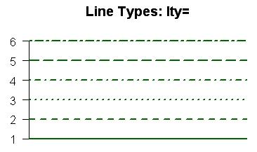


##  Kolory

 

###  sposoby kodowania kolorow dostepne w R


**rgb**-3 liczby dla trzech postawowywch kolorow (czerwony [R-red], zielony [G-green], niebieski [B-blue]). Because each of the three colors can have values from 0 to 255 (256 possible values), there are: 256 × 256 × 256 = 256^3 = 16.777.216 possible color combinations  
<br>
**rgba**-rgb z dodatkowym czwartym parametrm (alpha), odpowiedzialnym za szarosc.  
<br>

**hex**-ze znakiem hasha. Używaj systemu liczbowego heksagonalnego (16 znaków). 
A computer screen displays a color by combining red light, green light and blue light. 100% red, 100% green and 100% blue produces white. Zero red, zero green and zero blue produces black. In fact, equal levels of red, green and blue, whatever that level may be, will always produce a shade of gray.
The six digits of a hex code are in fact three two-digit numbers, each representing the level of red, green and blue. So #000100 is zero red, the darkest possible shade of green without being totally black, and zero blue. #010101, because the three values are all equal, is the darkest possible shade of grey, and #020202 is the second darkest. And of course #000000 is black. But what about #FFFFFF for white – what do the letters mean?
Hex Codes Use The Hexadecimal System to Minimize Length.
There are 256 possible shades each of red, green and blue (0 through 255). If we wanted to produce white (the brightest levels of all three colors combined), we’d need to write #255255255. That’s nine digits long.
Hex codes use the hexadecimal number system to make it possible for 256 numbers to be represented with only two digits. Instead of counting 0 through 10 like our regular decimal number system, it counts 0, 1, 2, 3, 4, 5, 6, 7, 8, 9, A, B, C, D, E, F and then 10, followed by 11, 12, 13, 14, 15, 16, 17, 18, 19, 1A, 1B, 1C, 1D, 1E, 1F and then 20. Make sense?
This means that 256 numbers can be represented using only two digits, instead of the 100 that are possible with our decimal number system (0 through 99). So the highest possible two digit number is not 99 but FF (equal to 255). This is why white is #FFFFFF, pure red is #FF0000, pure green #00FF00 and pure blue #0000FF.  
<br>

**HSLi HSV**-HSL and HSV are the two most common cylindrical-coordinate representations of points in an RGB color model.  
<br>

**LUV**-kolejny rodzaj kodowania kolorow. Mozna go skojarzyc z paleta przedstawiona na przechylownym zaokraglonym trojkocie.  

<br>

**LAB**
<br>

**XYZ**


###  `r CHAP(2,'przekodowywanie kolorow')
Podstawowym typem jakim sie operuje w R jest hex.

```{r}

#z rgb do hex
rgb(.04,.56,.65) #znormalizowany do 1
rgb(.04,.56,.65, maxColorValue = 255) #reczna normalizacja


# z hex do rgb - sposob 1 
require(colorspace)
hex2RGB(c("#FF1223"))
hex2RGB(c("#FF0000","#00FF00", "#0000FF"))

# z hex do rgb - sposob 2 
col2rgb(c("#4682B433"))


#z palet R do rgb
col2rgb("peachpuff")

col2rgb(c(g66 = "gray66", darkg =  "dark gray", g67 = "gray67",
          g74 = "gray74", gray  =       "gray", g75 = "gray75",
          g82 = "gray82", light = "light gray", g83 = "gray83"))

col2rgb(palette())


# z kolorow R na hsv
require(colortools)
col2HSV

```


###  palety kolorow


#### sztywne
 

```{r}
#dostepne w pakiecie grDevices

colors()
colors()[2]

palette()
palette()[3]

require(RColorBrewer)
#podglad palet
display.brewer.all(type="qual") 
brewer.pal(7,"Greens")

```


### palety elastyczne

```{r}

#rzeczy dostepne w grDevices

rainbow(5) # 5 kolorow
n<-10
rainbow(n, s=1, v=1, start=0, end=max(1,n-1)/n , alpha=1)

heat.colors(5)
heat.colors(5, alpha=.5)

gray.colors(5)
gray.colors(5, start=1, end=0)

cm.colors(5)

terrain.colors(5) 
terrain.colors(5, alpha=.5) 

topo.colors(5)
topo.colors(5, alpha=.5)


#hsv
hsv(.5,.5,.5)


#hcl
hcl(h = c(0, 120, 210, 300))

hcl(h = 0, c = 35, l = 85, 
  alpha, #zarkes [0,1]-przezroczystosc
  fixup = TRUE) 


#paleta kolorowa gdzie dostajemy hex
require(Kmisc)
x<-c(runif(20))
gradient(x, m = 10,cols = c("darkorange", "grey60", "darkblue"))


#paleta z ustalonym sztywnym zakresem-dostajemy hex
require(plotrix)
x<-c(runif(20))
color.scale(x, #zbior (wektor.macierz/ramka danych)
  c(0,1), #dla rgb pierwsza liczba dla pierwszego i drugiego koloru
  c(1,1), #dla rgb druga liczba dla pierwszego i drugiego koloru
  c(1,0), #dla rgb trzecia liczba dla pierwszego i drugiego koloru
  alpha=.9, #przezroczystosc koloru
  na.color=c(0,0,.5), #kolor dla brakow danych
  xrange = c(-3,3),  #ustawiony na sztywno zakres kolorystyczny palety
  color.spec='rgb'  # w jaki sposob podawane sa kolory
)


```


###  Przyklady sposobu kodowanie kolorow na przykladzie wykresow wykonanych w f:ggplot2:

```{r}
z<-data.frame(x=1:10, y=c(1,3,5,6,4,5,3,4,2,1))

#RGB
ggplot() + geom_line(data=z, aes(x=x, y=y), colour=rgb(0.2, 0.4, 0.7))

#Nazwa koloru
ggplot() + geom_line(data=z, aes(x=x, y=y), colour='orange')  #lista kolorow w pliku 'kolory_R-a'

#Kodowanie literowe
ggplot() + geom_line(data=z, aes(x=x, y=y), colour='#FFFFFF')  #lista kolorow w pozrodziale 'kolory R-a'

#Paleta
ggplot() + geom_line(data=z, aes(x=x, y=y), colour=rainbow(10))

#Paleta
ggplot() + geom_line(data=z, aes(x=x, y=y), colour=heat.colors(10))

#inne skale to terrain.colors, cm.colors, topo.colors
#skale dodatkowe sa w pakietach EColorBrewer i colorRamps

#Jaki uklad liczb w sytemie PGB ma dany kolor RGB?
col2rgb('orange')
```

### Palety kolorow w R przeglad
W przypadku kolorow gdzie odowlujemy sie po ich nazwach (np. orange) lista kolorow jest w pliku w pliku 
<a href="figures/koloryR.pdf">koloryR</a>

Kolory formatu #FFFFFFF znajduja sie ponizej:


Skale kolorow w pakiecie RcolorBrewer
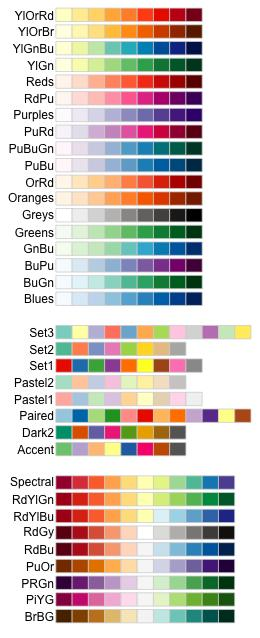


### Gotowe palety kolorow RGB


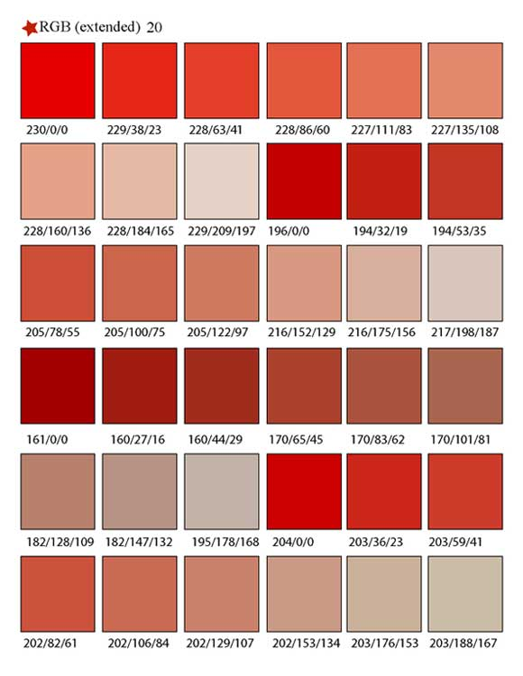
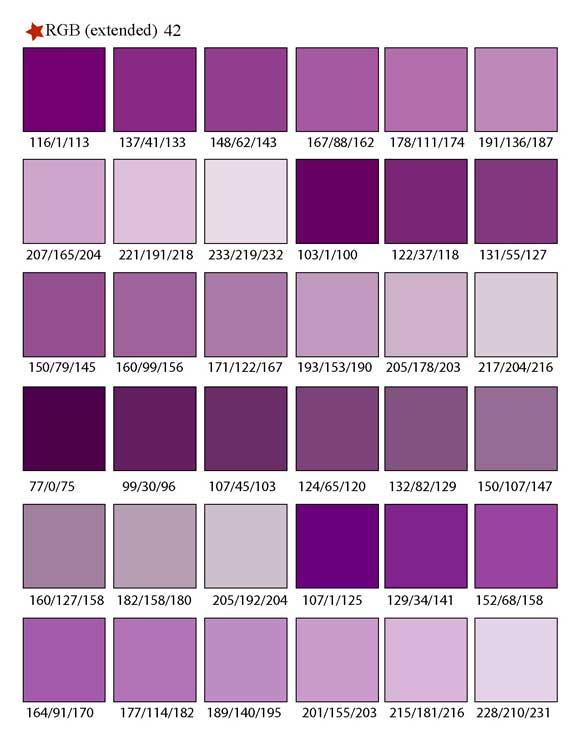
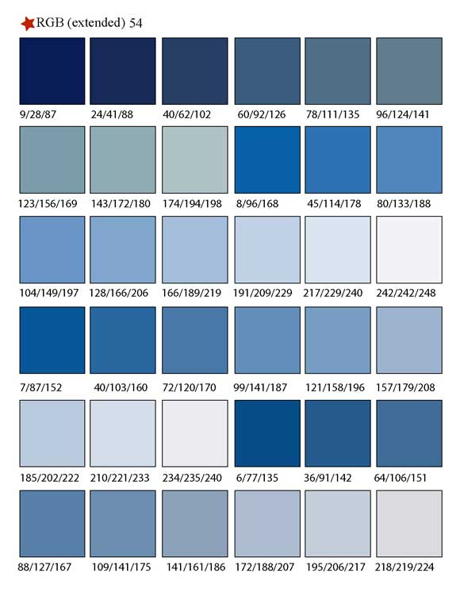

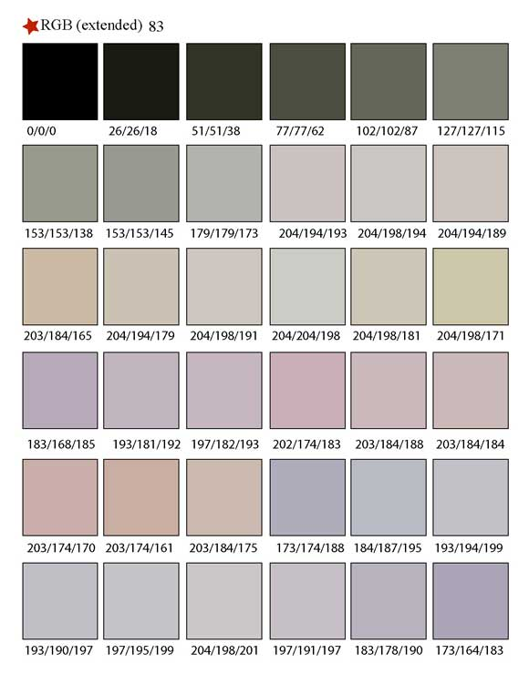

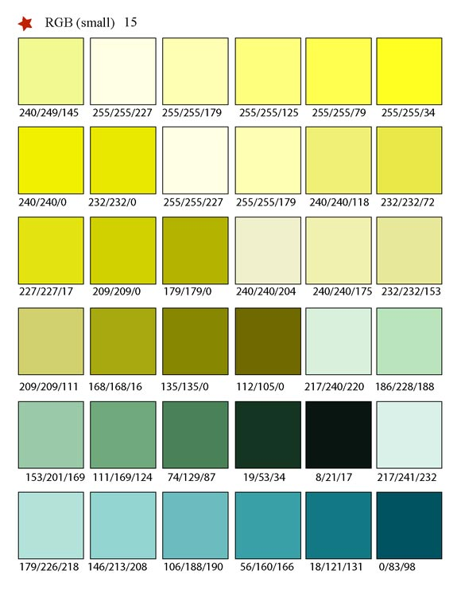


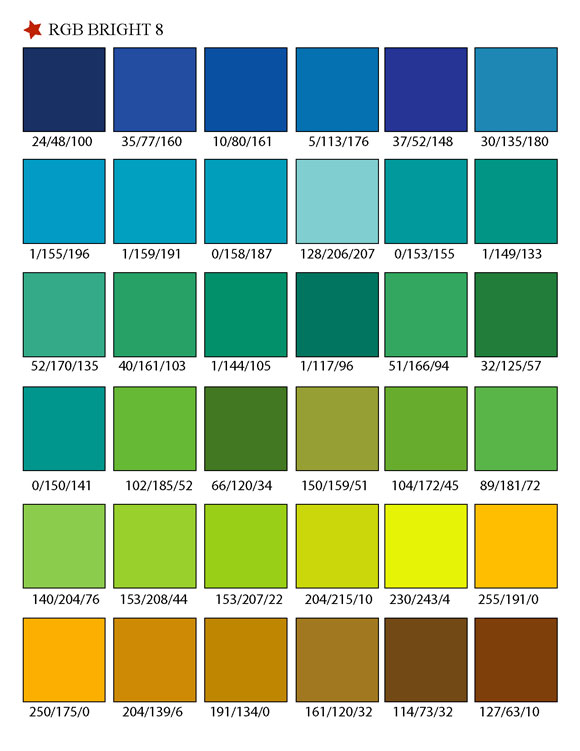

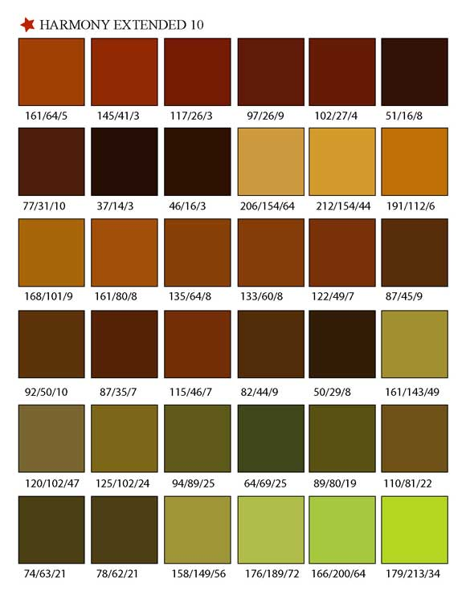
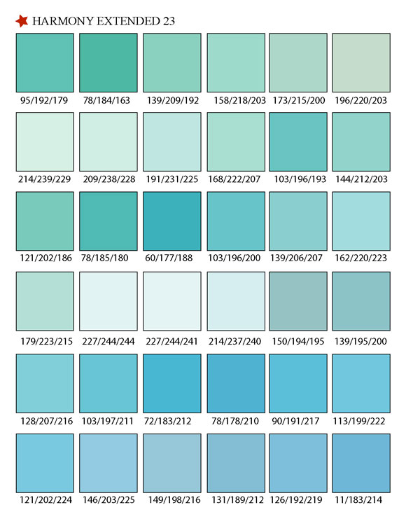
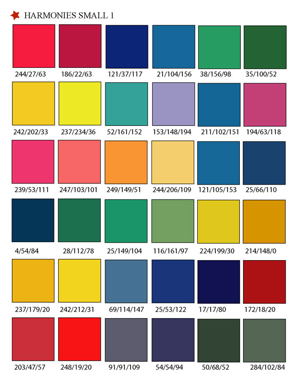


### Inne przyklady ladnych palet kolorow


Przyklad 1
```{r}
#ladne kolorki
library(gcookbook) # For the data set

# Base plot
p <- ggplot(uspopage, aes(x=Year, y=Thousands, fill=AgeGroup)) + geom_area()

# The palette with grey:
cb_palette <- c("#999999", "#E69F00", "#56B4E9", "#009E73", "#F0E442", 
                "#0072B2", "#D55E00", "#CC79A7")

# Add it to the plot
p + scale_fill_manual(values=cb_palette)
```


## Wspolrzedne

### Odczytywanie wspolrzednych z wykresow

```{r}
require(graphics)
locator(n=5) #uruchamiam funkcje, nastepnie klikam  puntu (w tym wypadku 5). Funkcja konczy dzialanie po kliknieciu n punktow lub po uzyciu przycisku esc.
```


##  Jednostki wspolrzednych na wykresie

###  jednostki dlugosci 'units'


```{r}

require(grid)

"npc"
Normalised Parent Coordinates (the default). The origin of the viewport is (0, 0) and the viewport has a width and height of 1 unit. For example, (0.5, 0.5) is the centre of the viewport.

"cm"
Centimetres.

"inches"
Inches. 1 in = 2.54 cm.

"mm"
Millimetres. 10 mm = 1 cm.

"points"
Points. 72.27 pt = 1 in.

"picas"
Picas. 1 pc = 12 pt.

"bigpts"
Big Points. 72 bp = 1 in.

"dida"
Dida. 1157 dd = 1238 pt.

"cicero"
Cicero. 1 cc = 12 dd.

"scaledpts"
Scaled Points. 65536 sp = 1 pt.

"lines"
Lines of text. Locations and dimensions are in terms of multiples of the default text size of the viewport (as specified by the viewport s fontsize and lineheight).

"char"
Multiples of nominal font height of the viewport (as specified by the viewport s fontsize).

"native"
Locations and dimensions are relative to the viewport s xscale and yscale.

"snpc"
Square Normalised Parent Coordinates. Same as Normalised Parent Coordinates, except gives the same answer for horizontal and vertical locations/dimensions. It uses the lesser of npc-width and npc-height. This is useful for making things which are a proportion of the viewport, but have to be square (or have a fixed aspect ratio).

"strwidth"
Multiples of the width of the string specified in the data argument. The font size is determined by the pointsize of the viewport.

"strheight"
Multiples of the height of the string specified in the data argument. The font size is determined by the pointsize of the viewport.

"grobwidth"
Multiples of the width of the grob specified in the data argument.

"grobheight"
Multiples of the height of the grob specified in the data argument.

```


## Wykresy dynamiczne

```{r}

require(animation)

#ustawienie interwalow czasowych
oopt = ani.options(interval = 2, #wielkosc przerwy dla koljnych klatek-wywolujemy potem funkcja 'ani.pause' 
                   nmax = 10)

# tworzenie petli
for (i in 1:ani.options("nmax")) {
  plot(rnorm(30))
  ani.pause() ## pause zdefiniowana wczesniej w 'ani.options'
}

## restore the options
ani.options(oopt)

```

## Rozne elementy graficzne

###  Tabelki

####  Hmisc

```{r}
#estetyczne wyswietlanie macierzy
require(Hmisc)

#pierwszy przyklad
data(HairEyeColor)
print.char.matrix(HairEyeColor[ , , "Male"], col.names = TRUE)

#drugi przyklad
require(ggplot2)
data(diamonds)
print.char.matrix(diamonds[1:5,])
```

### Drzewa


#### pakiet ade4-recznie rysowane drzewa niebinarne


```{r}
#Reczne rysowanie bardziej wypasionych drzew  (PAKIET ade4)----
require(ade4)
provi.tre <- "(  ((a,b,c,d,e)A,(f,g,h)B) C, ((i\njkj,j)k,l) G )D;" #uwaga. nie wolno powtarzac nazw liter bo sie pomiesza!!!
provi.phy <- newick2phylog(provi.tre)
plot.phylog(provi.phy, 
            clabel.l = 1.2, #wielkosc znakow w lisciach 
            clabel.n = .9, #wielkosc znakow na wezlach
            f = .6, ) #dlugosc galezi drzewa
```


<!--chapter:end:15-VISUALISATION_OTHER_ISSUES.Rmd-->

# (PART) <lfg>ADDS-ON</lfg> {-} 

# FORKING


## SQL Databases


https://db.rstudio.com/databases/microsoft-sql-server/

### Load file with sql code


```{r}

require(RODBC)
con <- odbcConnect('sql')
sql <- paste(readLines(con = "C:/Users/lukasz.muszynski/Desktop/temp_files/sql_source/sql_source.sql"), collapse = "\n")
wynik <- sqlQuery(con, sql)

```


### Configuration of connection between R and database with sql server as an example (for ODBC drivers

Go to  **control panel**, and next go to configuration of OCBD conneciton (see figure RODBC_1 i RODBC_2)
<br><br>

```{r, eval=TRUE, echo=FALSE, fig.cap='', out.width='500px'}

```

```{r, eval=TRUE, echo=FALSE, fig.cap='', out.width='500px'}
knitr::include_graphics('figures/RODBC_2.jpg')
```

```{r, eval=TRUE, echo=FALSE, fig.cap='', out.width='500px'}

```

In the administrator window (see next figure) in fiel 'Name' and 'Description' type in any name you want to use in R-cran.
In filed 'Server' type in server name from sql server properties (see second figure from here ).

```{r, eval=TRUE, echo=FALSE, fig.cap='', out.width='500px'}
knitr::include_graphics('figures/RODBC_4.jpg')
```

```{r, eval=TRUE, echo=FALSE, fig.cap='', out.width='500px'}
knitr::include_graphics('figures/RODBC_5.jpg')
```


In the end we have to connect with database in R usin p:RODBC:
```{r}
require(RODBC)
odbcConnect('sql')
channel <- odbcConnect('sql')
z<-sqlQuery(channel, 'select top 100 * from [dbo].[Sheet1$]')
```


### ORACLE

Connecting with RODBC
```{r}
# first you have to define odbc in Windows (like when you use other databases)

require(RODBC)

connection <- odbcConnect('oracle', 'system', 'oracle') #'oracle' is a database name,  'system' is username, 'oracle' is a password

result <- sqlQuery(connection, 'select * from   TABLE1')

sqlTables(connection, schema='system')

```


### SQL Server

#### Connection using p:DBI

```{r}

# SQL Server autentification
con <- DBI::dbConnect(odbc::odbc(),
                      driver = "SQL Server Native Client 11.0",
                      server = 'DESKTOP-BGFASK3\\SQLEXPRES',
                      database = 'master',
                      Trusted_Connection = 'yes',
                      Port = 1433)

# Windows autentification
con <- DBI::dbConnect(odbc::odbc(),
                      Driver = "SQL Server",
                      Server = "DESKTOP-BGFASK3\\SQLEXPRESS",
                      Database = "master",
                      Trusted_Connection = "True")

```


#### Connection beteen R and SQL server and available operations (except SELECT)


Using full string to provide connection parameters:
```{r}
# connection with  Windows Authentification
dbhandle <- odbcDriverConnect('driver={SQL Server};server=PPP-KOMPUTER\\SQLEXPRESS;database=Nauka;trusted_connection=true')

```

Most of syntax below can be applied to other databases.
```{r}
require(RODBC)
require(ggplot2) #for diamonds dataset
z <- diamonds

#connection configuration with full string (in sql server useful to specify trusted connection)
channel <- odbcDriverConnect(
	connection='
			Driver={SQL Server}; 
			Server=PPP-KOMPUTER\\SQLEXPRESS;
			Database=master;
			Trusted_Connection=yes;') # here we use trusted connection

#saving table in sql server
sqlSave(channel, # connection
				z,  #variable with table do save
				colnames=T,   #if columns names should be included
				nastring=NULL,   #how to define missing values
				rownames=F,   #if rows names should be included
				tablename='lukasz'  )  #table name

#updating data in table - we will replace old table the new one.
sqlUpdate(
			channel, 
			z, 
			tablename='lukasz', 
			nastring=NULL) #we will get error. Function needs kolumn with index (argumrnt 'index' of the function is a string with name of column), to overwrite table. If we dont't have indexit is easier to remove table and save new.


#list of available tables in server
sqlTables(channel, tableType='TABLE')  # available values for argument 'tableType' are: TABLE, VIEW, SYSTEM TABLE, ALIAS, SYNONYM. By default all types of tables are printed


#columns structure in table
sqlColumns(  channel
					 , sqtable='lukasz') # table name must be provided


#removing table
sqlDrop(channel, sqtable='lukasz', errors=T) # In the case of error we will get value -1.


#information about connection
odbcGetInfo(channel)


#info about mapping types between R and SQL when SAVING data in SQL 
getSqlTypeInfo(driver = "Microsoft SQL Server")


# info about data types in database
sqlTypeInfo(channel = channel)


```


#### set nocount on


The RODBC driver seems to think that when SQL Server returns any count of rows that the entire statement is complete. So you need to set nocount on at the beginning of your statement or stored procedure that is called. *set nocount on*: This allowed me to use a stored procedure that was using temporary table in R.
      
      
```{r}

require(RODBC)

# connection with database
z<-odbcConnect('sql')
#odbcClose(z)

#query
dane<-sqlQuery(z, '
               set nocount on
               SELECT rok,miesiac,model_sc model, sum(kwota) kwota,count(*) ilosc into #temp from 
               (select distinct
               year(data_wpisu) rok
               ,month(data_wpisu) miesiac
               ,day(data_wpisu) dzien
               ,datepart(hh,data_wpisu) godzina
               ,datepart(mm,data_wpisu) minuta
               ,p_l_nr_czlonka id_klienta
               ,p_s_nr_konta id_konta
               ,p_l_id_wniosek id_wniosek
               ,model_sc
               ,p_l_kwota kwota
               ,pd 
               ,pd*p_l_kwota/100 EL
               from sc.scoring ) as dane
               
               group by rok,miesiac,model_sc
               
               
               select * from
               ( select distinct rok,miesiac,model,kwota from #temp) as pv
               PIVOT
               (sum(kwota) FOR model in ([dk1],[s2],[dk3],[s4],[s5])) as tab
               order by rok,miesiac')
#end of query

odbcClose(z)


```


### Postgres


#### p:RPostreSQL


```{r}

#___RPostgreSQL
require(RPostgreSQL)
m <- dbDriver("PostgreSQL")
con_1 <- dbConnect(drv = m, dbname = 'lukasz', user = 'postgres', password = 'ppp', port=5432, host = 'localhost')
rs = dbSendQuery(con_1, "drop table diamonds")  # uwaga: jezeli chcemy wykorzystac lacze z src_postres to robimy dbSendQuery(my_db$con,q)
dbGetInfo(con_1) # podstawowe informacja po polaczeniu
dbListTables(conn = con_1) # lista tabel
dbRemoveTable(con_1, name = 'diamonds') #usuniecie tabeli
dbDisconnect(con_1) # rozlaczenie sie z baza


```


#### Working with dlyr


**Laczenie z baza i przesylanie tabel**


```{r}

# polaczenie z baza danych
my_db <- src_postgres(  dbname = 'lukasz'
											, user = 'postgres'
											, password = 'ppp'
											, port=5432
											, host = 'localhost')

# skopiowanie z R-a do postgresa
copy_to(  dest = my_db
				, mtcars
				, temporary = FALSE) 

# stworzenie zmiennej podlaczonej do tabeli w postgresie na ktore bedziemy mogli pracowa z R
tabela <- tbl(  my_db
							, 'mtcars') # praca na tabeli 'diamonds' ktora jest w bazie postres


# usuniecie tabeli w postgresie
dbRemoveTable(my_db, name = 'mtcars') #usuniecie tabeli


# zamkniecie polaczenia z baza
rm(my_db)

```


**zapytanie dplyr/sql**


```{r}

my_db <- src_postgres(  dbname = 'lukasz'
											, user = 'postgres'
											, password = 'ppp'
											, port=5432
											, host = 'localhost')
copy_to(my_db, df = mtcars, name = 'mtcars', temporary = TRUE)
tabela <- tbl(   my_db
							, 'mtcars')


# zapytanie przypisuje sie do zmiennych. Jest tu zasada leniwej ewaluacji wiec na razie nie nie jest wykonywane. Zapytanie moga stanowic ciag gdzie jedno moze sie odwolywac do wczesniejszych jak ponizej
z1 <- tabela %>% mutate(nowa_zmienna=cyl*10)
z2 <- z1 %>% mutate(mowa_zmienna_2=cyl*100)

# wykonanie zapytanie i zwrocenie wynikow do R-a
collect(z2)


# UWAGA: na razie przy takim ciagu zaleznosci nie mozna sie chyba odwolywac do kolumn wczesniej zdefuniowanych:
z1 <- tabela %>% mutate(nowa_zmienna=cyl*10)
z2 <- z1 %>% mutate(mowa_zmienna_2=nowa_zmienna*100)
collect(z2) #zwroci blad ( wynika moze to z tego ze w normlany SQL nie jest dopuszczalne takie odwolywanie sie do kolumny wczesniej utworzonej)


# wykonanie zapytania i zapisanie wynikow w tabeli w bazie
compute(z2, temporary=FALSE)

# podglad kodu SQL
show_query(z2)


```

### Other things

```{r}

#tlumeczenie wyrazenia na sql
translate_sql(first %is% NULL)

```


<!--chapter:end:16a-FORKING_SQL_DATABASES.Rmd-->

## NON SQL Databases

<!--chapter:end:16b-FORKING_NON_SQL_DATABASES.Rmd-->

## Python

### configuration

```{r}

require(reticulate)

# information about python configuration used by p:reticulate
py_config()

# discovering configuration
py_discover_config()

# changing default python
use_python(python = 'C:\ ...' , required = FALSE)

# using virtual environment
reticulate::use_virtualenv(virtualenv = 'C:/Users/memy/OneDrive/Pulpit/1_Programs_and_programing/PYTHON/project_1/venv')

# using conda virtual environment
use_condaenv(conda = 'C:\...')

reticulate::use_condaenv('C:/Users/memy/OneDrive/Pulpit/1_Programs_and_programing/PYTHON/project_1/venv')

```


### Executing Python in R

```{r}
# reticulate::virtualenv_create(envname = 'C:/Users/memy/OneDrive/Pulpit/1_Programs_and_programing/PYTHON/project_1/venv')

library(reticulate)

# running Python code from a file
py_run_file("script.py")


# running python code from string and assigning space to variable 'main'
main <- py_run_string("
x = 10
y = 20")
# extracting in R variables from Python
main$x %>% class
main$y


# general rule to extra python object in R from Pyhon
py$x


# loading Python packages
np <- import("numpy", convert = FALSE)
pd <- import("pandas", convert = FALSE)


# playing the Pandas data.frames
main_data_frame <- py_run_string('
import pandas as pd
df=pd.DataFrame({"Animal":["dog","dolphin","chicken","ant","spider"],"Legs":[4,0,2,6,8]})')

df <- main_data_frame$df
class(df) # this is not a R data.frame !!! . Currently (2018 Feb) you cannot convert it do R data.frame !!! 

```


### Execution R in Python

```{python}

```


<!--chapter:end:16c-FORKING_Python.Rmd-->


## C


## C++

<!--chapter:end:16d-FORKING_c_c++.Rmd-->


## Symphy


Algorytm korzystania z pakietu 'symphy':


Przykladowy kod w R z uzyciem pakietu symphy
```{r}
## Not run: 
# These examples are mostly from: http://wiki.sympy.org/wiki/Tutorial

# create a SymPy variable called x
sympy("var('x')")
sympy("y = x*x")
sympy("y")

sympy("limit(1/x, x, oo)")

# the next line fails under jython even without R
# and seems to corrupt the rest of the session
# sympy("(1/cos(x)).series(x, 0, 10)")

sympy("diff(sin(2*x), x, 1)")
sympy("diff(sin(2*x), x, 2)")

sympy("integrate(exp(-x), (x, 0, oo))")

sympy("xr = Symbol('xr', real=True)")
sympy("exp(I*xr).expand(complex=True)")

# Matrices are stored row by row (unlike R matrices)
cat(sympy("A = Matrix([[1,x], [y,1]])"), "\n")
cat(sympy("A**2"), "\n")


## End(Not run)
```


<!--chapter:end:16e-FORKING_Other.Rmd-->

# INTERACTIVE APPS SHINY

main website about shiny:
http://shiny.rstudio.com/

tutorial for shiny:
https://shiny.rstudio.com/tutorial/

## Code location

### Separated files

W ramach 'shiny' tworzymy dwa zwykle pliki R i zapisujemy do stworzonego wczesniej katalogu. Katalog moze miec dowolna nazwe i lokalizacje. Pierwszy plik musi miec nazwe 'ui' a drugi 'server'. Opcjonalanie mozemy dodac trzeci plik o nazwie 'global'. Nazwy nie moga byc zmienione, bo program nie odnajdzie plikow. W pierwszy definiujemy ogolna strukture strony internetowej. W drugim tworzymy kod wykonujacy obliczenia. W trzecim globalne zmienne ktore mozna wykorzystac przy przetwarzaniu kodu w dwoch pozostalych plikach. Od wersji R-studio 98.800 do uruchomienia programu wykorzystuje sie przycisk 'Run' z zielona strzelka (w miejscu gdzie dla zwyklego dokumentu pdf jest przycisk 'knit'). Wcześniej nie było takiej opcji i trzeba bylo sie posluzyc innym sposobem, .tzn, do uruchomienia strony wykorzystujemy polecenie zawierajace sciezke dostepu do katalogu z plikami:
`runApp('C:/Users/ppp/Desktop/shiny1')`. Polecenie musi byc umieszczone w pliku 'server'. Jednak w momencie odpalania strony samo polecenie nie może byc zapisane w pliku. Tzn. najpierw zapisujemy plik 'server' po zmianach, a nastepnie wklejamy polecenie i je odpalamy. 
przyklad:

ui:
```{r}
shinyUI()
```
server:
```{r}
require(shiny)
shinyServer()

# runApp('C:/Users/ppp/Desktop/wykresy_shiny/shinysky') # do recznego aplikacji bez przycisku w R-studio.
```

### All in one file

```{r, play=TRUE}
server <- function(input, output) {
  output$distPlot <- renderPlot({
    hist(rnorm(input$obs), col = 'darkgray', border = 'white')
  })
}

ui <- shinyUI(fluidPage(
  sidebarLayout(
    sidebarPanel(
      sliderInput("obs", "Number of observations:", min = 10, max = 500, value = 100)
    ),
    mainPanel(plotOutput("distPlot"))
  )
))

require(shiny)
shinyApp(ui = ui, server = server)
```


## UI - basic elements and layout


### General layout of page


**(1) Basic**
```{r}
shinyUI(ui = basicPage())
```


**(2) sidebarLayout**
```{r}
shinyUI(ui = sidebarLayout(  sidebarPanel()
                           , mainPanel = )
       )
```


**(3) Grid**
```{r}
shinyUI(ui = fluidPage( titlePanel('title')
                       ,fluidRow(
                           # numbers must sum up to 12 (here 4 + 8 = 12)
                           column(4, ...)
                          ,column(8, ...)
                        )
                       )
       )
```

<br><lfsb>Tip</lfsb>
<div class="btn-info"> Przy zagniezdzaniu kolumn lepiej uzyc f:fixedRow. Wtedy przy zanieżdżonych szerokosc kolumn zaniezdzonych sumuje sie nie do 12 ale do szerokosci kolumny n </div><br>

  
```{r}
fixedRow(
  column(9,
    "Level 1 column",
    fixedRow(
      column(6,
        "Level 2"
      ),
      column(3,
        "Level 2"
      )
    )
  )
)
```


**(6) flow**


```{r, comment = 'WORKING CODE'}
 
require(shiny)

ui <- shinyUI(pageWithSidebar(    
  headerPanel("Tab Switch Demo"),
  sidebarPanel(     
    flowLayout( # elements are alligned left to right and top to bottom
      numericInput("rows", "How many rows?", 5),
      selectInput("letter", "Which letter?", LETTERS),
      sliderInput("value", "What value?", 0, 100, 50)
    ),
    splitLayout( #Lays out elements horizontally, dividing the available horizontal space into equal parts
      numericInput("rows1", "How many rows?", 5),
      selectInput("letter1", "Which letter?", LETTERS),
      sliderInput("value1", "What value?", 0, 100, 50)
    ),
    inputPanel( #flowLayout with grey border and light grey backgroud
      numericInput("rows2", "How many rows?", 5),
      selectInput("letter2", "Which letter?", LETTERS),
      sliderInput("value2", "What value?", 0, 100, 50)
    ),
    
    radioButtons("dist", "Distribution type:",
                 c("Normal" = "norm",
                   "Uniform" = "unif",
                   "Log-normal" = "lnorm",
                   "Exponential" = "exp"), inline=TRUE),
    
    
    checkboxGroupInput("variable", "Variable:",
                       c("Cylinders" = "cyl",
                         "Transmission" = "am",
                         "Gears" = "gear"), inline=TRUE),
    sliderInput(inputId = 'slid', label = 'slider1', min = 50, max=100, value = 70, width='70px')
    
  ),
  mainPanel()  
))

server <- function(input, output)
  
shinyApp(ui, server)

```


**(5) navbarPage** page with downdrop menu
```{r}
shinyUI(

  navbarPage(inverse = FALSE, # for colors
             HTML('title'), 
  
    #button without downdrop
    tabPanel(HTML('MENU')),
    
    #buttons with downdrop in navigation bar (navbar)
    navbarMenu( "More"  #name of downdrop button
               ,tabPanel("Summary1", ...) # in the place of dots put content of the page you want to dispay after clicking tab
               ,tabPanel("Summary1", ...)
               ,"----" # separator
               ,"Section header" # section
               ,tabPanel("Table", ...)
               ,tabPanel("Plot", ...)
              )
    )
)


```


**(6) boostrap** ( For users who are proficient in HTML/CSS, and know how to lay out pages in Bootstrap. Create a Shiny UI page that loads the CSS and JavaScript for Bootstrap, and has no content in the page body (other than what you provide))
```{r}
shinyUI(ui = bootstrapPage(..., title = NULL, responsive = NULL, theme = NULL))
)
```


**(7) shinydashboar** See in chapter about extensions for shiny.


### Basic NON_INPUT elements

**(1) well**
```{r}

shiny::wellPanel(...)

```


**(2) conditionalPanel**

```{r, play = TRUE}

require(shiny)

ui <- shinyUI(basicPage(
  
   numericInput('n', 'n', value = 1, min = 0, max = 100)
  
  ,conditionalPanel(
         condition = "input.n == 1 | input.n == 2 " # input.n %in% c(1,2) does not work !!!!
        ,selectInput("br", "br", c("Sturges", "Scott", "Freedman-D")
        ))
))

server <- function(input, output)

shinyApp(ui, server)

```


**(3) tabset**
Creating tabsets
```{r, play=TRUE}

ui <- shinyUI(basicPage(
tabsetPanel(
   tabPanel("Plot",    list(plotOutput("plot1"), plotOutput("plot1") ) ) #jezeli jest wiele elementow to podaje je  w liscie
  ,tabPanel("Summary", verbatimTextOutput("summary"))
  ,tabPanel("Table",   tableOutput("table"))
  ,type = c("tabs", "pills")
  ,id = 'tab_id' # If provided, you can use input$id in your server logic to determine which of the current tabs is active.
  ,selected = "Table" # 'Table' tab is selected
  
)
))
server <- function(input, output)
shinyApp(ui, server)

```

Dynamically adding/removing tabs
```{r, play=TRUE}

# example app for inserting/removing a tab
ui <- fluidPage(
  sidebarLayout(
    sidebarPanel(
      actionButton("add", "Add 'Dynamic' tab"),
      actionButton("remove", "Remove 'Foo' tab")
    ),
    mainPanel(
      tabsetPanel(id = "tabs",
                  tabPanel("Hello", "This is the hello tab"),
                  tabPanel("Foo", "This is the foo tab"),
                  tabPanel("Bar", "This is the bar tab")
      )
    )
  )
)
server <- function(input, output, session) {
  observeEvent(input$add, {
    insertTab(inputId = "tabs",
              tabPanel("Dynamic", "This a dynamically-added tab"),
              target = "Bar"
    )
  })
  observeEvent(input$remove, {
    removeTab(inputId = "tabs", target = "Foo")
  })
}

shinyApp(ui, server)

```


### Basic INPUT elements


gellery of basic widgets for shiny:
https://shiny.rstudio.com/gallery/widget-gallery.html


`selectInput` i `selectizeInput` (pole do wybierania wartosci z listy rozwijanej):

<br><lfr>Warning!</lfr>
<div class="btn-danger"> Dla nie zaznaczenia niczego tworzymy wartosc wyboru pusta `''`. Jezeli mamy wielokrotny wybor to wtedy zwraca do servera `NULL`, a jezeli jednokrotny to pusty tekst `''` </div><br>

```{r, play = TRUE}
ui <- shinyUI(basicPage(
              
  selectInput(  inputId = 's1' #nazwa elementu do ktorej bedziemy sie odwolywac w pliku servera
              , label   = 's1' #nazwa elementu widoczna dla uzytkownika
              , selectize = TRUE # nie jest potrzebne dla pustego wyboru (brak wyboru jakiejkolwiek wartosci z listy)
              , multiple  = TRUE # Jezeli zaznaczanych jest wiele wartosci, to select zwroci zwykly wektor c(...)
              , selected  = 'A' # podaje wartosc do servera a nie wyswietlany label. Jezeli damy 'NULL'to nic nie bedzie zaznaczone
              , choices = c( 'a'     = 'A' # widoczne jest 'a' a do servera zwraca 'A'
                            ,'b'     = 'B'
                            ,'nic'   = '' # jezeli nic nie wybiore
                            ,'nic_2' = NA # zwroci tekst "NA" a nie brak danych NA
                            )) 
  ,verbatimTextOutput('s1_out')
))

server <- function(input, output, session) {
  output$s1_out <- renderPrint(input$s1)
}

shinyApp(ui, server)


    selectInput(
      inputId = 'zm1', #nazwa do ktorej bedziemy sie odwolywac w pliku servera
      label   = c("Lista rozwijana"), #nazwa listy rozwinajej
      choices = c(  "z" = "d"
                  , "d" = "b"
                  , "g" = "g"), #elementy do wyboru i ich etykiety
      selected = NULL, #co ma byc domyslnie zaznaczone. Jezeli damy 'NULL'to nic.
      multiple = FALSE)  #czy mozna zaznaczac wiele elementow. Domyslnie FALSE. Jezeli zaznaczanych jest wiele wartosci select prawdopodobnie zwroci zwykly wektor 'c(...)'
```


`dateInput`

```{r}
dateInput("date", label = h3("Date input"), value = "2014-01-01")
```

`dateRangeInput`
```{r}
dateRangeInput("dates", label = "Date range") # by default both date are set to current date

dateRangeInput(  'dates'
               , width = '300px' #szerokow w procentach ('100%') lub pixelach ('400px'), lub centymetrach ('2cm'), lub milimetrach ('20mm'), lub 'auto'
               , separator = 'to'
               , format = 'yyy-mm-dd'
               , language = 'en' # dostepny jest tez polski 'pl'
               , weekstart = 0 # 0-Sunday. Jaki dzien jest pierwszym dniem tygodnia.
               , startview = 'month' # okno kalendarzyka na jakim interwale ma byc po otwarciu
               , start = as.Date('2017-12-31')
               , end   = as.Date('2018-12-31')
               , min   = as.Date('2012-12-31')
               , max   = as.Date('2020-12-31'))

```

`radioButtons`

```{r}

radioButtons(  inputId      = 
             , label        = 
             
               , choices      = c('choiceName' = 'choiceValue')
             # alternativelly you can provide separated vector for both choiceNames and choiceValues
             # , choiceNames  = 
             # , choiceValues = 
             
             , selected     = 'choiceValue' #no choiceName !!!
             , inline       = 
             , width        = 
)

```


`checkboxGroupInput`

```{r}
checkboxGroupInput(  "checkGroup"
                   , inline   = 
                   , label    = h3("Checkbox group")
                   , choices  = list("Choice 1" = 1, "Choice 2" = 2, "Choice 3" = 3)
                   , selected = 1
                   )
```


`textarea` pole textowe o zmiennym rozmiarze

```{r}
tags$textarea(id="foo", rows=3, cols=40, "Default value")
```


### basic OUTPUT element

Shiny package:

1. renderDataTable() <-> dataTableOutput()
2. renderImage()     <-> imageOutput()
3. renderPlot()      <-> plotOutput()
4. renderPrint()     <-> verbatimTextOutput()
5. renderTable()     <-> tableOutput()
6. renderText()      <-> textOutput
7. renderUI()        <-> uiOutput()

Extensions:

1. rhandsontable::rhandsontable() <-> rhandsontable::rHandsontableOutput()
2. DT::renderDataTable()          <-> DT::dataTableOutput()


## UI - modifying


### CSS

Loading external files
```{r}
tags$link(  rel="stylesheet"
          , type="text/css"
          , href="C:/Users/ppp/Desktop/SHINY/Wstepne_analizy/css/plik_1.css")
# or
includeCSS(path='C:/Users/ppp/Desktop/SHINY/Wstepne_analizy/css/plik_1.css')


```


Using CSS styles
```{r}
# frame
div(  id = 'div_1'  #id is optional
    , class="span11"
    , sliderInput('ble',label='ble',min=0,max=10,step=1,value=4))

# parafraph
p(  id = 'a' #id is optional
  , class = 'b'
  , HTML('bleble'))
```


Using CSS directly
```{r}
# (1)
textInput('sep','sep'), tags$style(type='text/css', "#sep { width: 25px;}")

# (2)
textInput('dec','dec'), tags$style(type='text/css', "#dec { width: 100px;}")

# (3) MODYFIKACJA GLOBALNA USTAWIEN DLA WSZYSTKICH INPUTOW DANEJ KATEGORII
 tags$head(
        tags$style(type="text/css", "label.radio { display: inline-block; }", ".radio input[type=\"radio\"] { float: none; }"),
        tags$style(type="text/css", "select { max-width: 200px; }"),
        tags$style(type="text/css", "textarea { max-width: 85px; }"),
        tags$style(type="text/css", ".jslider { max-width: 200px; }"),
        tags$style(type='text/css', ".well { max-width: 310px; }"),
        tags$style(type='text/css', ".span4 { max-width: 310px; }")
      )

# (4) MODYFIKACJA HEADERA
  
tags$head(
tags$style(type='text/css', 
           ".textInput {font-size: 20px} ")),
  
# (5) MODYFIKACJA LABEL W PRZYCISKU (with html, no CSS)
sliderInput ("lambda1", label=div(HTML("Choose &-lambda;:")), min=0, max=10, value=1.1, step=0.1)
 
```


### tags

```{r}

ui <- shinyUI(basicPage(
              
   div(style='color:red;', HTML('frame'))
  ,span('a') # it is like div but with the difference that it is an INLINE element
  ,h1('big header') #headers
  
  ,h6('small header')
  ,a(href='http://www.wp.pl', 'Click Here!') # href fo rlinks
  ,img(src = 'C:/Users/memy/Desktop/dla_Ewelinki/Manual_R/figures/create_project.png', alt='no photo') 
  ,code('code')
  ,br() # break line <br>
  ,em('emphesized text') # Renders as emphasized text
  ,strong('bolded text')
  ,hr('a') # horizontal rule [linia pozioma]
  ,pre('Text in a pre elementis displayed in a fixed-width font, and it preserves both spaces and line breaks') # preformatted text
  
))

server <- function(input, output, session) {
}

shinyApp(ui, server)

```
```{r}
tagList( tags$h1("Title")
        ,tags$h2("Header text")
        ,tags$p("Text here"))
```


### UI - dynamically generating from server

See part about server side processing


## Server 


### General remarks


* Kod pisany w 'reactive' oddzialuje na konsole R-a. Warunkiem jest to ze sam reactive musi byc wywolany przez inny blok ktory generuje jakos ouput.Tej cechy nie posiada observe, ktory wykonuje kod nawet jesli nie jest wywolany. 

<br><br>


### scoping rules


1. Zmienne na ktorych pracuje sie w blokach reaktywnych (render, observer itp.), **NIE sa widziane** poza nimi. 
2. Zmienne zdefiniowane poza blokami reaktywnymi **sa widziane w blokach**
3. Zmienne zdefiniowane w pliku 'global' sa widziane w plikach 'ui' i 'server'
4. Operator przypisania globalnego. Patrz dalsze przyklady. Przy pomocy operatora przypisania globalnego `<<-` mozna zapisac wartosc do zmiennej aby byla widziana w kolejnej sesji. Zmienne mozna tak zapisywac rowniez w blokach. Ale nalezy pamietac ze w bloku mozemy nadpisac globalnie zmienna zdefiniowana poza blokami. Tzn. nadpisanie w bloku globalnie zmiennej pochodzacej z innego bloku nie jest mozliwe (patrz punkt pierwszy).
4. Wyniki z calych blokow mozna przypisywac do zmiennych. W takim wypadku zmienna taka jest widoczna w innych blokach. Z bloku jest przypisywana wartosc zogdna z regula nawiasow klamrowych (tzn ostatnie wyrazenie z klamry). 
5. Do zmiennych ktore powstaly przez przypisanie wartosci z bloku, w innym bloku odwolujemy sie poprzez wypisanie jej z nawiasami okraglymi np:<br> `zmienna()[[2]]`.


### problems list 


**list of some problems**


patterns for actionButtons:
http://shiny.rstudio.com/articles/action-buttons.html


(1)
dwa przyciski - jeden element - jedna zmienna przyjmuje 2 wartosci: jedna dla nacisniecia jednego przycisku druga grugiego. Robimy to w observerze na poczatku. Potem sprawdzmy wartosc i wiemy co bylo nacisniete

(2)
dwa outputy jedna lokalizacja - tutaj trzeba dynamicznego UI oraz zagniezdzenie obu outputow w observe

(3)
generowanie output w petli: zagniezdzamy petle w observerze. Trzeba pamietac o funkcji local.

(4)
nauka angielskiego - modul do wyswietlania i oceniania znajomosci. Musi byc globalny licznik


```{r}


z1 <- numeric(0)
z2 <- numeric(0)
z3 <- numeric(0)
z4 <- numeric(0)
z5 <- numeric(0)

ui <- fluidPage(actionButton('a1'), verbatimTextOutput('v1'))

se <- function(input, output, session){
  
    observeEvent(input$a1,{z1 <-  runif(1)})
    observeEvent(input$a1,{z2 <- -1; z2 <<- runif(1)})
    observeEvent(input$a1,{z3 <- -1; observe(observe(z3 <<- runif(1)))})
    observeEvent(input$a1,{z4 <- -1; assign('z4', value=runif(1), envir = .GlobalEnv)})
    observeEvent(input$a1,{z5 <- -1; observe(observe( assign('z5', value=runif(1), envir = .GlobalEnv) ) )})
  
    output$v1 <- renderPrint({
      input$a1
      print(list(  z1 # brak wplywu
                 , z2 # zmienia sie
                 , z3 # brak wplywu
                 , z4 #zmiena sie
                 , z5 #zmienia sie
                 )
            ) 
    })
    
}

shinyApp(ui, se)


```


### reactive i observer


#### f:reactiveVal i reactiveVals

<br><lfg>Useful</lfg>
<div class="btn-success"> f:reactiveVal vs f:reactiveValues() - syntax differences: </div><br>

```{r}
one_var   <- reactiveVal()
one_var(10) # assigning values
one_var() # extracting values

many_vars <- reactiveValues(a=1, b=2, c=3)
many_vars$a <- 10 #assigning values
many_vars$a # estracting values

```

W zmiennej reactiveVal mamy cos takiego, ze jezeli zmieniamy jej wartosc to wszyskie elementy ktore odwoluja sie do niej sa o tym informowane. 
  
Przyklad dla *output*
```{r, play=TRUE}

ui <- shinyUI(basicPage(actionButton('a1','a1'), verbatimTextOutput('v1')))

sv <- function(input, output, session){
  r_val <- reactiveVal()
  observeEvent(input$a1, {r_val(runif(1))}) # zdarzenie modyfikujace r_val
  output$v1 <- renderPrint({print(r_val() )}) 
}
shinyApp(ui, sv)
```


  

Przyklad dla *observer*

```{r, play=TRUE}

ui <- shinyUI(basicPage(actionButton('a1','a1')))

sv <- function(input, output, session){
  r_val <- reactiveVal()
  observeEvent(input$a1, {r_val(runif(1))}) # zdarzenie modyfikujace r_val
  observe({
    saveRDS(r_val(), file = '_17/usunac.RDS') # observer ktory bedzie poinformowany o zmianie wartosci r_val
  })
}
shinyApp(ui, sv)
```


Nastepny przyklad

<br><lfsb>Tip</lfsb>
  <div class="btn-info"> Uzycie reactiveVal dla rozwiazania problemy gdzie dwoma przycikami steruje jednym outputem. Wersja bez f:isolate </div><br>


```{r, play=TRUE}
require(shiny)

ui <- shinyUI(basicPage(
  
  actionButton('b1', 'b1')
  ,actionButton('b2', 'b2')
  
  ,verbatimTextOutput('v1')
  
))

server <- function(input, output, session){
  
  a <- reactiveValues(selection=NULL)
  observeEvent(input$b1, {a$selection <- 1})
  observeEvent(input$b2, {a$selection <- 2})
  
  output$v1 <- renderPrint({
    
    button_selection <- a$selection
    
    if(button_selection == 1){
      print('b1')
    }else if(button_selection == 2){
      print('b2')
    }
  })
}
shinyApp(ui = ui, server = server)
```


Do f:reactiveVal mozna tez stosowac isolate. Powyzszy przyklad po drobnej modyfikacji:
```{r, play=TRUE}

require(shiny)

ui <- shinyUI(basicPage(

   actionButton('b1', 'b1')
  ,actionButton('b2', 'b2')
  ,actionButton('action', 'action') # dadajemy trzeci przycisk bo dwa poprzednie beda zaizolowane
  ,verbatimTextOutput('v1')
  
))

server <- function(input, output, session){

  a <- reactiveValues(selection=NULL)
  observeEvent(input$b1, {a$selection <- 1})
  observeEvent(input$b2, {a$selection <- 2})
  
  output$v1 <- renderPrint({
    
    button_selection <- isolate(a$selection) # tutaj dodajemy izolacje
    
    input$action # trzeci przycisk dodany ze wzgledu na izolacje
    
    if(button_selection == 1){
      print('b1')
    }else if(button_selection == 2){
      print('b2')
    }
  })
}
shinyApp(ui = ui, server = server)

```


#### reactive

*reactive* syntax. Zgodnie z regula klamrowa zwracana jest ostatnia linijka. Jezeli nie umiescimy w niej zmiennej to *reactive* nam nic nie zwroci


```{r, play=TRUE}

ui <- shinyUI(basicPage(actionButton('a1','a1'), verbatimTextOutput('v1')))

se <- function(input, output, session){
  
  # list
  r1 <- reactive({
    input$a1
    l <- list(a=runif(1), b=runif(1))
    l
  })
  
  
  #one variable
  r2 <- reactive({
                  input$a1
                  x <- runif(1)
                  x
                 })
  
  # extracting
  output$v1 <- renderPrint({
    print(list(
      # r1()$l takie cos nam niczego nie zwroci !!!
       r1()$a      #1
      ,r1()['a']   #2
      ,r1()[1]     #3
      ,r2()        #4
    ))
  })
}

shinyApp(ui, se)


```


'reactive' tak jak 'rectiveVal' i 'reactiveVals' potrafi pchac:
  
```{r, play = TRUE}

ui <- shinyUI(basicPage(  
                          actionButton('a1', 'a1')
                        , verbatimTextOutput('v1')))
se <- function(input, output, session) {
  a <- reactive({a <- runif(1) 
                 input$a1 # ten przycisk bedzie pchal dzialanie reactive
                 a
                })
  output$v1 <- renderPrint({print(a())})
}

shinyApp(ui, se)
```


Natomiast output nie potrafi ciagnac (to co powyzej z drobna modyfikacja):
  
```{r, play = TRUE}

ui <- shinyUI(basicPage(  
    actionButton('a1', 'a1')
  , verbatimTextOutput('v1')))
se <- function(input, output, session) {
  a <- reactive({a <- runif(1) 
  # input$a1 # blokuje przycisk pchajacy
  a
  })
  output$v1 <- renderPrint({
    input$a1 # przycik ktory powinien NIBY ciagnac
    print(a())
    })
}

shinyApp(ui, se)

```


complex chaining of *reactve*. First conclusion is that reactive can push reactive. Next is that we can fork *reactive* elements.

```{r, play = TRUE}

ui <- shinyUI(basicPage(actionButton('a1', 'a1'), verbatimTextOutput('v1')))

se <- function(input, output, session){
  r1 <- reactive({
    input$a1
    runif(1)
  })
  
  r2 <- reactive({
    input$a1
    c(runif(1), r1())
  })
  
  r3a <- reactive({
    c(runif(1), r2())
  })
  
  r3b <- reactive({
    # we have no input$a1 here !!! we are pushed by r2()
    c(runif(1), r2())
  })
  
  output$v1 <- renderPrint({
    list(r1(), r2(), r3a(), r3b())
  })
  
}
shinyApp(ui, se)

```


#### observe

*observe* order of execution.

```{r, play = TRUE}

library(shiny)

z1 <- numeric(0)
z2 <- numeric(0)
ui <- fluidPage(actionButton('a1','a1'), verbatimTextOutput('v1'))

server <- function(input, output, session) {
  #z1
  observe(priority = 2, x = {input$a1; z1 <<- 200 + runif(1)})
  observe(priority = 1, x = {input$a1; z1 <<- 100 + runif(1)}) # this observe will be executed bofore previous!
  
  #z2
  observe(priority = 3, x = {input$a1; z2 <<- 400 + runif(1)})
  observe(priority = 4, x = {input$a1; z2 <<- 500 + runif(1)})
  
  output$v1 <- renderPrint({input$a1; print(list(z1,z2))})
  
}

shinyApp(ui, server)

```

*observe* suspension

```{r}

server <- function(input, output) {
  
  z <- reactive({
    
    input$action
    
    z <- input$obs  
    w <- rnorm(n=z)
    w
    
  })
  
  obs_1 <- observe({
    write.table(x = z(), file = 'C:/Users/ppp/Desktop/plik.txt')
  }
  , suspended=TRUE)
  
  obs_2 <- observe({
    if(input$action %% 2 == 0) obs_1$resume()
  }) #make 'obs_1' not suspended
  
  obs_2 <- observe({
    if(input$action %% 2 != 0) obs_1$suspend()
  }) #make 'obs_1' suspended
  
}

```
Using above syntax we can also change priority of *observe*
```{r}
obs_2 <- observe({
  if(input$action %% 2 != 0) obs_1$setPriority(priority = 0)
})
```


Sprawdzenie czy observe jest zawieszony

```{r, eval=FALSE}


s <- function(input, output, session){
  
  obs <- observe({}, suspended = TRUE)
  
  output$t <- renderPrint({
    obs$.suspended
  })
  
}


u <- shinyUI(fluidPage(
  
  verbatimTextOutput('t')
  
))

shinyApp(u, s)

```


### dynamic ui

#### simple examples

Simple example (uiOutput not generated separately)
```{r}

ui <- fluidPage(
  
   actionButton('a1', 'a1')
  ,numericInput('n1', 'n1', value = 1, min = 1, max = 100, step = 10)
  ,uiOutput('ui1')
  
)

se <- function(input, output, session){
  
  output$ui1 <- renderUI({
    
    default <- input$n1
    
    tagList(
       sliderInput('s1', 's1', value = default, min = 1, max = 100, step = 1)
    )
  })
}
shinyApp(ui, se)

```

Many separated dynamically generated ui (also uiOutput!!!)
```{r, play=TRUE}

u <- shinyUI(fluidPage(uiOutput('o3')))


s <- function(input, output, session){
  
  observe({
    
    output$o1 <- renderUI({
      checkboxInput('c1','c1',value = TRUE)
    })
    
    
    output$o2 <- renderUI({
      checkboxInput('c2','c2',value = FALSE)
    })
    
    
  })
  
  output$o3 <- renderUI({
    list(uiOutput('o1'), uiOutput('o2') )
  })
  
}

shinyApp(u,s)
```

#### Complicated nesting dynamically generated ui

Niestety bezposrednia zaleznosc *sel_1* od *c1* w ramach jednego *renderUI* jest niemozliwa.
```{r, play=TRUE}

require(shiny)
require(ggplot2)
d <- head(diamonds)
m <- head(mtcars)

s <- function(input,output, session){
  
  output$o1 <- renderUI({
    
    list(
      checkboxInput('c1', 'c1', value = TRUE),
      selectInput('sel_1', 'sel_1', choices = if(input$c1) names(d) else names(m) ))
    
  }) 
}

u <- shinyUI(fluidPage(
  
  actionButton('a1','a1'),
  uiOutput('o1')
  
))

shinyApp(u, s)

```
<br>
Koniecznie jest rozbicie elementow

```{r, play=TRUE}

require(shiny)
require(ggplot2)
d <- head(diamonds)
m <- head(mtcars)

s <- function(input,output, session){
  
  output$o1 <- renderUI({
    checkboxInput('c1', 'c1', value = TRUE)
  })
  
  output$o2 <- renderUI({
    
    list(
      selectInput('sel_1', 'sel_1', choices = if(input$c1) names(d) else names(m) ))
  })
  
}

u <- shinyUI(fluidPage(
  
    actionButton('a1','a1')
  , uiOutput('o1'),
  , uiOutput('o2')
  
))

shinyApp(u, s)

```


Next complecated nesting

```{r, play = TRUE}


ui <- fluidPage(
  
  uiOutput('ui1')
  
)

se <- function(input, output, session){
  
  output$ui1 <- renderUI({
    
    tagList(
       numericInput('n1', 'n1', min = 1, max = 100, step = 10, value = 1)
      ,renderUI({
          tagList(
            sliderInput('s1', 's1', min = 1, max = 100, value = input$n1)
          )
       })
    )
    
  })
  
}

shinyApp(ui, se)

```


#### dynamic ui in loop

Dynamicznie inputy, render i outputy (3 rzeczy na raz), w tym inputy dynamicznie po stronie ui a nie servera !!!
Przyklad ze strony: https://shiny.rstudio.com/gallery/creating-a-ui-from-a-loop.html

```{r, play = TRUE}

library(shiny)
require(dplyr)

ui <- fluidPage(
  title = 'Creating a UI from a loop',
  
  sidebarLayout(
    sidebarPanel(
      
      # generowanie dynamicznej ilosci selectow
      lapply(1:5, function(i) {
        selectInput(paste0('a', i), paste0('SelectA', i),
                    choices = sample(LETTERS, 5))
      })
    ),
    
    mainPanel(
      verbatimTextOutput('a_out'),
      
      # UI output
      lapply(1:10, function(i) {
        uiOutput(paste0('b', i))
      })
    )
  )
)

se <- function(input, output, session) {
  
  # note we use the syntax input[['foo']] instead of input$foo, because we have
  # to construct the id as a character string, then use it to access the value;
  # same thing applies to the output object below
  
  # mamy jeden renderPrint ktory musi sobie poradzic z pobieraniem dynamicznej iloscio inputow
  output$a_out <- renderPrint({
    res <- lapply(1:5, function(i) input[[paste0('a', i)]]) # tutaj mamy dynamiczna ilosc inputow
    str(setNames(res, paste0('a', 1:5)))
  })
  
  
  # generowanie dynamicznej ilosci outputow
  lapply(1:10, function(i) {
    
    output[[paste0('b', i)]] <- renderUI({
      strong(paste0('Hi, this is output B#', i))
    })
    
  })
}

shinyApp(ui, se)

```


Simple example with many plots

```{r, play = TRUE}

ui <- fluidPage(
  
   numericInput('n1', 'n1', value = 1, min = 1, max = 6)
  ,uiOutput('ui_1')
)


se <- function(input, output, session){
  observe({
    
    il_wyk <- input$n1
    
    # dynamiczne rendery
    lapply(1:il_wyk, function(i){
      
      output[[paste0('nazwa', i)]] <- renderPlot({
        # ggplot() + geom_histogram(data=data.frame(sample(x = 1:1000, size = 50, replace = TRUE)))
        hist(sample(x = 1:1000, size = 50, replace = TRUE))
      })
      
    })
    
    
    # dynamiczne outputy
    output$ui_1 <- renderUI({
    
      lapply(1:il_wyk, function(i){
        
        plotOutput(paste0('nazwa', i))
          
      })
    })
  })
}

shinyApp(ui, se)

```


Dynamic tabs

```{r}

require(shiny)
require(ggplot2)
r

g <- 1

u <- shinyUI(fluidPage(
  
  sliderInput('slid','slid',min=1, max=4, value=1),
  uiOutput('wynik'),
  actionButton('a1', 'a1')
  
))

s <- function(input, output, session) {
  
  output$wynik <- renderUI({
    
    # namest for tabs
    tabnames <- paste0('z_',1:input$slid)
    
    # dynamic generating plots
    if(g > input$slid){ # ten warunek powoduje ze jak zwiekszam ilosc wykresowo sliderem to nie znikaja wykresy z juz istniejacych tabs-ow
      for(i in (input$slid + 1):g ){ # tutaj licznik nie jest od 1 !!!
        output[[paste0('z_',i)]] <- renderPlot({})
      }
    }
    
    g <<- input$slid
    
    tabs <- list(NULL)
    
    # dynamic generating tabs with dynamically generated plotoutput (two things at one)
    for (i in 1:input$slid) tabs[[i]] <- tabPanel(tabnames[i], plotOutput(tabnames[i]), value = tabnames[i])
    
    tabs$id <- "tab0"
    do.call(tabsetPanel, tabs)
    
  })
  
  observe({
    
    if(input$a1 > 0){
      
      z <- isolate(input$tab0) # selected tab
      
      output[[z]] <- renderPlot({
        hist(sample(1:100, size = 50, replace=TRUE))
      })
    }
  })
}

shinyApp(u,s)
```


#### Dynamic navbar

```{r, play=TRUE}

l.s::l.s.packages_basic()

elements <- tribble(~nav, ~tab
										,'t1','a'
										,'t1','b'
										,'t2','c'
										,'t2','d'
										,'t2','e'
										)


# example app for prepending/appending a navbarMenu
ui <- navbarPage("Navbar page", id = "tabs",
								 tabPanel("Home",
								 				 actionButton("prepend", "Prepend a navbarMenu"),
								 				 actionButton("append", "Append a navbarMenu")
								 )
)


server <- function(input, output, session) {

	observe( {
		
		input$append
		
		elements_list <- elements %>% dplyr::group_by(nav) %>% tidyr::nest(.key = 'elements')
		
		for(i in 1:nrow(elements_list) ){
			
			id_nav <- elements_list[i,'nav'] %>% unnest %>% pull
			
			appendTab(inputId = "tabs", navbarMenu(title = id_nav)) #, tabPanel(paste0(id_nav,'ts1' ),  value = paste0(id_nav,'_ts1') ) )
								
			for(j in 1:nrow(unnest(elements_list[i,'elements']))){

				id_tab <- elements_list[i,'elements'] %>% unnest %>% .[j,'tab'] %>% pull

				appendTab(inputId = 'tabs', menuName = id_nav, tabPanel(id_tab, id_tab) )

			}
			
		}

	})
}

shinyApp(ui, server)
	

```


## modules

### simple examples

```{r, play = TRUE}
require(shiny)

# input element in UI
f_Ui_Input <- function(id){
  ns <- NS(id)
  tagList(
    sliderInput(ns('s1'), 's1', value = 2, min = 2, max = 100, step = 20)
  )
}

# output elements in UI
f_Ui_Output <- function(id){
  ns <- NS(id)
  plotOutput(ns('plot'))
}

# server elements
f_Server <- function(input, output, session){
  
  output$plot <- renderPlot({
    plot_1 <- input$s1
    plot(1:plot_1)
  })
}


# PROGRAM GLOWNY Z MODULAMI

server <- function(input, output, session){
  
  shiny::callModule(f_Server, 'ui_1')
}

# IM!!
# takie cos NIE ZADZIALA (cos co zadziala jest dalej)
ui_NIEZADZIALA <- shinyUI({
  basicPage(
    f_Ui_Input('ui_1'),
    plotOutput('plot') # tutaj jest problem z odwolaniem do 'plot' ktory jest w innym namespace IM!!
  )
})

# cos takiego zadziala
ui_ZADZIALA <- shinyUI({
  basicPage(
    f_Ui_Input('ui_1'),
    f_Ui_Output('ui_1')
  )
})

shinyApp(ui_NIEZADZIALA, server)
shinyApp(ui_ZADZIALA, server)
```


Teraz w module zrobie tylko jeden reactive w serwerze. 

```{r}

# robie tylko modulowy server
f_sever1 <- function(input, output, session){
  
  wynik <- reactive({
    s1 <- input$s1
    s1
  })
  wynik
  
}


# glowne UI
ui <- shinyUI({
  basicPage(
    f_Ui_Input('ui_1'),
    plotOutput('plot')
  )
})

# glowny server
server_2 <- function(input, output, session){
  
  liczba_do_wykresu <- callModule(f_sever1, 'ui_1')
  
  output$plot <- renderPlot({
    
    plot(1:liczba_do_wykresu())
  
  })
}


shinyApp( ui # ui jest zwykle
         , server_2)

```


### General logic of modules

```{r}
# dla modulow typu UI dziala to tak:

innerUI <- function(id) {
  ns <- NS(id)
  "This is the inner UI"
}

outerUI <- function(id) {
  ns <- NS(id)
  wellPanel(
    innerUI(ns("inner1"))
  )
}


  
# dla modulow z logika serverowa dziala tak:
  
inner <- function(input, output, session) {
    # inner logic
}

outer <- function(input, output, session) {
  innerResult <- callModule(inner, "inner1")
  # outer logic
}

```


### Important!!! passing input from outside of the module

```{r}

# module UI Outputs
f1 <- function(id){
	
	ns <- NS(id)
	tagList(  verbatimTextOutput(ns('print_1'))
					, verbatimTextOutput(ns('print_2')))
}

# module Server
f2 <- function(  input
               , output
               , session
               , a   # a is an extra argument where I will pass values IM!!
               , b){ # b is an extra argument where I will pass values IM!!
  # v2: function(input, output, session, a)
	output$print_1 <- renderPrint({
		
		c1 <- a()
		# v2: a()[[1]] 
		
		if(c1){
			z <- 1
		}else{
			z <- 2
		}
		
		z
	})
	
	output$print_2 <- renderPrint({
		
		c2 <- b()
		# v2: a()[[1]] 
		
		if(c2){
			z <- 1
		}else{
			z <- 2
		}
		
		z
	})
}

# Main UI
u4 <- shinyUI(fluidPage(

	 checkboxInput('c1', 'c1', value = FALSE)
	,checkboxInput('c2', 'c2', value = FALSE)
	,f1('test')
))

# Main Server
s4 <- function(input, output, session){
	
	callModule(  f2
	           , 'test'
	           , reactive(input$c1)  # passing arguments IMPORTANT!
	           , reactive(input$c2)) # passing arguments IMPORTANT!
	#v2: callModule(f2, 'test', reactive(list(input$c1, input$c2)))
}

shinyApp(u4, s4)

```


## debugging

### validate


Example: use f:validate to give a message that ggplot doesn't work. 

```{r, play=TRUE}

u <- shinyUI(fluidPage(
  
   actionButton('a1','a1')
  ,plotOutput('p1')
  
))


s <- function(input, output, session){
  
output$p1 <- renderPlot({
  input$a1
  validate( need( try( print( qplot(data=diamonds, x=aa ))) ,'problem' ) )
})
  
}

shinyApp(u, s)

```


## p:miniUI

## Example

Simple working example of gadget (not integrated as Addins in RStudio)

```{r}

library(shiny)
library(miniUI)
library(ggplot2)

ggbrush <- function(data, xvar, yvar) {

  ui <- miniPage(
    gadgetTitleBar("Drag to select points"),
    miniContentPanel(
      # The brush="brush" argument means we can listen for
      # brush events on the plot using input$brush.
      plotOutput("plot", height = "100%", brush = "brush")
    )
  )

  server <- function(input, output, session) {

    # Render the plot
    output$plot <- renderPlot({
      # Plot the data with x/y vars indicated by the caller.
      ggplot(data, aes_string(xvar, yvar)) + geom_point()
    })

    # Handle the Done button being pressed.
    observeEvent(input$done, {
      # Return the brushed points. See ?shiny::brushedPoints.
      stopApp(brushedPoints(data, input$brush))
    })
  }

  runGadget(ui, server)
}

# just run gadget
ggbrush(mtcars, "hp", "mpg")

# run gadget in paneViewer
runGadget(ui, server, viewer = paneViewer(minHeight = 500))

```

### How to install it as as Addins 


http://rstudio.github.io/rstudioaddins/

If you want to create your own RStudio addins, all you need to do is:

1. Create an R package,
2. Create some R functions, and
3. Create a file at inst/rstudio/addins.dcf **in your package directory**,

dcf extension: Digital Rights Management

Each Addin shoud have file with content like this:
```
Name: Insert %in%
Description: Inserts `%in%` at the cursor position.
Binding: insertInAddin
Interactive: false
```


### rstudioapi - interaction with code

1. getActiveDocumentContext()	- Returns information about the currently active RStudio document. See below for more details.
2. insertText(location, text, id = NULL) -	Insert text at a specific location within a document.
3. setDocumentContext(text, id = NULL) - Set the contents of a document open in RStudio.


The list returned from getActiveDocumentContext() provides the following information about the active RStudio document:

1. id — The unique document id.
3. path — The path to the document on disk.
3. contents — The contents of the document.
4. selection — A list of selections.

```{r}


```


## Shiny webPages


## Shiny and markdown

See: https://rmarkdown.rstudio.com/authoring_shiny.html


### inputs and renders

First simplified way with inputs and renders
```{r}
inputPanel(
  selectInput("n_breaks", label = "Number of bins:",
              choices = c(10, 20, 35, 50), selected = 20),
  
  sliderInput("bw_adjust", label = "Bandwidth adjustment:",
              min = 0.2, max = 2, value = 1, step = 0.2)
)

renderPlot({
  hist(faithful$eruptions, probability = TRUE, breaks = as.numeric(input$n_breaks),
       xlab = "Duration (minutes)", main = "Geyser eruption duration")
  
  dens <- density(faithful$eruptions, adjust = input$bw_adjust)
  lines(dens, col = "blue")
})
```

### Full app from directory
```{r}
shinyAppDir(
system.file("examples/06_tabsets", package = "shiny"),
options = list(
  width = "100%", height = 550
)
)
```

### Full app defined in markdow
```{r}

z <- 100 # IM!! wariable will be seen inside our app

shinyApp(

 ui = fluidPage(
    actionButton('a1','a1')
   ,verbatimTextOutput('v1')
 )

,server = 
  function(input, output, session){
    output$v1 <- renderPrint({
      input$a1
      list(runif(1), z)
    })
  }
)

```


## Extensions


### p:DT


#### list basic options

```{r}


datatable(data
          , options = list()
          , class = "display"
          , callback  = JS("return table;")
          , rownames
          , colnames
          , container
          , caption   = NULL
          , filter    = c("none", "bottom", "top")
          , escape    = TRUE
          , style     = "default"
          , width     = NULL
          , height    = NULL
          , elementId = NULL
          , fillContainer = getOption("DT.fillContainer", NULL)
          , autoHideNavigation = getOption("DT.autoHideNavigation", NULL)
          , selection  = c("multiple", "single", "none")
          , extensions = list()
          , plugins    = NULL
          , editable  = FALSE)


```


#### editable


Here no interaction with server side so changes are not saved!!!

```{r, play=TRUE}

library(shiny)
require(DT)

ui <- fluidPage( DT::DTOutput('dt1')
                ,verbatimTextOutput('v1'))

server <- function(input, output, session) {
  output$dt1 <- renderDT({DT::datatable( head(iris)
                                        , editable = TRUE
                                        )}, server = TRUE) # server=TRUE  IM!!

  
  output$v1 <- renderPrint({
      info = input$dt1_cell_edit
      str(info)
      # extracting info about cell we have edited
      i = info$row 
      j = info$col
      v = info$value
      list(i, j, v)
  })
}
shinyApp(ui, server)

```


How to save changes on the server side

1. First of all we have to know about event: input$x2_**cell_edit** . 
2. Secondly there is a f:replaceData and f:dataTableProxy
3. DT in opitons must have to set editable=TRUE

See: https://yihui.shinyapps.io/DT-edit/

In this example there are three tables with different setting. 
```{r, play=TRUE}

library(shiny)
library(DT)

shinyApp(
  
  ui = fluidPage(
    title = 'Double-click to edit table cells',
    
    # our three tables
    fluidRow(column(12, h1('Client-side processing'), hr(), DTOutput('x1'))),
    fluidRow(column(12, h1('Server-side processing'), hr(), DTOutput('x2'))),
    fluidRow(column(12, h1('Server-side processing (no row names)'), hr(), DTOutput('x3')))
  ),
  
  server = function(input, output, session) {
    d1 = iris
    d1$Date = Sys.time() + seq_len(nrow(d1))
    
    d2 = d3 = d1 # we have three data sets for each of our three tables

    options(DT.options = list(pageLength = 5)) # we can set global options for DT !!!

    output$x1 = renderDT(d1, selection = 'none', server = FALSE, editable = TRUE)
    output$x2 = renderDT(d2, selection = 'none', editable = TRUE)
    output$x3 = renderDT(d3, selection = 'none', rownames = FALSE, editable = TRUE)

    # creates a proxy object that can be used to manipulate an existing DataTables instance in a Shiny app, e.g. select rows/columns, or add rows.
    proxy2 = dataTableProxy('x2')

    observeEvent(input$x2_cell_edit, {
      info = input$x2_cell_edit
      str(info)
      # extracting info about cell we have edited
      i = info$row 
      j = info$col
      v = info$value
      
      # in next two lines we will update data
      d2[i, j] <<- DT::coerceValue(v, d2[i, j])
      replaceData(proxy2, d2, resetPaging = FALSE)  # important
    })

    
    proxy3 = dataTableProxy('x3')

    observeEvent(input$x3_cell_edit, {
      info = input$x3_cell_edit
      str(info)
      i = info$row
      j = info$col + 1  # column index offset by 1
      v = info$value
      d3[i, j] <<- DT::coerceValue(v, d3[i, j])
      replaceData(proxy3, d3, resetPaging = FALSE, rownames = FALSE)
    })
  }
)

```


#### selcting columns and rows

rows
```{r, play = TRUE}

ui <- fluidPage(
   DT::DTOutput('dt1')
  ,verbatimTextOutput('v1')
)

server <- function(input, output, session) {
  
  output$dt1 <- renderDT({
    head(diamonds, 20)
  })
  output$v1 <- renderPrint({
    input$dt1_rows_selected # if nothing is selected we get NULL
  })
}
shinyApp(ui, server)
```

columns
```{r, play = TRUE}

ui <- fluidPage(
   DT::DTOutput('dt1')
  ,verbatimTextOutput('v1')
)

server <- function(input, output, session) {
  
  output$dt1 <- renderDT({
      datatable(  head(diamonds, 20)
                , selection = list(target = 'column')) #IM!!
  })
  output$v1 <- renderPrint({
    input$dt1_columns_selected # if nothing is selected we get NULL
  })
}
shinyApp(ui, server)
```


rows and columns

calls
```{r, play = TRUE}

ui <- fluidPage(
   DT::DTOutput('dt1')
  ,verbatimTextOutput('v1')
)

server <- function(input, output, session) {
  
  output$dt1 <- renderDT({
      datatable(  head(diamonds, 20)
                , selection = list(target = 'cell')) #IM!!
  })
  output$v1 <- renderPrint({
    input$dt1_cell_clicked # if nothing is selected we get NULL
  })
}
shinyApp(ui, server)
```

#### getting information about table

1. **input$tableId_cell_clicked**: information about the cell being clicked of the form  list(row = row_index, col = column_index, value = cell_value) (example)
2. **input$tableId_rows_current**: the indices of rows on the current page
3, **input$tableId_rows_all**: the indices of rows on all pages (after the table is filtered by the search strings)
4. **input$tableId_search**: the global search string
5. **input$tableId_search_columns**: the vector of column search strings when column filters are enabled
6. **input$tableId_state**: the state information of the table (a list containing the search string, ordering and paging information; it is available only if the option stateSave = TRUE is applied to the table)


```{r, play = TRUE}

fluidPage(

  title = 'Select Table Rows',

  h1('A Client-side Table'),

  fluidRow(
    column(6, DT::dataTableOutput('x1')),
    column(6, plotOutput('x2', height = 500))
  ),

  hr(),

  h1('A Server-side Table'),

  fluidRow(
    column(9, DT::dataTableOutput('x3')),
    column(3, verbatimTextOutput('x4'))
  )

)

library(shiny)
library(DT)

shinyServer(function(input, output, session) {

  output$x1 = DT::renderDataTable(cars, server = FALSE)

  # highlight selected rows in the scatterplot
  output$x2 = renderPlot({
    s = input$x1_rows_selected
    par(mar = c(4, 4, 1, .1))
    plot(cars)
    if (length(s)) points(cars[s, , drop = FALSE], pch = 19, cex = 2)
  })

  # server-side processing
  mtcars2 = mtcars[, 1:8]
  output$x3 = DT::renderDataTable(mtcars2, server = TRUE)

  # print the selected indices
  output$x4 = renderPrint({
    s = input$x3_rows_selected
    if (length(s)) {
      cat('These rows were selected:\n\n')
      cat(s, sep = ', ')
    }
  })

})


```


### p:rhandsontable

rhandsontable in shiny: https://jrowen.github.io/rhandsontable/#shiny

Basic Input

```{r}

ui <- fluidPage(
  rHandsontableOutput('rh1')  
)

se <- function(input, output, session){
  output$rh1 <- renderRHandsontable({
    # defining data set
    DF = data.frame( integer   = 1:10
                    ,numeric   = rnorm(10)
                    ,logical   = rep(TRUE, 10)
                    ,character = LETTERS[1:10]
                    ,factor    = factor(  letters[1:10]
                                        , levels = letters[10:1]
                                        , ordered = TRUE)
                    ,factor_allow = factor( letters[1:10]
                                           ,levels = letters[10:1]
                                           ,ordered = TRUE)
                    ,date = seq(  from = Sys.Date()
                                , by = "days"
                                , length.out = 10)
                    ,stringsAsFactors = FALSE)
    
    rhandsontable(  DF
                  , width = 600
                  , height = 300) %>%
        # modifying selected columns
        hot_col( "factor_allow" # column name
                , allowInvalid = TRUE) # attributes of column
    
  })
}
shinyApp(ui, se)

```


Interactive input
```{r, play=TRUE}

ui <- fluidPage(
  
  rHandsontableOutput('rh1')
)
  
  
se <- function(input, output, session){
  
  output$rh1 <- rhandsontable::renderRHandsontable({
    
    if( is.null( input$rh1)){ # jezeli pierwsze uruchomienie i tabela nie istnieje
        data <- data.frame(a=FALSE, b=TRUE, c=letters[1:10], d=1:10, e = 1:10)
        rhandsontable(data)
    }else{
        hot <- hot_to_r( input$rh1) # sciagniecie wartosci z wyswietlonej tabeli
        hot %<>% mutate(e=10 * d) # values in column 'e' are calculated using values from column 'd'
        rhandsontable(hot)
    }
  })
}


shinyApp(ui, se)
```


Sparlines

```{r, play=TRUE}

ui <- fluidPage(
  
  rHandsontableOutput('rh1')
)

se <- function(input, output, session){
  
  output$rh1 <- renderRHandsontable({
        
    # creating part of data withour chars 
    DF = data.frame(  val   = 1:10
                    , bool  = TRUE
                    , big   = LETTERS[1:10]
                    , small = letters[1:10]
                    , dt    = seq(from = Sys.Date(), by = "days", length.out = 10)
                    , stringsAsFactors = FALSE)
    
    # adding column 'chart' with charts (called sparklines)
    DF$chart = c(sapply( 1:5 # five element on each chart
                        ,function(x) jsonlite::toJSON(list( values=rnorm(10)
                                                           ,options = list(type = "bar")))),
                 sapply( 1:5 # five element on each chart
                        ,function(x) jsonlite::toJSON(list( values=rnorm(10)
                                                           ,options = list(type = "line")))))
    
    rhandsontable(DF, rowHeaders = NULL, width = 550, height = 300) %>%
      hot_col("chart", renderer = htmlwidgets::JS("renderSparkline"))
  })
  
}
shinyApp(ui, se)

```


#### brushing

See: https://shiny.rstudio.com/articles/plot-interaction.html


Getin information aboout action:

1. input$plot_**click**
2. input$plot_**dblclick**
3. input$plot_**hover**
4. input$plot_**brush**

It works also with p:ggplot2

Click, hover and brush
```{r}

ui <- basicPage(
  
  #ui plot - here I select option for type of interaction
  plotOutput(  outputId = "plot1"
              ,click    = "plot_click" # IM!!
              ,dblclick = "plot_dblclick"
              ,hover    = "plot_hover"
              ,brush    = "plot_brush"
  )
  , br()
  , tabsetPanel(
       tabPanel("click",   verbatimTextOutput("click"))
      ,tabPanel("dbclick", verbatimTextOutput("dbclick"))
      ,tabPanel("hover",   verbatimTextOutput("hover"))
      ,tabPanel("brush",   verbatimTextOutput("brush"))
      ,tabPanel("brushed_points", verbatimTextOutput("brushed_points"))
  )
)


server <- function(input, output) {
  
  # rendering plot
  output$plot1 <- renderPlot({
    plot(mtcars$wt, mtcars$mpg)
  })

  # info about interaction
  output$click   <- renderPrint({input$plot_click})
  output$dbclick <- renderPrint({input$plot_dblclick})
  output$hover   <- renderPrint({input$plot_hover})
  output$brush   <- renderPrint({input$plot_brush})
  output$brushed_points <- renderPrint({ # IM!!
        brushedPoints(  mtcars
                      , input$plot_brush
                      , xvar = "wt"
                      , yvar = "mpg"
                      , allRows = FALSE) # If TRUE, the input data frame will have a new column, selected_, which indicates whether the row was inside the brush (TRUE) or outside the brush (FALSE)
  })
}
shinyApp(ui, server)
```


### p:shinyalerts

simplified version od shiny *modalDialog*. 

```{r, play=TRUE}
library(shiny)
library(shinyalert)

ui <- fluidPage(
  useShinyalert(),  # Set up shinyalert
  actionButton("preview", "Preview")
)

server <- function(input, output, session) {
  observeEvent(input$preview, {
    # Show a modal when the button is pressed
    shinyalert("Oops!", "Something went wrong.", type = "error")
  })
}

shinyApp(ui, server)

```


### p:shinyAce


```{r, play=TRUE}
library(shiny)
require(shinyAce)

ui <- fluidPage(
  div( # div to change width od Editor
    aceEditor(  outputId = "myEditor"
            , value = "Initial text for editor here"
            , mode="r" # use f:getAceModes to see all available modes
            , theme="ambiance" # use f:getAceThemes to see all available themes
            , height = '300px'
            , fontSize = 12
            , showLineNumbers = TRUE
            , selectionId = 'selected_elements'
            , cursorId = 'cursor_change'
            )
    ,style = 'width:400px;')
  ,actionButton('a1','a1')
  ,verbatimTextOutput('v1')
)

server <- function(input, output, session) {
  
  output$v1 <- renderPrint({
    input$a1
    code <- isolate(input$myEditor)
    eval(parse(text=code))
  })
  
}

shinyApp(ui, server)

```


### HIT!!! p:shinyWidgets

```{r, play=TRUE}

require(shiny)
require(shinyWidgets)

ui <- fluidPage(
  
   switchInput('si')
  ,materialSwitch('ms')
  ,pickerInput(
    inputId = "id", 
    label = "Select/deselect all options", 
    choices = LETTERS, options = list(`actions-box` = TRUE), 
    multiple = TRUE)
  ,checkboxGroupButtons(
      inputId = "somevalue", label = "Make a choice :", 
      choices = c("Choice A", "Choice B", " Choice C", "Choice D"), 
      justified = TRUE, status = "primary",
      checkIcon = list(yes = icon("ok", lib = "glyphicon"), no = icon("remove", lib = "glyphicon"))
    )
  ,dropdownButton(
    tags$h3("List of Input"),
    selectInput(inputId = 'xcol', label = 'X Variable', choices = names(iris)),
    selectInput(inputId = 'ycol', label = 'Y Variable', choices = names(iris), selected = names(iris)[[2]]),
    sliderInput(inputId = 'clusters', label = 'Cluster count', value = 3, min = 1, max = 9),
    circle = TRUE, status = "danger", icon = icon("gear"), width = "300px",
    tooltip = tooltipOptions(title = "Click to see inputs !")
  )
  ,radioGroupButtons(inputId = "somevalue", choices = c("A", "B", "C"))
  ,actionBttn(  'a1'
              , 'a1'
              , icon  = 
              , style = 'simple' # simple, bordered, minimal, stretch, jelly, gradient, fill, material-circle, material-flat, pill, float, unite
              , color = 'warning' # default, primary, warning, danger, success, royal
              , size  = 'md' # xs,sm, md, lg
              , block = FALSE) # full width button
)

se <- function(input, output, session){}

shinyApp(ui, se)

```


Gallery of buttons
```{r, play=TRUE}

library(shiny)

ui <- fluidPage(
  
   actionBttn('a1','a1', icon = icon(name = 'address=book'))
  ,actionBttn('a2','a2', style = 'simple', color = 'success')
  ,actionBttn('a3','a3', style = 'bordered', color = 'success')
  ,actionBttn('a4','a4', style = 'minimal', color = 'success')
  ,actionBttn('a5','a5', style = 'stretch', color = 'success')
  ,actionBttn('a6','a6', style = 'jelly', color = 'success')
  ,actionBttn('a7','a7', style = 'gradient')
  ,actionBttn('a8','a8', style = 'fill')
  ,actionBttn('a9','a9', style = 'material-circle')
  ,actionBttn('a10','a10', style = 'material-flat')
  ,actionBttn('a11','a11', style = 'pill')
  ,actionBttn('a12','a12', style = 'float', color = 'success')
  ,actionBttn('a13','a13', style = 'unite')
)
server <- function(input, output, session) {}
shinyApp(ui, server)
```


### p:htmlwidgets

https://shiny.rstudio.com/articles/#extensions

### p:shinydashboard


<br><lfr>Warning!</lfr>
<div class="btn-danger"> to generate dynamically manuItem use renderMenu and sidebarMenuOutput!!! NOT renderUI !!!! </div><br>
```{r, play=TRUE}
require(shinydashboard)

u <- dashboardPage(

dashboardHeader(title = "Basic dashboard", disable = FALSE),

#to generate dynamically manuItem use renderMenu and sidebarMenuOutput!!! NOT renderUI !!!!
dashboardSidebar(disable = FALSE,
                 sidebarMenu(
                    menuItem( text    = "Dashboard" 
                             ,tabName = "plot"  #tabName correspond witd the same value in tabItem!!!
                             ,icon    = icon("dashboard"))
                   ,menuItem( text       = "Widgets"
                             ,icon       = icon("th")
                             ,tabName    = "text"
                             ,badgeLabel = "new" 
                             ,badgeColor = "green")
           )),

dashboardBody(
              tabItems( #tabItemx is optional if we want to display boex in dynamic configuration dependent on buttons in menuItem
              tabItem( tabName = 'plot' #tabName correspond witd the same value in MenuItem!!!
                      ,box(  title = 'plot_box'
                           , plotOutput("plot1", height = 250) 
                           , width = '100%', solidHeader = TRUE)),
              tabItem( tabName = 'text' 
                      ,box(  title = 'text_box'
                           , textInput('text', 'text', '')
                           , width = '100%', solidHeader = TRUE))
              )
)
)


s <- function(input, output, session){
        output$plot1 <- renderPlot({
            ggplot() + geom_density(data=diamonds, aes(x=price))
        })
}
    
shinyApp(u, s)
```


Dynamic menu

```{r}

library(shiny)
# ========== Dynamic sidebarMenu ========== example from help
ui <- dashboardPage(
  dashboardHeader(title = "Dynamic sidebar"),
  dashboardSidebar(
    sidebarMenuOutput("menu")
  ),
  dashboardBody()
)

server <- function(input, output) {
  output$menu <- renderMenu({
    sidebarMenu(
      menuItem("Menu item", icon = icon("calendar"))
    )
  })
}
shinyApp(ui, server)
```


## My apps

### RAS

#### Building modules manual


**Most simple example**
```{r, play=TRUE}

# modules -----------------------------------------------------------------


plots_UI <- function(  id                  # f:callModule refers to this label.
										 , label = 'my_plot'){ # This is not an ID !!!
	
	# f:ns for creating unique ID
	ns <- NS(id) 
	
	# list of inputs (remember about putting id into f:ns)
	tagList(
		 actionButton(ns('run'), 'run')
		,plotOutput(ns('plot'))
	)
}
	
	
	
plots_server <- function(  input
												 , output
												 , session
												 , api_save_input_values # saving information about inputs values
												 , Notes){ # for notes
	
	output$plot <- renderPlot({
    input$run
		hist(rnorm(1000))
	})
}


# calling modules inside shiny app ----------------------------------------


library(shiny)

ui <- fluidPage(
	plots_UI('plot_gg_test')
)


server <- function(input, output, session) {
  callModule(  plots_server
  					 , 'plot_gg_test'
  					 , reactive(input$api_save_input_values)
  					 , reactive(input$Notes))
}

shinyApp(ui, server)
```


**error info**
```{r, play=TRUE}
# modules -----------------------------------------------------------------


plots_UI <- function(  id                  # f:callModule refers to this label.
										 , label = 'my_plot'){ # This is not an ID !!!
	
	# f:ns for creating unique ID
	ns <- NS(id) 
	
	# list of inputs (remember about putting id into f:ns)
	tagList(
		 actionButton(ns('run'), 'run')
		# ,numericInput(ns('value'), value = 1, min = 10, max=1000, step = 50, label = 'sample size')
		,textInput(ns('value'), value = '1')
		,plotOutput(ns('plot'))
	)
}

	
	
plots_server <- function(  input
												 , output
												 , session
												 , api_save_input_values # saving information about inputs values
												 , Notes){ # for notes
	
	output$plot <- renderPlot({
    input$run
		error_info(inherits(tryCatch(hist(rnorm(as.numeric(input$value))), error = function(e) e ), 'error'), 'blad')
	})
}


# calling modules inside shiny app ----------------------------------------


library(shiny)

ui <- fluidPage(
	plots_UI('plot_gg_test')
)


server <- function(input, output, session) {
  callModule(  plots_server
  					 , 'plot_gg_test'
  					 , reactive(input$api_save_input_values)
  					 , reactive(input$Notes))
}

shinyApp(ui, server)

```


**Dynamic tabs**
```{r, play=TRUE}

# modules -----------------------------------------------------------------


plots_UI <- function(  id                  # f:callModule refers to this label.
										 , label = 'my_plot'){ # This is not an ID !!!
	
	# f:ns for creating unique ID
	ns <- NS(id) 
	
	# list of inputs (remember about putting id into f:ns)
	tagList(
		 actionButton(ns('run'), label = 'run')
		,numericInput(ns('value'), value = 1, min = 10, max=1000, step = 50, label = 'sample size')
		,sliderInput(ns('slid_den'), min = 1, max = 5, value = 1, label = 'tabs number')
		,uiOutput(ns('Plot'))
	)
}

	
	
plots_server <- function(  input
												 , output
												 , session
												 , api_save_input_values # saving information about inputs values
												 , Notes){ # for notes
	
	# dynamic rendering tabs
	output$Plot <- renderUI({
		ns <- session$ns
		l.shiny.tabs_without_subtabs(  tab_name     = 'Plot.den_gg.tab.' # this must be unique for each use of function
																	 , dynamic      = TRUE
																	 , number       = 5
																	 , slider_input = input$slid_den
																	 , ns           = ns)
		
	})
	
	# rendering plot in selected tab
	observe({
		  input$run
			selected_main_tab <- isolate(input$Plot.den_gg.tab.0)
			output[[paste0(selected_main_tab,'_t')]] <- renderPlot({
					hist(rnorm(input$value))
			})
	})
	
}


# calling modules inside shiny app ----------------------------------------


library(shiny)

ui <- fluidPage(
	plots_UI('plot_gg_test')
)


server <- function(input, output, session) {
  callModule(  plots_server
  					 , 'plot_gg_test'
  					 , reactive(input$api_save_input_values)
  					 , reactive(input$Notes))
}

shinyApp(ui, server)


```


**Static tabs**
```{r, play=TRUE}

# modules -----------------------------------------------------------------


plots_UI <- function(  id                  # f:callModule refers to this label.
										 , label = 'my_plot'){ # This is not an ID !!!
	
	# f:ns for creating unique ID
	ns <- NS(id) 
	
	# list of inputs (remember about putting id into f:ns)
	tagList(
		 actionButton(ns('run'), label = 'run')
		,numericInput(ns('value'), value = 1, min = 10, max=1000, step = 50, label = 'sample size')
		# ,sliderInput(ns('slid_den'), min = 1, max = 5, value = 1, label = 'tabs number')
		,uiOutput(ns('Plot'))
	)
}

	
	
plots_server <- function(  input
												 , output
												 , session
												 , api_save_input_values # saving information about inputs values
												 , Notes){ # for notes
	
	# dynamic rendering tabs
	output$Plot <- renderUI({
		ns <- session$ns
		l.shiny.tabs_without_subtabs(  tab_name     = 'Plot.den_gg.tab.' # this must be unique for each use of function
																	 , dynamic      = FALSE
																	 , number       = 5
																	 , slider_input = NULL
																	 , ns           = ns)
		
	})
	
	# rendering plot in selected tab
	observe({
		  input$run
			selected_main_tab <- isolate(input$Plot.den_gg.tab.0)
			output[[paste0(selected_main_tab,'_t')]] <- renderPlot({
					hist(rnorm(input$value))
			})
	})
	
}


# calling modules inside shiny app ----------------------------------------


library(shiny)

ui <- fluidPage(
	plots_UI('plot_gg_test')
)


server <- function(input, output, session) {
  callModule(  plots_server
  					 , 'plot_gg_test'
  					 , reactive(input$api_save_input_values)
  					 , reactive(input$Notes))
}

shinyApp(ui, server)

```


```{r, play=TRUE}

# modules -----------------------------------------------------------------

plots_UI <- function(  id                  # f:callModule refers to this label.
										 , label = 'my_plot'){ # This is not an ID !!!
	
	# f:ns for creating unique ID
	ns <- NS(id) 
	
	# list of inputs (remember about putting id into f:ns)
	tagList(
		 actionButton(ns('save_idle'), label = 'run_and_save_idle')
		,actionButton(ns('save_incrementally'), label = 'run_and_save_incrementally')
	)
}


									
	
plots_server <- function(  input
												 , output
												 , session
												 , api_save_input_values # saving information about inputs values
												 , Notes){ # for notes
	
	observe({
		
	data <- dplyr::sample_n(mtcars, 10)
	
	# rendering plot in selected tab
	observeEvent(input$save_idle, {
		
		# zapis w trybie idle
		l.shiny.api.save_data(  data      = data
													,	data_name = 'data_2' # name of data (if there is only one kind of data set to save it is recomended to give empty data_name)
													, name      = 'super_Plot' # name of module
													, if_add_input_val = if(is.null(api_save_input_values)) NULL else api_save_input_values() # this cannot be just input$api_save_input_values because it is from the outide of the module
													, notes_input = if(is.null(Notes)) NULL else Notes() # this cannot be just input$Notes because this from the outside of the module
													, api_env         = api_env
													, selected_navbar = NULL # selected_navbar
													, save_mode       = TRUE
													, isolate(input$Plot_den_gg.select_variable)
													, isolate(input$slid)
		)
		
	})
		
		
		# zapis w trybie nie idle
	observeEvent(input$save_incrementally,{
			l.shiny.api.save_data(  data      = NULL # nie podaje danych bo tutaj tylko kopiuje dane z idle
														,	data_name = 'data_2' # name of data (if there is only one kind of data set to save it is recomended to give empty data_name)
														, name             = 'super_Plot' # name of module
														, if_add_input_val = if(is.null(api_save_input_values)) NULL else api_save_input_values() # this cannot be just input$api_save_input_values because it is from the outide of the module
														, notes_input = if(is.null(Notes)) NULL else Notes()  # this cannot be just input$Notes because this from the outside of the module
														, api_env         = api_env
														, selected_navbar = NULL # selected_navbar
														, save_mode       = FALSE # save_mode()# this cannot be just input$save_mode because this is from the outside of the module
														, isolate(input$Plot_den_gg.select_variable)
														, isolate(input$slid)
			)
	}, label = 'save_no_idle')
	})
}


# calling modules inside shiny app ----------------------------------------


library(shiny)

ui <- fluidPage(
	plots_UI('plot_gg_test')
)


server <- function(input, output, session) {
  callModule(  plots_server
  					 , 'plot_gg_test'
  					 , reactive(input$api_save_input_values)
  					 , reactive(input$Notes))
}

shinyApp(ui, server)


```


```{r, play=TRUE}

require(l.RAS)

f1 <- function(){
	
	x <- 10000
	
	l.RAS::interp_assign_from_local_to_global(destination_variable = 'zw', value_to_assign = x)
	
	l.RAS::interp_assign_from_global_to_local(destination_variable = 'bb', value_to_assign = zw)
	
	print(bb)
	
}

f1()

```


**Executing code from input**
```{r, play=TRUE}
validate(need(try(eval(parse(text=paste0('names_data <- names(', input$api_df_processing_data, ')') ))) 
	  							, 'such data set does not exist'))
```


  

<!--chapter:end:17a-INTERACTIVE_APPS_SHINY.Rmd-->

# INTERACTIVE APPS tcltk


<!--chapter:end:17b-INTERACTIVE_APPS_tcltk.Rmd-->

# WORK ORGANISATION


## Projects


## Packrat

https://rstudio.github.io/packrat/walkthrough.html


### Creating packrat project

**Step 1** 
Creating New Project and checking if p:packrat is installed


**Step 2**
Changing project into packrat mode.

```{r, eval=TRUE, echo=FALSE, fig.cap='opis z numeracja', out.width='500px'}
knitr::include_graphics('figures/packrat_mode_settings.png')
```


When we accept 'packrat' mode then new directory named 'packrat' will be created
On the console you will see that:
```{r, eval=TRUE, echo=FALSE, fig.cap="Creation of 'packrat' files and directory", out.width='500px'}
knitr::include_graphics('figures/packrat_f_init.png')
```
We can create that manually too with f:init.

'packrat' directory contains:

1. packrat/packrat.lock: Lists the precise package versions that were used to satisfy dependencies, including dependencies of dependencies. (This file should never be edited by hand!)
2. packrat/packrat.opts: Project-specific packrat options. These can be queried and set with get_opts and set_opts; see ?"packrat-options" for more information.
3. packrat/lib/: Private package library for this project.
4. packrat/src/: Source packages of all the dependencies that packrat has been made aware of.
5. .Rprofile: Directs R to use the private package library (when it is started from the project directory).


### Managing packages in packrat


** Installing packages**

You can install packages from CRAN or github in regular way. All packages will be downloaded to 'packrat' directory in your project. If your project needs to install packages from local directories firt you have to create extra directory (most recommended is to create it in project directory) and the set path to it wih f:set_opts(packrat):

```{r}
packrat::set_opts(local.repos = "<path_to_repo>")
```


**shapshot**

Packrat should automatically **create *snapshot*  ** of packages. We can do it manually too:

```{r}
packrat::snapshot()
```


```{r, eval=TRUE, echo=FALSE, fig.cap='opis z numeracja', out.width='500px'}
knitr::include_graphics('figures/packrat_making_shapshots.png')
```


To restore *snapshot* 

Once your project has a snapshot, you can easily install the packages from that snapshot into your private library at any time.

You’ll need to do this, for example, when copying the project to a new computer, especially to one with a different operating system. Let’s simulate this by exiting R and then deleting the library subdirectory in your project. Then launch R from your project directory again.

Packrat automates the whole process for you – upon restarting R in this directory, you should see the following output:


## Creating own packages

### With RStudio
Do tworzenia pakietu wykorzystany narzedzia zaimplementowane w RStudio.

Writing an R package from scratch:
https://hilaryparker.com/2014/04/29/writing-an-r-package-from-scratch/


**Step 1**: <lfr>Warning</lfr> Istalujemy program (nie jest to pakiet!!!) 'Rtools' jezeli nie jest zainstalowany. Jest do pobrania na stronie CRAN-R. Dodatkowo sprawdzamy czy mamy zainstalowany  pakiet roxygen2.

```{r, eval=TRUE, echo=FALSE, fig.cap='Rtools on CRAN website', out.width='500px'}
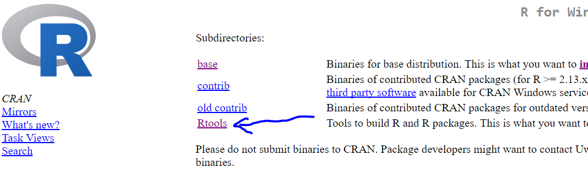
```


**Step 2**: Tworzymy plik z wlasnymi funkcjami (wszystkie w jednym pliku). Plik zapisujemy jako zwykly plik skryptu R-a. Mozna tez dodawac definicje obiektow (np. R6) i ich instancje.
Jezeli chcemy aby do naszych funkcji byl dostepny 'help' oraz zrobila sie dokumentacja, w naszym pliku dodajemy opis dla kazdej funkcji uzywajac tzw. skladni Roxygen. (wczesniej musimy pamietac o tym czy mamy zainstalowany pakiet roxygen2 !!!)
Kazda linika opisu Roxygen zaczyna sie od `#' `
Znakiem `@` rozpoczynam kolejne tagi (hasla) naszego 'help-a' Wyjatkiem jest piewsza linijka z opisem pod ktora zostawiam jedna linijke wolna. Ponizej przyklad:


```{r}
#' Moja super funkcja do sumowania elementow
#'
#' @usage function(x1, x2=2)
#' @param x1 - pierwszy parametr typu numeric
#' @param x2 - drugi parametr typu numeric. Domyslanie ma wartosc 2.
#' @return - funkcja zwraca wartosc liczbowa
#' @note - moja notatka
#' @examples
#' # tutaj podaje jakis uzyteczny przyklad (jak widac moze zawierac kilka linije kodu)
#' x1 <- 100
#' moja_funkcja(x1)
#' @export

# definicja mojej funkcji:
moja_funkcja <- function(x1, x2 = 2){
  x1 + x2 # funkcja sumuje dwa elementy
}
```
Nie wszystkie tagi sa obowiazkowe. Ja zawsze daje `@usage` (zeby wiedziec na szybko jakie sa parametry i jakie maja wartosci domyslne), `@examples` (zazwyczaj z dzialajacym przykladem) i chyba zawsze daje sie `@export`. Obowiazkowy tez jest tytul (bez niego nie bedzie sie dalo zbudowac pakietu). Wazne jest zeby zrobic to starannie, bo przy skomplikowanych funkcjach dobry help jest bezcenny. Poza tym nie mozna robic pomylek w samej skladni Roxygen (nie zapominamy o spacji przed `@` itp.), bo potem bedziemy sie meczyc z bladami przy budowie. 

<br><lfg>Useful</lfg>
<div class="btn-success"> Szkielet takiego komentarza Roxygen mozna wprowadzic automatycznie. Kursor umieszczamy wewnatrz funkcji i nastepnie rozwijamy przycisk 'różdżki' i wybieramy 'Insert Roxygen Skeleton' </div><br>

```{r, eval=TRUE, echo=FALSE, fig.cap='Inserting skeletons', out.width='500px'}
knitr::include_graphics('figures/own_package_interting_roxygen_skeleton.png')
```


**Step 3**: Tworzymy nowy *Project*. W koncowym oknie podajemy sciezke dostepu do pliku gdzie jest nasz kod oraz nazwe i miejsce gdzie powstanie nowy katalog (patrz na ponizsze zrzuty). W utorzonym katalogu beda nowe pliki utworzone po nacisnieciu przysicku 'Create Project' niezbedne do dalszej pracy zwiazanej z tworzeniem pakietu.


```{r, eval=TRUE, echo=FALSE, fig.cap='Starting of creation Project', out.width='500px'}
knitr::include_graphics('figures/own_package_uruchomienie_narzedzia.png')
```
<br>
```{r, eval=TRUE, echo=FALSE, fig.cap='Selecting new project', out.width='500px'}
knitr::include_graphics('figures/own_package_wybor_rodzaju_projektu_1.png')
```
<br>
```{r, eval=TRUE, echo=FALSE, fig.cap='Selecting type of new project', out.width='500px'}
knitr::include_graphics('figures/own_package_wybor_rodzaju_projektu_2.png')
```
<br>
```{r, eval=TRUE, echo=FALSE, fig.cap='Paths ans names in Project. In (1) we have to provide path for pur file with functions. In (2) we provide path where new project directory will be created', out.width='500px'}
knitr::include_graphics('figures/own_package_nazwa_i_sciezki.png')
```
<br>

**Step 4**
Zeby dalo sie tworzyc dokumentacje sprawdzamy w ustawieniach czy jest taka mozliwosc (patrz ponizszy zrzut):
```{r, eval=TRUE, echo=FALSE, fig.cap='Ad step 4: Settings for Roxygen documentation', out.width='500px'}
knitr::include_graphics('figures/own_package_roxygen_documentation.png')
```


**Step 5**: Jezeli wprowadzilismy jakies modyfikacje do naszego pliku z funkcjami (np. dodalismy nowa funkcje, usunelismy, albo zmodyfikowalismy stara) i chcemy odswiezyc projekt klikamy 'clean and rebuild'. 

**Step 6**: Jezeli chcemy dodatkowo zbudowac/odswiezyc nasza dokumentacje Roxygen to klikamy 'Document'

```{r, eval=TRUE, echo=FALSE, fig.cap='Ad step 5 and 6: Rebuilding package and updating documentation', out.width='500px'}
knitr::include_graphics('figures/own_package_clean_and_rebuild.png')
```


**Step 7**: Uruchamiamy budowanie ostatecznego katalogu pakietu ktory bedziemy instalowali w R  (rysunek 'build'). Mozna wybrac 'Build Source Package' jak i 'Build Binary Package' (patrz zrzut).
Ja zazwyczj wybieram wersje 'Binary'. Binary releases contain computer readable version of the application, meaning it is compiled. Source releases contain human readable version of the application, meaning it has to be compiled before it can be used. The source release is the raw, uncompiled code. 

```{r, eval=TRUE, echo=FALSE, fig.cap='Build new package', out.width='500px'}
knitr::include_graphics('figures/own_package_build.png')
```
W wyniku powstanie nowy plik ktory mozna zainstalowac w programie R jak kazdy inny pakiet, ale instalacje robimy nie z repozytorium CRAN ale z lokalnego zrodla. 

```{r, eval=TRUE, echo=FALSE, fig.cap='Instalation of package from local files', out.width='500px'}
knitr::include_graphics('figures/own_package_final_instalation.png')
```


**Uwagi**:

1. Jezeli chcemy dodac **wlasne zbiory danych** tworzymy katalog 'data' w naszym katalogu z projektem. Wklejami tam pliki z danymi najlepiej w formacie txt. Bedzie je mozna po zaladowaniu pakietu wywolac funkcja `data()`.
2.  Jezeli chcemy aby podczas ladowania pakietu ladowaly sie inne pakiety musimy (jeszcze przed utworzeniem pliku zrodlowego ktory bedzie bezposrednio instalowany) w pliku DESCRIPTION (najlepiej otworzyc go notatnikiem)  dodac linijke kodu za 'Maintaner' wyszczegolniajaca pakiety:<br>
  Maintainer: Who to complain to <yourfault@somewhere.net>
  Depends: shiny, ggplot2

### Without RStudio

It is possible to create own package without RStudio, but difficult and time-consuming. RStudio tool for doing this i preferable and much better solution. 


## Github

Swnietny podrecznik o wspolpracy Githuba i Windows pt "Happy Git and GitHub for the useR" (autor Jenny Bryan), jest na stronie http://happygitwithr.com/install-git.html#install-git


### Installation and configuration with RStudio

<br><lfr>Warning!</lfr>
<div class="btn-danger"> Before installation you must have your own account on Gibtub webpage. </div><br>

**Step 1:**

Install *Git for Windows* from https://gitforwindows.org/ on your computer.


**Step 2:**

Instroduce yourself to Git by writting in shell this code:

```{r}
git config --global user.name 'lucas9999'
git config --global user.email 'memy@wp.pl'
git config --global --list

```

**Step 3 (optional):**

Installing Git Client. This is optional but highly recommended. This give us ability to use Version Control. Best choise is Sourcetree from https://www.sourcetreeapp.com/ . 

**Step 4:**

Make repo in GitHub :

1. Go to https://github.com and make sure you are logged in.
2. Click green “New repository” button. Or, if you are on your own profile page, click on “Repositories”, then click the green “New” button.
3. Repository name: myrepo (or whatever you wish, we will delete this) Public YES Initialize this repository with a README
4. Click big green button “Create repository.”
5. Copy the HTTPS clone URL to your clipboard via the green “Clone or Download” button.


**Step 5:**

Detect Git with RStudio.


Firs let’s check **if RStudio can find** the Git executable.

1. File > New Project… Do you see an option to create from Version Control? If yes, good.
3. Select New Directory > Empty Project. Do you see a checkbox “Create a git repository”? If yes, good, CHECK IT.
3. Give this disposable test project a name and click Create Project. Do you see a “Git” tab in the upper right pane, the same one that has “Environment” and “History”? If yes, good.

If all looks good it means than RStudio and Git are talking to each other.

Keep reading if things don’t go so well or you want to know more.

**If RStudio did't detect Git automatically**:

In shell you command to detect Git location:
```{r}
where git
```
Last time I got path: C:/Program Files/Git/cmd/git.exe. 
Then tell RStudio where to find it. From RStudio, go to Tools > Global Options > Git/SVN and make sure that the box Git executable points to … the Git executable.
**Restart RStudio** if you make any changes.


### Cloning repo from Git account

Clone the new GitHub repository to your computer via RStudio

In RStudio, start a new Project:

1. File > New Project > Version Control > Git. In the “repository URL” paste the URL of your new GitHub repository. It will be something like this https://github.com/jennybc/myrepo.git.
  - Do you NOT see an option to get the Project from Version Control? Go to chapter 14 for tips on how to help RStudio find Git.
2. Take charge of – or at least notice! – the local directory for the Project. A common rookie mistake is to have no idea where you are saving files or what your working directory is. Pay attention. Be intentional. Personally, I would do this in ~/tmp.
3. I suggest you check “Open in new session”, as that’s what you’ll usually do in real life.
4. Click “Create Project”.

This should download the README.md file that we created on GitHub in the previous step. Look in RStudio’s file browser pane for the README.md file.


```{r, eval=TRUE, echo=FALSE, fig.cap='Instalation of package from local files', out.width='500px'}
knitr::include_graphics('figures/git_repo_Cloning.png')
```

### Updates

**Updating repo after changes in local files**

To update repo after local changes:
1. Check 'stages'. If there are some then commit them. 
2. Use "push" button to load changes files to your repo. While pushing you will have to log in your git account.

```{r, eval=TRUE, echo=FALSE, fig.cap='Git stages to commit', out.width='500px'}
knitr::include_graphics('figures/git_stages.png')
```

```{r, eval=TRUE, echo=FALSE, fig.cap='Committing changes: (1) select changes to commit, (2) add comment for each change, (3) commitm changes', out.width='500px'}
knitr::include_graphics('figures/git_commiting_changes.png')
```

**Updating local files after changes in repo**

Just press pull button. 


### Package to repo

If we have existing project how to connect it with our Git account?


```{r, eval=TRUE, echo=FALSE, fig.cap='', out.width='500px'}
knitr::include_graphics('figures/git_export_project_to_repo.png')
```

After that you will have to restart RStudio. 


Then create new repo on your account but withour README. 

```{r, eval=TRUE, echo=FALSE, fig.cap='', out.width='500px'}
knitr::include_graphics('figures/git_create_repository_without_README.png')
```

Then create new branch in RStudio.
```{r, eval=TRUE, echo=FALSE, fig.cap='New git branch in RStudio', out.width='500px'}
knitr::include_graphics('figures/git_new_branch.png')
```

### Deleting repo on Git

1. On GitHub, navigate to the main page of the repository.
2. Repository settings buttonUnder your repository name, click  Settings.
3. Repository deletion buttonUnder Danger Zone, click Delete this repository.
4. Read the warnings.
5. Deletion labelingTo verify that you're deleting the correct repository, type the name of the repository you want to delete.
6. Click I understand the consequences, delete this repository.

```{r, eval=TRUE, echo=FALSE, fig.cap='Removing repo from account', out.width='500px'}
knitr::include_graphics('figures/git_delete_repo.png')
```
Next remove your local repo if you want. 


## SVN


<!--chapter:end:18-WORK_ORGANISATION.Rmd-->

# REPORTS HTML

## Uniwersalia

Znajduja sie tutaj elementy uniwersalne dzialajace niezależnie od werski outputu knitra. Sa elementy z **Pandos**, **Bootstrap** jak i utworzone wlasnorecznie funkcje R-owskie typu html (znajdujace sie w plikach o nazwach rozpoczynajacych sie od FUNCTION...html.v). Pliki R-owskie tworzone specjalnie pod szablony sa w rozdziale 'Szablony' i znajduja sie w plikach o nazwach 'FUNCTIONS...html.nazwa_szablonu'. 

### tekst-formaltowanie


#### wyglad_tekstu


1. ~~tekst przekreslony~~ <br>
2. *tekst pochylony* <br>
3. **tekst pogrubiony** <br>
4. <small>mniejsza czcionka</small> <br>
5. subskrypt <sup> gorny </sup> <br>
6. subskrypt <sub> gorny </sub> <br>
7. `tekst komputerowy czerwony` <br>


<br>KOD:
```
1. ~~tekst przekreslony~~
2. *tekst pochylony*
3. **tekst pogrubiony**
4. <small>mniejsza czcionka</small>
5. subskrypt <sup>gorny</sub>
6. subskrypt <sub>gorny</sub>
7. `tekst komputerowy czerwony`
```

#### drobiazgi i ozdobniki


1. Nowa linia: dwie spacje i enter  
2. Dodatkowa spacja: ` &nbsp; `
3. Linia pionowa: ` --- `
4. Naglowek rodzialu nienumerowany: `# My header {.unnumbered}`


### praktyczne elementy rozne

#### indeksy i chaptery w oparciu o wlasne funkcje

#### notes

<br>**footnote**
`^[notatka na koncu strony]`

<br>**sidenotes** 

Zalezy od technologii output. Patrz szablony.


<br>**tooltip**  
`<a href="#" data-toggle="tooltip" title="Another tooltip">have a</a>`


#### Linki


**linki do strony**  
`[sdca](http://wp.pl)`

**link do rozdzialu**  
`[nazwa linku](#nazwa_rozdzialu)`

**link do zdjecia**
<!--   zadolarowane bo nie ma fizycznego zdjecia-->

**link na email**

**obrazek jako link**

**link wewnetrzny**
```
<a id='ble'></a>
<a href='#ble'>link</a>
```


#### numeracja rozdzialow


```
//naglowki rozdzialow-numeracja

body {counter-reset: h1;}

h1 {counter-increment: h1; counter-reset: h2; } 
h2 {counter-increment: h2; counter-reset: h3; } 
h3 {counter-increment: h3; counter-reset: h4; } 
h4 {counter-increment: h4; counter-reset: h5; } 
h5 {counter-increment: h5; counter-reset: h6; } 
h6 {counter-increment: h6;  } 
/* usage: enclose content with div class="heading_numbered" */ 
h1:before {content:counter(h1)". "; }
h2:before {content:counter(h1)"."counter(h2)". "; }
h3:before {content:counter(h1)"."counter(h2)"."counter(h3)". "; }
h4:before {content:counter(h1)"."counter(h2)"."counter(h3)"."counter(h4)". "; }
h5:before {content:counter(h1)"."counter(h2)"."counter(h3)"."counter(h4)"."counter(h5)". "; }
h6:before {content:counter(h1)"."counter(h2)"."counter(h3)"."counter(h4)"."counter(h5)"."counter(h6)". "; }

h1 {font-size: 14px;}

```


### praca z css i js

#### wprowadzenie kodu


**css wewnetrzny**  
`<style type="text/css">...</style>`

**css zewnetrzny**  
`<link rel="stylesheet" href="C:/Users/.../bootstrap-theme.min.css" type="text/css" media="screen"/>`


**java  wenetrzny**  
`<script></script>`

**java zewnętrzny**  
`<script type="text/javascript" src="simpletabs_1.3.js"></script>`


#### CSS-skladnia


1. **wiele kolumn w div**: -webkit-column-count: 3; -moz-column-count: 3;   column-count: 3;
2. **marginesy zewnetrzne dla tabel**: margin-left: 10px; margin-right:20px; *samo margin nie zadziala*/
3. **floating**: float:left:10px;
4. **mozliwe wartosci dislplay**: block, inline, inline-block
5. **mozliwe wartosci position**: fixed, absolute, relative
6. **kolor tekstu: color:red**;  color:rbg(100,210,110); color:   #FF0000;
7. **zaokraglone narozniki**: border-radius: 25px;
8. **box-shadow**: 3px 3px 3px 3px;
9. **text-shadow**: 2px 2px 2px;

**Skladnia**<br> 
table.t1 tr, td, #ble {} <br> 
Powyzszy kod to odwolanie sie do *tr* z *tabel* klasy *t1* i do wszystkich elementow *td*, oraz elementu o id *ble*


#### ustawienia dla elementow


```
/*cala strona*/
body
{

background:"bgimage.jpg";
background-color:rgb(255,0,0);
font-family : Verdana, Geneva, Arial, Helvetica, sans-serif;
margin: 0px;
text-decoration: underline;

}


/*wlasnosci linkow*/
a:link    
{color:green;}

a:visited 
{color:green;}

a:hover   
{color:red;}

a:active  
{color:yellow;} 


/*div*/

div
{

box-shadow: 10px 10px 5px #888888;
border:2px solid;
border-radius:25px;
line-height: 20px;  /*odstep miedzy wierszami*/
line-height: normal
}


```

#### ustawienia css tabel


```

table, th, td
{
border: 1px solid black;
/
border-color:#98bf21;
border-width
border-radius:25px;
border-width:5px;
border-width:medium;

border-style:solid;
border-top-style:dotted;
border-right-style:solid;
border-bottom-style:dotted;
border-left-style:solid;


backpground-color:green;
background:url(img_flwr.gif);
background-size:80px 60px;
background-size:100% 100%;
background-repeat:no-repeat; /*repeat|repeat-x|repeat-y|no-repeat|initial|inherit;*/


text-align:right;
vertical-align:bottom; /*top*/

padding: 15px;


width:100%;
height:50px;

}

```


```
**ustawienia w tabeli dla n=tego wiersza**

table tr:first-child td{
color:yellow
}

table tr:last-child td{
color:yellow
}

table tr:nth-child(2) td{
color:yellow
}

/* od trzeciego wiersza*/
table tr:nth-child(n+2) td{
color:yellow
}

/*od drugiego wiersza co trzeci*/
table tr:nth-child(3n+2) td{
color:yellow
}


table tr:firt-child td{
color:yellow
}

table tr:nth-child(odd) td{
background-color: red;
}
table tr:nth-child(even) td{
background-color: blue;
}


```

#### js przyklady


tabela z kolorem po najechaniu myszka (dodatkowo zakladam odowlanie do pliku sortable jako ze przykladowa tabela jest tej klasy)

```
<style>

table tr:nth-child(odd){
color:red;
}


tr:hover {
    background-color: #FFCF8B
}
tr:selected {
    background-color: #FFCF8B
}
td {padding: 5px;}

</style>


<script type='text/javascript'>
var trs = document.querySelectorAll("tr");
for(var i = 0; i < trs.length; i++){
    trs[i].addEventListener("click", function(){this.className += " selected";});
}

var trs = document.querySelectorAll("tr");
for(var i = 0; i < trs.length; i++){
    trs[i].addEventListener("click", function(){
        var cn = this.className, thc = " selected", start_idx = cn.indexOf(thc);
        if(start_idx == -1) cn += thc;
        else cn = cn.replace(thc,"");

        console.log("#"+cn(0,start_idx)+"#");
        this.className = cn;
    });
}
</script>


<table border="1" style="width:300px" class='sortable' >
<tr>
  <th>Firstname</th>
  <th>Lastname</th>
  <th>Points</th>
</tr>
<tr>
  <td>Eve</td>
  <td>Jackson</td>
  <td>94</td>
</tr>
<tr>
  <td>Eve</td>
  <td>uackson</td>
  <td>94</td>
</tr>
<tr>
  <td>Eve</td>
  <td>Jackson</td>
  <td>94</td>
</tr>
<tr>
  <td>Eve</td>
  <td>qackson</td>
  <td>94</td>
</tr>
</table>


```


### organizacja


#### podzial na czesci <small>2014-09-11</small>

##### Podzial na kolumny z plywnnym przeplywem zawartosci


<style>

div.dwa {
    -webkit-column-count: 2; /* Chrome, Safari, Opera */
    -moz-column-count: 2; /* Firefox */
    column-count: 2;
} 

div.trzy {
    -webkit-column-count: 3; /* Chrome, Safari, Opera */
    -moz-column-count: 3; /* Firefox */
    column-count: 3;
} 
</style>

<div class='trzy'>
aaaaaaa aaaaaaaaa aaaaaaaaaaa aaaaaaaaaa aaaaaaaaaaa aaaaaaaaaa aaaaaaaaaaaa aaaaaaaaaaa aaaaaaaaaaa aaaaaaaaaaa
</div>

<br>KOD:
```
<style>

div.dwa {
    -webkit-column-count: 2; /* Chrome, Safari, Opera */
    -moz-column-count: 2; /* Firefox */
    column-count: 2;
} 

div.trzy {
    -webkit-column-count: 3; /* Chrome, Safari, Opera */
    -moz-column-count: 3; /* Firefox */
    column-count: 3;
} 
</style>

<div class='trzy'>
aaaaaaa aaaaaaaaa aaaaaaaaaaa aaaaaaaaaa aaaaaaaaaaa aaaaaaaaaa aaaaaaaaaaaa aaaaaaaaaaa aaaaaaaaaaa aaaaaaaaaaa
</div>
```

##### Podzial sztywy na kolumny


<div class="row">
  <div class="col-md-6"> tresc pierwszej kolumny</div>
  <div class="col-md-6"> tresc drugiej kolumny</div>
</div>

<br>KOD:
```
<div class="row">
  <div class="col-md-6"> tresc pierwszej kolumny</div>
  <div class="col-md-6"> tresc drugiej kolumny</div>
</div>
```


### zdjecia


**Rysunek**
``

**Rysunek i jego float**  
Służy do tego parametr 'align' który przyjmuje wartości:

1. left
2. right
3. center
4. justify

Dodatkowo parametr `hspace` steruje odstępem po obu stronach rysunku, a `vspace1` od góry i dołu.  

**Dwa rysunki z opływającym tekstem**  
```
<figure>


</figure>
```


## Baza elementow

### Kolory


<div class='trzy'> 

<font color='#000080'>**1 #000080**</font> <br>
<font color='#FFDEAD'>**2 #FFDEAD**</font> <br>
<font color='#C71585'>**3 #C71585**</font> <br>
<font color='#3CB371'>**4 #3CB371**</font> <br>
<font color='#9370DB'>**5 #9370DB**</font> <br>
<font color='#32CD32'>**6 #32CD32**</font> <br>
<font color='#B0C4DE'>**7 #B0C4DE**</font> <br>
<font color='#778899'>**8 #778899**</font> <br>
<font color='#20B2AA'>**9 #20B2AA**</font> <br>
<font color='#F08080'>**10 #F08080**</font> <br>
<font color='#4B0082'>**11 #4B0082**</font> <br>
<font color='#483D8B'>**12 #483D8B**</font> <br>
<font color='#FFFF00'>**13 #FFFF00**</font>

</div>

### Bootstrap-rozne elementy


**Kolorowe napisy**

<span class="label label-default">Default</span>
<span class="label label-primary">Primary</span>
<span class="label label-success">Success</span>
<span class="label label-info">Info</span>
<span class="label label-warning">Warning</span>
<span class="label label-danger">Danger</span>

<br>KOD:
```
<span class="label label-default">Default</span>
<span class="label label-primary">Primary</span>
<span class="label label-success">Success</span>
<span class="label label-info">Info</span>
<span class="label label-warning">Warning</span>
<span class="label label-danger">Danger</span>

```

**Oznaczanie skrótów klawiaturowych**
`<kbd>ctr</kbd>`


**Glypkon**

<div class='trzy'>
1. search: <span class="glyphicon glyphicon-search"></span>
2. pushpin: <span class="glyphicon glyphicon-pushpin"></span>
3. hand-right: <span class="glyphicon glyphicon-hand-right"></span>
4. circle-arrow-right: <span class="glyphicon glyphicon-circle-arrow-right"></span>
5. wrench: <span class="glyphicon glyphicon-wrench"></span>
6. chevron-up: <span class="glyphicon glyphicon-chevron-up"></span>
7. chevron-down: <span class="glyphicon glyphicon-chevron-down"></span>
8. arrow-right: <span class="glyphicon glyphicon-arrow-right"></span>
9. arrow-up: <span class="glyphicon glyphicon-arrow-up"></span>
10. arrow-down: <span class="glyphicon glyphicon-arrow-down"></span>
11. ok: <span class="glyphicon glyphicon-ok"></span>
12. remove: <span class="glyphicon glyphicon-remove"></span>
13. stats: <span class="glyphicon glyphicon-stats"></span>
14. th-list: <span class="glyphicon glyphicon-th-list"></span>
15. list-alt: <span class="glyphicon glyphicon-list-alt"></span>
</div>

<br>KOD:

```

1. search: <span class="glyphicon glyphicon-search"></span>
2. pushpin: <span class="glyphicon glyphicon-pushpin"></span>
3. hand-right: <span class="glyphicon glyphicon-hand-right"></span>
4. circle-arrow-right: <span class="glyphicon glyphicon-circle-arrow-right"></span>
5. wrench: <span class="glyphicon glyphicon-wrench"></span>
6. chevron-up: <span class="glyphicon glyphicon-chevron-up"></span>
7. chevron-down: <span class="glyphicon glyphicon-chevron-down"></span>
8. arrow-right: <span class="glyphicon glyphicon-arrow-right"></span>
9. arrow-up: <span class="glyphicon glyphicon-arrow-up"></span>
10. arrow-down: <span class="glyphicon glyphicon-arrow-down"></span>
11. ok: <span class="glyphicon glyphicon-ok"></span>
12. remove: <span class="glyphicon glyphicon-remove"></span>
13. stats: <span class="glyphicon glyphicon-stats"></span>
14. th-list: <span class="glyphicon glyphicon-th-list"></span>
15. list-alt: <span class="glyphicon glyphicon-list-alt"></span>


```

**textarea**
<br>KOD:
```
<textarea name="comments" id="comments" style="width:160px;height:90px;background-color:Cornsilk;">
</textarea>
```

## Own functions

### Versatile


<br>**tabela i zakladki **

```

l.html.stab(df, red=FALSE,rownames=TRUE, colnames=TRUE, hide=FALSE, title="table", title_before=NULL, title_after=NULL)

l.html.tabs(k=0, names=NULL)

l.html.collapse(code, title="collapse", title_before=NULL, title_after=NULL)

```


<br>**haslo do indeksu**  
dopuszczalne 3 poziomy zagniedzenia  
```
'r l.html.i(c('f:mode','f:typeof', g:variables!acceptable names')); zn.)

```

<br>**chapter**
```
## 'r CHAP(nesting=1, title='pierwszy', subtitle='asdc', date='', type=c('normal'))'

```

<br>**generowanie indeksu i spisu treści i eksport danych do globalnego indeksu**
```
l.html.indeks_tabela()
if(exists('indeks_plik')) l.html.ind_eksp(indeks_plik)


l.html.toc()
if(exists('table.chapter')) CHAP.save()
```

<br> **Panele **

```
l.html.panel.test(title = 'chi kwadrat', begin_text = 'fajny test', purpose = 'rozne', assumptions = 'musi byc odpowiedni rozklad')


l.html.panel.method(title = 'ble', begin_text = 'ble', notions = c(ala='bleble',kot='sdcdsac'))


l.html.panel.syntax(title='funkcja(pakiet)', parameters=c(aaa='[TRUE]-jakis paramert', bbb='[FALSE]csdcsc'))


l.html.panel.intro(title='dsac', text='dsc asdc')


l.html.glyp('search','yellow') 

```


<!--chapter:end:19a-REPORTS_HML.Rmd-->

# REPORTS Latex

<!--chapter:end:19b-REPORTS_Latex.Rmd-->

# REPORTS Markdown

## Chunk options

### list of basic options


* echo
* eval - if evaluate code
* background
* results
* fig.width
* fig.height
* fig.align
* fig.keep
* warning
* message
* error
* ref.label
* R.options
* autodep
* cache
* cache.path
* cache.lazy
* engine
* engine.path

### Conditional values of options

```{r}
#If variable 'cook' > 1 then run child file "outlier.Rnw"
'''{r, child=if(any(cook>1)) "outlier.Rnw" }

'''

```


### Shortcuts for options names
 

```{r}

set_alias(w='fig.width', h='fig.height')

```


### Changing chunk default settings


```{r}

'''r{setup, include=FALSE}
  opts_chunk$set(fig.path='figure/beamer-',fig.align='center',fig.show='hold',size='footnotesize')
options(replace.assign=TRUE,width=90)
'''

```


### Creating list of setting


```{r}

require(knitr)

#list
'''{r}
opts_template$set(
k=list(eval=FALSE, echo=TRUE), #sam kod
kot=list(eval=TRUE, echo=TRUE) #zwykły output i kod z thumbnail
)
'''

#how to refer to the list
'''{r, opts.label="kot"}

'''

```


### Function execution after/before chunk
```{r}

# this function if set TRUE displays writing before chunk
require(knitr)
'''{r setup, eval=TRUE}
require(knitr)
knit_hooks$set(play = function(before, options, envir) {
    if(before) '.>>>>'
})

'''


'''{r, play=TRUE}
#dafasf
'''

```


## Chunks names and references


### Rules for names

R gives the numers to chunks automatically. We can also specify names for chuns ourselves. **Names must be unique**.


### Cross-references


```{r}


'''{r A}
x<-100
'''
'''{r B}
y<-200
'''


#first type of cross-reference
'''{r}
<<A>>
<<B>>
'''

#second type of cross-referense

'''{r, ref.label=c("A","B")}

'''

```

Cross reference to all chunks
```{r}

#reference to all chunks except the first one.
'''{r, ref.label=all_labels()[-1]}

'''

```

## Splitting file (child files)

```
'''{r, child='sciezka.Rmd'}

'''
```
Note: If we use relative path the point of reference is a file directory you work with(not working directory).


## depenencies between chunks
Default auto dependency is used. For more details see 'Dynamic Documents with R and knitr', p.71 (chapter 8). 


## Creating chunks dinamically

See: example in directory


## Cache

If document rendering becomes time consuming due to long computations or plots that are expensive to generate you can use knitr caching to improve performance. The documentation knitr chunk and package options describe how caching works and the cache examples (https://yihui.name/knitr/demo/cache/) provide additional details.

If you want to enable caching globally for a document you can include a code chunk like this **at the top of the document**:

```{r, include=FALSE}
knitr::opts_chunk$set(cache=TRUE)
```
For individual chunks use *cache*,  *cache.path*, *chache.vars*, *cache.lazy* options.

When `cache=TRUE`, the chunk will only be evaluated in the following scenarios:

1. There are no cached results (either this is the first time running or the results were moved/deleted)
2. The code chunk has been modifed rustuling in a new MD5 digest. For clearnig cache you can use button 

```{r, eval=TRUE, echo=FALSE, fig.cap='Clearning cache', out.width='500px'}
knitr::include_graphics('figures/markdown_clearnig_cache.png')
```

<br><lfr>Warning!</lfr>
<div class="btn-danger"> When you use cache depemdencies between chaunks are very imporatnt. </div><br>

*dependson* option (NULL; character or numeric): a character vector of chunk labels to specify which other chunks this chunk depends on; this option applies to cached chunks only – sometimes the objects in a cached chunk may depend on other cached chunks, so when other chunks are changed, this chunk must be updated accordingly.

*autodepth* option (FALSE; logical): whether to figure out the dependencies among chunks automatically by analyzing the global variables in the code (may not be reliable) so that dependson does not need to be set explicitly  


## Extractind R code from chunks of markdown document

```{r}
require(knitr)
purl(  file_path = ...
     , documentation = 1) # 0 for pure code, 1 code with chunk headers, 2 add to code text chunks as roxygen
```
The results will be R file in working directory with extracted R code.


## How to change position of TOC

The position of the TOC is fixed in the R Markdown default HTML template. If you want to change its position in the document, you'll need to modify the template:

Make a copy of the R Markdown HTML template to use as a starting point. You can find it by running this R command: system.file("rmd/h/default.html", package="rmarkdown")
Move the $toc section to where you want the table of contents to appear.
Save the modified template in the same folder as the document you're rendering as e.g. lowertitle.html
Add template: lowertitle.html to the html_document settings.
From the standpoint of the template, all of the document's content is an atomic unit, so it might be necessary to put any content you want to appear before the TOC in the template itself.


## Other programming languages

If you have installed p:reticulate you can use this code:

```{r}

# python, engine.path='C:/Users/memy/Anaconda3/python.exe'

100

```


## tables


### p:formattable


**First step: formatting numbers**
```{r}
require(formattable)

p <- data.frame(
  id      = c(1, 2, 3, 4, 5),
  name    = c("A1", "A2", "B1", "B2", "C1"),
  balance = accounting(c(52500, 36150, 25000, 18300, 7600), format = "f", digits = 5  ),
  growth  = percent(c(0.3, 0.3, 0.1, 0.15, 0.1555555)
                    , format = "G" # d - liczba calkowita; e format naukowy; f - ulamet - domyslnie dwa miejsca po przecinku (regulowane przez digit) ;
                    # , digits = 5
                    , flag='+'),
  ready   = formattable(c(TRUE, TRUE, FALSE, FALSE, TRUE), "yes", "no"))
p

```


**Second step: formatting colors and adding icons**
```{r}

df <- data.frame(
   id               = 1:10
  ,name             = c("Bob", "Ashley", "James", "David", "Jenny", "Hans", "Leo", "John", "Emily", "Lee")
  ,age              = c(28, 27, 30, 28, 29, 29, 27, 27, 31, 30)
  ,grade            = c("C", "A", "A", "C", "B", "B", "B", "A", "C", "C")
  ,test1_score      = c(8.9, 9.5, 9.6, 8.9, 9.1, 9.3, 9.3, 9.9, 8.5, 8.6)
  ,test2_score      = c(9.1, 9.1, 9.2, 9.1, 8.9, 8.5, 9.2, 9.3, 9.1, 8.8)
  ,final_score      = c(9, 9.3, 9.4, 9, 9, 8.9, 9.25, 9.6, 8.8, 8.7)
  ,registered       = c(TRUE, FALSE, TRUE, FALSE, TRUE, TRUE, TRUE, FALSE, FALSE, FALSE)
  ,stringsAsFactors = FALSE
  )


formattable(  
    df
  , list(
        age   = color_tile("white", "orange")
      , grade = formatter( "span"
                          , style = x ~ ifelse(  x == "A"
                                               , style(color = "green", font.weight = "bold")
                                               , NA))
      , area(col = c(test1_score, test2_score)) ~ normalize_bar("pink", 0.2)
      , final_score = formatter( "span" # span is a html tag
                                 # x represents column of data.frame we want to stylize
                                , style = x ~ style(color = ifelse(rank(-x) <= 3, "green", "gray"))
                                , x ~ sprintf("%.2f (rank: %02d)", x, rank(-x)))
      , registered = formatter(  "span"
                               , style = x ~ style(color = ifelse(x, "green", "red"))
                                # adding icons
                               , x ~ icontext(  ifelse(x, "ok", "remove") # icon name
                                              , ifelse(x, "Yes", "No")))  # values in column (converted from TRUE/FALSE)
  )
)

```


### p:pivottabler

```{r}

require(ggplot2) # zaby byl zbior 'diamonds' dostepny
require(pivottabler)

# tutaj bedzie output w koncoli R-a
qpvt( dataFrame    = diamonds #zbior diamonds z pakietu ggplot2
      ,rows         = c('cut', 'color') # zmienne grupujace po wierszach
      ,columns      = c('clarity') #zmianna grupujaca kolumnowa (oczywiscie moze byc wiecej niz jedna)
      # ponizej dwa pola obliczeniowe
      ,calculations = c(  'suma'='sum(price, na.rm=TRUE)' 
                          , 'min'='min(price, na.rm=TRUE)') # c("Number of Trains"="n()", "Maximum Speed"="max(SchedSpeedMPH, na.rm=TRUE)")
      ,totals       = 'NONE' #list("x"="All x", "y"="All y") # informacja o tym czy maja byc podsumowania po kategoriach 
)


# tutaj to samo jako HTML
qhpvt( dataFrame    = diamonds #zbior diamonds z pakietu ggplot2
      ,rows         = c('cut', 'color') # zmienne grupujace po wierszach
      ,columns      = c('clarity') #zmianna grupujaca kolumnowa (oczywiscie moze byc wiecej niz jedna)
      # ponizej dwa pola obliczeniowe
      ,calculations = c(  'suma'='sum(price, na.rm=TRUE)' 
                          , 'min'='min(price, na.rm=TRUE)') # c("Number of Trains"="n()", "Maximum Speed"="max(SchedSpeedMPH, na.rm=TRUE)")
      ,totals       = 'NONE' #list("x"="All x", "y"="All y") # informacja o tym czy maja byc podsumowania po kategoriach 
)

# Totals can be controlled using the totals argument. This works as follows:
# If not specified, then totals are generated for all variables.
# To hide all totals, specify totals=NONE.
# To specify which variables have totals, specify the names of the variables in a character vector, e.g. in a pivot table containing the variables x, y and z, to display totals only for variables x and z, specify totals=c("x", "z").
# To specify which variables have totals and also rename the captions of the total cells, specify a list, e.g. to rename the totals for x to “All x” and y to “All y”, specify totals=list("x"="All x", "y"="All y")
# 
# c("Number of Trains"="n()", "Maximum Speed"="max(SchedSpeedMPH, na.rm=TRUE)")

```


<!--chapter:end:19c-REPORTS_Markdown.Rmd-->

# REPORTS Officer

p:officer documentation: https://davidgohel.github.io/officer/index.html


## Word

### basic operations

```{r}

require(officer)
require(ggplot2)
library(magrittr)

# creating new word document
my_doc = read_docx()

# default styles in document
styles_info(doc)


# adding elements

gg_plot <- ggplot(iris) + geom_density(aes(x=Petal.Width))

myft <- regulartable(  head(mtcars)
                     , col_keys = c("am", "carb", "gear", "mpg", "drat" ) # by default is names(data)
                     )

my_doc <- my_doc %>% 
  body_add_par('Witam. To jest moj wierwszy paragraf w dokumencie wykonanym pakietem officer') %>% 
  body_add_break() %>%  # przejscie do nowej STRONY
  # add picutre
  body_add_img(src = 'figures\\create_project.png', width = 5, height = 6, style = "centered") %>% 
  # add paragraph
  body_add_par("Hello world!", style = "Normal") %>% 
  body_add_par("", style = "Normal") %>% # blank paragraph
  #add table
  body_add_table(iris[1:5,], style = "table_template") %>% 
  body_add_gg(gg_plot) %>% 
  body_add_flextable(myft)
  

# adding elements to our document

print(my_doc, target = "first_example.docx")


```


### using bookmarks and cursors

```{r}
require(officer)
require(magrittr)

my_doc_1 <- officer::read_docx()


my_doc_1 <- my_doc_1 %>% 
  body_add_par('tekst 1') %>% 
  body_add_par('tekst 2') %>% 
  body_add_par('tekst 3') %>%
  body_bookmark('moj_znacznik_1') %>%
  body_add_par('tekst 4') %>%
  body_add_par('tekst 5') %>%
  body_add_par('tekst 6') %>%
  body_bookmark('moj_znacznik_2') %>%
  body_add_par('tekst 7') %>%
  body_add_par('tekst 8')

print(my_doc_1, target = "cursors.docx")

# removing part of text with cursor

my_doc_2 <- my_doc_1 %>% 
  cursor_bookmark('moj_znacznik_1') %>% 
  body_remove() # removing element before cursor

print(my_doc_2, target = "cursors_removed.docx")

```


### merging cells in columns and rows


More at: https://davidgohel.github.io/flextable/articles/layout.html

**columns**
```{r}

select_columns <- c("Species", "Petal.Length", "Petal.Width")

myft <- regulartable(iris[46:55,], col_keys = select_columns)

# merge cells in columns 'spaces' and 'Petal.Width'
myft <- merge_v(myft, ~ Species + Petal.Width )

myft

```


**rows**
```{r}

select_columns <- c("Species", "Petal.Length", "Petal.Width")

myft <- regulartable(head(mtcars, n = 10 ) )

myft <- merge_h(myft)

# and add borders

myft <- border(myft, border = fp_border(), part = "all")

myft

```


**colls and rows**
```{r}
select_columns <- c("Species", "Petal.Length", "Petal.Width")

myft <- regulartable(head(mtcars, n = 6 ) )

myft <- merge_at( myft, i = 1:3, j = 1:3)

myft <- border(myft, border = fp_border(), part = "all")

myft
```


### Headers

```{r}

```


## Power Point scraping


## Table p:flextable 


### Simple table

```{r}

require(officer)
require(flextable)

# creating of new object
myft <- regulartable(  head(mtcars)
                     , col_keys = c("am", "carb", "gear", "mpg", "drat" ) # by default is names(data)
                     )

myft

# changing table layout with theme
myft <- theme_vanilla(myft)
myft
```


<!--chapter:end:19d-REPORTS_ReporterS.Rmd-->

# (APPENDIX) <lfg> APPENDICES </lfg> {-}


# Uwagi dla Eweliny


Starałem sie pisać ten manual, żeby był w miarę uprządkowany i łatwy w czytaniu. Ale wszyskiego jest bardzo dużo i wiele elementów jest po prostu na tą chwilę mieszanką roznych materiałów z roznych zrodel pisanych w bardzo roznych okresach czasu. To powoduje zaburzenie ciaglosci i zmniejsza przystepnosc.

Format calej "ksiazki" (bo tak to trzeba nazwac) jest na tyle przyjemny, że mysle iż będzie Ci się wygodnie na własna ręką go uzupełniało i rozszerzało. Ten szablon możesz oczywiście smialo  używać też przy nauce innych języków programowania. Ja będę go używał do Python i do materiałów związanych z analizą statytyczną (w tej ksiazce o statystyce w R nic nie bedzie - tylko podstawy programowania). Chcialem też w takiej ksiazce gromadzic wiedze z SQL-a, ale z uwagi na to ze zakres materialu ktory mnie interesuje jest maly, nie wiem czy warto. Plik ze snippetami ktory Ci przeslalem na razie mi wystarcza. Tak czy inaczej jezeli bys ten materiał rozwijała po proponuje, żeby się na przyszłość takimi rzeczmi wymieniać. Napewno przyśpieszy nam to zdobywanie wiedzy.
<br><br>
**Kilka zdan a porpos tego co jest w załącznikach, a zwłaszcza w rodziale o stosowanych OZNACZENIACH**

To co jest napisane w zalacznikach moze byc dla niektorych troche smieszne i byc przejawem skrajnej pedanterii ale uwierz mi ze to ma sens. Kiedy ilosc informacji którą gromadzisz jest bardzo duża trzeba stosować różne reguły w jej zapisywaniu. Wie to każda osoba która prowadzi np. porządny zeszyt z notatkami. Takie reguły ułatwiają logiczne porządkowanie wszystkiego, zapewniają przejżystość, umożliwiają wprowadzenie hierarchizacji w ważności informacji. Dlatego też takie reguły warto sobie dobrze przemyśleć już na samym początku. 
Sama "ksiażka"  którą teraz oglądasz też powstała jak wynik różnych doświadczeń związanych z gromadzeniem informacji. Kiedyś moja wiedza programistyczna była rozproszona po różnych plikach i zeszycikach. W pewnym momencie było tego tak dużo że zacząłem się w tym wszystkim gubić. Ta książka podobnie jak inne które prowadzę pozwala mi bardzo uporządkowane magazynowanie wiedzy na zdobycie której trzeba przecież poświećić tak wiele pracy i czasu. Potem w takiej książce wszysko  mam  na wyciągnięcie ręki.
Jeszcze jedno. Wiele osob lubi notować papierowo w zeszytach Ale tutaj jak widziesz mamy do czynienia z kodem programistycznym i notowanie tego z zeszycie to słaby pomysł. Kod to rozwiązania które musisz móc szybko sobie przekopiować do wlasnego skryptu. Poza tym tutaj ten cały materiał żyje i cały czas jest mofikowany i udoskonalany. W zeszycie musiałabys albo cały czas kreślić, albo robić na końcu załączniki i byś się w końcu w tym wszyskim pogubiła. Narzędzie elektroniczne są już na tyle rozwinięte, że naprawdę notowanie tutaj jest bardzo wygodne i nie doskwierają nam wieksze ograniczenia. Jak dla mnie na tą chwilę jezeli chodzi o wiedze naukowa/zawodowa, to tylko notowanie rzeczy gdzie trzeba dużo rysować albo pisać wzorów matematycznych powinno sie robic na papierze. Ale to też się powoli zmienia to pokazuje mi mój tablet z rysikiem.


# Oznaczenia 

## Oznaczenia odpisowe

Opisujac cos slowami posluguje sie nastepujacymi zasadami (to tylko zasady do opisu slownego  NIESTOSOWANE w samym programowaniu !!!):

1. "p:" dla pakietow (np. zamiast "pakiet dplyr"" pisze "p:dplyr" )
2. "f:" dla funkcji (np. zamiast "funkcja max" pisze "f:max))
3. Jezeli chce pozdac ze cos jest funkcja i jednoczesnie okreslic pakiet robie tak: funkcja summarise z pakietu dplyr zamieniam na. f:summarise(dplyr)
4. Tlumaczenia na na jezyk polski (lub czasem z polskiego na angielski) sa w nawiasach kwadratowyh np.: data.frame [ramka danych]. Warto uczyc sie nazw angielskich, zeby potem szybkiej wyszukiwac informacje w internecie. W ostatnim dodatku bede prowadzil sobie slowniczej.
5. Przy pisaniu tak jak przy programowaniu raczej nie uzywam polskich znakow. Pare razy przez zle ustawienie kodowania w RStudio wszyskie polskie znaki pozamienialy sie na krzaczki i od tego czasu odechcialo mi sie ich uzywania. Poza tym wszystkie nowe materialy staram sie juz pisac po angielsku. Tobie w ramach nauki angielskiego tez cos takiego doradzam. Bedzie Ci sie latwiej wypowiadalo na tematy informatyczne i znacznie latwiej pisalo dokumentacje. 
6. Rzeczy istotne sa **boldowane**
7. Nazwy wlasne itp. sa *kursywa pochylona*
8. W codzyslowie podaje tytuly publikacji itp.
9. Bloki w ktorych jest kod R-a bede nazywal *chunk* (wymawiam: czank), zgodnie z ich prawdziwa nazwa w jezyku angielskim. Niektorzy tez uzywaja pojecia *Listing*.
10. Poza chunk-ami formatowanie czcionki jakie jest w kodach `moze pojawic sie w samym teksie`.
11. Czesc chunkow jest pisana tak ze po przejlejeniu powinny dzialac. Jezeli mam doczynienia z jakims ciekawszym i wpelni dzialajacym kodem to przed chunkiem jest znak '.>>>>'. 
12. Czasami jakis wiekszy przyklad moze byc rozbity na wiecej chunkow. Wtedy przed pierwszym chunkiem jest napis 'BEGIN' a po ostatnim 'END'.
13. Niektore kody w chunkach musza byc dlugie zeby zrobic pelny dzialajacy przyklad. Ale istota problemy moze byc zlokalizowana w zaledwie kilku linijkach. Zeby je oznaczyc w komentarza wstawiam znanik 'IM!!'

Przyklad chunk-a:
```{r}
#tutaj jest przykladowy chunk w ktorym bede pisal kod R-a. 
```


Ponadto stosuje kolorowe ramki dla oznaczenia rzeczy istotnych:

<br><lfr>Warning!</lfr>
<div class="btn-danger"> jakies wazne ostrzezenie </div>
  
<br><lfsb>Tip</lfsb>
<div class="btn-info"> Jakis przydatny trik </div>
  
<br><lfg>Useful</lfg>
<div class="btn-success"> Jakas ciekawa i uzyteczna informacja, np. fajne zrodlo z informacjami </div>


## Oznaczenia w kodzie

### Packages names before functions names

Co do samego programowania to jezeli funkcja pochodzi z jakiegos pakietu ktory trzeba zaladowac wywoluje ja z podaniem nazwy pakietu:
```{r}

dplyr::summarise(data) # f:summarise podchodzi z p:dplyr i mozna ja tak wywolac wlasnie podajac nazwe pakietu przed podwojnym dwukropkiem

summarise(data)

```
Po co cos takiego? PO PIERWSZE dla Twojej wygody zebys od razu wiedziala z jakiego pakietu jest dana funkcja. PO DRUGIE czasem wystepuje konflikt polegajacy na tym, ze funkcja o tej samej nazwie jest w dwoch roznych pakietach i zeby byc pewnym co tak naprawde wywolujemy musimy wlasnie podac nazwe pakietu przed podwojnym dwukropkiem. Ale to sie zdarza dosyc rzadko. Przykladem sa p:dplyr i p:plyr gdzie wiele funkcji nazywa sie tak samo.

Pytanie jak sprawdzic ile funkcji o tej samej nazwie jest zaladowanych:

```{r}

# laduje 2 pakiety w ktorych wystepuje ta sama f:mutate
require(plyr)
require(dplyr)

# sprawdzam czy jest zaladowana wiecej niz jedna f:mutate
getAnywhere('mutate')

```
Powyzej domyslnie bedzie uzywana funkcja z p:dplyr, bo zostal zaladowany po p:plyr. Po prostu f:mutate z p:plyr zostala przykrywa przez funkcje z p:dplyr. Takie wiec:
```{r}
mutate(data) # tutaj wywolamy funkcja z p:dplyr
plyr::mutate(data) # tak piszemy jezeli chcemy jednak uzyc funkcji z p:plyr
```


### Sytem of making variables names

```{r}
zmienne:przedrostki
d. - date
path. - file/directory path 
c. - control 

names: using dots
after one dot - type
after two dots - source

use '_' if the name compare few words

variables named with one letter - only for loop counter.
```


### System of making comments

```
# from number to number

# from capital letter to capital letter (chapters)

# one line blow or next to


#> opcjonalnie tekst
#< bez tekstu


#> opcjonalnie tekst
#< opcjonalnie tekst ( potrzebne przy zagniezdzaniach zeby sie polapac co gdzie sie konczy)

#>b to remove
#<e


# note (general remarks not direcly concerning a code)

```


# More about R

1. Dla zaawansowanego uzytownika bezcenny jest internetowy podrecznik: http://adv-r.had.co.nz/
2. Na stronie RStudio sa tzw. sciagi [cheat sheets] https://www.rstudio.com/resources/cheatsheets/  gdzie w skroconej i przejzystej formie sa pokazane najwazniejsze rzeczy w R. Niektore z nich sa dostepne w samym RStudio: Help -> Cheatsheets.
3. Podobnie jak w przypadku chyba kazdego innego jezyka programowania forum https://stackoverflow.com/  to ogromna skarbnica wiedzy
4. Warto też odwiedzac strony do danych pakietow z funkcjami. Sa najczesciej na stronie tzw. githuba gdzie ludzie rozwijaja te pakiety. Tu jest przykladowo strona dla p:dplyr: https://github.com/tidyverse/dplyr
5. Firma ktora robi program RStudio robi tez wlasne swietne pakiety ktore maja rewelacyjna dokumentacja na ich stronie: https://www.rstudio.com/products/rpackages/  . Do tych pakietow wlicza sie m.in caly czas przede mnie polecany dplyr (czyli sql pod R-em), ggplot2 (wykresy) czy tez makrodown (tworzenie dokumentow/raportow/prezentacji)
6. http://r4ds.had.co.nz/  . Na tej stronie jest fajny podrecznik "R for Data Science"
7. Pisanie wlasnych ksiazek przy uzyciu p:markdown i bookdown: https://bookdown.org/yihui/bookdown/
8. Warto ogladac filmiki na youtubie
9. Sa tez darmowe albo za niewielka oplata kursy internetowe np. na DataCamp
10. Strona: https://awesome-r.com/#awesome-r-syntax


# Skroty klawiaturowe 


Ponizej sa skroty z ktorych sam najczesciej korzystam

1. **alt + strzalka** - umozliwia przesuwanie w gore i w dol zaznaczonych linijek kodu
2. **ctrl + alt + strzelka** - umozliwia rozwiniecie multikursora czyli pisanie w kilku linijkach jednoczesnie
3. **alt +  znak minus**  - wstawia znak przypisania ze spacjami po obu stronach
4. **ctrl + shift + R** - wstawia w skrypcie nowy rozdzial (dziala w pliku bedacym skryptem R-a a nie np. pliku markdown do generowania raportow)
5. **ctrl + s** - zapisanie zmian w pliku
6. **ctrl + Enter** - uruchomienie zaznaczonego kodu
7. **ctrl + l** - w konsoli (tam gdzie kod jest wykonywany, a nie w pliku skryptu) czysci ekran
8. **ctr1 + 1** - przejscie kursorem do skryptu z kodem
9. **ctrl + 2** - przejcie kursorem do konsoli
10. **F1** - kiedy jestesmy kursorem na funkcji to wyswieli nam pomoc w obienku help
11. **F2** - kiedy jestesmy kursorem na funkcji to wyswieli nam kod funkcji
12. **ctrl + z** - cofniecie ostatniej operacji
13. **ctrl + F** - wyszukiwanie/zamienianie w tekscie - dosyc rozbudowane narzedzie - mozna uzywac wyrazen regularnych [regular expressions]
14. **ctrl + shift + F3** - wyszukiwanie w plikach - bardzo użyteczna rzecz. 
15. **shift + alt + G** - przejdz do linii numer. Ja sobie zawsze zmieniam ten skrot na ctrl + G zeby miec tak samo jak w MS SQL. 
16. **ctrl + shift + C** - zamiana linijek kodu na komentrz, lub odkomentowanie jezeli juz mamy komentarz
17. **Shift + Ctrl + m** - new pipe
18. **Ctrl + Alt + i**  - new chunk in markdown file
19. **Alt + o** - collapse all collapsible code (e.g. chunks)
20. **Shift + Alt + o**  - expand all collapsible code


Pelna lista skrotow jest w: *Tools -> Keyboards Shorcuts Help*

<br><lfg>Useful</lfg>
  <div class="btn-success"> W RStudio mozna sobie modyfikowac skroty i tworzyc swoje wlasne: Tools -> Modify Keyboard Shorcuts </div>


# Dobre nawyki

O dobrych nakach w programowaniu w R: https://google.github.io/styleguide/Rguide.xml

## skladnia w kodzie

1. Make new line each time it makes code more clear
2. Use spaces after commas and around signs (like <-, + and so on)
3. Dont’t use capital letters in variables names
4. Variables and functions names should be related to their purpose.
5. Make long variables names if it is necessary.


## Home i End
W programowaniu warto uzywac przyciskow *Home* i *End* rzeby szybo przechodzic na poczatek i koniec linijek kodu.


## Rozdzialy
Warto skrypt z kodem **dzielic sobie na rozdzialy** (dodawanie skrotem ctrl + shift + R) - dzieki temu stworzymy fajny spis tresci. Poza tym rozdzialy mozemy zwijac i rozwijac przez to przegladanie nawet duzego skryptu jest znacznie wygodniejsze. 


## snippets
Warto je robic dla ulatwianie sobie zycia. Sa w *Tools -> Global Options -> Code -> Editing*(sam dół tej zakładki)


```{r, eval=TRUE, echo=FALSE, fig.cap='gdzie znalesc snippety w RStudio', out.width='500px'}
knitr::include_graphics('figures/snippety.png')
# { width=60% }
```


## Projects
W przyszlosci zrob sobie nawyk zeby kazda wieksza analize robic jako oddzielny *Project*. *Project* jest zwartym katalogiem (taka paczka) ktory zapewnie przenoscnowsc. Czyli taki *Project* mozesz po prostu komus skopiowac na inny komputer i bedzie mu to dzialalo (pod warunkiem ze ma oczywiscie zainstalowne odpowiednie pakiety). Kazdy *Project* ma swoj wlasny Environment ze zmiennymi wiec nie ma komfliktu miedzy nimi i np. czyszczac pamiec zmiennych w jednym projekcie nie naruszasz innych projektow.  


# Other things

## **Packages instalation**
Uwaga: jezeli instalujemy jakis pakiet i nie wystepuje w podpowiedziach, to wcale nie musi oznaczec ze go nie ma na repozytorium pakietow na CRAN-R. Przyczyna problemy moze byc to ze mamy zbyt stara wersje R-a. Zeby to sprawdzic wchodzi na pakiet na stronie repozytorium i sprawdzamy parametr 'Depends'


## My packages

```
l.html - generating html code
l.s - supporing non graphic functions
l.a - analytics function(includig analytical-vizualization functions )
l.g - supporting graphic functions
```

## Categories for index (for the future when adding index is possible)

```
1. f  - function
2. p  - package
3. w  - warning
4. t  - statistical test
5. w  - warning
6. tr - trick/tip
```


# Things to do

Przeczytac koniecznie o najciekawszych nowych pakietach:
https://www.r-bloggers.com/jan-2018-top-40-new-package-picks/
https://www.r-bloggers.com/august-2017-new-package-picks/

# Dictionary 

## EN-PL


```{r, eval=TRUE, echo=FALSE}

DT::datatable(  filter = 'top'
              , data =tibble::tribble(
                ~EN, ~PL, ~Comment
        ,'dispatch', '', ''
        ,'lazy evaluation', 'leniwa evaluacja', ''
        ,'eager evaluation', 'gorliwa ewaluacja', ''
))

```


## PL-EN


```{r, eval=TRUE, echo=FALSE}

DT::datatable(  filter = 'top'
              , data = tibble::tribble(
  ~PL, ~EN, ~Comment
  ,'wartosc skrajna', 'outlier', ''
  ,'brak danych', 'missing value', ''
  ,'eager evaluation', 'gorliwa ewaluacja', ''
  ,'','',''
))

```


`r if (knitr:::is_html_output()) '
# References {-}
'`


<!--chapter:end:APPENDICES.Rmd-->


## R Markdown
## Including Plots

<!--chapter:end:smieci.Rmd-->

