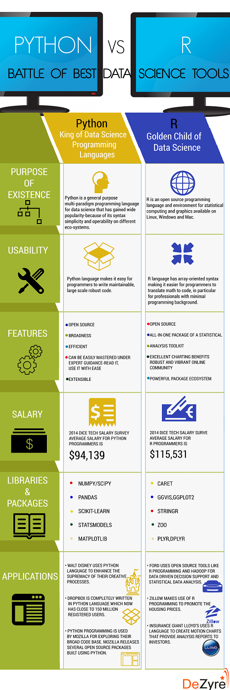

--- 
title: "Introduction to R"
author: "Łukasz Muszyński"
date: "`r Sys.Date()`"
output: bookdown::gitbook
documentclass: book
bibliography: [book.bib, packages.bib]
biblio-style: apalike
link-citations: yes
description: ""
---


```{r, include=FALSE, eval=TRUE}

# definicje funkcji wyswietlajacych elementy przed i po chunkach

require(knitr)
knit_hooks$set(play = function(before, options, envir) {
    if(before) '.>>>>'
})

knit_hooks$set(begin = function(before, options, envir) {
    if(before) 'BEGIN'
})

knit_hooks$set(begin = function(before, options, envir) {
    if(!before) 'END'
})


knitr::opts_chunk$set(echo = TRUE, eval=FALSE, include=TRUE)


```

# INTRO

O jezyku R

1. R jest jezykiem ktory posiada typowanie dynamiczne. Typowanie dynamiczne to przypisywanie typow do wartosci przechowywanych w zmiennych w trakcie dzialania programu. Przy zastosowaniu typowania dynamicznego, zmienne nie posiadaja typow przypisanych statycznie, czyli przed uruchomieniem programu np. w trakcie kompilacji. W takiej sytuacji typ zmiennej wynika z wartosci jaka dana zmienna przechowuje. Jest to jeden ze sposobow na zwolnienie programisty z obowiazku deklarowania typow zmiennych. Ulatwia to operacje na zmiennych, utrudnia natomiast kontrola integralnosci programu. Zmienna moze w roznych momentach wykonania programu przechowywac wartosci roznych typow.
2. R jest jezykiem ktory pozwala na programowanie strukturalne, funkcyjne i obiektowo.
3. R jest jezykiem imperatywnym a nie deskryptywnym. 
4. Domyślnie program R pracuje w trybie interpretowanym a nie kompilowanym. Praca w trybie kompilowanym jest możliwa np. dzieki p:complier.

W internecie warto sledzic rozwoj R-a i porownania go do innych narzedzi. Ostatnio bardzo popularne są zestawiania R-a z Pytonem: 

```{r, eval=TRUE, echo=FALSE, fig.cap='Python vs R', out.width='500px'}

```


